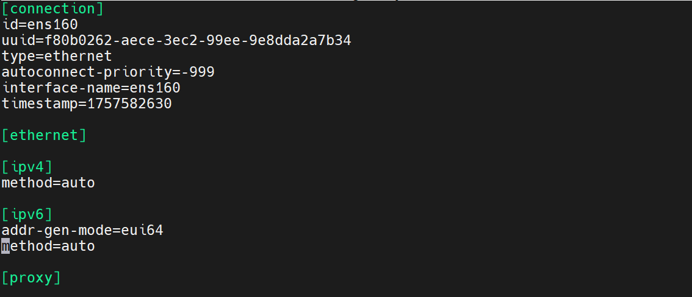
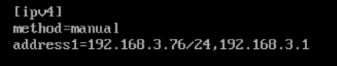
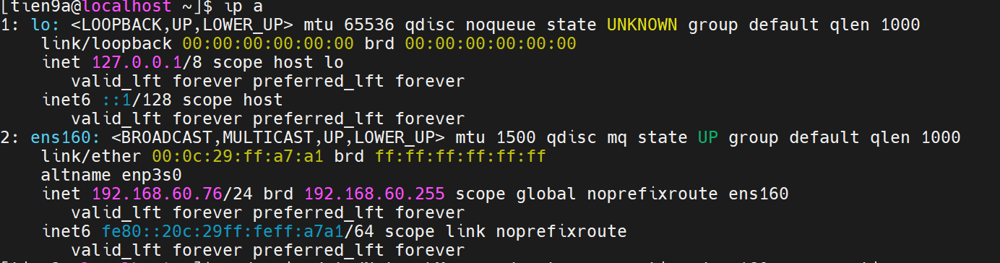
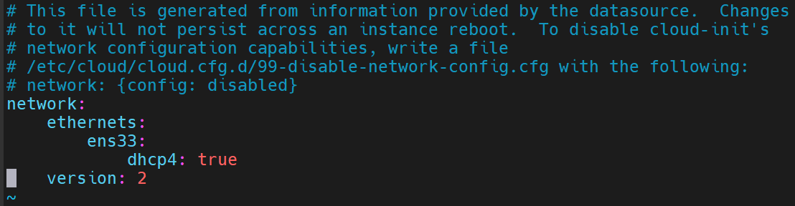

# CÀI ĐẶT IP TĨNH TRÊN LINUX

## I. TRÊN CENTOS 9

Để đặt IP tĩnh trên CentOS, ta có thể áp dụng theo 2 cách:

### 1. `Cách 1`

-Vào chế độ Root bằng câu lệnh:

```su -```

-Cài nano để có thể truy cập file cấu hình mạng:

```yum install nano -y```

Mở file cấu hình mạng (ens160):

```ruby
 nano /etc/NetworkManager/system-connections/ens160.nmconnection
```

Kết quả:



-Ấn để chỉnh sửa nội dung, chỉnh sửa nội dung trong [ipv4] thành:



- `method=manual`: Chỉ định địa chỉ IP tĩnh.
- `address1= 192.168.3.76/24,192.168.60.1`:
  - `192.168.60.76/24` địa chỉ IP và subnet mask.
  - `192.168.60.1` gateway => lên để `192.168.60.2` vì con default gateway kia của máy thật rồi

-Sau khi chỉnh sửa xong, `Ctrl + O` => Enter => `Ctrl + X` để lưu cấu hình.

-Sau khi thực hiện thay đổi, cần restart NetWorkManager để áp dụng thay đổi:

```ruby
systemctl restart NetworkManager
```

-Sau khi cấu hình xong kiểm tra IP tĩnh cài chưa ta đánh:

```ip addr show```



### 2. `Cách 2`: Dùng nmcli (NetworkManager CLI)

-Nếu không muốn chỉnh sửa file thủ công, dùng các lệnh sau:

```ruby
sudo nmcli connection modify ens160 ipv4.address 192.168.60.76/24

sudo nmcli connection modify ens160 ipv4.gateway 192.168.60.1

sudo nmcli connection modify ens160 ipv4.method manual

sudo nmcli connection up ens160
```

- `sudo nmcli connection modify ens33 ipv4.address 192.168.60.76/24`: đặt IP tĩnh.
- `sudo nmcli connection modify ens33 ipv4.gateway 192.168.60.1`: Đặt gateway.
- `sudo nmcli connection modify ens33 ipv4.method manual`: chuyển sang chế độ IP tĩnh.
- `nmcli connection up ens33`: Áp dụng thay đổi.

*lưu ý:*

- IP phải nằm trong cùng dải mạng với máy thật. Dải mạng ở đây là `192.168.60.x`.
- Không trùng với IP của máy khác.
- subnet mask phải khớp và gateway phải đúng.

## II. Trên Ubuntu 24.04

- Mở file cấu hình `netplan` (thường nằm trong `/etc/netplan/`):

```ruby
sudo vim /etc/netplan/50-cloud-init.yaml
```

-Kết quả:



-Ấn `i` để chỉnh sửa nội dung, chỉnh sửa nội dung trong [ipv4] thành:

- `ens33`: Tên card mạng.
- `dhcl3: no`: tắt DHCP để dùng IP tĩnh.
- `addresses: - 192.168.60.77/24` địa chỉ IP và subnet mask.
- `gateway4: 192.168.60.2` gateway vì máy thật là `.1` rồi

-Chỉnh sửa xong, ấn `Esc` để thoát khỏi chế độ `Insert`. Tiếp đó nhập `:wq` và `Enter` để lưu cấu hình.

-Sau khi thực hiện thay đổi, cần restart để áp dụng thay đổi:

```ruby
sudo netplan apply
```

-Sau đó, `ip a` để check xem đúng IP chưa.

-Sau đó check xem đã kết nối qua địa chỉ mạng `192.168.60.77` ra môi trường bên ngoài chưa bằng câu lệnh:`ping 8.8.8.8 -c 4` - ping 4 gói.

### 1.Routes

- `to:default`: Khi máy tính muốn gửi gói tin đến một địa chỉ IP nào đó mà không nằm trong mạng nội bộ của nó, nó sẽ không biết đường đi. Lúc này hệ thống sẽ tra bảng routing table, nếu ko tìm thấy route cụ thể nào khớp, nó sẽ dùng route mặc định - gửi tất cả ra gateway đó.
  - Nó sẽ kiểu là nếu không biết đi đâu thì đi hướng này.
  - `to: default` → áp dụng cho mọi đích đến không rõ (tức "mọi nơi khác")

Nếu không dùng `to:default` - ta có thể route đến 1 mạng hay 1 subnet
cụ thể:

```bash
routes:
  - to: 10.10.0.0/16 # chỉ gói tin đi đến mạng này
    via: 192.168.1.254 # mới đi qua gateway này
```

### 2. Nhiều default route + metric (ưu tiên gateway chính, dự phòng gateway phụ)

```bash
network:
  version: 2
  ethernets:
    eth0:
      addresses: [192.168.1.10/24]
      routes:
        - to: default
          via: 192.168.1.1
          metric: 100     # ưu tiên cao (số nhỏ hơn = ưu tiên hơn)
    eth1:
      addresses: [192.168.2.10/24]
      routes:
        - to: default
          via: 192.168.2.1
          metric: 200     # dự phòng, chỉ dùng khi route kia chết
```

- Hệ thống sẽ ưu tiên dùng gateway có metric thấp hơn. Nếu interface đó down, tự động chuyển sang gateway còn lại.

### 3. Định tuyến theo chính sách (Policy-based routing) — mỗi interface đi ra đúng gateway của nó

```bash
network:
  version: 2
  ethernets:
    eth0:
      addresses: [192.168.1.10/24]
      routes:
        - to: default
          via: 192.168.1.1
          table: 100
        - to: 192.168.1.0/24
          via: 0.0.0.0
          table: 100
      routing-policy:
        - from: 192.168.1.10
          table: 100

    eth1:
      addresses: [192.168.2.10/24]
      routes:
        - to: default
          via: 192.168.2.1
          table: 200
        - to: 192.168.2.0/24
          via: 0.0.0.0
          table: 200
      routing-policy:
        - from: 192.168.2.10
          table: 200
```

- `table:100/200`: tạo bảng định tuyến riêng cho từng interface
- `routing-policy: from: ...` nói nếu gói tin có địa chỉ nguồn là IP này, thì tra bảng route số đó.

Sau khi thực hiện thay đổi, cần restart để áp dụng thay đổi:

```plaintext
sudo netplan apply
```

#### 4. Phân biệt 

- `addresses`: địa chỉ của chính interface đó:

```yaml
addresses:
  - 192.168.2.10/24
```

- Ở đây `/24` không phải để nói "route tới đâu", mà để nói: "interface này thuộc về mạng nào".

  - `/24` cho hệ thống biết, địa chỉ của tôi là `192.168.2.10`
  - Nhưng cả dải `192.168.2.0-192.168.2.255` là cùng mạng LAN với tôi.
  - Nghĩa là: nếu muốn nói chuyện với bất kỳ máy nào trong dải đó (`192.168.2.1`, `192.168.2.50`,...), tôi gửi thẳng trực tiếp (Layer 2, không cần qua gateway)

- `routes: to:`: đường đi đến mạng khác

- Vậy tại sao không phải /32 cho addresses?:

Vì `/32` nghĩa là "chỉ có đúng 1 địa chỉ, không có mạng nào xung quanh cả" — nếu đặt IP của interface là /32, máy sẽ nghĩ là không có máy nào khác cùng mạng LAN với mình hết, kể cả gateway! Lúc đó nó sẽ không biết cách gửi ARP hay gói tin đến gateway (vì gateway coi như "ở xa", phải qua route khác — mà route đó cũng cần gateway... → vòng lặp vô lý).

Đó là lý do address luôn cần prefix đúng theo subnet mask thật của mạng (`/24`, `/23`, v.v.) — để hệ thống biết ranh giới "gần" (LAN) và "xa" (phải qua gateway) nằm ở đâu.

- Nếu dùng `route to: .../32` nghĩa là nếu muốn đến địa chỉ ip này thì qua gateway này là cấu hình riêng.
