# ADVANCE INSTALLATION LINUX

## I. OVERVIEW LINUX STORAGE SYSTEMS

### 1. Swap

**Swap** là vùng bộ nhớ ảo (virtual memory) mà hệ điều hành Linux sử dụng trên ổ đĩa khi RAM vật lý (RAM thật) bị thiếu hoặc đầy.

### 2. Disk Management Tools

#### `df -h` displays File system on VM

- dùng để kiểm tra xem ổ cứng của bạn còn trống bao nhiêu và đã bị "xài" hết bao nhiêu.

- Tuỳ chọn `-h` cho dễ đọc.

- Điểm khác biệt lớn nhất `df -h` so với `lsblk` đó là:

  - `lsblk`: Cho bạn cái nhìn về phần cứng. Nó cho biết bạn có bao nhiêu ổ đĩa, chia bao nhiêu phân vùng (giống như xem sơ đồ bản vẽ của ngôi nhà).

  - `df -h`: Cho bạn cái nhìn về nội dung bên trong. Nó cho biết các phân vùng đó đã "đầy" hay chưa (giống như xem các phòng trong nhà đã chứa bao nhiêu đồ đạc).

#### `lsblk`(List Block Devices) displays block devices in tree format

- Hiển thị danh sách thiết bị lưu trữ dạng khối như **HDD**, **SSD**, **USB**

- Nó cho bạn thấy cấu trúc dạng cây của tất cả ổ đĩa và phân vùng.

#### `fdisk` and parted create and modify partitions

- “Phân vùng” = chia ổ đĩa thành các phần riêng biệt, mỗi phần có thể dùng cho hệ điều hành, dữ liệu, hoán đổi, v.v.

- Công cụ `fdisk` (dòng lệnh) hoặc `parted` (tương tự, có thể hỗ trợ GPT tốt hơn) giúp bạn: Tạo phân vùng mới, Xóa phân vùng cũ, Xem bảng phân vùng hiện có.

- Ví dụ trong menu tương tác: `sudo fdisk /dev/sdb`

- Tuỳ chọn:
  
  - `n`: Tạo phân vùng mới
  - `p`: xem bảng phân vùng
  - `d`: xóa phân vùng
  - `w`: lưu thay đổi

### 3. File System Format:(Định dạng File System Linux)

- `ext4`: Default for most Linux distros
- `XFS`: High-performance for large files
- `Btrfs`: Modern with snapshots.

### 4. Mount Operations (Thao tác `Mount`)

#### 4.1 Gắn tạm thời với lệnh `mount`

Lệnh này có tác dụng ngay lập tức nhưng sẽ biến mất sau khi bạn khởi động lại máy (reboot).

**Cú pháp cơ bản**:

```bash
sudo mount <thiết bị> <điểm gắn>
```

**Ví dụ**: Bạn muốn gắn phân vùng /dev/sdb1 vào thư mục /mnt/data:

- Tạo thư mục (nếu chưa có):

```bash
sudo mkdir -p /mnt/data
```

- Gắn ổ đĩa:

```bash
sudo mount /dev/sdb1 /mnt/data
```

**Kiểm tra**: Gõ `df -h` để xem danh sách các ổ đĩa đã được gắn và dung lượng còn trống.

#### 4.2 Gắn vĩnh viễn với `/etc/fstab`

Để mỗi khi bật máy, ổ đĩa tự động sẵn sàng, bạn cần khai báo trong file cấu hình hệ thống `/etc/fstab`.

Các bước thực hiện:

1. **Lấy UUID** của ổ đĩa: Dùng lệnh `blkid` hoặc `lsblk -f`. Sử dụng **UUID** sẽ an toàn hơn tên thiết bị (như `/dev/sdb1`) vì tên này có thể thay đổi nếu bạn cắm thêm ổ cứng khác.

2. **Chỉnh sửa file fstab**: `sudo nano /etc/fstab`

3. Thêm dòng cấu hình theo cấu trúc:

```bash
<UUID>  <Điểm gắn>  <Loại FS>  <Tùy chọn>  <Dump>  <Pass>
```

Ví dụ một dòng hoàn chỉnh:

```bash
UUID=1234-abcd-5678  /mnt/data  ext4  defaults  0  2
```

- Giải thích các tham số:

  - `defaults`: Sử dụng các thiết lập mặc định (`rw`, `suid`, `dev`, `exec`, `auto`, `nouser`, `async`).

  - `0` (Dump): Có cho phép backup không (thường để 0).

  - `2` (Pass): Thứ tự kiểm tra lỗi ổ đĩa khi khởi động (`0` là bỏ qua, `1` cho ổ hệ thống, `2` cho các ổ dữ liệu).

Sau khi sửa file `/etc/fstab`, **đừng** khởi động lại máy ngay lập tức! Nếu bạn gõ sai một ký tự trong file này, hệ thống có thể bị lỗi boot (không vào được hệ điều hành).

Hãy chạy lệnh sau để kiểm tra:

```bash
sudo mount -a
```

Lệnh này sẽ thử gắn tất cả các thiết bị được liệt kê trong `fstab`.

- Nếu không hiện lỗi gì, chúc mừng bạn, bạn đã cấu hình đúng!
- Nếu hiện lỗi, hãy sửa ngay trong `fstab` trước khi quá muộn.

#### 4.4 Gỡ gắn (Unmount)

Khi muốn rút USB hoặc bảo trì ổ đĩa, hãy dùng lệnh `umount`.

**Lệnh**: `sudo umount /mnt/data`

**Lưu ý**: Bạn không thể gỡ gắn nếu đang đứng bên trong thư mục đó hoặc có chương trình nào đang ghi dữ liệu vào đó (lỗi "`target is busy`"). Hãy thoát ra ngoài bằng `cd ~` trước khi chạy lệnh.

### 5. Lab File System

#### 5.1 Đọc thông số File System Disk VM

```bash
# Trên 1 Host VM bất kì ta check file system Disk của nó
lsblk -f
```


- Trong đó:

  - `NAME`: Tên của thiết bị lưu trữ hoặc phân vùng trong hệ thống.
  - `FSTYPE`: Loại hệ thống tập tin (Vd: `ext4`, `xfs`, `ntfs`, `vfat`, `swap`)
  - `FSVER`: phiên bản hệ thống tập tin
  - `LABEL`: Tên gợi nhớ do con người đặt cho phân vùng.
  - `UUID`: Một chuỗi ký tự dài và ngẫu nhiên để định danh duy nhất phân vùng đó
  - `FSAVAIL`: Dung lượng available trong phân vùng hệ thống
  - `FSUSE%`: Tỉ lệ dung lượng đã dùng so với tổng dung lượng.
  - `MOUNTPOINTS`: Thư mục mà phân vùng đó đang được gắn vào để bạn truy cập dữ liệu.

Nếu đang sử dụng máy ảo Bạn cần gắn thêm ổ ảo trong phần cài đặt của máy ảo.


#### 5.2 Partition a Disk

Giả sử ta phân vùng cho phân vùng `sda2`:

```bash
sudo fdisk /dev/sda2
```

**Note**:

Lúc này ta sẽ thấy lỗi này hiện lên:

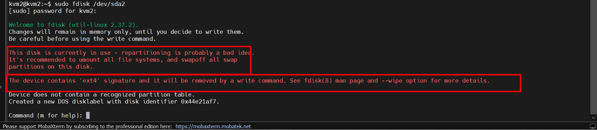

- **Lỗi 1:** Ổ đĩa đang được sử dụng
- **Lỗi 2:** `fdisk` nhận thấy phân vùng `/dev/sda2` của bạn đã có dữ liệu và được định dạng theo chuẩn `ext4`. Nếu bạn thực hiện lệnh `w`(write) bây giờ, `fdisk` sẽ xóa bỏ cái "chữ ký" (signature) này. Kết quả là hệ điều hành sẽ không còn nhận ra đây là ổ `ext4` nữa -> Toàn bộ dữ liệu hiện có sẽ biến mất.

**Giải thích**: `/dev/sda2` của bạn đang chứa định dạng `ext4`. Nếu bạn cố chia phân vùng bên trong nó, cấu trúc quản lý file của `ext4` sẽ bị ghi đè và mất sạch dữ liệu.

**Khắc phục:**

- Nhấn phím `q` (quit) và **Enter**. Lệnh này sẽ thoát mà không lưu bất kỳ thay đổi nào, dữ liệu của bạn vẫn an toàn.

- Gõ `lsblk` để xem `/dev/sda2` đang được gắn (mount) vào đâu:

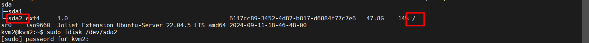

-> Phân vùng `/dev/sda2` đang được mount vào `/` (thư mục gốc - Root Directory). Cho nên nếu muốn chia phân vùng ta nên chọn ổ cứng chính là `sda` để thao tác.

=> Còn nếu ta vẫn muốn quản lý linh hoạt không gian của `sda2` thì lúc đó ta cần 1 tool khác đó là **LVM**

Cuối cùng, ta thực hiện phân vùng ổ đĩa chính `dev/sda`:

```bash
sudo fdisk /dev/sda
```

**Note2:**

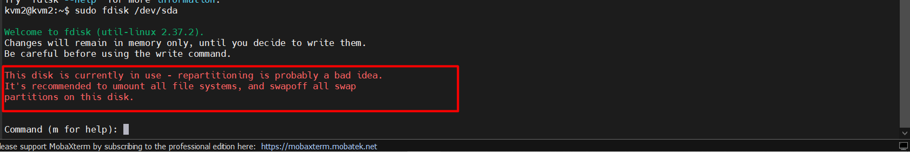

**Lỗi:** Ta để ý dòng "`This disk is currently in use`" ám chỉ ổ đĩa này đang được sử dụng hay đang chạy 1 tiến trình gì đó. Lúc này ta out bằng cách nhấn `q` và dùng lệnh `lsblk` để xem ổ đĩa này đang được `mount` vào đâu.

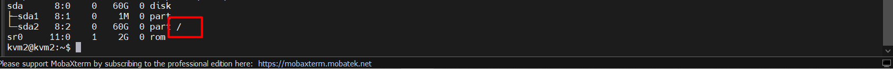

**Giải thích:** Ta có thể thấy ổ đĩa này đang `mount` vô thư mục gốc, nên mọi tiến trình đang chạy trên ổ này khiến ta không thể cấu hình phân vùng được.

**Khắc phục:** Ta có 2 cách khắc phục

- Đầu tiên ta sẽ add thêm 1 ổ cứng mới rồi phân vùng cái ổ cứng mới đó thui.
- Ta sẽ sử dụng tool **LVM**

**Khắc phục:** Ta sẽ chọn cách add thêm HardDisk khác:

- Tắt VM đi ta vào mục `options` -> `Add` -> `Hard Disk` -> `SCSI` -> Ta tạo 1 HardDisk có dung lượng `20GB` và tích "`store as single file`"

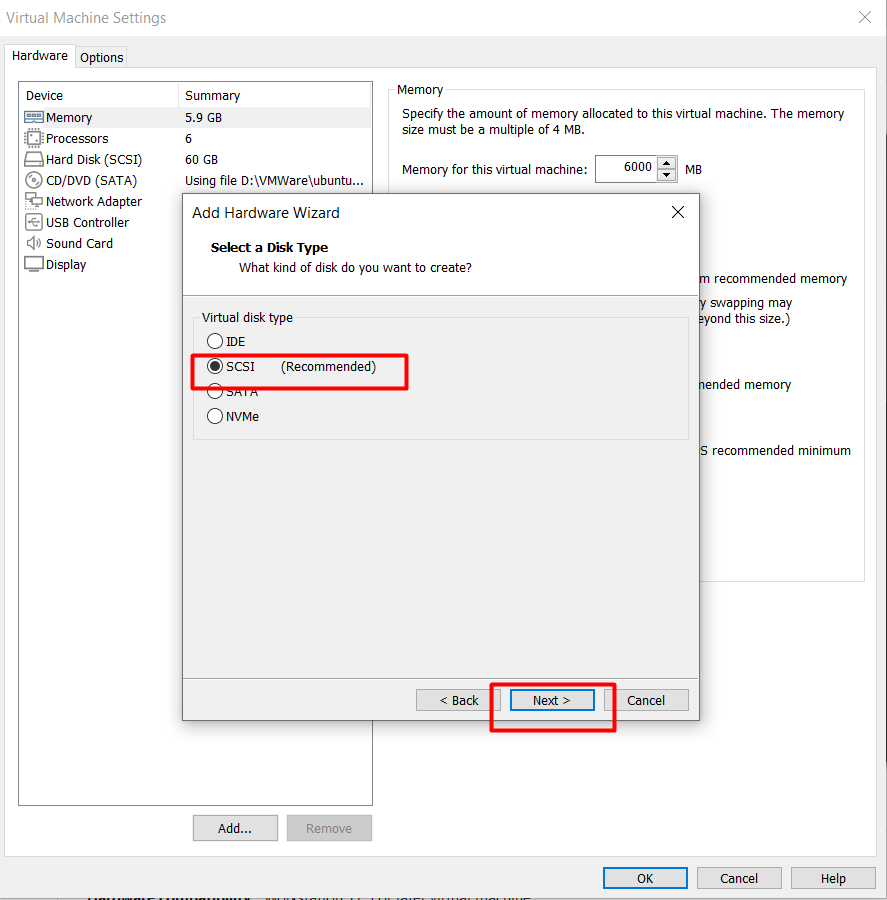

- Ta check xem máy ảo đã nhận cấu hình thêm HardDisk chưa bằng lệnh:

```bash
# Check HardDisk được thêm chưa
lsblk

# Check nhận cấu hình ổ cứng đó thành dạng File System chưa
df -h
```

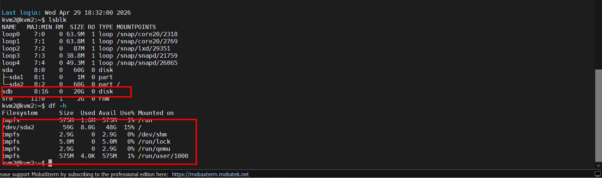

=> Như ta có thể thấy máy đã nhận được ổ `sdb`(Disk) ta mới thêm nhưng chưa nhận cấu hình File System cho nó (Do chúng ta chưa mount nó vào thư mục nào cả) vì thế nó mới đang ở dạng `RAW` DISK (Thích hợp để phân vùng)

- Tiếp theo ta sẽ phân vùng ổ đĩa ta mới thêm này:

```bash
sudo fdisk /dev/sdb

# Sau đó nhập tuỳ chọn n để tạo mới, p để xem, rồi w để lưu
```

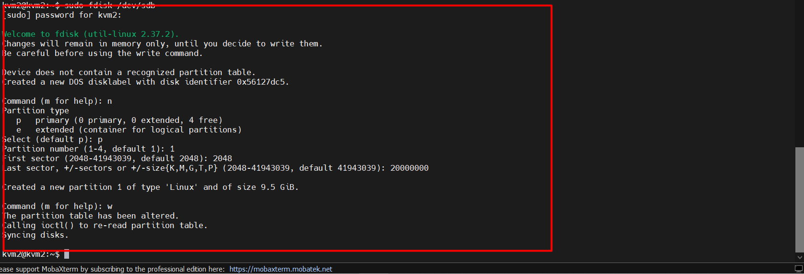

- Sau đó, định dạng phân vùng mới tạo và mount (Gắn) vào hệ thống:

```bash
sudo mkfs.ext4 /dev/sdb1
sudo mkdir /mnt/data_test
sudo mount /dev/sdb1 /mnt/data_test
```

- Kiểm tra lại bằng lệnh `df -h` xem máy ảo đã nhận cấu hình FileSystem chưa:

```bash
df -h
```

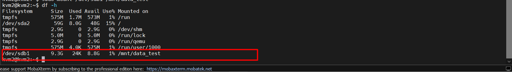

=> Hiện lên là thành công.

**Note3:** Vì sao ta không mount cả ổ cứng `sdb` mà chỉ mount mỗi phân vùng của nó vì:

- Ta hoàn toàn có thể định dạng File System cho cả ổ `sdb` thành dạng `ext4` và mount vào thư mục nhưng định dạng `ext4` sẽ khiến cho ổ `sdb` định dạng thành 1 file system riêng lên sẽ không thể làm được vì vướng phân vùng `sdb1` bên trong. Ta có thể thử định dạng và mount ổ `sdb` sau khi đã làm với `sdb1` và kết quả sẽ ra đúng như ta lập luận:

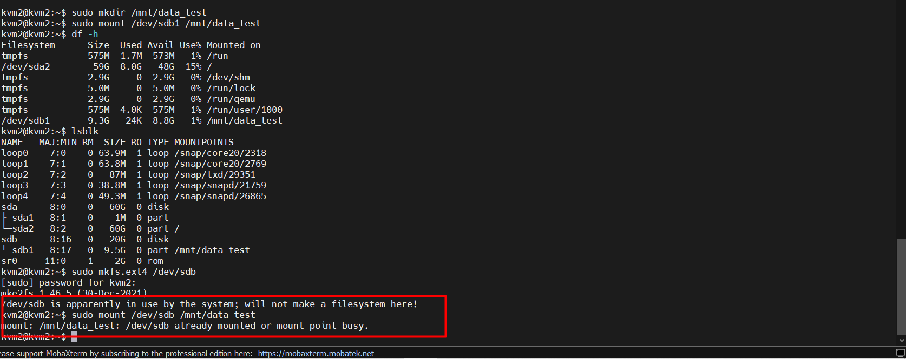

- Với cả nếu ta mount với định dạng cả ổ `sdb` như vậy thì rất khó để chia phân vùng sau này.

#### 5.3 Create `ext4` FileSystem

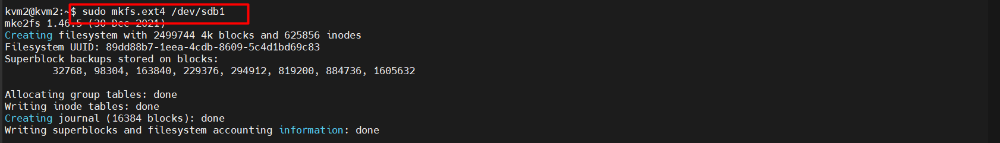

#### 5.4 Mount FileSystem

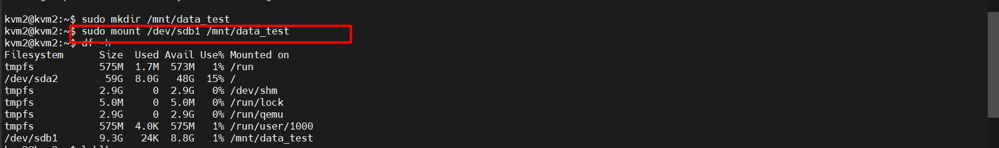

#### 5.5 Unmount FileSystem

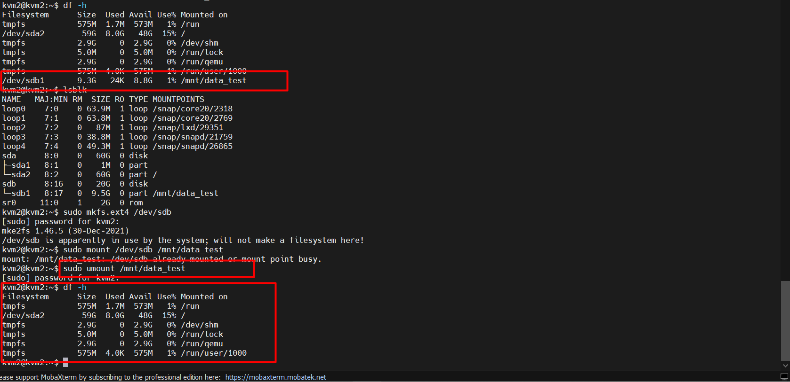

### 6. Disk Utilities

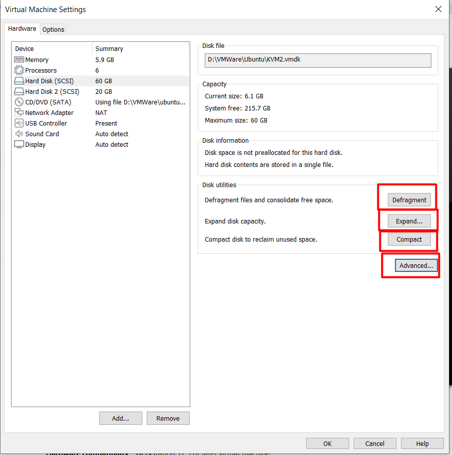

#### 6.1 Expand (Mở rộng dung lượng)

**Tác dụng**: Nó nới rộng sức chứa của ổ đĩa ảo.

**Lưu ý quan trọng**: Khi ta bấm `Expand` từ `20G` lên `40G` trong VMware, vào Linux gõ `lsblk` ta sẽ thấy ổ `sdb` hiện `40G`, NHƯNG phân vùng `sdb1` vẫn chỉ là `9.5G`.

**Việc phải làm**: Ta phải dùng tiếp lệnh `fdisk` hoặc `resize2fs` bên trong Linux để "kéo dãn" phân vùng ra cho khớp với diện tích mới.

#### 6.2 Compact (Nén/Thu nhỏ file `.vmdk`)

**Khái niệm file** `vmdk`: Đây là định dạng file do VMware phát triển để giả lập một ổ cứng vật lý.

**Nhiệm vụ của Compact**: Nó sẽ quét và thu hồi những vùng dữ liệu trống đó, giúp file `.vmdk` nhẹ đi, tiết kiệm dung lượng cho máy thật của chúng ta

**Mẹo**: Trước khi Compact, bạn nên chạy lệnh đổ đầy số 0 vào vùng trống trong Linux (`dd if=/dev/zero of=/wipefile; rm /wipefile`) để VMware dễ dàng nhận diện vùng cần nén.

#### 6.3 Defragment (Dồn đĩa)

**Tác dụng**: Sắp xếp lại các mảnh dữ liệu nằm rải rác trong file `.vmdk` để đầu đọc (vật lý hoặc logic) truy cập nhanh hơn.

**Cách dùng**: Chỉ nên dùng nếu máy thật của ta dùng ổ cứng HDD truyền thống. Nếu ta dùng SSD thì đừng đụng vào, vì nó chỉ làm tốn vòng đời ghi xóa của SSD mà chẳng tăng tốc được mấy.

## II. LOGICAL VOLUME MANAGER (LVM)

### Tại sao chúng ta cần LVM

Trong Linux, bình thường khi bạn cài đặt, bạn chia ổ đĩa vật lí (`/dev/sda`, `/dev/sdb`, …) thành các phân vùng (partition) cố định:
`/dev/sda1`,`/dev/sda2`,v.v...

- Khi chia như vậy, nếu sau này bạn muốn tăng kích thước partition, rất khó hoặc buộc phải xoá đi tải lại.
- **Logical Volume Management** (LVM) ra đời để giải quyết vấn đề này.

Mục đích của **LVM**:

- Giúp bạn quản lí không gian lưu trữ linh hoạt - có thể mở rộng, thu nhỏ, gộp, tách, di chuyển dữ liệu mà không cần format lại ổ.

### 1. Khái niệm LVM

**LVM (Logical Volume Manager)** là một cơ chế quản lý không gian lưu trữ linh hoạt trên Linux. Thay vì quản lý dữ liệu trực tiếp trên các ổ đĩa hay phân vùng vật lý cố định (như cách chia phân vùng truyền thống), LVM tạo ra một lớp trừu tượng ảo hóa nằm giữa hệ điều hành và phần cứng lưu trữ.

**Nói một cách dễ hiểu**: LVM cho phép bạn "gom" nhiều ổ đĩa cứng vật lý lại thành một "kho chứa" (pool) khổng lồ. Từ kho chứa này, bạn có thể tự do cắt ra các phân vùng ảo với dung lượng tùy ý để sử dụng.

**Điểm ăn tiền nhất của LVM** là **tính linh hoạt**: Bạn có thể dễ dàng phóng to (extend) hoặc thu nhỏ (reduce) các phân vùng ảo này ngay cả khi hệ thống đang hoạt động mà không làm mất dữ liệu hay cần phải khởi động lại máy.

### 2. Kiến trúc LVM

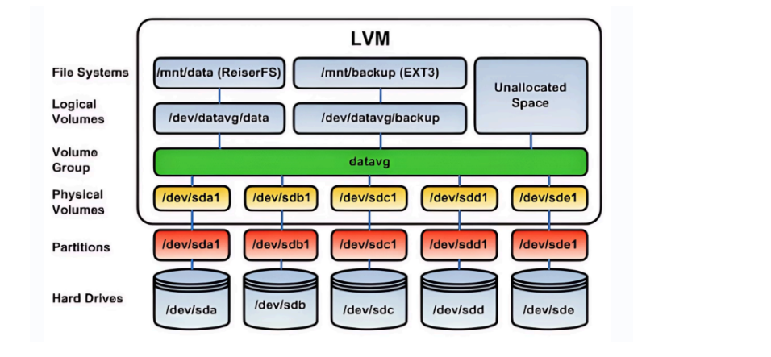

Để hiểu cách LVM hoạt động, bạn cần nắm rõ 3 thành phần cốt lõi sau:

1. **Physical Volume (PV)**: Đây chính là các ổ đĩa vật lý (hoặc phân vùng đĩa) mà bạn dành riêng cho LVM. Chúng ta cần format chúng sang dạng "Linux LVM" đặc biệt.

2. **Volume Group (VG)**: Đây là nơi "gom" các Physical Volume lại với nhau. Bạn có thể coi VG như một bể chứa lớn. Bể càng lớn thì khả năng linh hoạt càng cao.

3. **Logical Volume (LV)**: Đây là các "phân vùng ảo" mà bạn tạo ra để sử dụng. LV này được tạo ra từ dung lượng có sẵn trong Volume Group. Bạn có thể tạo nhiều LV từ một VG.

- Nó hoạt động giống như 1 partition bình thường mà bạn có thể format, mount, resize.

### 3. Triển khai LVM

Tạo máy ảo có ổ cúng ban đầu là `sda` là `20G` đã được mount vào FileSystem.

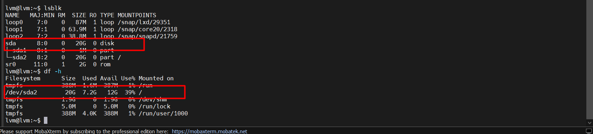

Giả sử bạn vừa cắm thêm 2 ổ cứng mới vào máy ảo là `/dev/sdb` và `/dev/sdc` (mỗi ổ `10GB`) và muốn gộp chung lại để tạo một phân vùng lưu trữ lớn hơn.

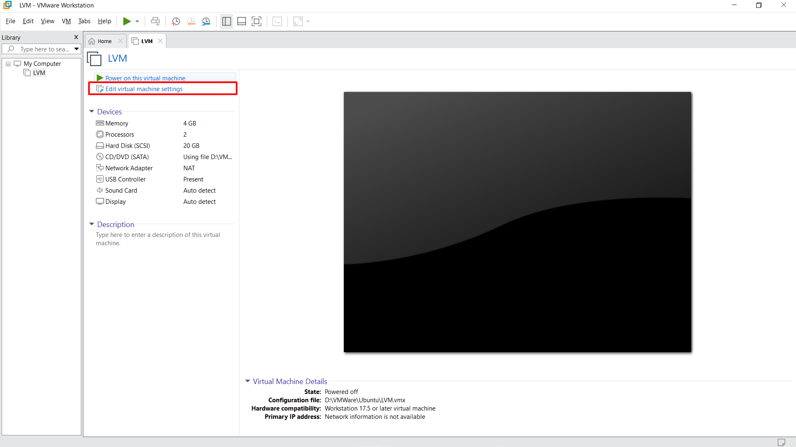

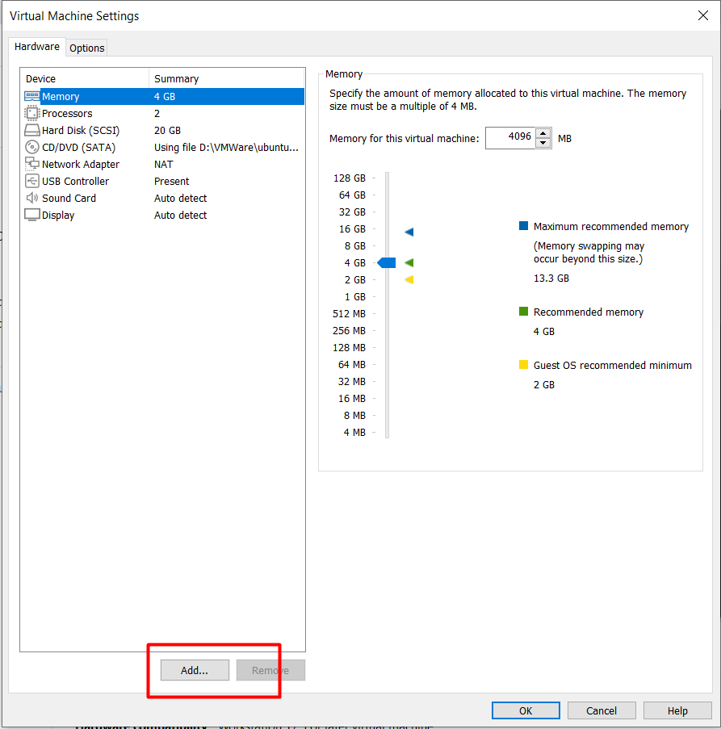

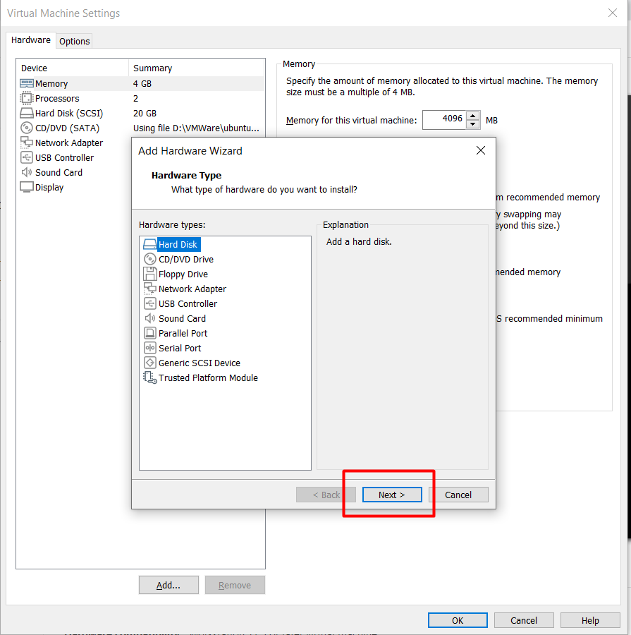

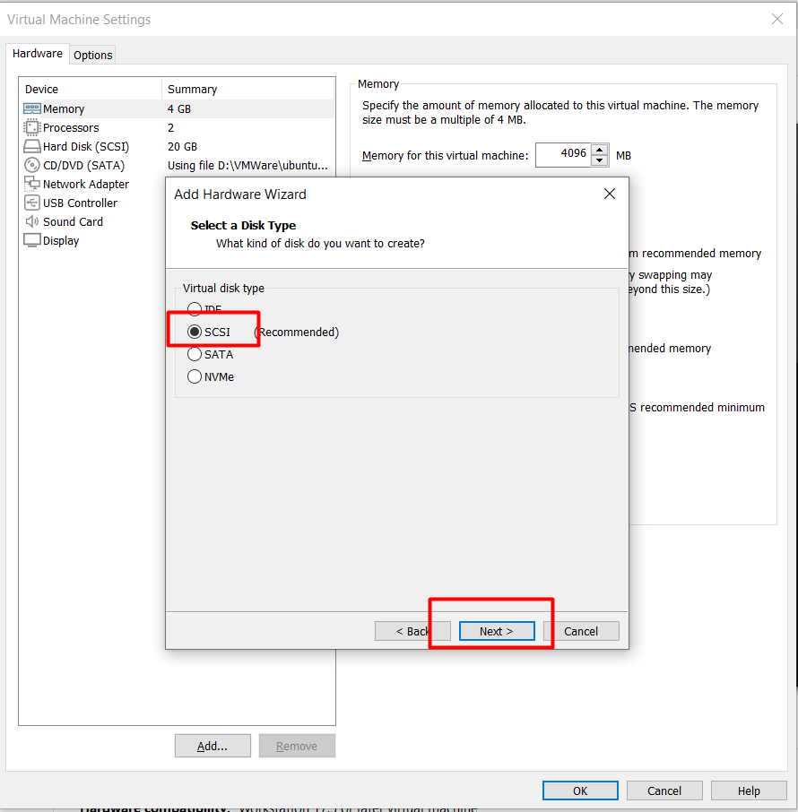

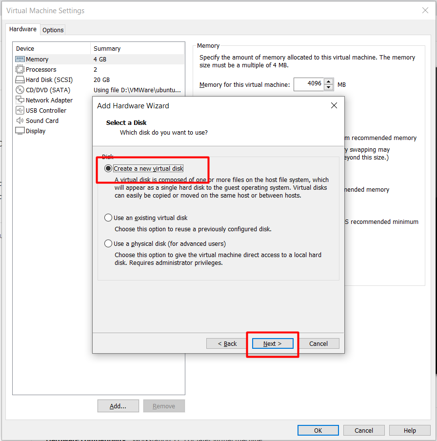

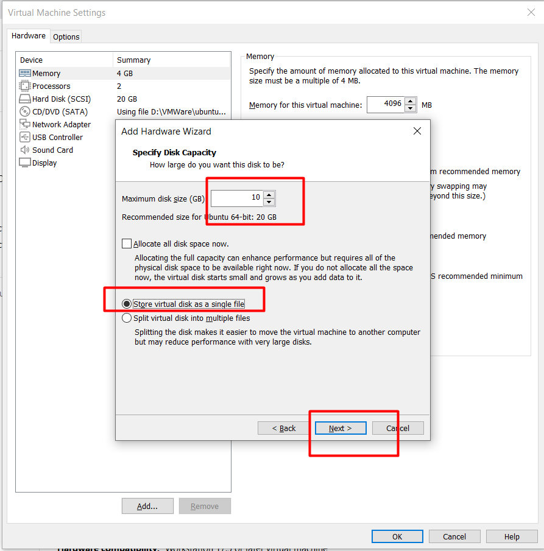

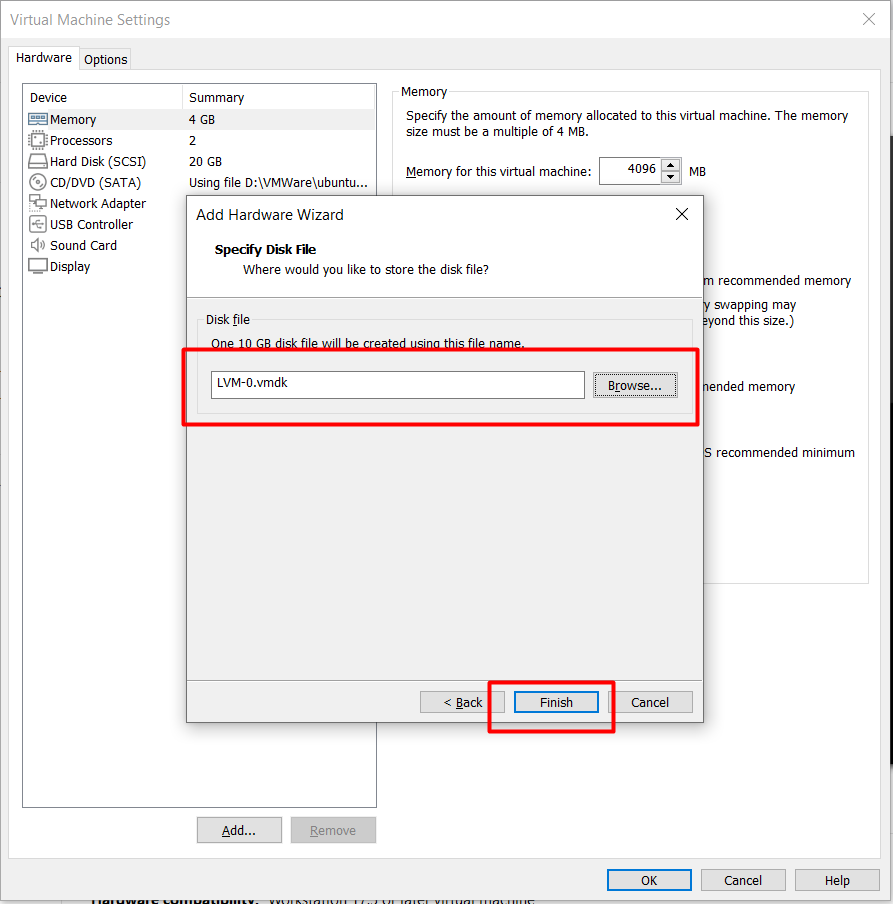

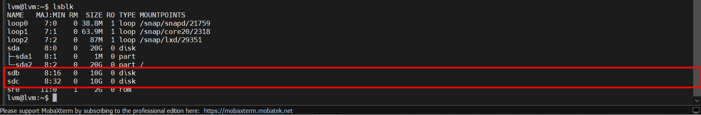

#### Bước 1: Khởi tạo Physical Volume (PV)

Đầu tiên, bạn cần đánh dấu 2 ổ cứng này là PV để LVM có thể quản lý.

```bash
# Khởi tạo PV trên sdb và sdc
sudo pvcreate /dev/sdb /dev/sdc

# Kiểm tra danh sách các PV
sudo pvs
# hoặc dùng lệnh chi tiết hơn: sudo pvdisplay
```

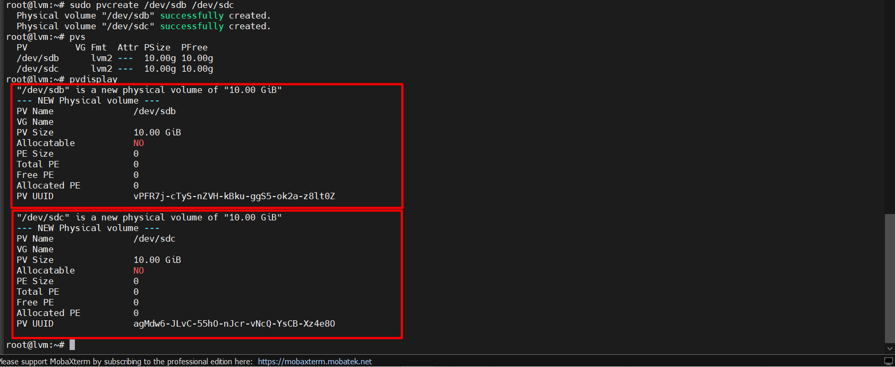

Trong đó:

- Dòng "`Allocatable: NO`": Nghĩa là hiện tại `20GB` này (`10GB` mỗi ổ) vẫn đang nằm rời rạc, chưa được gộp vào đâu cả, nên chưa thể đem đi chia cho các máy ảo hay chứa dữ liệu được. Vậy ta cần tạo Volume Group để gộp chúng lại.

#### Bước 2: Tạo Volume Group (VG)

Tiếp theo, bạn gom 2 PV vừa tạo thành một nhóm VG chung, đặt tên là `vg_data` (tổng dung lượng lúc này sẽ là ~20GB).

```bash
# Tạo VG tên là vg_data từ 2 ổ sdb và sdc
sudo vgcreate vg_data /dev/sdb /dev/sdc

# Kiểm tra lại VG vừa tạo
sudo vgs
# hoặc sudo vgdisplay
```

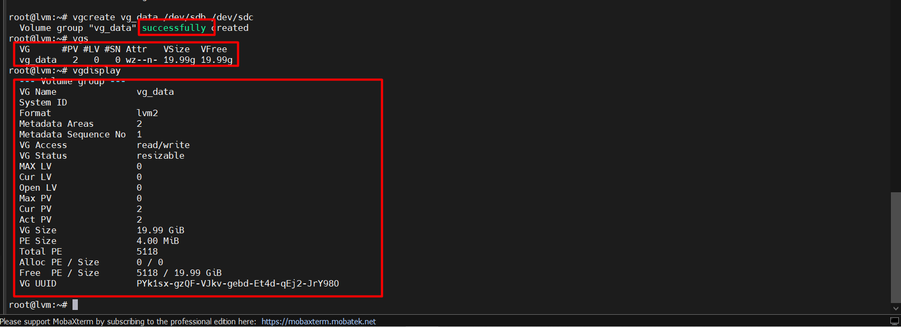

Trong đó:

- Dòng `PE Size 4.00 MiB` : Nghĩa là mỗi `Physical Extent` (PE) có kích thước 4MB. Khi bạn tạo Logical Volume, LVM sẽ lấy các PE này ghép lại để tạo thành LV.
- Dòng `Total PE 5118` : Nghĩa là tổng số `Physical Extent` (PE) có trong `Volume Group` này là 5118. Hay nói cách khác là tổng dung lượng của `Volume Group` này là `5118 * 4MB = 20GB`.
- Dòng "`Allocatable: YES`": Nghĩa là `20GB` này đã được gộp vào Volume Group và có thể đem đi chia cho Logical Volume rồi.

#### Bước 3: Tạo Logical Volume (LV)

Từ "kho chứa" `vg_data` `20GB`, bạn có thể cắt ra các phân vùng ảo (LV). Giả sử bạn muốn tạo một phân vùng tên là `lv_storage` có dung lượng `15GB`.

```bash
# Tạo LV dung lượng 15GB
sudo lvcreate -n lv_storage -L 15G vg_data

# (Tuỳ chọn) Nếu muốn dùng toàn bộ 100% dung lượng trống còn lại của VG:
# sudo lvcreate -n lv_storage -l 100%FREE vg_data

# Kiểm tra lại LV
sudo lvs
# hoặc sudo lvdisplay
```

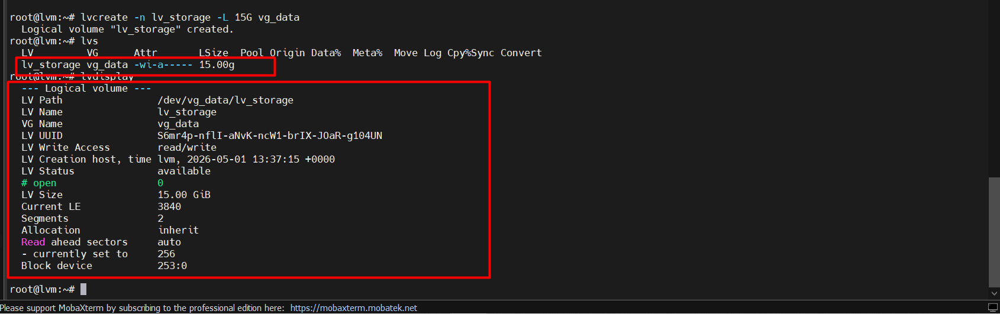

Trong đó:

- Dòng `LV UUID: A1b2c3d4-e5f6-7890-1234-567890abcdef`: Đây là số định danh duy nhất của LV.
- Dòng `LV Path: /dev/vg_data/lv_storage`: Đây là đường dẫn tới LV.
- Dòng `LV Size: 15.00 GiB`: Đây là kích thước của LV.
- Dòng `Used Size: 0 B`: Đây là dung lượng đã sử dụng của LV.
- Dòng `Free Space: 15.00 GiB`: Đây là dung lượng trống của LV.
- Dòng `VG Name: vg_data`: Đây là tên của VG mà LV thuộc về.
- Dòng `Segments: 2`: ổ `15GB` này thực chất đang được ghép từ 2 mảnh (segment) nằm trên 2 ổ đĩa vật lý khác nhau (`sdb` và `sdc`).
- Dòng `Allocation-inherit`: Nghĩa là LV này được tạo ra từ dung lượng trống có sẵn trong VG.

#### Bước 4: Định dạng File System cho LV

Bây giờ, `lv_storage` hoạt động giống như một phân vùng bình thường. Bạn cần định dạng nó (ví dụ: `ext4`) trước khi lưu dữ liệu.

Đường dẫn tới LV thường có dạng `/dev/Tên_VG/Tên_LV` (ở đây là `/dev/vg_data/lv_storage`).

```bash
# Định dạng ext4 cho LV
sudo mkfs.ext4 /dev/vg_data/lv_storage
```

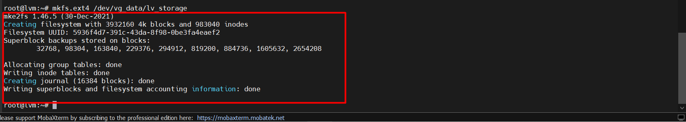

#### Bước 5: Mount (Gắn) LV vào hệ thống để sử dụng

Tạo một thư mục và mount LV vào đó.

```bash
# Tạo thư mục mount
sudo mkdir -p /mnt/storage

# Mount LV vào thư mục
sudo mount /dev/vg_data/lv_storage /mnt/storage

# Kiểm tra lại kết quả
df -h
```

**Lưu ý:** Bạn sẽ thấy một phân vùng mới được mount với kích thước 15GB. Để phân vùng này tự động mount mỗi khi khởi động lại máy, bạn cần thêm đường dẫn của nó (hoặc UUID) vào file `/etc/fstab` tương tự như cách làm với các ổ cứng thông thường (đã nói ở phần `4.2`).

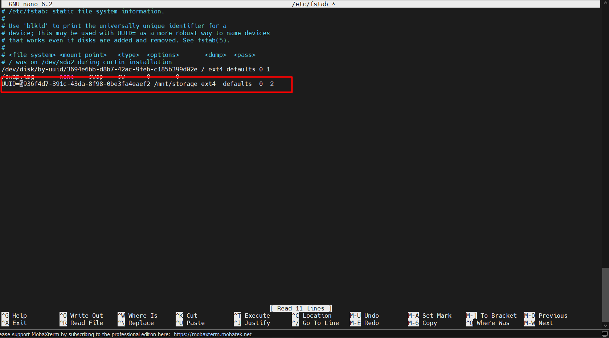

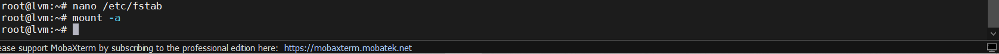

Sau khi restart check lại `lsblk` và `df-h`

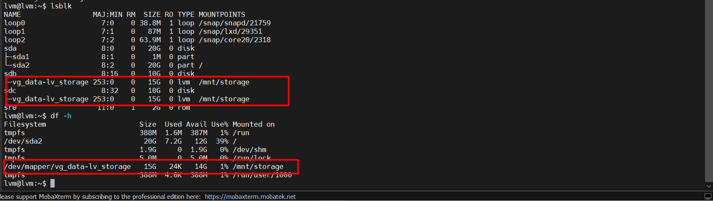

### 4. Mở rộng dung lượng LVM (Extend LVM)

Đây là tính năng "ăn tiền" nhất của LVM. Giả sử sau một thời gian sử dụng, phân vùng `lv_storage` (15GB) của bạn bị đầy và bạn muốn tăng thêm dung lượng cho nó.

LVM cho phép bạn tăng dung lượng **ngay lập tức trong lúc máy đang chạy** mà không sợ mất dữ liệu. Có 2 kịch bản chính:

#### `Kịch bản 1`: Volume Group (VG) vẫn còn dung lượng trống

Trong ví dụ ở phần 3, `vg_data` có tổng là `20GB`, và ta mới dùng `15GB` cho `lv_storage`. Vậy **VG** vẫn còn dư `5GB`. Ta lấy nốt 5GB này đắp vào `lv_storage`:

```bash
# B1: Tăng dung lượng của LV thêm 5GB (dùng dấu +)
sudo lvextend -L +5G /dev/vg_data/lv_storage

# (Hoặc nếu muốn lấy toàn bộ phần trống còn lại của VG đắp vào LV)
# sudo lvextend -l +100%FREE /dev/vg_data/lv_storage

# B2: "Kéo giãn" File System để nó nhận diện được mức dung lượng mới
# LƯU Ý: Bắt buộc phải làm bước này, nếu không lệnh df -h vẫn chỉ báo dung lượng cũ
sudo resize2fs /dev/vg_data/lv_storage

# Kiểm tra lại
df -h
```

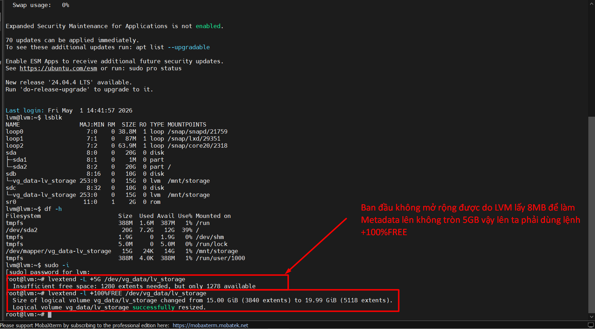

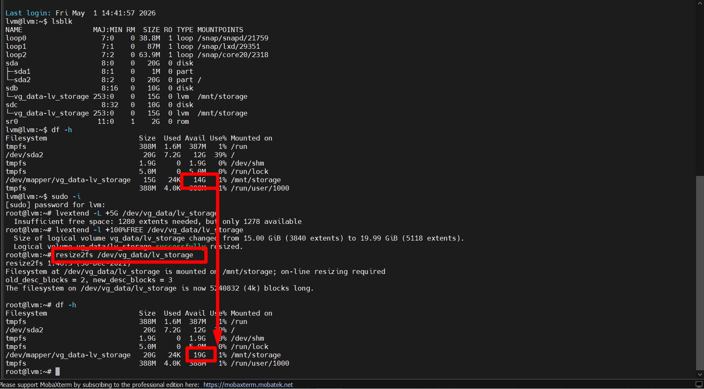

#### `Kịch bản 2`: Volume Group (VG) đã hết sạch dung lượng

Nếu **VG** của bạn cũng đã hết (không còn khoảng trống nào), bạn bắt buộc phải mua/cắm thêm ổ cứng vật lý mới (ví dụ có thêm ổ `/dev/sdd` dung lượng `50GB`) và làm theo luồng sau:

```bash
# B1: Khởi tạo PV cho ổ cứng mới
sudo pvcreate /dev/sdd

# B2: Bơm dung lượng của ổ sdd mới (PV mới) vào "bể chứa" VG hiện tại
sudo vgextend vg_data /dev/sdd
# Lúc này vg_data đã được cộng thêm 50GB, tha hồ dùng!

# B3: Mở rộng LV (Ví dụ lấy ra 20GB để mở rộng tiếp)
sudo lvextend -L +20G /dev/vg_data/lv_storage

# B4: Kéo giãn File System như bình thường
sudo resize2fs /dev/vg_data/lv_storage

# Kiểm tra lại
df -h
```

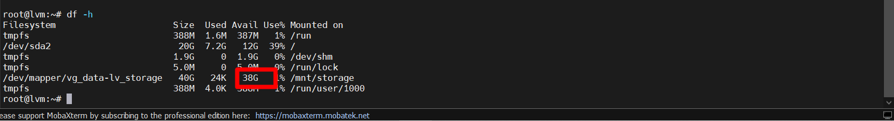

*(Lưu ý nhỏ: Lệnh `resize2fs` dùng riêng cho định dạng `ext4`. Nếu ban đầu bạn định dạng ổ đĩa là `xfs`, thì ở bước cuối bạn phải dùng lệnh `xfs_growfs /mnt/storage` để thay thế nhé).*

### 5. Thu nhỏ dung lượng LVM (Reduce LVM)

**CẢNH BÁO QUAN TRỌNG:** Không giống như lúc mở rộng, việc thu nhỏ dung lượng LVM tiềm ẩn rủi ro mất dữ liệu rất cao nếu thao tác sai, và bắt buộc phải **Unmount** thư mục trước khi thực hiện (tức là dịch vụ sẽ bị gián đoạn). Lệnh thu nhỏ chỉ hỗ trợ tốt trên `ext4`, còn `xfs` thì mặc định không hỗ trợ thu nhỏ.

Các bước thực hiện chuẩn chỉ (dành cho `ext4`):

```bash
# B1: Unmount phân vùng
sudo umount /mnt/storage

# B2: Kiểm tra lỗi cấu trúc File System (Bắt buộc)
sudo e2fsck -f /dev/vg_data/lv_storage

# B3: Thu nhỏ cấu trúc File System trước (Ví dụ thu nhỏ xuống chỉ còn 10GB)
sudo resize2fs /dev/vg_data/lv_storage 10G

# B4: Thu nhỏ dung lượng của Logical Volume (LV) xuống 10GB
sudo lvreduce -L 10G /dev/vg_data/lv_storage
# Hệ thống sẽ cảnh báo mất dữ liệu, gõ 'y' để xác nhận

# B5: Mount lại để sử dụng
sudo mount /dev/vg_data/lv_storage /mnt/storage

# Kiểm tra lại
df -h
```

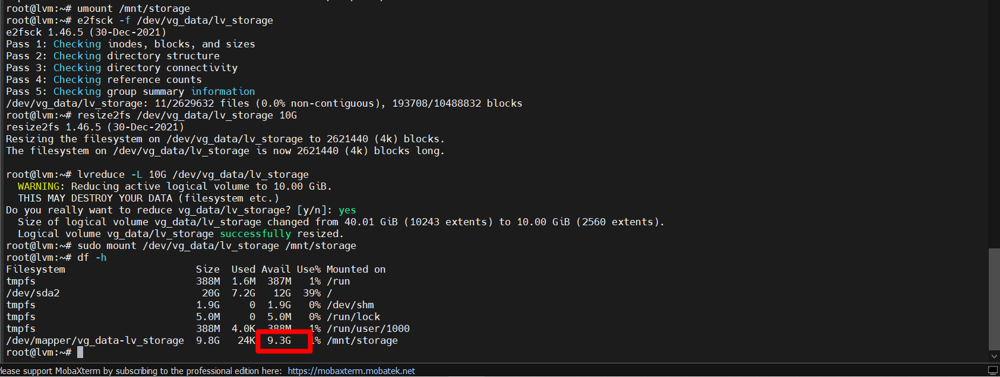

### 6. Xóa bỏ LVM (Remove LVM)

Khi không còn nhu cầu sử dụng và muốn dọn dẹp để trả lại ổ đĩa vật lý về trạng thái ban đầu, bạn cần thực hiện "xóa ngược" từ trên xuống dưới theo thứ tự: **Xóa LV** -> **Xóa VG** -> **Xóa PV**.

```bash
# B1: Gỡ gắn kết khỏi hệ thống
sudo umount /mnt/storage

# B2: Xóa Logical Volume (LV)
sudo lvremove /dev/vg_data/lv_storage
# Gõ 'y' để xác nhận

# B3: Xóa Volume Group (VG)
sudo vgremove vg_data

# B4: Xóa thẻ Physical Volume (PV) để trả lại ổ vật lý ban đầu
sudo pvremove /dev/sdb /dev/sdc /dev/sdd

# B5 :Bạn BẮT BUỘC phải mở file /etc/fstab và XÓA hoặc COMMENT (#) dòng cấu hình mount tự động của LV này đi. Nếu bạn quên bước này, trong lần khởi động tiếp theo, hệ thống sẽ báo lỗi `Emergency Mode` và không thể boot vào OS do không tìm thấy ổ đĩa!

sudo nano /etc/fstab

# Tìm dòng có chứa UUID hoặc đường dẫn /dev/vg_data/lv_storage và xóa nó đi.
```

Tới bước này, các ổ `/dev/sdb`, `/dev/sdc` và `/dev/sdd` đã trở lại thành ổ đĩa thô (RAW), hoàn toàn sạch sẽ để bạn cấu hình cho mục đích khác!

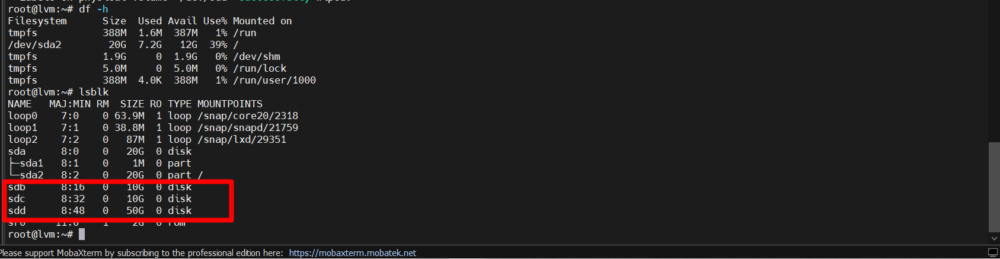

### 7. Tổng hợp các lệnh LVM thường dùng (Cheat Sheet)

Để dễ nhớ và tra cứu nhanh, dưới đây là bảng tổng hợp các nhóm lệnh cơ bản trong LVM:

#### 7.1. Nhóm lệnh hiển thị thông tin (Display)

- `pvs` / `vgs` / `lvs`: Hiển thị thông tin tóm tắt của PV / VG / LV. (Rất hay dùng để nhìn nhanh).
- `pvdisplay` / `vgdisplay` / `lvdisplay`: Hiển thị thông tin chi tiết đầy đủ của PV / VG / LV.
- `lsblk`: Hiển thị sơ đồ cây tất cả các ổ đĩa và phân vùng (nhìn tổng quan cực tốt).

#### 7.2. Nhóm lệnh Physical Volume (PV)

- `pvcreate /dev/sdb`: Khởi tạo một ổ cứng/phân vùng thành Physical Volume.
- `pvremove /dev/sdb`: Xóa bỏ định dạng PV trên ổ cứng.
- `pvmove /dev/sdb /dev/sdc`: Di chuyển toàn bộ dữ liệu đang lưu trên ổ `sdb` sang ổ `sdc` (rất hữu ích khi muốn rút ổ `sdb` ra khỏi máy mà không gây gián đoạn).

#### 7.3. Nhóm lệnh Volume Group (VG)

- `vgcreate ten_vg /dev/sdb /dev/sdc`: Tạo mới một Volume Group từ các PV.
- `vgextend ten_vg /dev/sdd`: Bơm thêm dung lượng (ổ mới) vào Volume Group hiện tại.
- `vgreduce ten_vg /dev/sdb`: Rút một ổ PV ra khỏi Volume Group (Lưu ý: ổ đó phải không chứa dữ liệu).
- `vgrename vg_cu vg_moi`: Đổi tên Volume Group.
- `vgremove ten_vg`: Xóa hoàn toàn Volume Group.

#### 7.4. Nhóm lệnh Logical Volume (LV)

- `lvcreate -n ten_lv -L 10G ten_vg`: Tạo mới một Logical Volume với dung lượng 10GB từ VG.
- `lvcreate -n ten_lv -l 100%FREE ten_vg`: Tạo LV lấy TOÀN BỘ dung lượng còn trống của VG.
- `lvextend -L +5G /dev/ten_vg/ten_lv`: Mở rộng LV thêm 5GB.
- `lvreduce -L -2G /dev/ten_vg/ten_lv`: Thu nhỏ LV đi 2GB (Khuyến cáo cẩn thận, dễ mất dữ liệu).
- `lvrename ten_vg lv_cu lv_moi`: Đổi tên Logical Volume.
- `lvremove /dev/ten_vg/ten_lv`: Xóa bỏ Logical Volume.

#### 7.5. Nhóm lệnh Resize File System (Đi kèm sau khi thay đổi dung lượng LV)

- `resize2fs /dev/ten_vg/ten_lv`: Giãn / Thu nhỏ File System chuẩn `ext4`.
- `xfs_growfs /mount/point`: Giãn File System chuẩn `xfs` (chỉ hỗ trợ giãn, không hỗ trợ thu nhỏ).
