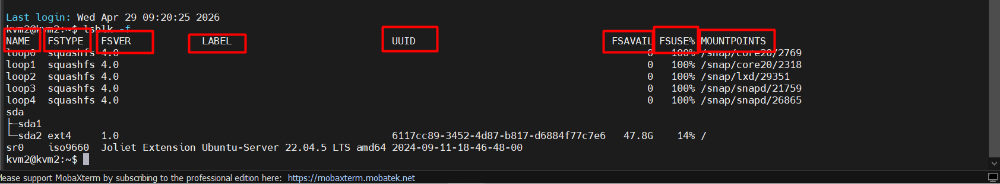
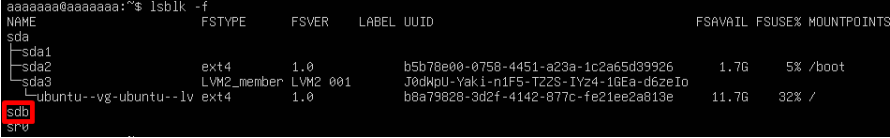

# ADVANCE INSTALLATION LINUX

## I. OVERVIEW LINUX STORAGE SYSTEMS

### 1. Swap

**Swap** là vùng bộ nhớ ảo (virtual memory) mà hệ điều hành Linux sử dụng trên ổ đĩa khi RAM vật lý (RAM thật) bị thiếu hoặc đầy.

### 2. Disk Management Tools

#### `lsblk`(List Block Devices) displays block devices in tree format

- Hiển thị danh sách thiết bị lưu trữ dạng khối như **HDD**, **SSD**, **USB**

- Nó cho bạn thấy cấu trúc dạng cây của tất cả ổ đĩa và phân vùng.

#### `fdisk` and parted create and modify partitions

- “Phân vùng” = chia ổ đĩa thành các phần riêng biệt, mỗi phần có thể dùng cho hệ điều hành, dữ liệu, hoán đổi, v.v.

- Công cụ `fdisk` (dòng lệnh) hoặc `parted` (tương tự, có thể hỗ trợ GPT tốt hơn) giúp bạn: Tạo phân vùng mới, Xóa phân vùng cũ, Xem bảng phân vùng hiện có.

- Ví dụ trong menu tương tác: `sudo fdisk /dev/sdb`

- Tuỳ chọn:
  
  - `n`: Tạo phân vùng mới
  - `p`: xem bảng phân vùng
  - `d`: xóa phân vùng
  - `w`: lưu thay đổi

### 3. File System Types:(Định dạng File System Linux)

- `ext4`: Default for most Linux distros
- `XFS`: High-performance for large files
- `Btrfs`: Modern with snapshots.

### 4. Mount Operations (Thao tác `Mount`)

#### 4.1 Gắn tạm thời với lệnh `mount`

Lệnh này có tác dụng ngay lập tức nhưng sẽ biến mất sau khi bạn khởi động lại máy (reboot).

**Cú pháp cơ bản**:

```bash
sudo mount <thiết bị> <điểm gắn>
```

**Ví dụ**: Bạn muốn gắn phân vùng /dev/sdb1 vào thư mục /mnt/data:

- Tạo thư mục (nếu chưa có):

```bash
sudo mkdir -p /mnt/data
```

- Gắn ổ đĩa:

```bash
sudo mount /dev/sdb1 /mnt/data
```

**Kiểm tra**: Gõ df -h để xem danh sách các ổ đĩa đã được gắn và dung lượng còn trống.

#### 4.2 Gắn vĩnh viễn với /etc/fstab

Để mỗi khi bật máy, ổ đĩa tự động sẵn sàng, bạn cần khai báo trong file cấu hình hệ thống `/etc/fstab`.

Các bước thực hiện:

1. **Lấy UUID** của ổ đĩa: Dùng lệnh `blkid` hoặc `lsblk -f`. Sử dụng **UUID** sẽ an toàn hơn tên thiết bị (như `/dev/sdb1`) vì tên này có thể thay đổi nếu bạn cắm thêm ổ cứng khác.

2. **Chỉnh sửa file fstab**: `sudo nano /etc/fstab`

3. Thêm dòng cấu hình theo cấu trúc:

```bash
<UUID>  <Điểm gắn>  <Loại FS>  <Tùy chọn>  <Dump>  <Pass>
```

Ví dụ một dòng hoàn chỉnh:

```bash
UUID=1234-abcd-5678  /mnt/data  ext4  defaults  0  2
```

- Giải thích các tham số:

  - `defaults`: Sử dụng các thiết lập mặc định (`rw`, `suid`, `dev`, `exec`, `auto`, `nouser`, `async`).

  - `0` (Dump): Có cho phép backup không (thường để 0).

  - `2` (Pass): Thứ tự kiểm tra lỗi ổ đĩa khi khởi động (`0` là bỏ qua, `1` cho ổ hệ thống, `2` cho các ổ dữ liệu).

#### 4.3 Quy tắc "Sống còn" trước khi Reboot

Sau khi sửa file `/etc/fstab`, đừng khởi động lại máy ngay lập tức! Nếu bạn gõ sai một ký tự trong file này, hệ thống có thể bị lỗi boot (không vào được hệ điều hành).

Hãy chạy lệnh sau để kiểm tra:

```bassh
sudo mount -a
```

Lệnh này sẽ thử gắn tất cả các thiết bị được liệt kê trong `fstab`.

- Nếu không hiện lỗi gì, chúc mừng bạn, bạn đã cấu hình đúng!
- Nếu hiện lỗi, hãy sửa ngay trong fstab trước khi quá muộn.

#### 4.4 Gỡ gắn (Unmount)

Khi muốn rút USB hoặc bảo trì ổ đĩa, hãy dùng lệnh `umount`.

**Lệnh**: `sudo umount /mnt/data`

**Lưu ý**: Bạn không thể gỡ gắn nếu đang đứng bên trong thư mục đó hoặc có chương trình nào đang ghi dữ liệu vào đó (lỗi "`target is busy`"). Hãy thoát ra ngoài bằng `cd ~` trước khi chạy lệnh.

### 5. Lab File System

Đọc thông số **File System Disk VM**:

```bash
# Trên 1 Host VM bất kì ta check file system Disk của nó
lsblk -f
```



- Trong đó:

  - `NAME`: Tên của thiết bị lưu trữ hoặc phân vùng trong hệ thống.
  - `FSTYPE`: Loại hệ thống tập tin (Vd: `ext4`, `xfs`, `ntfs`, `vfat`, `swap`)
  - `FSVER`: phiên bản hệ thống tập tin
  - `LABEL`: Tên gợi nhớ do con người đặt cho phân vùng.
  - `UUID`: Một chuỗi ký tự dài và ngẫu nhiên để định danh duy nhất phân vùng đó
  - `FSAVAIL`: Dung lượng available trong phân vùng hệ thống
  - `FSUSE%`: Tỉ lệ dung lượng đã dùng so với tổng dung lượng.
  - `MOUNTPOINTS`: Thư mục mà phân vùng đó đang được gắn vào để bạn truy cập dữ liệu.

Nếu đang sử dụng máy ảo Bạn cần gắn thêm ổ ảo trong phần cài đặt của máy ảo.



Partiton