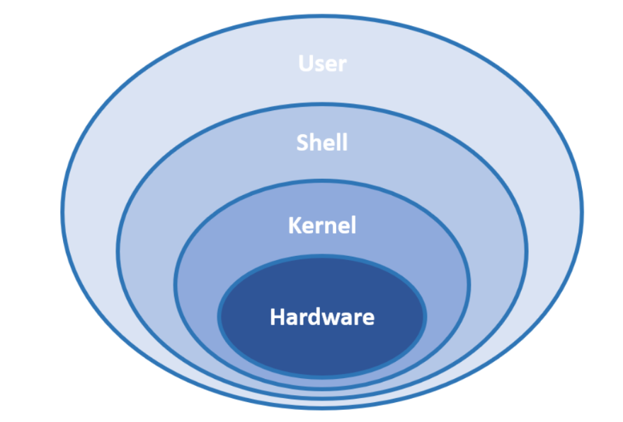
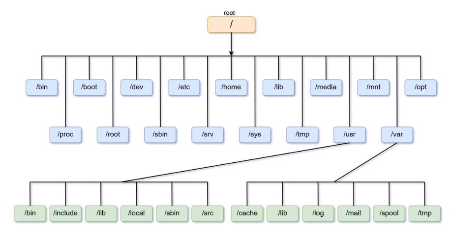
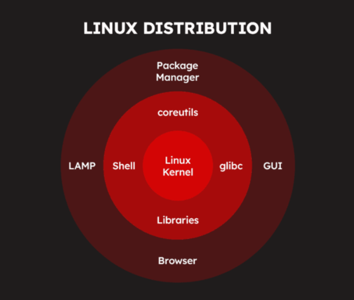
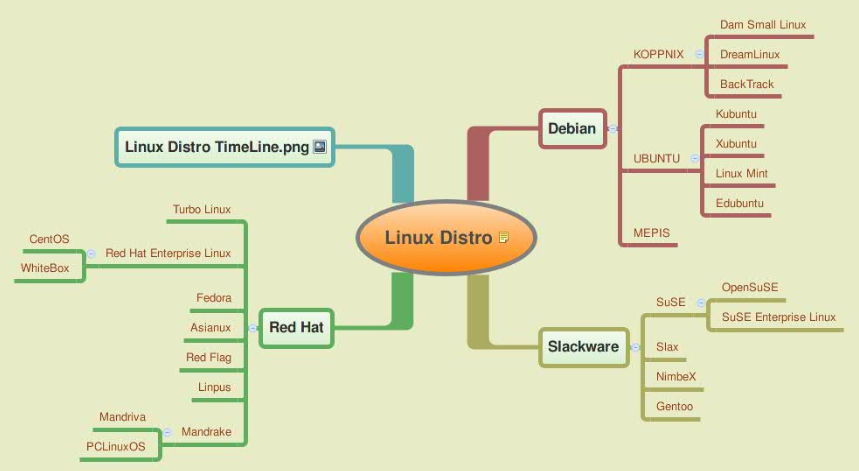

# Tổng quan về Linux

## I. LINUX LÀ GÌ ?

### 1. Khái niệm

Linux là một hệ điều hành mã nguồn mở dựa trên nhân (kernel) Linux. Nó cung cấp môi trường hoạt động cho phần mềm và phần cứng, tương tự như Windows hoặc macOS, nhưng có tính linh hoạt và bảo mật cao hơn.

### 2. Kiến trúc thành phần Linux

Hệ điều hành Linux được tổ chức theo một kiến trúc phân lớp, trong đó mỗi thành phần có nhiệm vụ và vai trò riêng biệt. Cấu trúc này giúp Linux hoạt động ổn định và hiệu quả trên nhiều loại phần cứng khác nhau.

**Hardware (Phần cứng) – Nền tảng vật lý:**

- **Không phải là một thành phần của hệ điều hành Linux**, nhưng là nền tảng để hệ điều hành hoạt động.
- Gồm CPU, RAM, ổ cứng, card mạng, bo mạch chủ và các thiết bị ngoại vi khác.
- Kernel của Linux sẽ giao tiếp với phần cứng thông qua trình điều khiển thiết bị (drivers).

**Kernel (Nhân hệ điều hành) – Cốt lõi của Linux:**

- Thành phần quan trọng nhất của Linux, chịu trách nhiệm quản lý tài nguyên phần cứng và phân phối chúng cho các tiến trình và ứng dụng.
- Quản lý bộ nhớ, CPU, thiết bị ngoại vi và thực thi các tiến trình.
- Kernel hoạt động như một cầu nối giữa phần cứng và phần mềm.

**Shell:**

- Là thành phần đứng giữa người dùng và Kernel
- Làm nhiệm vụ “phiên dịch” các câu lệnh của người dùng cho Kernel hiểu để thao tác với phần cứng.

**User Space (Không gian người dùng) – Ứng dụng và Chương trình:**

- Là thành phần trên cùng của kiến trúc Linux, đây chính là các chương trình, ứng dụng (Program, Application) hay câu lệnh mà người dùng chạy trong quá trình sử dụng Linux.

**Các thành phần quan trọng khác:**

- **Bootloader (bộ nạp khởi động):** Khi bật máy tính, nó sẽ trải qua quá trình tự khởi động gọi là booting. Bootloader (bộ nạp khởi động) sẽ có chức năng chính là tải kernel vào bộ nhớ và bắt đầu quá trình khởi động này.
- **Daemon:** là các quy trình chạy ngầm (background process) bắt đầu trong quá trình khởi động. Daemon đảm bảo các chương trình chạy trơn tru trên hệ thống:
  - **systemd:** Daemon trung tâm chịu trách nhiệm quản lý các tiến trình daemon khác.
  - **sshd:** Daemon cho phép kết nối an toàn với máy chủ từ xa và cho phép truyền tệp.
  - **Httpd:** Daemon máy chủ web nhận các yêu cầu HTTP và phục vụ các trang web.
  - **cron:** Daemon thực thi các tác vụ hoặc tập lệnh đã lên lịch từ crontab vào những thời điểm được yêu cầu.
- **Init system (Hệ thống khởi tạo):** là một quy trình daemon được bắt đầu bởi kernel. Init system có vai trò khởi tạo không gian người dùng trong khi khởi động và quản lý các quy trình hệ thống trong thời gian chạy.
- **Graphic server (Máy chủ đồ họa):** là một framework cơ bản trên Linux hiển thị đồ họa trên màn hình. Thành phần này triển khai Hệ thống X Window (X11 hoặc X) và cho phép quản lý cửa sổ, nhập liệu bằng bàn phím/chuột và hỗ trợ nhiều màn hình.
- **Môi trường desktop:** là một thành phần không bắt buộc có trên tất cả các hệ thống Linux. Mỗi môi trường desktop cung cấp:
  - Các ứng dụng cài sẵn (ví dụ: trình quản lý tệp và thư mục, công cụ chỉnh sửa văn bản, trình duyệt web, trò chơi, và các tác vụ phổ biến khác).
  - Giao diện người dùng đồ họa (GUI) cho phép người dùng tương tác với hệ điều hành bằng chuột và bàn phím (Ví dụ: cửa sổ, menu thả xuống, cách hiển thị tệp và thư mục…)

## II. CẤU TRÚC FILE, FOLDER TRONG LINUX

Đối với Linux, tất cả đều là file. Từ file thông thường, thư mục, đĩa cho đến thiết bị ngoại vi, mọi thứ đều được hệ điều hành Linux coi là các file trong hệ thống. Tất cả các “file” này được tổ chức theo cấu trúc dạng cây phân cấp (FHS – File Hierarchy Structure) trong đó cao nhất là thư mục gốc “/” (gọi là root)

### 1. Root - Thư mục gốc (`/`)

- Thư mục cấp cao nhất của hệ thống Linux.
- Chứa tất cả các thư mục và tệp trong hệ thống.
- Có thể truy cập bởi mọi người dùng nhưng hầu hết các tệp và thư mục nếu muốn sửa đổi thì cần quyền của người dùng root.

### 2. Các thư mục quan trọng trong hệ thống Linux

| thư mục | Mô tả |
|-----------|-------------|
| `/bin` | Chứa các lệnh thiết yếu như `ls`, `cp`, `mv`, `rm`, `cat`… |
| `/sbin` | Chứa các lệnh quản trị hệ thống như `reboot`, `shutdown`, `fdisk`… |
| `/boot` | Chứa các tập tin khởi động hệ thống như `vmlinuz` (kernel Linux), `grub` (bootloader). |
| `/dev` | Chứa các tệp thiết bị (device) như `sda` (ổ cứng), `tty` (terminal), `cdrom`… |
| `/etc` | Chứa các tệp cấu hình hệ thống và ứng dụng, ví dụ: `/etc/passwd`, `/etc/fstab`… |
| `/home` | Thư mục chứa dữ liệu cá nhân của người dùng (Ví dụ: `/home/user1`, `/home/user2`…). |
| `/lib` | Chứa thư viện hệ thống cần thiết cho chương trình trong `/bin` và `/sbin`. |
| `/mnt` | Thư mục tạm để gắn kết (mount) ổ đĩa ngoài, USB, phân vùng khác. |
| `/media` | Thư mục chứa các thiết bị gắn ngoài tự động như USB, CD-ROM. |
| `/opt` | Chứa phần mềm cài đặt thủ công hoặc từ bên thứ ba (ví dụ: Google Chrome, Skype). |
| `/proc` | Chứa thông tin về tiến trình hệ thống (process) và thông tin kernel. |
| `/root` | Thư mục home của tài khoản **root** (quản trị viên). |
| `/run` | Chứa các tập tin tạm thời của tiến trình chạy sau khi hệ thống khởi động. |
| `/srv` | Chứa dữ liệu của các dịch vụ chạy trên máy như web server, FTP. |
| `/sys` | Chứa thông tin về phần cứng hệ thống, tương tự `/proc`. |
| `/tmp` | Chứa các tệp tạm thời, sẽ bị xóa sau khi hệ thống khởi động lại. |
| `/usr` | Chứa các chương trình cài đặt bởi người dùng, gồm `/usr/bin`, `/usr/sbin`, `/usr/lib`… |
| `/var` | Chứa dữ liệu thay đổi liên tục như log hệ thống (`/var/log`), hàng đợi in (`/var/spool`). |

### 3. Các thư mục quan trọng trong `/usr`

- `/usr/bin`: Chứa các lệnh dành cho tất cả người dùng (ví dụ: `nano`, `vim`, `wget`…).
- `/usr/sbin`: Chứa các lệnh dành riêng cho quản trị viên (`apache2`, `nginx`, `iptables`…).
- `/usr/lib`: Chứa các thư viện bổ sung.
- `/usr/local`: Dành cho phần mềm do người dùng cài đặt thủ công.

### 4. Các thư mục quan trọng trong `/var`

- `/var/log`: Chứa file log hệ thống (`syslog`, `auth.log`, `dmesg`…).
- `/var/spool`: Chứa dữ liệu hàng đợi in, email.
- `/var/www`: Chứa dữ liệu website trên máy chủ web.

### 5. Một số thư mục đặc biệt khác

- `.` (dấu chấm): Đại diện cho thư mục hiện tại.
- `..` (hai dấu chấm): Đại diện cho thư mục cha.
- `~` (dấu ngã): Đại diện cho thư mục home của người dùng hiện tại.
- `-`: Thư mục đã làm việc trước đó.
- `/lost+found`: Dành cho file bị lỗi sau khi kiểm tra hệ thống (chỉ có trong phân vùng ext4).

## III. ĐẶC ĐIỂM LINUX

### 1. Ưu điểm

**Mã nguồn mở & miễn phí:**

- Không cần mua bản quyền như Windows.
- Người dùng có thể chỉnh sửa, tùy biến theo nhu cầu.

**Bảo mật cao:**

- Ít bị virus và phần mềm độc hại tấn công do có hệ thống phân quyền chặt chẽ.
- Cộng đồng liên tục cập nhật và vá lỗi nhanh chóng.

**Hiệu suất cao và ổn định:**

- Linux có khả năng hoạt động hiệu quả trên cả phần cứng cũ và mới
- Chạy mượt trên cả máy cấu hình thấp.
- Có thể chỉnh sửa Kernel và các thành phần khác để tối ưu hóa hiệu suất.
- Ít bị lỗi treo máy, ít cần khởi động lại.

**Tùy biến linh hoạt:**

- Có nhiều bản phân phối (Ubuntu, Fedora, Arch Linux...) phù hợp với nhiều nhu cầu khác nhau.
- Hỗ trợ nhiều môi trường desktop (GNOME, KDE, XFCE, LXQt).

**Hỗ trợ tốt cho lập trình & quản trị hệ thống:**

- Tích hợp sẵn nhiều công cụ lập trình, đặc biệt là cho Python, C, C++, Java...
- Hệ thống dòng lệnh (terminal) mạnh mẽ giúp quản lý hệ thống dễ dàng.

**Đa nhiệm:**

- Linux có khả năng đa nhiệm tốt, cho phép chạy nhiều tiến trình và ứng dụng cùng lúc mà không làm giảm hiệu suất hoạt động.

**Hệ thống file linh hoạt:**

- Hỗ trợ nhiều định dạng file hệ thống như Ext4, XFS, Btrfs…
- Ít bị phân mảnh hơn so với Windows.

### 2. Hạn chế

**Khó sử dụng với người dùng mới:**

- Giao diện khác Windows, yêu cầu làm quen với terminal.
- Một số tác vụ yêu cầu dùng dòng lệnh thay vì giao diện đồ họa.

**Phần mềm hạn chế:**

- Một số phần mềm phổ biến như Microsoft Office, Photoshop không có bản chính thức cho Linux.
- Phải sử dụng phần mềm thay thế (LibreOffice, GIMP) hoặc giả lập (Wine, PlayOnLinux).

**Không tương thích với một số phần cứng:**

- Một số driver không được hỗ trợ chính thức (ví dụ: card đồ họa NVIDIA, máy in).
- Phải tìm kiếm và cài đặt driver thủ công trong một số trường hợp.

**Không phù hợp cho game:**

- Hầu hết game trên PC được tối ưu cho Windows.
- Dù có Steam Proton và Lutris giúp chạy game Windows trên Linux, nhưng không phải game nào cũng hoạt động tốt.

**Hỗ trợ kỹ thuật hạn chế:**

- Không có trung tâm hỗ trợ chính thức như Windows hay macOS.
- Phải tự tìm kiếm trên các diễn đàn hoặc nhờ cộng đồng giúp đỡ.

## IV. DISTRO LINUX LÀ GÌ ? PHÂN LOẠI DISTRO LINUX

### 1. Khái niệm Distro Linux

**Distro (Linux Distribution) - bản phân phối của Linux:**

- là một phiên bản của hệ điều hành Linux, được đóng gói kèm theo Kernel (nhân Linux), công cụ hệ thống, phần mềm mặc định, trình quản lý gói (package manager) và giao diện người dùng.
- Mỗi Distro có cách quản lý, tối ưu và mục đích sử dụng khác nhau, phù hợp với nhiều đối tượng từ người mới dùng đến lập trình viên và quản trị hệ thống.

### 2. Thành phần chính của một bản phân phối Linux

**Lớp lõi (Core) – Trung tâm của hệ thống:**

- **Kernel:** nhân hệ điều hành, quản lý tài nguyên hệ thống và giao tiếp với phần cứng.

**Lớp hệ thống (System Layer) – Cung cấp công cụ cơ bản:**

- **Shell:** Giao diện dòng lệnh (CLI) giúp người dùng giao tiếp với hệ thống.
- **glibc (GNU C Library):** Thư viện C tiêu chuẩn mà hầu hết các chương trình trong Linux sử dụng.
- **Libraries:** Các thư viện phần mềm mà ứng dụng cần để chạy.
- **coreutils:** Bộ công cụ dòng lệnh cơ bản (ls, cat, cp, mv, rm, etc.).

**Lớp ứng dụng và quản lý phần mềm:**

- **Package Manager:** Hệ thống quản lý gói phần mềm, giúp cài đặt và cập nhật ứng dụng (ví dụ: `apt`, `dnf`, `pacman`).
- **LAMP (Linux, Apache, MySQL, PHP/Python/Perl):** Bộ công cụ cho máy chủ web.
- **GUI (Graphical User Interface):** Giao diện đồ họa, giúp người dùng thao tác dễ dàng hơn (Gnome, KDE, XFCE…).
- **Browser:** Trình duyệt web được cài sẵn trong nhiều bản phân phối.

### 3. Phân loại distro linux

**Theo nguồn gốc (Dựa trên Distro gốc):** Hầu hết các bản phân phối Linux đều phát triển từ một số ít các bản gốc, tạo thành các nhánh chính:

- `Debian-based` (dựa trên Debian)
  - Tiêu biểu: Ubuntu, Linux Mint, Kali Linux, MX Linux.
  - Đặc điểm: Ổn định, dễ dùng, quản lý gói bằng `APT` (`.deb`).
  - Ứng dụng: Máy tính cá nhân, server, bảo mật.
- `Red Hat-based` (dựa trên Red Hat)
  - Tiêu biểu: RHEL (Red Hat Enterprise Linux), CentOS, Fedora, Rocky Linux, AlmaLinux.
  - Đặc điểm: Phù hợp cho doanh nghiệp, quản lý gói bằng `DNF`/`YUM` (`.rpm`).
  - Ứng dụng: Server, doanh nghiệp, phát triển phần mềm.
- `Slackware-based` (dựa trên Slackware)
  - Tiêu biểu: Slackware, Puppy Linux, Zenwalk.
  - Đặc điểm: Cổ điển, ít thay đổi, không có trình quản lý gói tự động.
  - Ứng dụng: Hệ thống ổn định, chuyên biệt.
- `Arch-based` (dựa trên Arch Linux)
  - Tiêu biểu: Arch Linux, Manjaro, EndeavourOS.
  - Đặc điểm: Tối giản, dành cho người dùng nâng cao, quản lý gói bằng `Pacman`.
  - Ứng dụng: Người dùng có kinh nghiệm, hệ thống nhẹ, tùy chỉnh cao.

**Phân loại theo mục đích sử dụng:**

- `Distro dành cho Desktop` (Người dùng cá nhân)
  - Tiêu biểu: Ubuntu, Linux Mint, Fedora, Manjaro.
  - Đặc điểm: Giao diện thân thiện, hỗ trợ phần cứng tốt, dễ dùng.
  - Ứng dụng: Thay thế Windows/macOS, công việc văn phòng, giải trí.
- `Distro dành cho Server`
  - Tiêu biểu: Ubuntu Server, CentOS, RHEL, Debian Server, OpenSUSE Leap
  - Đặc điểm: Ổn định, bảo mật cao, hỗ trợ lâu dài (LTS).
  - Ứng dụng: Lưu trữ web, máy chủ doanh nghiệp, điện toán đám mây.
- `Distro dành cho bảo mật & hacking`
  - Tiêu biểu: Kali Linux, Parrot OS, BackBox.
  - Đặc điểm: Cung cấp sẵn công cụ pentest, forensic, hacking.
  - Ứng dụng: Kiểm thử bảo mật, nghiên cứu an toàn thông tin.
- `Distro dành cho máy tính cũ & nhẹ`
  - Tiêu biểu: Puppy Linux, Lubuntu, Xubuntu, Tiny Core.
  - Đặc điểm: Nhẹ, chạy nhanh trên phần cứng cũ, tối ưu RAM thấp.
  - Ứng dụng: Tái sử dụng máy tính cũ, hệ thống nhúng.
- `Distro dành cho lập trình viên & DevOps`
  - Tiêu biểu: Fedora, Arch Linux, Ubuntu, Debian.
  - Đặc điểm: Cập nhật nhanh, nhiều công cụ lập trình, hỗ trợ container.
  - Ứng dụng: Phát triển phần mềm, DevOps, Docker/Kubernetes.

**Phân loại theo mô hình phát hành (Release Model):**

- `Fixed Release` (Phát hành cố định)
  - Tiêu biểu: Ubuntu, Debian, Fedora, RHEL.
  - Đặc điểm: Cập nhật định kỳ (6 tháng – 2 năm), ổn định hơn.
  - Ứng dụng: Người dùng phổ thông, doanh nghiệp.
- `Rolling Release` (Phát hành liên tục)
  - Tiêu biểu: Arch Linux, Manjaro, OpenSUSE Tumbleweed.
  - Đặc điểm: Luôn cập nhật phiên bản mới nhất, ít cần cài đặt lại.
  - Ứng dụng: Lập trình viên, người thích cập nhật công nghệ mới.
