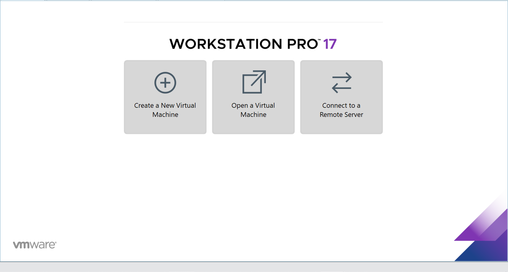

# TÌM HIỂU VMWare

## I. VMWare LÀ GÌ ?

### 1. Khái niệm VMWare

VMware là phần mềm máy chủ ảo chức năng như một hệ thống máy tính ảo với CPU, bộ nhớ, mạng và bộ lưu trữ riêng. Chúng được tạo bởi một hệ thống phần cứng vật lý. Phần mềm được gọi là hypervisor chia các tài nguyên của máy khỏi phần cứng và cung cấp một cách thích hợp để máy ảo(VM) có thể sử dụng.

### 2. Hypervisor là gì - Các loại hypervisors?

Hypervisors là công cụ được sử dụng để tạo máy ảo (VM) để lưu trữ dịch vụ, thử nghiệm và phát triển phần mềm trong một môi trường an toàn.

Có 2 loại hypervisors khác nhau có thể được sử dụng để ảo hóa:

1. Loại 1
Hypervisor loại 1 chạy trực tiếp trên phần cứng. Hypervisor quản lý và phân bổ tài nguyên VM trực tiếp tới phần cứng. KVM là một ví dụ về hypervisor loại 1. KVM đã được tích hợp vào nhân Linux từ năm 2007. Do đó, nếu bạn đang sử dụng một phiên bản Linux hiện đại, bạn đã có quyền truy cập vào KVM.

2. Loại 2
Hypervisor loại 2 là Host – Tài nguyên máy ảo VMware được lập lịch dựa trên hệ điều hành chủ, sau đó được thực thi dựa trên phần cứng. VMware Workstation và Oracle VirtualBox là những ví dụ cho Hypervisor loại 2.

### 3. Chức năng chính của VMware là gì?

**Tạo và quản lý các máy ảo**:

VMware cung cấp các công cụ và giải pháp cho phép người sử dụng tạo và quản lý các máy ảo trên máy tính của họ. Các máy ảo này giống như các máy tính thực tế, cho phép người sử dụng chạy các hệ điều hành và các ứng dụng khác trên chúng.

**Quản lý các máy tính trong môi trường doanh nghiệp**:

Công cụ sẽ có các tính năng hỗ trợ người quản trị IT quản lý và theo dõi các máy tính trong môi trường doanh nghiệp, hỗ trợ người quản trị có thể dễ dàng quản lý và bảo trì các hệ thống máy tính.

**Đồng bộ hóa các môi trường máy tính**:

Ví dụ, người sử dụng có thể đồng bộ hóa các thiết lập hệ điều hành, cài đặt phần mềm và các tài nguyên khác giữa các máy tính khác nhau để giảm thời gian và công sức cho việc quản lý các hệ thống máy tính.

**Tăng khả năng bảo mật cho máy tính**:

VMware cũng cung cấp các công cụ và giải pháp bảo mật cho phép người sử dụng bảo vệ máy tính và các tài nguyên. Các công cụ này giúp ngăn chặn các cuộc tấn công từ mạng và ngăn ngừa sự tạo ra các lỗ hổng bảo mật trên hệ thống máy tính.

### 4. Cài dặt VMW Workstation

Tất cả các bước đều có trong link này :

<https://fptshop.com.vn/tin-tuc/thu-thuat/vmware-la-gi-153376>

Sau khi cài xong ta sẽ có giao diện trông như thế này :

## II. PHÂN BIỆT 3 NETWORK MODE VMW: NAT, BRIDGED, HOST-ONLY

### 1. So sánh nhanh 3 chế độ Networkmode VMW

**Lưu ý**: Thông thường Physical Network hay VMware Network cũng đều có các thành phần phổ biến như Switch, Network Adapter/Card, DHCP server, NAT device, …(Tất nhiên trênVMware thì toàn bộ đám này sẽ là ảo hết).

| Tính năng | NAT | Bridged | Host-Only |
|-----------|-------------|---------|---------|
| Kết nối Internet | Có (thông qua máy chủ host) | Có (nếu host có mạng) | Không (trừ khi cấu hình thêm) |
| Giao tiếp với máy host | Có | Có | Có |
| Giao tiếp với máy thật khác | Không (bị ẩn sau host) | Có (như mọt máy tính thật trong mạng) | Không (chỉ liên lạc được với host và VM khác) |
| Cách cấp IP | Máy ảo lấy IP từ VMware DHCP | Máy ảo lấy IP từ router của mạng LAN | Máy ảo lấy IP từ VMware riêng biệt |
| Bảo mật | Cao (máy ảo ẩn khỏi mạng bên ngoài) | Thấp (máy ảo lộ trực tiếp ra ngoài mạng) | Rất cao (máy ảo hoàn toàn cách ly) |
| Tính ứng dụng | Truy cập internet mà không lộ IP thật | Test mạng như máy thật, cần IP tĩnh | Môi trường cô lập, thử nghiệm nội bộ |

### 2. Chi tiết các chế độ

Khi tạo các VMnet, trên máy thật sẽ tạo ra các card mạng ảo tương ứng với VMnet đó, dùng để kết nối Virtual Switch với máy tính thật, giúp máy ảo và máy thật có thể liên lạc được với nhau.

Riêng VMnet0 kết nối trực tiếp với card mạng vật lý thông qua cơ chế bắc cầu (bridged) nên không tạo ra card VMnet. VMnet8 mặc định sẽ sử dụng cơ chế NAT. Các VMnet khác khi thêm vào sẽ là Host-Only.

#### 1. NAT (Network Address Translation)

Máy ảo được cấu hình NAT sẽ sử dụng IP của máy thật để giao tiếp với mạng ngoài. Các máy ảo được cấp địa chỉ IP nhờ một DHCP ảo của VMware. Lúc này, các máy ảo sẽ kết nối với máy thật qua switch ảo VMnet8, và máy thật sẽ đóng vai trò NAT server cho các máy ảo.

**Cách hoạt động:**

**1.Máy ảo (VM) gửi yêu cầu truy cập mạng:** Khi máy ảo muốn truy cập một địa chỉ trên mạng (ví dụ: một trang web), nó sẽ gửi một gói tin đi. Gói tin này sẽ có địa chỉ IP nguồn là địa chỉ IP riêng (private IP) của máy ảo.

**2.Máy thật (Host) thực hiện NAT lần 1:** Máy thật đóng vai trò là NAT device cho máy ảo. Khi gói tin từ máy ảo đến, máy thật sẽ thực hiện các bước sau:

- Thay đổi địa chỉ IP nguồn trong gói tin từ địa chỉ IP riêng của máy ảo thành địa chỉ IP riêng của chính máy thật
- Ghi lại thông tin về kết nối này (địa chỉ IP và port của máy ảo, địa chỉ IP và port mới của máy thật) vào bảng NAT của nó. Thông tin này sẽ được dùng để theo dõi các phản hồi sau này.

**3.Router thực hiện NAT lần 2:** Gói tin sau khi đã được NAT bởi máy thật sẽ tiếp tục được gửi đến router. Router, là thiết bị kết nối mạng nội bộ với internet, sẽ thực hiện NAT lần thứ hai:

- Thay đổi địa chỉ IP nguồn trong gói tin từ địa chỉ IP riêng của máy thật thành địa chỉ IP công cộng (public IP) được cấp bởi nhà cung cấp dịch vụ internet (ISP).
- Tương tự, router cũng sẽ ghi lại thông tin về kết nối này vào bảng NAT của nó (địa chỉ IP và port của máy thật, địa chỉ IP và port mới sau khi NAT ra IP public).

**4.Phản hồi từ internet:** Khi máy chủ web hoặc dịch vụ mà máy ảo đang cố gắng truy cập gửi phản hồi, gói tin sẽ có địa chỉ IP đích là địa chỉ IP công cộng của router.

**5.Router chuyển phản hồi về máy thật:** Router sẽ xem xét bảng NAT của nó và xác định rằng gói tin này là phản hồi cho một kết nối đã được khởi tạo từ địa chỉ IP riêng của máy thật. Do đó, router sẽ thay đổi địa chỉ IP đích trong gói tin từ địa chỉ IP công cộng trở lại địa chỉ IP riêng của máy thật và gửi gói tin này về máy thật.

**6.Máy thật chuyển phản hồi về máy ảo:** Khi máy thật nhận được gói tin phản hồi, nó sẽ xem xét bảng NAT của mình và xác định rằng gói tin này là phản hồi cho một kết nối đã được khởi tạo từ địa chỉ IP riêng của máy ảo. Do đó, máy thật sẽ thay đổi địa chỉ IP đích trong gói tin từ địa chỉ IP riêng của chính nó trở lại địa chỉ IP riêng của máy ảo và gửi gói tin này đến máy ảo.

**Khả năng giao tiếp:**

- Máy ảo -> Internet: Có
- Máy ảo <- Internet: cần cấu hình Port Forwarding
- Máy ảo <-> Máy chủ (host): Có
- Máy ảo <-> Máy ảo (cùng NAT): có thể bị hạn chế và cần cấu hình
- Máy ảo <-> Mạng LAN bên ngoài: Không thể truy cập trực tiếp

#### 2. Bridged

Card mạng của máy ảo sẽ được gắn trực tiếp với card mạng của máy thật (sử dụng switch ảo VMnet0). Lúc này, máy ảo sẽ đóng vai trò như một máy trong mạng thật, có thể nhận DHCP từ mạng ngoài, hoặc đặt IP tĩnh cùng dải với mạng ngoài để giao tiếp với các máy ngoài mạng hoặc lên Internet.

**Cách hoạt động:**

Máy ảo kết nối trực tiếp vào mạng LAN thông qua card mạng vật lý của máy host.

- VMware tạo một Virtual Bridge (cầu nối ảo) giữa adapter Ethernet/Wi-Fi của máy host và VMnet0 (cầu nối ảo).
- Máy ảo hoạt động như một thiết bị độc lập trong mạng LAN, giống như một máy tính thật.
- Máy ảo có thể lấy IP từ DHCP trong mạng LAN, giống như máy host và các thiết bị khác trong mạng.

Luồng dữ liệu khi máy ảo giao tiếp với mạng:

- Khi máy ảo gửi gói tin, nó đi qua Virtual Ethernet Adapter → VMnet0 → card mạng vật lý của máy host → mạng LAN.
- Khi máy ảo nhận gói tin, dữ liệu từ mạng LAN đi vào card mạng vật lý của máy host → VMnet0 → máy ảo.

**Khả năng giao tiếp:**

- Máy ảo <-> Internet: Có
- Máy ảo <-> Máy chủ (host): Có
- Máy ảo <-> Máy ảo (cùng Bridged): Có
- Máy ảo <-> Mạng LAN bên ngoài: Có

#### 3. Host-Only

Khi cấu hình máy ảo sử dụng host-only networking, máy ảo sẽ được kết nối với máy thật trong một mạng riêng thông qua Switch ảo VMnet1. Địa chỉ của máy ảo và máy thật trong mạng host-only có thể được cấp bởi DHCP ảo gắn liền với Switch ảo Vmnet1 hoặc có thể đặt địa chỉ IP tĩnh cùng dải để kết nối với nhau.

**Lấy IP tự động từ DHCP:**

**Cách hoạt động:**

- VMware tạo một mạng ảo riêng biệt (VMnet1)
- VMnet1 là một mạng nội bộ chỉ có giữa máy host và các máy ảo host-only.
- Máy host có một Host Virtual Adapter để giao tiếp với mạng VMnet1.
Không có kết nối với card mạng vật lý của máy host, nên máy ảo không thể ra Internet hoặc truy cập mạng LAN bên ngoài.

**Luồng dữ liệu khi máy ảo giao tiếp:**

- Khi máy ảo gửi gói tin, nó đi qua Virtual Ethernet Adapter → VMnet1 → máy host hoặc máy ảo khác trong cùng VMnet1.
- Nếu máy host chạy một dịch vụ (VD: SSH, HTTP), máy ảo có thể kết nối đến dịch vụ đó thông qua IP của Host Virtual Adapter.

**Khả năng giao tiếp:**

- Máy ảo <-> Internet: Không
- Máy ảo <-> Máy chủ (host): Có (tắt tường lửa ở máy chủ)
- Máy ảo <-> Máy ảo (cùng Host-Only): Có
- Máy ảo <-> Mạng LAN bên ngoài: Không

## III. SNAT,DNAT

Đã tìm hiểu ở bài NAT

Link: <https://github.com/tiend9/system-intership/blob/master/TienHA/02.CCNA/06.NAT/NAT.md>