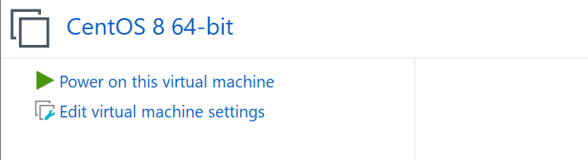
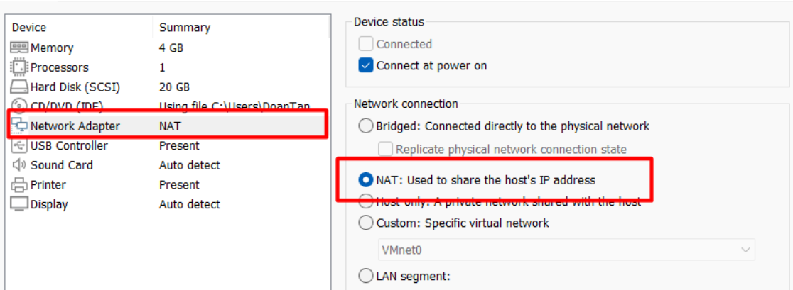
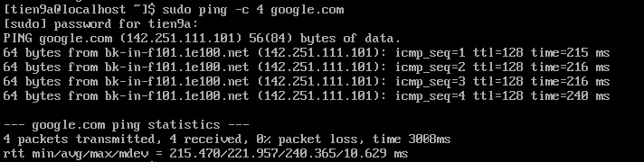
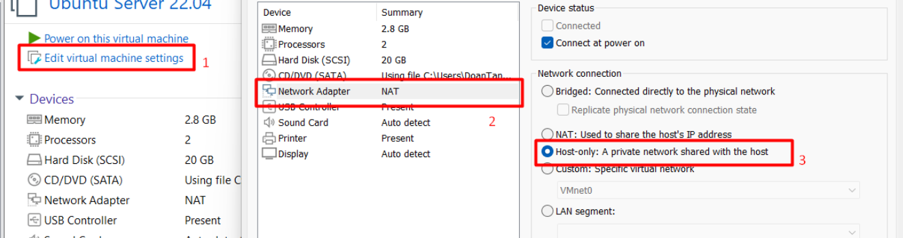
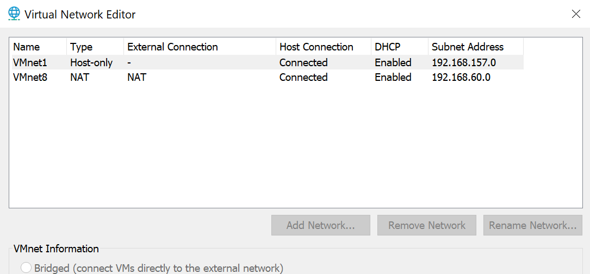
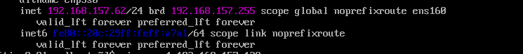
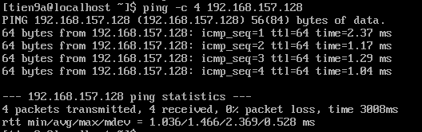
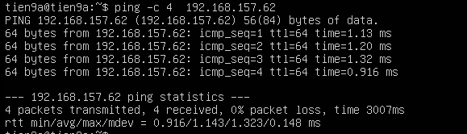

# LAB

## I. Sử dụng chế độ mạng NAT để truy cập Internet

### `Bước 1:` Cấu hình NAT trên VMware Workstation

1. Tắt máy ảo CentOS 9 nếu đang chạy.
2. Chọn máy ảo CentOS 9 trong VMware Workstation.
3. Nhấp vào Edit virtual machine settings.

4. Chọn Network Adapter → Chọn NAT (Share the host’s IP address).

5. Nhấn OK để lưu lại cấu hình.

### `Bước 2:` Kiểm tra và kết nối internet

1. Ping kiểm tra kết nối internet(ping 4 gói gửi đi)

```ruby
sudo ping -c 4 google.com
```

Nếu nhận được phản hồi, máy ảo đã kết nối internet thành công.



## II. Sử dụng chế độ card Host-only để 2 máy ảo kết nối với nhau

### `Bước 1:` Cấu hình card mạng Host-Only trên VMware

1. Chọn CentOS 9 → Edit virtual machine settings → Chọn Network Adapter → Tích chọn Host-Only → OK để lưu cấu hình.
2. Lặp lại các bước trên Unbuntu Server.



Kiểm tra cấu hình card mạng Host-Only:

- Vào Edit → Virtual Network Editor.
- Đảm bảo có một VMnet1 đã được thiết lập cho Host-Only.



Nếu chưa có:

- Chọn Add Network → VMnet1 → Host-Only.
- Đặt dải IP (ví dụ: 192.168.186.0/24).

### `Bước 2:` Cấu hình/ Check IP tĩnh cho mỗi máy ảo

-Ta dùng lệnh `ip a` ra ip tĩnh cho cả 2 máy ảo CentOs(192.168.60.70) và Unbutu(192.168.157.168).Lúc này ta chỉ cần chỉnh sửa sao cho 2 máy trùng dải mạng là `192.168.157.X` và ta sẽ chỉnh ở con CentOS.

**Trên máy ảo CentOS 9:**

- Chỉnh sửa file cấu hình card mạng:

```ruby
sudo nano /etc/NetworkManager/systemconnections/ens160.nmconnection
```

Cập nhật thêm thông tin nội dung như sau:



Lưu và khởi động lại card mạng:

```ruby
sudo systemctl restart network
```

kiểm tra lại địa chỉ IP:

```ruby
ip addr
```

**Kiểm tra kết nối giữa 2 máy ảo:**

Từ CentOS 9 ping tới Ubuntu Server:

```ruby
ping 192.168.157.128
```

kết quả ping thành công:



Từ Ubuntu Server ping tới CentOS 9:

```ruby
ping 192.168.157.62
```

Kết quả ping thành công:



## III. Sử dụng 1 card Bridged để từ máy ảo ping ra máy laptop cá nhân

**Lưu ý quan trọng:** Khi muốn cài chế độ Bridged trên máy ảo ta cần tắt máy ảo đó trước rồi thực hiện chọn chế độ như Host-Only,NAT nhưng thêm 1 bước vào phần Advance → Bridged to để chọn card mạng vật lý (Wi-Fi hoặc Ethernet) → Chọn đúng card mạng mà máy laptop của bạn đang kết nối internet.

### `Bước 1:` Kiểm tra cấu hình mạng

-Trên laptop cá nhân, kiểm tra địa chỉ IP trong mạng LAN:

-Trên Window, mở CMD và nhập lệnh:

`ipconfig`

Nếu laptop kết nối có dây, sử dụng địa chỉ trong Ethernet adapter Ethernet. Nếu kết nối không dây, sử dụng địa chỉ trong Wireless LAN adapter Wi-Fi.

### `Bước 2:` Cấu hình IP cho máy ảo

**Cách 1: Sử dụng DHCP (IP động):**

-Do CentOS 9 đã bỏ phần Network-Scripts (không có sẵn) lên ta sẽ dùng 'nmcli' để quản lí

-Đặt chế độ DHCP bằng lệnh `nmcli`:

```ruby
sudo nmcli connection modify ens160 ipv4.method auto
sudo nmcli connection up ens160
```

-Check lại IP xem đã có chưa:

```ruby
ip a show dev ens160
```

**Cách 2: Cài đặt IP tĩnh (Nếu không muốn dùng DHCP):**

**Lưu ý quan trọng:** Chọn địa chỉ IP chưa sử dụng và cùng dải với laptop không thì sẽ gặp tình trạng lỗi nếu đang ở trong 1 mạng LAN có địa chỉ trùng với địa chỉ đó.

`CentOS 9:`

Mở cấu hình mạng:

```ruby
sudo vi /etc/sysconfig/network-scripts/ifcfg-ens160
```

Cập nhật nội dung:

```ruby
TYPE="Ethernet"
BOOTPROTO="none"
ONBOOT="yes"
IPADDR=192.168.1.50
NETMASK=255.255.255.0
GATEWAY=192.168.1.1
DNS1=8.8.8.8
Trong đó IPADDR là địa chỉ cùng dải mạng và khác host với IP của laptop. GATEWAY trùng với Default Gateway của laptop để truy cập mạng.
```

Lưu file và khởi động lại mạng:

```ruby
sudo systemctl restart network
```

### `Bước 3:` Kiểm tra kết nối

Từ laptop ping tới máy ảo: Trên window (CMD)

```ruby
ping 192.168.3.58
```

Kết quả ping thành công:

```text
successfully ping to vm
```

-Từ máy ảo ping tới laptop: thực hiện tương tự
