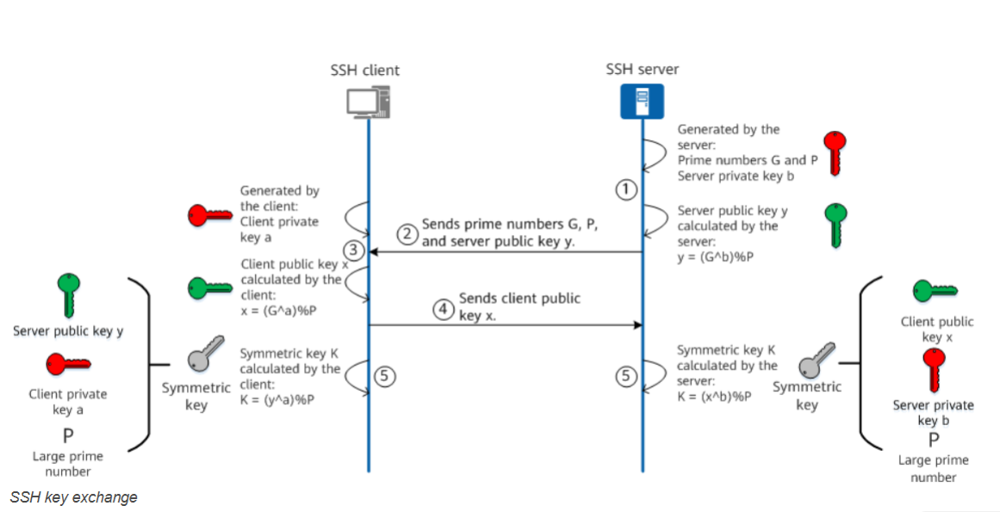
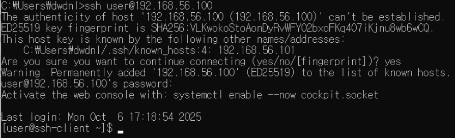
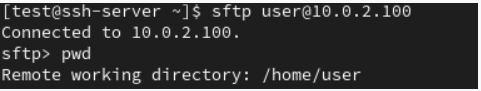
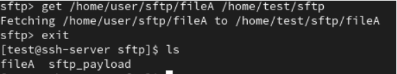

# TÌM HIỂU VỀ SSH

## I. GIAO THỨC SSH LÀ GÌ ?

### **Giới thiệu**

SSH (secure shell) là một giao thức mã hóa dùng để quản trị và giao tiếp với servers.

- SSH hoạt động ở lớp trên trong mô hình phân lớp TCP/IP
- Các công cụ SSH (như là OpenSSH, PuTTy,…) cung cấp cho người dùng cách thức để thiết lập kết nối mạng được mã
  hoá để tạo 1 kênh kết nối riêng tư.
- Hơn nữa tính năng tunneling (hoặc còn gọi là port forwarding) của các công cụ này cho phép chuyển tải các
  giao vận theo các giao thức khác.
- Mỗi khi dữ liệu được gửi bởi 1 máy tính vào mạng, SSH tự động mã hoá nó. Khi dữ liệu được nhận vào, SSH tự động
  giải mã nó.
- Kết quả là việc mã hoá được thực hiện trong suốt.

Có một vài cách để SSH tới SSH server như dùng password hoặc keypair. Trong đó phương thức dùng keypair được cho là có tính bảo mật cao hơn bởi nếu trong quá trình sử dụng mà các gói tin của bạn bị bắt lại, các phiên trao đổi khóa giữa SSH server và Client sẽ bị lộ và attacker có thể dùng nó để giải mã dữ liệu. Hơn nữa, việc này cũng tạo điều kiện cho các cuộc tấn công Brute Force mật khẩu.

SSH có hỗ trợ sử dụng cặp khóa Private Key và Public Keyđược chia sẻ với nhau từ trước. Nghĩa là bạn đã có sẵn Private Key để trao đổi với server mà không cần đến quá trình trao đổi khóa, điều này sẽ hạn chế khả năng bị bắt gói. Hơn nữa cặp khóa này còn có một mật khẩu riêng của nó, gọi là passphrase (hay keyphrase). Mật khẩu này được dùng để mở khóa Private Key (được hỏi khi bạn SSH vào server) và tạo lớp xác thực thứ 2 cho bộ khóa. Nghĩa là:

- Nếu attacker không có Private Key, việc truy cập vào server gần như không thể, chỉ cần bạn giữ kĩ Private Key.
- Tuy nhiên trong trường hợp Private Key bị lộ, bạn vẫn khá an toàn vì đối phương không có passphrase thì vẫn chưa thể làm được gì, tuy nhiên đó chỉ là tạm thời. Bạn cần truy cập server thông qua cách trực tiếp hoặc qua VNC của nhà cung cấp nếu đó là một VPS để thay đổi lại bộ khóa.

### 1. Khái niệm SSH

**SSH** hay còn gọi là **Secure Shell** là 1 giao thức dùng để đăng nhập hay truy cập từ xa để vận hành các dịch vụ mạng bằng cách execute CLI an toàn trên một mạng không bảo mật (qua IP) SSH sử dụng mật mã để xác thực và mã hoá các kết nối giữa các thiết bị qua số cổng 22 (nó là phương thức truy cập mạnh thay thế cho telnet; rlogin ) SSH đảm bảo tính bảo mật, toàn vẹn và xác thực khi giao tiếp.


### 2. Các thành phần trong SSH

- **Server** : Một máy chủ thực hiện kết nối SSH với một máy khách kết nối đến nó, trình bày xác thực, cấp phép, … Trong hầu hết SSH bổ sung của Unix thì server thường là sshd.
- **Client** : Một máy khách kết nối đến SSH server và đưa ra yêu cầu như là “log me in” hoặc “copy this file”.
  Trong SSH1, SSH2 và OpenSSH, client chủ yếu là ssh và scp.
- **Session** : Một phiên kết nối giữa một client và một server. Nó bắt đầu sau khi client xác thực thành công đến
  một server và kết thúc khi kết nối chấm dứt. Session có thể được tương tác với nhau hoặc có thể là một chuyến riêng.

### 3. Ứng dụng SSH

- Cung cấp quyền truy cập an toàn cho người dùng và các quy trình tự động
- Truyền tệp và tương tác tự động
- Phát hành các lệnh từ xa
- Quản lí cơ sở hạ tầng mạng và các thành phần hệ thống quan trọng khác (tạo đường hầm)

### 4. Tính năng chính

- **Truy cập máy chủ từ xa:** Cho phép quản trị viên kết nối và điều khiển máy chủ Sever từ xa hoặc truy cập vào Database.
- **Truyền tệp an toàn (Secure File Transfer):** Cho phép truyền dữ liệu an toàn qua các kết nối không an toàn bằng cách bọc dữ liệu trong đường hầm SSH. Có 2 loại:

  - **Local Port Forwarding:** Định tuyến lưu lượng từ máy cục bộ qua máy chủ SSH - `ssh -L 8080:localhost:80 user@server`

  - **Remote Port Forwarding:** Cho phép máy chủ SSH chuyển tiếp lưu lượng đến một máy khác - `ssh -R 9090:localhost:3000 user@server`

  - **Dynamic Port Forwarding:** Chuyển tiếp lưu lượng từ máy cục bộ đến nhiều đích (SOCKS proxy) - `ssh -D 1080 user@server`

- **Truyền tệp tin thông qua các giao thức SCP & SFTP chạy trên nền SSH:**

  - `scp` (Secure Copy): Truyền tệp tin giữa client và server an toàn dựa trên nền SSH.
  - `sftp` (SSH File Transfer Protocol): Giao thức truyền tệp an toàn dựa trên nền SSH.
  - vd: truyền file từ ubuntu sang centos:

    ```ruby
    scp text.txt tien9a@192.168.3.88:/home/tien9a/
    hoặc chỉ cho kết nối với keypair
    scp -i ~/.ssh/id_rsa text.txt tien9a@192.168.8.88:/home/tien9a/
    ```

- **Chạy lệnh từ xa:** Có thể thực thi lệnh trên máy chủ mà không cần mở phiên shell (`ssh user@server "ls -l"`).

### 5. WorkFlow - Cách hoạt động của SSH


#### **Giai đoạn 1 - Thiết lập kết nối TCP**

- Client mở một kết nối TCP tới server SSH (mặc định port 22).
- Đây là handshake TCP 3-way (SYN/SYN-ACK/ACK). Trước khi SSH hoạt động, cần lớp vận chuyển TCP ổn định.
- **Mục đích**: Tạo kênh truyền vật lý ổn định giữa hai thiết bị để SSH có thể gửi gói tin. SSH là giao thức tầng ứng dụng (Application Layer), nó cần TCP làm nền để đảm bảo tính tin cậy (reliable transmission).

#### **Giai đoạn 2- Protocol/version exchange**

- Hai bên trao đổi chuỗi phiên bản (ví dụ SSH-2.0-OpenSSH_8.4) để biết phiên bản SSH (thường SSH-2.0).
- Gửi thông tin phiên bản SSH được server hỗ trợ cho client.
- Client nhận nội dung, quyết định sử dụng phiên bản nào trong phạm vi hỗ trợ và gửi đến máy chủ.
- Đảm bảo client và server cùng nói “một ngôn ngữ giao thức” (phiên bản SSH).

#### **Giai đoạn 3 - Algorithms negotiation (KEXINIT)**

- Client và server gửi gói `KEXINIT` chứa danh sách thuật toán mà họ hỗ trợ:

  - thuật toán trao đổi khóa (KEX algorithms: e.g., diffie-hellman-group14-sha1, ecdh-sha2-nistp256),
  - thuật toán host key (rsa, ecdsa),
  - cipher (symmetric encryption: AES256-ctr, chacha20),
  - MAC (HMAC-sha2-256),
  - compression

- Hai bên so khớp và đồng ý một bộ thuật toán chung, thống nhất bộ thuật toán bảo mật sẽ dùng cho toàn phiên (session)

#### **Giai đoạn 4,5 Key Exchange**

- **Host key (khóa dài hạn của server)** đã tồn tại trên server (ví dụ /etc/ssh/ssh_host_rsa_key). Dùng để server chứng minh mình là ai.

- **Ephemeral key pair** được tạo tức thời cho quá trình KEX (ví dụ ECDH/DH ephemeral).

- Cả SSH client và server dùng thuật toán trao đổi khóa (Key Exchange Algorithm – KEX) để tạo ra một khóa phiên (session key) và mã định danh phiên (session ID).

  - Session key → dùng để mã hóa/giải mã dữ liệu trong suốt phiên làm việc.
  - Session ID → định danh phiên, đảm bảo khi xác thực người dùng (login), server biết bạn thuộc phiên nào.

- Ngoài ra, client có thể đã có user key pair (ví dụ ~/.ssh/id_rsa) dùng để xác thực người dùng sau này.

- Mục đích: Tạo ra một “mật khẩu tạm thời” dùng chung, được sinh ngẫu nhiên cho từng phiên kết nối — giúp bảo mật, không reuse khóa giữa các phiên.

- Trong giai đoạn trao đổi khóa, client cũng xác thực danh tính của server.

  - Server dùng private key của nó để ký (sign) một phần thông điệp trao đổi khóa.
  - Client dùng public key của server (đã biết trước hoặc được lưu trong known_hosts) để xác minh chữ ký.
  - Đảm bảo client đang nói chuyện với đúng server thật, không phải hacker (ngăn “man-in-the-middle attack”).
- Đây là quá trình xác thực server:

  - Server ký bằng private key → chứng minh “tôi là chính chủ”.
  - Client xác minh bằng public key → đảm bảo chữ ký hợp lệ.

- Sau khi trao đổi khóa thành công, cả hai bên cùng tạo ra cùng một session key (dù không hề gửi trực tiếp cho nhau).

  - Giúp họ có thể dùng mã hóa đối xứng (symmetric encryption) — nhanh và hiệu quả hơn — cho phần còn lại của phiên.
  - SSH không gửi trực tiếp khóa qua mạng.

- Thay vào đó, nó dùng thuật toán trao đổi khóa an toàn, phổ biến là:

  - Diffie–Hellman (DH)
  - ECDH (Elliptic Curve Diffie–Hellman)
  - Hai bên có thể cùng tính ra một bí mật chung (shared secret) mà hacker nghe lén không thể tính ra được, vì chỉ có một phần dữ liệu công khai được trao đổi.

- Dựa vào toán học (số mũ modulo, đường cong elliptic…), thuật toán trao đổi khóa đảm bảo rằng:

  - Không ai có thể đoán được khóa thực.
  - Không cần truyền khóa qua mạng.
  - Đảm bảo tính bí mật của session key dù toàn bộ quá trình diễn ra qua Internet không an toàn.

- Không có khóa nào được gửi trực tiếp. Cả hai tự tính ra cùng một kết quả bằng công thức toán học, dựa trên giá trị công khai và khóa riêng của chính mình.
  - **Mục đích**: Ngăn chặn kẻ tấn công “nghe trộm” (eavesdropping) hoặc “chèn khóa giả”.
  


- Máy chủ tạo ra số nguyên tố G,P và khóa riêng của máy chủ b, đồng thời tạo khóa công khai y của server bằng công thức `y=(G^b)%P`.
- SSH Server chuyển số nguyên tố G, P và Public key y cho SSH client.
- SSH Client tạo private key **a** và tính toán Public key **x** của client dựa trên công thức: `x = (G^a)%P.`
- SSH Client gửi Public key **x** tới SSH Server.
- SSH server tính toán Symmertric key K dựa trên công thức `K = (x^b)%P`, SSH Client cũng tính symmertric key K dựa trên công thức `K = (y^a)%P`
- Luật toán này đảm bảo Symmetric keys được tạo ra bởi SSH server và client là 1.

#### **Giai đoạn 6 - Initiate a login request (start userauth service)**

- Sau KEX hoàn tất và cả hai đã chuyển sang kênh mã hóa bằng session key, client gửi yêu cầu khởi động service `ssh-userauth`.

- Bắt đầu tiến trình xác thực: client nói muốn đăng nhập dưới user `alice` và thử từng phương pháp (publickey, password, keyboard-interactive...).

#### **Giai đoạn 7 - Server checks public key / decide authentication method**

- Nếu client đề nghị public-key auth, server kiểm tra xem public key đó có khớp entry trong `~/.ssh/authorized_keys` của user trên server không.

- Nếu có, server sẽ báo “OK” (trong giao thức SSH2 server trả về `USERAUTH_PK_OK`) — tức server chấp nhận public key này là có thể dùng để đăng nhập (nhưng phải chứng minh quyền sở hữu private key).

  - Có 2 biến thể lịch sử để chứng minh sở hữu private key:

    - Signature-based (hiện đại): client ký một chuỗi (session identifier + dữ liệu) bằng private key and gửi signature; server kiểm tra bằng public key.
    - Challenge-response (mã hóa challenge): server gửi một challenge mã hóa bằng public key và client giải mã bằng private key → chứng minh quyền sở hữu. (phần lớn triển khai SSH2 hiện nay dùng signature, không mã hóa trực tiếp.)

#### **Giai đoạn 8 - Server provides challenge / returns encrypted random (or PK_OK)**

- server gửi `USERAUTH_PK_OK`, rồi client kí (signature) trên một giá trị liên quan tới KEX/session id (không gửi private key). Cả 2 đều dùng session id để liên kết xác thực với KEX.

#### **Giai đoạn 9 - Client proves key possession (decrypt or sign using private key)**

- Client dùng private key để:

  - hoặc giải mã challenge (nếu dùng challenge-response),
  - hoặc ký đoạn dữ liệu (nhiều triển khai hiện dùng ký).

- Kết quả (signature hoặc decrypted challenge) được gửi về server.

#### **Giai đoạn 10 - Client sends decrypted data / signature**

- Client gửi kết quả chứng minh lên server qua kênh đã mã hóa (vì KEX xong rồi).
- Nếu dùng password auth thì client sẽ gửi password tại bước này (luôn qua kênh đã mã hóa).

#### **Giai đoạn 11 - Server verifies client's proof**

- Server dùng public key (trong `authorized_keys`) để kiểm tra signature hoặc xác thực password.
- Nếu hợp lệ → server chấp nhận authentication; nếu không → từ chối (có thể yêu cầu phương pháp khác).

#### **Giai đoạn 12 - Session request and response (open session/channel)**

- Sau khi xác thực, client mở SSH channel (ví dụ: `session` channel), rồi gửi request: `shell` (muốn một shell tương tác), hoặc `exec` (chạy 1 lệnh), hoặc `subsystem` (ví dụ sftp), hoặc tạo forwarding channel (`direct-tcpip` cho port forwarding).

- Server trả lời accept/deny cho từng request.

#### **Giai đoạn 13 - Send encrypted commands (data flows over channels)**

- Khi kênh được mở, mọi dữ liệu (lệnh, stdin/stdout/stderr, file) được đóng gói thành SSH_MSG_CHANNEL_DATA và mã hóa bằng symmetric cipher (session key) + MAC.

- Ví dụ: client gửi các kí tự gõ vào shell; server nhận và thực thi.

#### **Giai đoạn 14 - Server decrypts commands using session key and executes**

- Server giải mã gói chứa lệnh bằng session key, thực thi lệnh trên shell hoặc service tương ứng.

- Kết quả chuẩn (stdout/stderr) được thu lại.

#### **Giai đoạn 15 - Server sends encrypted result back**

- Kết quả thực thi (output) được mã hóa tương tự và gửi ngược lại client trong các gói dữ liệu SSH.

#### **Giai đoạn 16 - Client decrypts result using session key**

- Client giải mã và hiển thị output cho người dùng.

- Vòng đời này (gửi lệnh → thực thi → trả kết quả) lặp lại cho đến khi session đóng.

## II. HOW TO USE SSH ?

### 1. Basic Command - Các lệnh cơ bản

Khi kết nối bằng ssh, hãy nhập tên người dùng và IP/DNS và nhập mật khẩu cho người dùng đó.

```ruby
ssh [username]@[IP or DNS]
```



Khi kết nối lần đầu, khóa công khai của máy chủ không được lưu trữ trong máy khách, vì vậy bạn sẽ được yêu cầu nhập khóa công khai để lưu. Nếu bạn chọn "có", khóa công khai sẽ được lưu, sau đó bạn sẽ được yêu cầu nhập mật khẩu và kết nối.

Khóa công khai được lưu trữ tại `.ssh/known_hosts` trong thư mục gốc của bạn.


Bạn cũng có thể thực thi lệnh mà không cần truy cập từ xa. Trong trường hợp này, chỉ có kết quả thực thi lệnh được trả về và kết nối không được thiết lập.

```ruby
ssh [username]@[IP hoặc DNS][command]
```

### 2. Xác thực dựa trên khoá

Đối với xác thực dựa trên khóa, bạn cần tạo cặp khóa riêng tư/công khai.
Nếu bạn không chỉ định vị trí lưu trữ khi tạo khóa, khóa riêng tư sẽ được lưu trữ tại `.ssh/id_rsa` trong thư mục gốc của bạn, và khóa công khai sẽ được lưu trữ tại `.ssh/id_rsa.pub.`

```ruby
ssh-keygen [optoin][đối số]
```


Khi chuyển khóa công khai đến hệ thống bạn muốn kết nối, hãy sử dụng lệnh này và một tệp pub sẽ được gửi.
Khóa đã nhận có thể được tìm thấy trong `.ssh/authorized_keys` trong thư mục home của bạn.

```ruby
ssh-copy-id [option][đối số] [username]@[IP hoặc DNS]
```


### 3. Các giao thức chuyển tập tin dựa trên giao thức SSH

`SCP` (Bản sao an toàn) có thể được sử dụng theo cùng cách như lệnh cp hiện có.

```ruby
scp [option][source] [username]@[IP or DNS]:[destination] folder use option -r
```


`SFTP` (Giao thức truyền tệp an toàn) có thể được sử dụng tương tự như FTP hiện có.

```ruby
sftp [username]@[IP or DNS]
```



Bạn có thể chuyển các tập tin trên máy khách sang máy chủ bằng lệnh `put`.

```ruby
put [source][destination]
```


Bạn có thể chuyển các tập tin trên máy chủ tới máy khách thông qua `get`.

```ruby
get [source][destination]
```


