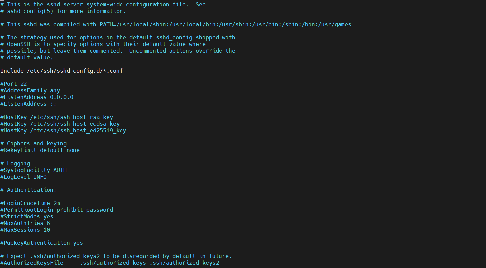
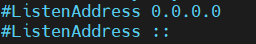
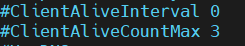
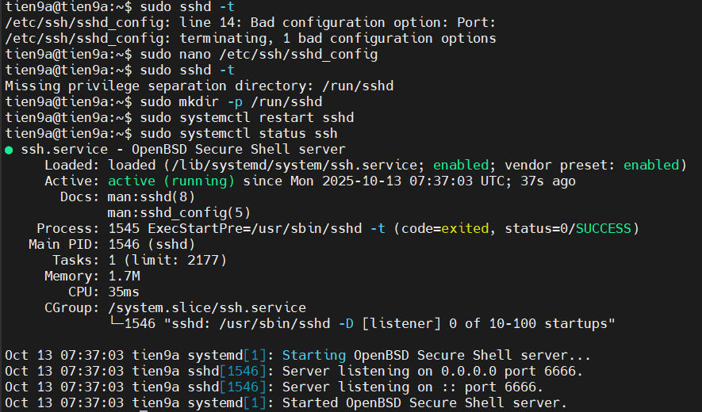

# THÔNG SỐ CẤU HÌNH SSH

## I. CÁC FILE CẤU HÌNH CHÍNH CẦN LƯU Ý

- `/etc/ssh/sshd_config` : File config cho phép máy mình kết nối ra ngoài (đóng vai trò như 1 sever) → sửa hoặc kiểm tra `sshd_config`, muốn chỉnh sửa file thì dùng `sudo vi` or `sudo nano` và nhớ `sudo systemctl restart sshd` để lưu cấu hình sau khi thay đổi

- `/etc/ssh/ssh_config` : File config cho phép máy mình được SSH vào (đóng vai trò như 1 client) → chỉnh `ssh_config`, muốn chỉnh sửa file thì dùng `sudo vi` or `sudo nano` và nhớ `sudo systemctl restart ssh` để lưu cấu hình sau khi thay đổi

- `~/.ssh/config` : File cấu hình SSH Client **trên Linux**(ta check trên Ubuntu hay CentOS và cùng có ở Sever và Client)

- `/etc/nologin` : Nếu file này tồn tại, thì dịch vụ SSH Server trên Linux sẽ từ chối đăng nhập từ các user khác trên hệ thống trừ user `root`. File này thường dùng cho trường hợp khẩn cấp cần cách ly hệ thống sớm

**So sánh `/etc/ssh/ssh_config` và `~/.ssh/config`:**

| Mục so sánh | `/etc/ssh/ssh_config` | `~/.ssh/config` | Ghi chú |
|--------------|-----------------------|-----------------|----------|
| **Phạm vi áp dụng** | Toàn hệ thống (system-wide) | Riêng cho user hiện tại | User config sẽ *ghi đè* lên system config |
| **Vị trí file** | `/etc/ssh/ssh_config` | `/home/<username>/.ssh/config` | `~` = thư mục home của user |
| **Quyền chỉnh sửa** | Chỉ `root` có quyền sửa | User nào cũng có thể sửa file của mình | Thường sysadmin chỉ định mặc định ở đây |
| **Được đọc khi nào** | SSH client khởi động | Cũng vậy, nhưng đọc sau `/etc/ssh/ssh_config` | SSH đọc theo thứ tự → system trước, user sau |
| **Ứng dụng thực tế** | Cấu hình chung cho mọi user | Dành cho từng user (tùy biến riêng) | Thường để user định nghĩa host alias |

## II. CHỈNH SỬA FILE CẤU HÌNH SSH

### 1. Mở file cấu hình để chỉnh sửa

#### Đối với SSH Sever(Là con Ubuntu)

```ruby
sudo nano /etc/ssh/sshd_config
```



- `Include /etc/ssh/sshd_config.d/*.conf`: Cho phép include thêm các file cấu hình trong thư mục `/etc/ssh/sshd_config.d/`. Đây là cách mới (trên Ubuntu 20.04+, Debian 10+, CentOS Stream 9…) để tách cấu hình ra file nhỏ.

- `Cổng 22`: là cổng mặc định để Forwarding tệp tin giữa Client và Sever

- `ListenAddress 0.0.0.0`: Khi để chế độ này SSH Sever sẽ lắng nghe trên tất cả IPv4

- `ListenAddress ::`: Khi để chế độ này SSH Sever sẽ lắng nghe trên tất cả IPv6

- `HostKey /etc/ssh/ssh_host_rsa_key`: Chỉ định key host mà SSH dùng. Mặc định sẽ có RSA, ECDSA, ED25519.

- `#RekeyLimit default none`: Giới hạn dung lượng dữ liệu truyền trước khi bắt buộc rekey. Nếu none thì dùng mặc định.

#### Đối với SSH Client(Là con MobaXterm)

```ruby
sudo nano /etc/ssh/ssh_config
```


### 2. Đổi Port

- Dịch vụ SSH mặc định hoạt động trên port `22` . Vì là port phổ biến , rất dễ bị kẻ xấu thực hiện các hoạt động dò tìm mật khẩu tự động đăng nhập SSH vào hệ thống .

- Để điều chỉnh port mặc định , xuống dòng `17 Port`, chỉ định port mới , đồng thời bỏ dấu `#` ở đầu dòng. Ví dụ, ta đổi sang `port 6666` và Client chỉ cần quan tâm dến đúng Port của Sever mở để kết nối

=> **Vì vậy, ta chỉ cần đổi Port trong file cấu hình của con Sever là được nhưng lưu ý Port không được trùng với Port có dịch vụ đặc biệt**


### 3. Giới hạn IP lắng nghe SSH

- Nếu hệ thống có nhiều hơn 1 địa chỉ IP thì tốt nhất nên chỉ định rõ địa chỉ IP nào sẽ lắng nghe port SSH . Thực
  hiện sửa đổi ở dòng `19 ListenAddress` , đồng thời bỏ dấu `#` ở đầu dòng ( `0.0.0.0` có nghĩa là mọi IP đều lắng
  nghe SSH ):



### 4. Timeout khi user đăng nhập không thành công

- Khi 1 user đăng nhập SSH , nếu không chỉ định thông tin user từ đầu thì sẽ hiện ra 1 prompt yêu cầu nhập thông tin User . Sau đó là phần nhập mật khẩu nếu user đó đăng nhập bằng mật khẩu . Ta sẽ quy định thời gian 1 kết nối SSH đợi cho hoạt động đăng nhập user thành công , nếu sau khoảng thời gian này không đăng nhập được thì ngắt kết nối.

- Thay đổi tùy chọn này ở dòng `37 LoginGraceTime`( mặc định đã được cấu hình là 2 phút )


### 5. Không cho User `root` đăng nhập

- Để tăng tính bảo mật cho hệ thống, bạn không nên cho đăng nhập bằng user `root`.

- Khi muốn sử dụng quyền `root` thì chỉ cần tạo user rồi cấp quyền sudo cho user đó.

- Để ngăn không cho ssh bằng tài khoản `root`. Tìm đến dòng `38 PermitRootLogin`, sửa `yes` thành `no` đồng thời bỏ dấu `#` ở đầu dòng :


### 6. Chế độ "Strict Mode"

- Ta sẽ chỉ định dịch vụ SSH phải kiểm tra thông tin quyền của thư mục `$HomeUser` , thư mục `.ssh` và file `authorized_keys` chứa key SSH nếu dùng SSH key.

- Nếu không sử dụng chế độ này ( `no` ) thì SSH sẽ không kiểm tra cấu hình các quyền khi đăng nhập vào Server -> Ép người quản trị phải cấu hình đúng các phân quyền ( permissions ) cho các thư mục `/ key` dùng để đăng nhập SSH

- Thay đổi tùy chọn này ở dòng `39 StrictModes` (mặc định để `yes`)


### 7. Thiết lập số lần đăng nhập sai tối đa

- Nếu đăng nhập sai số lần quy định sẽ ngắt kết nối của Client .

- Thay đổi tùy chọn này ở dòng `40 MaxAuthTries`( mặc định là 6 ) :


### 8. Số phiên đăng nhập SSH tối đa

- Thay đổi giá trị tại dòng `41 MaxSessions` (mặc định là 10)


### 9. Sử dụng chứng thực bằng SSH key , thay vì mật khẩu

- Mặc định , mỗi VPS/Cloud Server sẽ đăng nhập vào bằng user root hoặc user thường . Tuy nhiên việc sử dụng mật khẩu có 2 nguy cơ lớn là :

  - Mất toàn bộ hệ thống nếu để lộ mật khẩu
  - Hacker có thể dùng phương thức tấn công**BruteForce** để dò ra mật khẩu

- Vì vậy nên dùng SSH Key để đăng nhập vào Server cũng như sử dụng nó để xác thực các kết nối từ bên ngoài vào cho an toàn hơn . Đồng thời , nếu có thể nên tắt cấu hình chứng thực mật khẩu.

- Thực hiện thay đổi ở dòng `43 PubkeyAuthentication` và `65 PasswordAuthentication`


### 10. Tắt log Last login

- Để tắt log đăng nhập lần cuối, ta chỉnh sửa dòng `106 PrintLastLog` (mặc định là `yes`) đổi thành `no`


### 11. Cấu hình thời gian ngắt kết nối SSH khi User không hoạt động

- Có thể quy định thời gian timeout mà 1 kết nối SSH đến Server Linux không nhận được bất kỳ hoạt động tương tác nào trên Terminal SSH . Lúc này nếu quá thời gian quy định thì SSH Server sẽ tự ngắt kết nối từ các user không tương tác.

- Thực hiện thay đổi ở dòng `112 ClientAliveInterval` và `113 ClientAliveCountMax`, đồng thời bỏ dấu `#` ở đầu dòng :



### 12. Giới hạn User/Group sử dụng cho SSH

- Mặc định SSH Server cho phép tất cả các user local đăng nhập qua SSH . Nhưng đôi khi cần chặn không cho đăng nhập với 1 số user nhất định hoặc 1 nhóm cụ thể

- Để **cho phép** user hoặc group được đăng nhập SSH , thực hiện thêm vào 1 số dòng sau vào cuối file:

  ```ruby
  AllowUsers user_name1 user_name2
  AllowGroups group_name1 group_name2
  ```

- Để **không cho phép** user hoặc group được đăng nhập SSH , thực hiện thêm vào 1 số dòng sau vào cuối file

  ```ruby
  DenyUsers user_name1 user_name2
  DenyGroups group_name1 group_name2
  ```

### 13. Đường dẫn tới file key

- Nếu bạn tạo file key ở 1 vị trí khác mặc định, ta có thể thay đổi đường dẫn tại dòng `47 AuthorizedKeysFile`


### 14. Kiểm tra file cấu hình

Thực hiện kiểm tra lại quá trình sửa đổi file `sshd_config` xem có sai không , nếu sai sẽ báo lỗi :

```ruby
sudo sshd -t
```

### 15. Cho phép SSH qua Firewall không chặn Port

#### a, Trên CentOS

```ruby
sudo firewall-cmd --permanent --zone=public --add-port=2222/tcp
sudo firewall-cmd --reload
```

hoặc

```ruby
sudo firewall-cmd --permanent --zone=public --add-service=ssh
sudo firewall-cmd --reload
```

#### b, Trên Ubuntu

```ruby
sudo ufw allow 2222/tcp
```

### 16. Khởi động lại dịch vụ SSH và kiểm tra trạng thái

```ruby
sudo systemctl start sshd (Khởi động dịch vụ SSH)
sudo systemctl restart sshd (khởi động lại dịch vụ SSH )
sudo systemctl enable sshd (Tự động chạy mỗi khi khởi động máy ảo)
```

Or

```ruby
sudo systemctl status sshd
```



### 17. Ngắt Firewall tạm thời hoặc ngắt hẳn để SSH qua Firewall không chặn Port

#### a, Trên CentOS 9

Tạm thời (đến khi reboot lại):

```ruby
sudo systemctl stop firewalld
```

Và nếu mày muốn tắt hẳn luôn, để lần sau khởi động không bật nữa:

```ruby
sudo systemctl disable firewalld
```

Check trạng thái Firewall:

```ruby
sudo systemctl status firewalld
```

#### b,Trên Ubuntu

Check trạng thái hiện tại của Firewall :

```ruby
sudo ufw status
```

Nếu trạng thái là ->`Active` thì ta ngắt nó :

```ruby
sudo ufw disable
```

Sau bật lại thì ta thay `disable` -> `enable`

### 18. Cấu hình SSH Client (`~/.ssh/config`)

File này giúp cấu hình SSH Client trên máy khách để kết nối nhanh hơn.

#### Host

- **Chức năng:** Định nghĩa một khối cấu hình riêng biệt cho một hoặc nhiều máy chủ. Điều này cho phép bạn thiết lập các tùy chọn khác nhau cho từng máy chủ thường xuyên kết nối đến.

- Ví dụ: Nếu thường xuyên SSH vào 192.168.1.100 với user ubuntu và cổng 2222, thay vì gõ lệnh dài:

  ```ruby
  ssh -p 2222 ubuntu@192.168.1.100
  ```

- Có thể cấu hình như sau:

  ```ruby
  Host myserver
    HostName 192.168.1.100
    User ubuntu
    Port 2222
    IdentityFile ~/.ssh/id_rsa
  ```

  - `IdentityFil`: Xác định đường dẫn đến tệp chứa khóa riêng tư (private key) mà SSH client sẽ sử dụng để xác thực bằng khóa công khai.
- Sau đó chỉ cần gõ lệnh:

  ```ruby
  ssh myserver
  ```

### 18. Cấu hình SeLinux (Tránh cho chặn kết nối SSH)

SELinux là viết tắt của Security-Enhanced Linux — hiểu nôm na là hệ thống an ninh cấp thấp của Linux, kiểu như “vệ sĩ riêng” canh từng hành động của tiến trình (process). Và nó là nguyên nhân chặn các tiến trình của SSH.

Trên Linux, quyền bảo mật chủ yếu dựa vào:

- User/Group/Other

- File permission (rwx)

→ Nếu mày là root thì mày gần như làm gì cũng được.

Nhưng với SELinux: Nó thêm một lớp bảo mật mạnh hơn, gọi là MAC (Mandatory Access Control).

-> Dù mày là root, vẫn bị giới hạn hành động nếu SELinux policy không cho phép.

Tóm tắt lại:

| 🧩 Mục đích | 💻 Lệnh |
|--------------|---------|
| **Kiểm tra SELinux** | `sestatus` |
| **Tắt tạm thời** | `sudo setenforce 0` |
| **Tắt vĩnh viễn** | Sửa file `/etc/selinux/config` → `SELINUX=disabled` |
| **Giữ bật nhưng mở port mới** | `sudo semanage port -a -t ssh_port_t -p tcp 2222` |

### 19. Huỷ dịch vụ SSH

| Mục đích                     | Lệnh tương ứng                      | Giải thích                                            |
| ---------------------------- | ----------------------------------- | ----------------------------------------------------- |
| 💤 **Dừng tạm thời**         | `sudo systemctl stop ssh`           | SSH dừng ngay, nhưng **khởi động lại máy sẽ bật lại** |
| 🚫 **Vô hiệu hóa vĩnh viễn** | `sudo systemctl disable ssh`        | SSH **không tự khởi động cùng hệ thống**              |
| 🔄 **Xóa hoàn toàn**         | `sudo apt remove openssh-server -y` or `sudo dnf remove openssh-sever -y` | Gỡ hẳn SSH server khỏi hệ thống                       |

⚠️ **Lưu ý quan trọng:**

Nếu bạn đang SSH vào máy từ xa, mà dừng dịch vụ SSH → mất kết nối ngay lập tức (và không thể SSH lại nữa).
👉 Nên làm trực tiếp trên console, hoặc máy ảo qua màn hình ảo (VMware, VirtualBox, vSphere...).

Sau khi gỡ, nếu muốn bật lại:

**Ubuntu:**

```ruby
sudo apt install openssh-server -y
sudo systemctl enable --now ssh
```

**CentOS:**

```ruby
sudo dnf install openssh-server -y
sudo systemctl enable --now sshd
```
