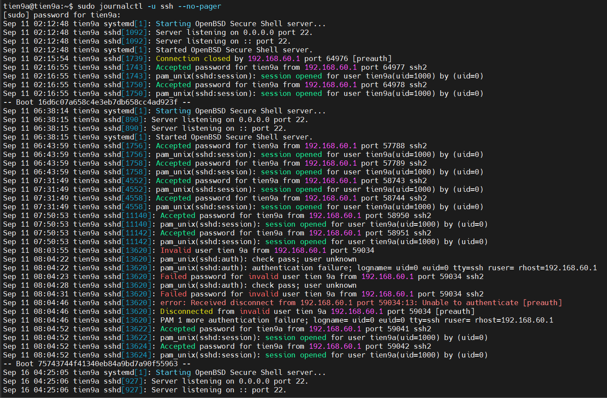
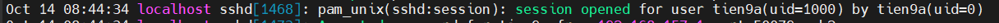

# TÌM HIỂU VỀ FILE LOG SSH & CÁCH ĐỌC VÀ QUẢN LÍ FILE LOG

## I.TÌM HIỂU SSH Log LÀ GÌ ?

### 1. SSH Log là gì ?

**SSH logs** thường được ghi lại bởi daemon SSH (sshd), chịu trách nhiệm xử lý các kết nối SSH đến. Những nhật ký này có thể cung cấp thông tin về hoạt động của người dùng, các lần thử kết nối, các lần xác thực thành công hoặc thất bại, và các sự kiện liên quan khác. Việc giám sát những nhật ký này rất quan trọng để phát hiện các nỗ lực truy cập trái phép, khắc phục sự cố và đảm bảo tuân thủ các chính sách bảo mật.

**Ví dụ về SSH logs điển hình:**

```ruby
Jul 17 09:23:45 server1 sshd[1234]: Accepted publickey for user1 from 192.168.1.100 port 52413 ssh2: RSA SHA256:abcdefghijklmnopqrstuvwxyz123456789ABCDEFG
```

Mục nhật ký này chứa thông tin quan trọng như: **TimeLine**, **HostName**, **ProcessID**, **AuthenticationMethod**, **UserName**, **SourceIP**, **PortNumber** và **All Keys Usage**. Bằng cách phân tích các nhật ký này, quản trị viên hệ thống có thể theo dõi truy cập của người dùng, xác định các mối đe dọa bảo mật tiềm ẩn và duy trì một môi trường SSH an toàn.

### 2. Mục đích File Log SSH

File log SSH ghi lại các sự kiện liên quan đến hoạt động của SSH server, bao gồm:

- Các nỗ lực kết nối đến (thành công và thất bại).
- Thông tin về người dùng đã đăng nhập.
- Các lỗi hoặc cảnh báo liên quan đến dịch vụ SSH.
- Hoạt động của các kênh SSH (ví dụ: chuyển tiếp cổng).

File log này rất hữu ích cho việc giám sát bảo mật, khắc phục sự cố kết nối và kiểm tra các hoạt động bất thường.

### 3. Các file logs phổ biến

- **Secure log:** Trên hầu hết các hệ thống giống Unix, các kết nối SSH được lưu vào tệp log hệ thống tại `/var/log/secure` hoặc `/var/log/auth.log`. Tệp log này chứa một bản ghi về tất cả các yêu cầu đăng nhập SSH thành công và thất bại, bao gồm ngày và giờ của yêu cầu, tên người dùng được sử dụng để kết nối, địa chỉ IP của máy khách và các chi tiết khác.

- **OpenSSH log:** OpenSSH là một triển khai SSH phổ biến được sử dụng trên các hệ thống giống Unix, và nó ghi lại các kết nối SSH vào tệp được đặt tại `/var/log/secure` theo mặc định. Tuy nhiên, OpenSSH cũng có thể được cấu hình để ghi lại vào một tệp khác sử dụng chỉ thị LogLevel trong tệp `sshd_config`.

- **Windows Event Log:** Trên các hệ thống Windows, các kết nối SSH có thể được ghi lại vào Trình quản lý Sự kiện bằng cách sử dụng Windows Event Log. Tệp log cụ thể được sử dụng sẽ phụ thuộc vào triển khai SSH được sử dụng.

## II. CÁCH ĐỌC VÀ QUẢN LÍ FILE LOG

### 1. Vị trí File Log trên Ubuntu 24.04 và CentOS Stream 09

#### a. Ubuntu 24.04

Ubuntu 24.04 đã thay đổi hệ thống log truyền thống và chuyển sang `journald`.

Hoặc có thể truy cập vào Directory sau: `/var/log/auth.log`

#### b. CentOS Stream 9

- **Log chính của SSH:** `/var/log/secure`
- **log dịch vụ SSH:** `journalctl -u sshd --no-pager`
- **log chung của hệ thống:** `/var/log/messages`

### 2. Truy cập vào File Log SSH

- **Sử dụng journalctl:**

  - `journalctl` là một lệnh được sử dụng để xem các nhật ký được quản lý bởi systemd, hệ thống quản lý và dịch vụ được sử dụng trong nhiều bản phân phối Linux hiện đại & mới nhất như Ubuntu, CentOS và Debian.

  - Trên các hệ thống sử dụng systemd, chẳng hạn như các phiên bản hiện đại của Ubuntu, CentOS và Debian, nhật ký SSH được quản lý bởi dịch vụ journald. Lệnh journalctl được sử dụng để truy cập các SSH logs.

  - Sử dụng câu lệnh `journalctl -u ssh` or `sudo journalctl -u ssh --no-pager` (chế độ không cần hiển thị pager) để truy cập SSH logs (u-là units đơn vị trong file log ssh của nó)



- **Truy cập vào `/var/log/auth.log` (Đối Ubuntu bản cũ hơn)**

  - Trên một số hệ thống, đặc biệt là các hệ thống cũ hoặc những hệ thống không sử dụng systemd, nhật ký SSH được ghi trong tệp `/var/log/auth.log`. Điều này thường gặp trên các phiên bản cũ của Debian, Ubuntu và các bản phân phối khác sử dụng SysVinit hoặc các hệ thống init khác.

  - Sử dụng một số câu lệnh sau để truy cập vào file SSH log trên:

    - `cat /var/log/auth.log`
    - `tail -f /var/log/auth.log`
    - `grep sshd /var/log/auth.log`
    - `less /var/log/auth.log`

- **Truy cập vào `/var/log/secure` (Đối CentOS)**

### 3. Cách đọc File Log SSH

#### a. Cấu trúc dòng log

**Định dạng chung:**

```ruby
    Thời-gian Máy-chủ Dịch-vụ[PID]: Thông-tin
```


#### b. Xác thực thành công bằng mật khẩu

```ruby
    Sep 11 02:16:55 tien9a sshd[1743]: Accepted password for tien9a from 192.168.60.1 port 64977 ssh2
```

- `Sep 11 02:16:55`: Thời gian (11/7, 02:16:55).

- `sshd[1742]`: Tiến trình SSH với PID 1743.

- `Accepted password`: Xác thực thành công bằng mật khẩu.

- `for tien9a`: Người dùng đăng nhập là tien9a.

- `from 192.168.60.1`: Địa chỉ IP nguồn (máy khách) là 192.168.60.1.

- `port 64977`: Cổng nguồn ngẫu nhiên của máy khách.

- `ssh2`: Giao thức SSH phiên bản 2.

#### c. Mở phiên và đóng phiên ssh




- `pam_unix(sshd:session):` Hệ thống xác thực PAM (Pluggable Authentication Module) xử lý phiên SSH.

- `session opened:` Một phiên shell được mở.

- for `user tien9a(uid=1000):` Dành cho người dùng quyen với UID (User ID) 1000.

- by `tien9a(uid=0):` Được thực hiện bởi root (UID 0), vì đây là tài khoản thực thi sshd.

#### d. Ngắt kết nối chủ động


- `Received disconnect`: Máy chủ nhận tín hiệu ngắt kết nối từ máy khách.

- `from 192.168.91.130 port 34364`: Từ IP 192.168.157.128, cổng 58214.

- `:11: disconnected by user`: Mã 11 cho biết người dùng chủ động ngắt (thường bằng exit).

- `Disconnected from user tien9a`: Kết nối của tien9a bị ngắt

### 4. Quản lí File Log SSH

#### Các cách nâng cao bảo mật

- **Giới hạn truy cập SSH:** bằng cách chỉnh file cấu hình của SSH.

  - Cho phép một số đối tượng cụ thể có thể thực hiện SSH bằng chỉnh sửa dòng `AllowUsers` trong file cấu hình: `AllowUsers user1 user2.`

- **Vô hiệu hóa đăng nhập bằng tài khoản root:** `PermitRootLogin no`. Giảm nguy cơ bị tấn công brute-force trực tiếp vào tài khoản root, Khuyến khích sử dụng tài khoản người dùng bình thường với quyền sudo để quản trị, đảm bảo bảo mật tốt hơn.

- **Sử dụng xác thực dựa trên khóa:** Ngăn chặn các cuộc tấn công brute-force vì không cần nhập mật khẩu. Tăng cường bảo mật khi sử dụng các cặp khóa SSH mạnh và bảo vệ khóa riêng tư.

  - Tạo cặp khóa SSH trên máy client: `ssh-keygen -t rsa -b 4096`
  - Sao chép khóa công khai lên máy chủ: `ssh-copy-id username@server_ip`
  - Vô hiệu hóa xác thực bằng mật khẩu: `sudo nano /etc/ssh/sshd_config` và chỉnh `PasswordAuthentication no`, `PubkeyAuthentication yes`
  - Khởi động lại dịch vụ SSH: `sudo systemctl restart sshd`

- **Thay đổi cổng kết nối mặc định của SSH:**

  - Chỉnh sửa tệp cấu hình SSH: `sudo nano /etc/ssh/sshd_config`
  - Tìm dòng chứa #Port 22 và thay đổi thành một số cổng khác: `Port 2222`
  - Khởi động lại dịch vụ SSH: `sudo systemctl restart sshd`

- **Chỉnh sửa mức độ ghi lại log của các kết nối SSH**: Mức độ nhật ký chi tiết hơn giúp phát hiện các hoạt động bất thường, các nỗ lực truy cập trái phép hoặc lỗi cấu hình.

- **Chỉnh sửa tệp cấu hình SSH:** `sudo nano /etc/ssh/sshd_config`

- **Tìm và điều chỉnh dòng LogLevel:** `LogLevel INFO`. Thay thế INFO bằng mức độ ghi lại log phù hợp.

  - **QUIET:** Chỉ ghi nhật ký tối thiểu.
  - **FATAL:** Chỉ ghi các lỗi nghiêm trọng.
  - **ERROR:** Ghi lại các lỗi không nghiêm trọng.
  - **INFO**: (Mặc định) Ghi nhật ký các thông tin cơ bản về hoạt động.
  - **VERBOSE:** Ghi chi tiết hơn, hữu ích khi khắc phục sự cố.
  - **DEBUG, DEBUG1, DEBUG2, DEBUG3:** Ghi nhật ký chi tiết nhất, thường được dùng cho việc phân tích lỗi và không nên sử dụng trên hệ thống sản xuất.

- **Lưu tệp và khởi động lại dịch vụ SSH:** `sudo systemctl restart sshd`

- **Lọc các logs của SSH:** sử dụng câu lệnh `journalctl` dựa vào một số thông số khác nhau.

  - **Theo ngày/giờ:**

    - `journalctl -u ssh --since "2023-07-01"` để xem các kết nối SSH từ ngày bao nhiêu.
    - `journalctl -u ssh --since "2023-07-01" --until "2023-07-12"` để xem các kết nối SSH trong khoảng ngày bao nhiêu.

  - **Theo độ ưu tiên:**

    - `journalctl -u ssh -p err:` xem một số kết nối SSH bị lỗi or `-p 3`: chỉ lấy log ở mức error.

      - 0: emerg (emergency) - Hệ thống không ổn định.
      - 1: alert - Cần hành động ngay lập tức.
      - 2: crit (critical) - Lỗi nghiêm trọng
      - 3: err (error) - Lỗi.
      - 4: warning - Cảnh báo.
      - 5: notice - Thông báo quan trọng nhưng không phải lỗi.
      - 6: info - Thông tin.
      - 7: debug - Thông tin gỡ lỗi.

- **Giám sát SSH log trong thời gian thực:**

  - Dùng câu lệnh `journalctl`:  `journalctl -u ssh -f`
  - Dùng thư mục `/var/log/auth.log`: `tail -f /var/log/auth.log`

- **Xem các kết nối SSH được thực hiện gần đây:**

  - Sử dụng lệnh last log: `lastlog`

- **Tìm kiểm kết nối or Kiểm tra tấn công trong File Log SSH bằng lệnh `grep`:**

Check các kết nối "**Failed**":

```ruby
sudo journalctl -u ssh | grep "Failed" (Với Ubuntu)
```

```ruby
sudo grep "Failed" /var/log/secure (Với CentOS)
```

Check các kết nối "**Accepted**": Tương tự như trên

Check các kết nối "**Authentication Failture**":Tương tự như trên
