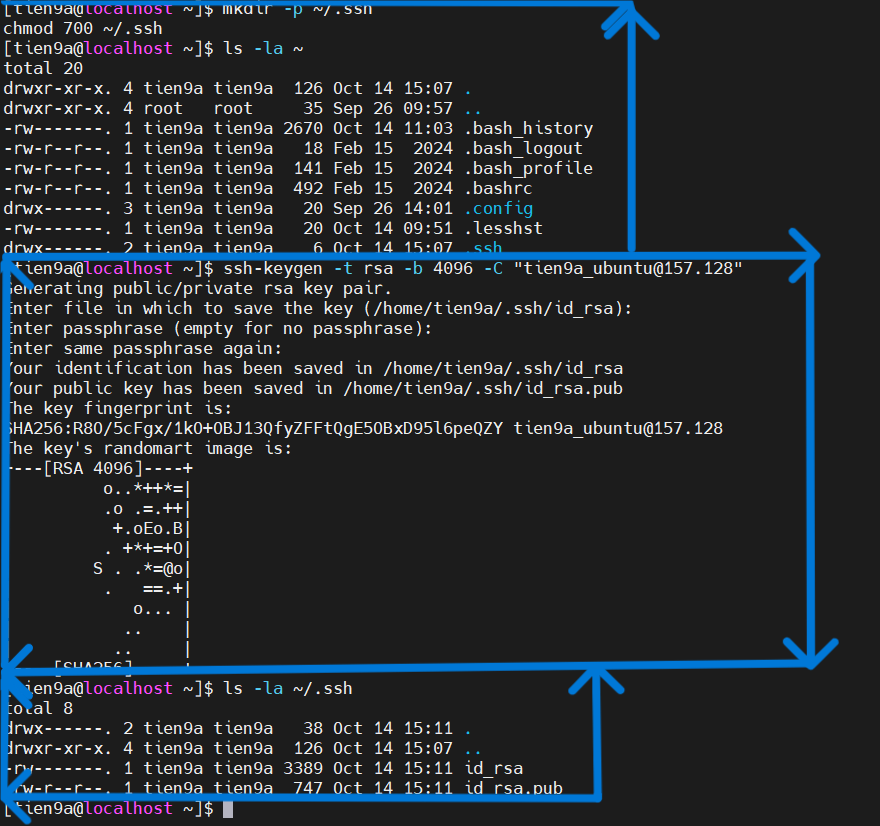
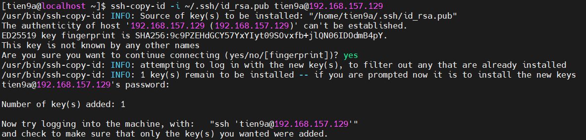
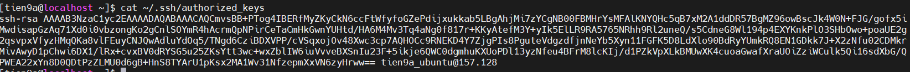

# Tìm hiểu và thực hành SSH keypair

## Keypair là gì?

### 1. Khái niệm

SSH key pair (cặp khóa SSH) là một cơ chế xác thực an toàn cho giao thức SSH, bao gồm hai file khóa riêng biệt nhưng có liên quan mật thiết:

- **Private key (Khóa riêng tư):** Khóa này phải được giữ bí mật và an toàn trên máy tính của bạn. Nó tương tự như chiếc chìa khóa duy nhất có thể mở ổ khóa mà khóa công khai đã khóa.
- **Public key (Khóa công khai):** Khóa này được chia sẻ với các máy chủ mà bạn muốn truy cập. Bạn có thể coi nó như một ổ khóa mà bất kỳ ai cũng có thể nhìn thấy và sử dụng để khóa một hộp thư.

Khi kết nối SSH, máy host sẽ kiểm tra public key được gửi từ máy client và gửi số ngẫu nhiên được mã hóa bằng public key để máy client giải mã bằng private key.

### 2. Mục đích của SSH keypair

Cung cấp một phương thức xác thực an toàn và tiện lợi hơn so với việc sử dụng mật khẩu truyền thống. Với key pair, có thể đăng nhập vào máy chủ SSH mà không cần nhập mật khẩu mỗi lần.

### 3. Cách thức hoạt động

`Bước 1`: Tạo keypair

- Sử dụng một công cụ (thường là `ssh-keygen`) để tạo ra một cặp khóa (public key và private key) trên máy tính.

`Bước 2`: Phân phối public key

- Sao chép khóa công khai lên máy chủ SSH muốn truy cập.
- khóa này thường được thêm vào file `~/.ssh/authorized_keys` trong thư mục home của người dùng trên máy Sever.

`Bước 3`: Yêu cầu đăng nhập

- Khi cố gắng SSH vào máy host, SSH client sẽ gửi yêu cầu đăng nhập.

`Bước 4`: Thử thách - Phản hồi

- Máy host sẽ kiểm tra file `authorized_keys` để tìm public key tương ứng với máy đang cố gắng đăng nhập. Nếu tìm thấy, máy host sẽ tạo ra một số ngẫu nhiên và mã hóa bằng public key của máy đăng nhập, sau đó gửi mã đi.

`Bước 5`: Giải mã và phản hồi

- Máy client sẽ giải mã bằng private key và gửi lại cho máy host

`Bước 6`: Xác minh

- Máy host so sánh số ngẫu nhiên đã nhận được với số ban đầu. Nếu trùng khớp -> cho phép đăng nhập mà không cần mật khẩu.

### 4. Ưu điểm khi dùng Key pair

- Không cần nhập mật khẩu mỗi lần SSH.
- Bảo mật hơn vì không dễ bị brute-force.
- Dễ dàng quản lý và tự động hóa kết nối SSH.

## Lab keypair

### Mô hình lab

Tạo SSH Keypair và sử dụng nó để SSH từ máy client (Ubuntu 24.04) vào máy server (CentOS Stream 9).

- **Máy client:** ubuntu
- **Máy server:** centos

### lab

`Bước 1`: Kiểm tra SSH key trên client (**ubuntu**)

- Trên máy client (**ubuntu**), kiểm tra đã có SSH Key chưa:

```plaintext
ls -l ~/.ssh/
```

- Nếu chưa có, tạo mới:

    ```plaintext
    ssh-keygen -t rsa -b 4096 -C "lab_ssh_keypair"
    ```

  - `ssh-keygen`: lệnh dùng để tạo, quản lý và chuyển đổi các khóa SSH.
  - `-t rsa`: Tùy chọn `-t` (type) chỉ định loại thuật toán mã hóa sẽ được sử dụng để tạo khóa.
  - `-b 4096`: Tùy chọn `-b` (bits) chỉ định số lượng bit cho khóa. Đối với thuật toán RSA, số lượng bit càng cao thì khóa càng mạnh và an toàn hơn, nhưng cũng có thể mất nhiều thời gian hơn để tạo và sử dụng. 4096 là một kích thước khóa mạnh và được khuyến nghị sử dụng hiện nay.
  - `-C "lab_ssh_keypair"`: Tùy chọn `-C` (comment) thêm một dòng chú thích vào file khóa công khai.
- Nhấn `Enter` để lưu key vào đường dẫn mặc định (`~/.ssh/id_rsa`).
- Sau khi tạo xong, kiểm tra:

```plaintext
ls -l ~/.ssh/
```



- Sẽ có 2 file:
  - `id_rsa` (Private key)
  - `id_rsa.pub` (public key)

`Bước 2`:Copy public key qua máy server (centos)

- Chạy lệnh sau trên máy client (ubuntu):

    ```ruby
    ssh-copy-id -i ~/.ssh/id_rsa.pub tien9a@192.168.157.129
    ```

  - `-i`: Tùy chọn `-i` (identity file) chỉ định đường dẫn đến file chứa khóa công khai mong muốn sao chép lên máy chủ.
  - `tien9a`: Tên user trên máy server (centos).
  - `192.168.157.129`: địa chỉ IP máy server (centos).
- Kết quả sau nhập lệnh:



- Kiểm tra trên máy server (centos)

```plaintext
cat ~/.ssh/authorized_keys
```

- Kết quả:



`Bước 3`: SSH từ client (ubuntu) vào server (centos) bằng SSH Key

- Trên ubuntu SSH vào centos:

```plaintext
ssh tien9a@192.168.157.129
```

- Nếu có passphrase, sẽ cần nhập rõ. Nhưng như ở `bước 1` tạo keypair không dùng passphrase.

- Kết quả đăng nhập thành công:


`Bước 4`: Cấu hình nâng cao

- **Chặn SSH bằng mật khẩu trên centos:**
  - Mở file cấu hình SSH:

  ```ruby
  sudo vim /etc/ssh/sshd_config
  ```

  - Tìm dòng sau và sửa thành:

  ```ruby
  PasswordAuthentication no
  PubkeyAuthentication yes
  ```

  - Lưu file và khởi động lại SSH:

  ```ruby
  sudo systemctl restart sshd
  ```

  - Bây giờ chỉ có thể SSH bằng SSH key.

- **Cấu hình SSH client để dễ dàng quản lý**

  - Trên máy client (ubuntu), chỉnh file `~/.ssh/config`:

  ```ruby
  vim ~/.ssh/config:
  ```

  - Thêm nội dung sau:

  ```ruby
  Host myserver
    HostName 192.168.157.129
    tien9a
    IdentityFile ~/.ssh/id_rsa
  ```

  - Lưu file, giờ có thể SSH bằng:

  ```ruby
  ssh tien9a
  ```
