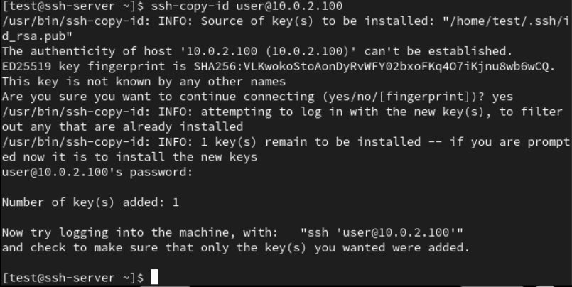

# TÌM HIỂU VỀ SSH

## I. GIAO THỨC SSH LÀ GÌ ?

### **Giới thiệu**

SSH (secure shell) là một giao thức mã hóa dùng để quản trị và giao tiếp với servers.

- SSH hoạt động ở lớp trên trong mô hình phân lớp TCP/IP
- Các công cụ SSH (như là OpenSSH, PuTTy,…) cung cấp cho người dùng cách thức để thiết lập kết nối mạng được mã
  hoá để tạo 1 kênh kết nối riêng tư.
- Hơn nữa tính năng tunneling (hoặc còn gọi là port forwarding) của các công cụ này cho phép chuyển tải các
  giao vận theo các giao thức khác.
- Mỗi khi dữ liệu được gửi bởi 1 máy tính vào mạng, SSH tự động mã hoá nó. Khi dữ liệu được nhận vào, SSH tự động
  giải mã nó.
- Kết quả là việc mã hoá được thực hiện trong suốt.

Có một vài cách để SSH tới SSH server như dùng password hoặc keypair. Trong đó phương thức dùng keypair được cho là có tính bảo mật cao hơn bởi nếu trong quá trình sử dụng mà các gói tin của bạn bị bắt lại, các phiên trao đổi khóa giữa SSH server và Client sẽ bị lộ và attacker có thể dùng nó để giải mã dữ liệu. Hơn nữa, việc này cũng tạo điều kiện cho các cuộc tấn công Brute Force mật khẩu.

SSH có hỗ trợ sử dụng cặp khóa Private Key và Public Keyđược chia sẻ với nhau từ trước. Nghĩa là bạn đã có sẵn Private Key để trao đổi với server mà không cần đến quá trình trao đổi khóa, điều này sẽ hạn chế khả năng bị bắt gói. Hơn nữa cặp khóa này còn có một mật khẩu riêng của nó, gọi là passphrase (hay keyphrase). Mật khẩu này được dùng để mở khóa Private Key (được hỏi khi bạn SSH vào server) và tạo lớp xác thực thứ 2 cho bộ khóa. Nghĩa là:

- Nếu attacker không có Private Key, việc truy cập vào server gần như không thể, chỉ cần bạn giữ kĩ Private Key.
- Tuy nhiên trong trường hợp Private Key bị lộ, bạn vẫn khá an toàn vì đối phương không có passphrase thì vẫn chưa thể làm được gì, tuy nhiên đó chỉ là tạm thời. Bạn cần truy cập server thông qua cách trực tiếp hoặc qua VNC của nhà cung cấp nếu đó là một VPS để thay đổi lại bộ khóa.

### 1. Khái niệm SSH

**SSH** hay còn gọi là **Secure Shell** là 1 giao thức dùng để đăng nhập hay truy cập từ xa để vận hành các dịch vụ mạng or execute CLI an toàn trên một mạng không bảo mật (qua IP) bằng cách sử dụng mật mã để xác thực và mã hoá các kết nối giữa các thiết bị qua số cổng 22 (nó là phương thức truy cập mạnh thay thế cho astelnet; rlogin )


### 2. Các thành phần trong SSH

- **Server** : Một chương trình cho phép đi vào kết nối SSH với một bộ máy, trình bày xác thực, cấp phép, … Trong
  hầu hết SSH bổ sung của Unix thì server thường là sshd.
- **Client** : Một chương trình kết nối đến SSH server và đưa ra yêu cầu như là “log me in” hoặc “copy this file”.
  Trong SSH1, SSH2 và OpenSSH, client chủ yếu là ssh và scp.
- **Session** : Một phiên kết nối giữa một client và một server. Nó bắt đầu sau khi client xác thực thành công đến
  một server và kết thúc khi kết nối chấm dứt. Session có thể được tương tác với nhau hoặc có thể là một chuyến riêng.

Mỗi thành phần sẽ có Pair key riêng biệt: **User Key**, **Host Key**, **Session Key**

### 3. Ứng dụng SSH

- Cung cấp quyền truy cập an toàn cho người dùng và các quy trình tự động
- Truyền tệp và tương tác tự động
- Phát hành các lệnh từ xa
- Quản lí cơ sở hạ tầng mạng và các thành phần hệ thống quan trọng khác (tạo đường hầm)

### 4. Tính năng chính

- **Truy cập máy chủ từ xa:** Cho phép quản trị viên kết nối và điều khiển máy chủ Linux/Unix từ xa.
- **Truyền tệp an toàn (Secure File Transfer):** Cho phép truyền dữ liệu an toàn qua các kết nối không an toàn bằng cách bọc dữ liệu trong đường hầm SSH. Có 2 loại:
  - **Local Port Forwarding:** Định tuyến lưu lượng từ máy cục bộ qua máy chủ SSH.
  - **Remote Port Forwarding:** Cho phép máy chủ SSH chuyển tiếp lưu lượng đến một máy khác.
- **SCP & SFTP:**

  - `scp` (Secure Copy): Truyền tệp tin giữa client và server an toàn.
  - `sftp` (SSH File Transfer Protocol): Giao thức truyền tệp an toàn dựa trên SSH.
  - vd: truyền file từ ubuntu sang centos:

    ```ruby
    scp text.txt tien9a@192.168.3.88:/home/tien9a/
    hoặc chỉ cho kết nối với keypair
    scp -i ~/.ssh/id_rsa text.txt tien9a@192.168.8.88:/home/tien9a/
    ```

- **Chạy lệnh từ xa:** Có thể thực thi lệnh trên máy chủ mà không cần mở phiên shell (`ssh user@server "ls -l"`).

### 5. WorkFlow - Cách hoạt động của SSH


### Giai đoạn 1 - TCP handshake

- Client khởi tạo kết nối TCP đến server qua cổng mặc định 22 (hoặc cổng tùy chỉnh).
- Server lắng nghe trên cổng 22 và phản hồi bằng một gói tin SYN-ACK để chấp nhận yêu cầu kết nối.
- Client gửi lại một gói tin ACK để hoàn tất quá trình bắt tay ba bước (three-way handshake) của TCP. Lúc này, một kết nối TCP đã được thiết lập giữa client và server.

### Giai đoạn 2 - Protocol Version Exchange

- Sau khi kết nối TCP được thiết lập, client và server bắt đầu thương lượng về phiên bản giao thức SSH mà họ sẽ sử dụng và các thuật toán mã hóa, xác thực được hỗ trợ, ví dụ:

```ruby
SSH-2.0-OpenSSH_9.3p1 Ubuntu-1
```

### Giai đoạn 3 - Version Negotiation

SSH có hai phiên bản là SSH1.X(có sớm hơn) và SSH2.0. SSH2.0 sẽ hỗ trợ thêm một số phương thức xác nhận, phương pháp mã hóa và một số dịch vụ bổ sung. SSH client và SSH server sẽ trao đổi để quyết định phiên bản SSH nào được sử dụng:

- SSH server sẽ gửi các phiên bản SSH mà nó hỗ trợ thông qua quá trình thiết lập kết nối tới SSH client.
- Sau khi nhận được thông tin từ SSH server, nó cũng sẽ gửi lại các phiên bản SSH mà nó hỗ trợ lại SSH server.
- SSH server tiến hành kiểm tra thông tin và xác định phiên bản SSH sẽ được sử dụng.

### Giai đoạn 4 - Algorithm Negotiation

- Mục tiêu của giai đoạn này là xác dịnh thuật toán sử dụng dể trao đổi khóa như Diffie-Hellman (DH) hoặc Elliptic Curve Diffie-Hellman (ECDH).

### Giai đoạn 5 - Key Exchange

- Mục tiêu của giai đoạn này là tạo ra **Session key**. Quá trình này thường sử dụng các thuật toán trao đổi khóa như Diffie-Hellman (DH) hoặc Elliptic Curve Diffie-Hellman (ECDH).
- Các bước cơ bản (ví dụ sử dụng Diffie-Hellman (DH)):
  - Cả hai bên chọn một cặp số chung: `g` (generator), `p` (số nguyên tố lớn).
  - Mỗi bên chọn một số bí mật: client chọn `a`, server chọn `b`.
  - Tính public value: Client tính `A = g^a mod p`, Server tính `B = g^b mod p`.
  - Client gửi `A` cho server, và server gửi `B` cho client.
  - Client tính `K = B^a mod p`; Server tính `K = A^b mod p`.
  - **Session key** = K + random + session ID.
- Ví dụ:
  - Giả sử `g = 5`, `p = 23`
  - Client chọn `a = 6` → `A = 5^6 mod 23 = 8`
  - Server chọn `b = 15` → `B = 5^15 mod 23 = 2`
  - Client nhận `B = 2` → tính `K = 2^6 mod 23 = 18`
  - Server nhận `A = 8` → tính `K = 8^15 mod 23 = 18`
  - Kết quả: cùng shared secret `K = 18` mà không cần gửi a hoặc b

### Giai đoạn 6 - User Authentication


- Để đảm bảo rằng client đang kết nối đúng đến server mong muốn và không phải là một kẻ tấn công trung gian (man-in-the-middle attack), client cần xác minh danh tính của server.
- Client tạo keypair (gồm public key và private key) và gửi public key cho server.

  ```ruby
  ssh-copy-id -i ~/.ssh/id_rsa.pub tien9a@192.168.3.73
  ```

- public key được lưu trong tệp `~/.ssh/authorized_keys` của server
- Xác thực bằng keypair:

  - Server gửi một chuỗi thử thách (challenge) – có thể là số ngẫu nhiên, session ID, hoặc 1 message do server chọn.
  - Client ký số chuỗi đó bằng private key của mình.
  - Server dùng public key (client đã đăng ký trước) để kiểm tra chữ ký.
  - Nếu chữ ký hợp lệ → xác thực thành công

### Giai đoạn 7 - Request Services (Sau xác thực)

Sau khi xác thực thành công, client có thể yêu cầu dịch vụ.

## II. HOW TO USE SSH ?

### 1. Basic Command - Các lệnh cơ bản

Khi kết nối bằng ssh, hãy nhập tên người dùng và IP/DNS và nhập mật khẩu cho người dùng đó.

```ruby
ssh [username]@[IP or DNS]
```


Khi kết nối lần đầu, khóa công khai của máy chủ không được lưu trữ trong máy khách, vì vậy bạn sẽ được yêu cầu nhập khóa công khai để lưu. Nếu bạn chọn "có", khóa công khai sẽ được lưu, sau đó bạn sẽ được yêu cầu nhập mật khẩu và kết nối.

Khóa công khai được lưu trữ tại `.ssh/known_hosts` trong thư mục gốc của bạn.


Bạn cũng có thể thực thi lệnh mà không cần truy cập từ xa. Trong trường hợp này, chỉ có kết quả thực thi lệnh được trả về và kết nối không được thiết lập.

```ruby
ssh [username]@[IP hoặc DNS][command]
```

### 2. Xác thực dựa trên khoá

Đối với xác thực dựa trên khóa, bạn cần tạo cặp khóa riêng tư/công khai.
Nếu bạn không chỉ định vị trí lưu trữ khi tạo khóa, khóa riêng tư sẽ được lưu trữ tại `.ssh/id_rsa` trong thư mục gốc của bạn, và khóa công khai sẽ được lưu trữ tại `.ssh/id_rsa.pub.`

```ruby
ssh-keygen [optoin][đối số]
```


Khi chuyển khóa công khai đến hệ thống bạn muốn kết nối, hãy sử dụng lệnh này và một tệp pub sẽ được gửi.
Khóa đã nhận có thể được tìm thấy trong `.ssh/authorized_keys` trong thư mục home của bạn.

```ruby
ssh-copy-id [option][đối số] [username]@[IP hoặc DNS]
```




### 3. Chuyển tập tin

`SCP` (Bản sao an toàn) có thể được sử dụng theo cùng cách như lệnh cp hiện có.

```ruby
scp [option][source] [username]@[IP or DNS]:[destination] folder use option -r
```


`SFTP` (Giao thức truyền tệp an toàn) có thể được sử dụng tương tự như FTP hiện có.

```ruby
sftp [username]@[IP or DNS]
```


Bạn có thể chuyển các tập tin trên máy khách sang máy chủ bằng lệnh `put`.

```ruby
put [source][destination]
```


Bạn có thể chuyển các tập tin trên máy chủ tới máy khách thông qua `get`.

```ruby
get [source][destination]
```


