# TÌM HIÊU VỀ HTTP_HTTPs

## I. HTTP


### 1. Khái niệm HTTP

**HTTP (HyperText Transfer Protocol)** là giao thức truyền siêu văn bản hoạt động theo mô hình **Client–Server** và cơ chế **Request–Response**. Đây là nền tảng của World Wide Web (WWW), cho phép người dùng truy cập các trang web thông qua các trình duyệt như Brave, Chrome, Edge,... Trình duyệt web (client) gửi yêu cầu đến máy chủ web (server) để truy xuất **tài nguyên** như trang HTML, hình ảnh, hoặc dữ liệu.

- **Client-Server Model**:

  - Client (trình duyệt, ứng dụng di động, công cụ gọi API, v.v.) là bên gửi yêu cầu (request).
  - Server (máy chủ web hoặc ứng dụng) là bên xử lý yêu cầu và gửi phản hồi (response).

=>Mô hình này giúp phân tách rõ ràng vai trò của hai bên, giúp hệ thống dễ mở rộng và quản lý.

- **Request-Response**:

  - Client gửi một yêu cầu (request) chứa thông tin cần truy cập hoặc thao tác.
  - Server xử lý và gửi một phản hồi (response) chứa kết quả hoặc dữ liệu tương ứng.

=> Đây là chu trình giao tiếp cơ bản nhất của HTTP, đảm bảo rằng mọi tương tác đều có tính xác định: một yêu cầu → một phản hồi.

**HTTP** là giao thức lớp ứng dụng trong bộ giao thức Internet, thường chạy trên TCP, nhưng các phiên bản mới như **HTTP/3** đã sử dụng **QUIC + UDP** để tăng tốc truyền tải.

**HTTP** là một giao thức ứng dụng của bộ giao thức TCP/IP (các giao thức nền tảng cho Internet). Cổng mặc định mà HTTP sử dụng là 80.

Các phiên bản chính:

- **HTTP/1.0**: mỗi yêu cầu dùng một kết nối TCP riêng.

- **HTTP/1.1:** hỗ trợ giữ kết nối (persistent connection) cho nhiều yêu cầu, giảm độ trễ.

- **HTTP/2:** cải tiến bằng nén tiêu đề, đa luồng (multiplexing), và server push, giúp truyền dữ liệu nhanh hơn.

- **HTTP/3:** thay TCP bằng **QUIC (UDP)**, giảm tắc nghẽn và độ trễ, tối ưu tốc độ kết nối.

**HTTP** hỗ trợ các cơ chế bộ nhớ đệm (caching), proxy, và web crawler, giúp tối ưu lưu lượng mạng. Các tài nguyên **HTTP** được định danh bằng **URL (Uniform Resource Locator)**, thường sử dụng lược đồ http hoặc https.

### 2. Các đặc trưng của HTTP

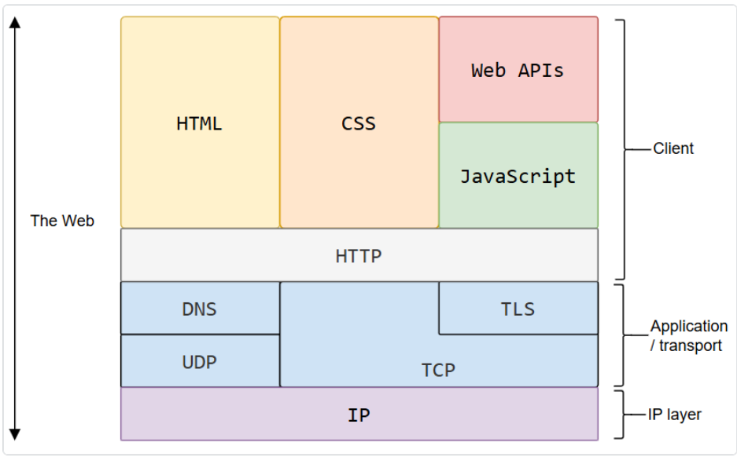

- **Text-Based – Dạng văn bản**: toàn bộ các thông điệp HTTP (request và response) đều được ghi dưới dạng văn bản thuần (plain text) — bao gồm dòng lệnh, tiêu đề (header), và phần nội dung (body).
  - Điều này giúp con người dễ đọc, dễ hiểu và dễ gỡ lỗi (debug) khi cần kiểm tra dữ liệu trao đổi giữa client và server.

- **HTTP là giao thức connectionless** (kết nối không liên tục) : ví dụ như HTTP Client khởi tạo 1 request, Client sẽ ngắt kết nối từ Server và đợi cho 1 phản hồi, Server xử lí request và thiết lập lại sự kết nối với Client để gửi phản hồi trở lại.

- **HTTP là một phương tiện độc lập** : Bất cứ loại dữ liệu nào cũng có thể được gửi bởi HTTP, miễn là Server và Client biết cách kiểm soát nội dung dữ liệu. Nó được yêu cầu cho Client cũng như Server để xác định kiểu nội dung bởi sử dụng kiểu **MIME** (Multipurpose Internet Mail Extensions - Giao thức mở rộng thư điện tử Internet đa mục đích) thích hợp.

- **HTTP là stateless (không trạng thái)** : Request hiện tại không biết những gì đã hoàn thành trong request trước đó. Điều này tạo ra sự hoạt động, nhưng cũng đòi hỏi các kỹ thuật bổ sung như sử dụng cookie hoặc session để giữ lại trạng thái người dùng trong các thùng tương tác phức tạp như thùng hàng.
  
  - **Ví dụ:** Khi bạn tải xuống một trang web chứa nhiều hình ảnh, mỗi hình ảnh là một yêu cầu riêng biệt — máy chủ không tự động “nhớ” rằng chúng đến từ cùng một người dùng trừ khi ta sử dụng **cookie**, **phiên** hoặc **mã thông báo** để bổ sung trạng thái.


### 3. Cấu trúc của HTTP

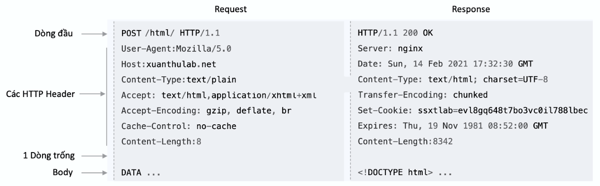

| **Khái niệm (Concept)**                              | **Mô tả chi tiết (Description)**          |
| ---------------------------------------------------- | ---------------------------------------------------------|
| **HTTP Request Headers**<br>(Tiêu đề yêu cầu HTTP)   | Là phần thông tin dạng **cặp khóa – giá trị (key-value pairs)** được gửi kèm trong mỗi yêu cầu HTTP. Các header này chứa dữ liệu bổ sung như: loại trình duyệt của client (**User-Agent**), loại dữ liệu mong muốn (**Accept**), thông tin xác thực (**Authorization**), hoặc địa chỉ máy chủ (**Host**).<br>=> Giúp server hiểu cách xử lý và phản hồi phù hợp với yêu cầu của client. |
| **HTTP Request Body**<br>(Thân yêu cầu HTTP)         | Là phần dữ liệu chính mà **client gửi lên server** — thường chứa thông tin người dùng nhập từ biểu mẫu (form), dữ liệu xác thực, hoặc payload của API (ví dụ: **JSON**, **XML**, **file upload**).<br>=> Thường xuất hiện trong các phương thức **POST**, **PUT**, hoặc **PATCH**.                                                                                                      |
| **HTTP Response Headers**<br>(Tiêu đề phản hồi HTTP) | Là thông tin bổ sung đi kèm phản hồi, giúp **client hiểu rõ cách xử lý dữ liệu**. Ví dụ:<br>• **Content-Type**: Loại dữ liệu trả về (HTML, JSON, XML…).<br>• **Content-Language**: Ngôn ngữ của nội dung.<br>• **Cache-Control**: Quy tắc bộ nhớ đệm.<br>=> Các header này định hướng cho trình duyệt hoặc ứng dụng hiểu đúng nội dung phản hồi.                                        |
| **HTTP Response Body**<br>(Thân phản hồi HTTP)       | Là phần dữ liệu chính mà **server gửi lại cho client**, tùy thuộc vào yêu cầu ban đầu. Ví dụ:<br>• Trang **HTML** khi người dùng truy cập website.<br>• Dữ liệu **JSON** khi gọi API.<br>• Hình ảnh, video hoặc file tải về khi được yêu cầu.                                 |

- **HTTP:** hoạt động dựa trên mô hình **Client – Server** or mô hình **Request - Respone**

  - **Client:** Client gửi một yêu cầu tới Server theo mẫu của một phương thức yêu cầu, URI(Uniform Resource Identifier - định dạng tài nguyên thống nhất), và phiên bản giao thức, được theo bởi một thông báo MIME chứa các bộ chỉnh sửa yêu cầu, thông tin Client, và nội dung đối tượng có thể qua một kết nối TCP/IP.

  - **Server:** Server phản hồi với một dòng trạng thái, bao gồm phiên bản giao thức của thông báo và một mã code trạng thái thành công hoặc lỗi, theo sau bởi một thông báo MIME chứa thông tin Server, thông tin thực thể đa phương tiện và nội dung đối tượng.

  - **Yêu cầu (Request):** Thông điệp được gửi từ Client đến Server. Chứa thông tin về tài nguyên được yêu cầu và phương thức yêu cầu (vd: POST, GET).

  - **Phản hồi (Response):** Thông điệp phản hồi từ Server tới Client. Chứa tài nguyên được yêu cầu và mã trạng thái. (vd: 200 OK, 404 Not Found).

### 4. HTTP Active Mode

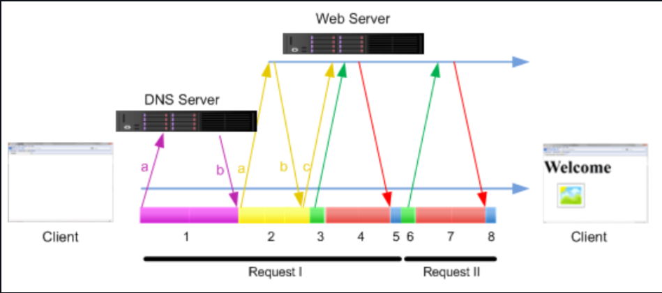

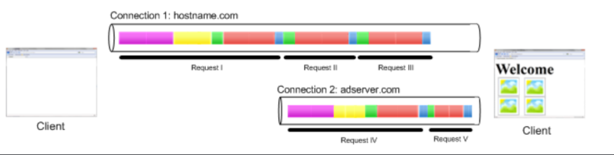

- **B1 - Tra cứu DNS** : Máy khách sử dụng tên miền (ví dụ: <www.example.com> ) để tìm địa chỉ IP của máy chủ.

- **B2** - Máy khách gửi truy vấn DNS đến máy chủ DNS của ISP cục bộ.

- **B3** - Máy chủ DNS phản hồi với địa chỉ IP cho <hostname.com>

- **B4 - Kết nối TCP** : Máy khách và máy chủ thiết lập kết nối Giao thức Điều khiển Truyền (TCP) với địa chỉ IP của hostname.com để đảm bảo truyền dữ liệu đáng tin cậy. Quá trình này thường bao gồm bắt tay ba chiều TCP. Cổng mặc định cho việc này là cổng 80 cho HTTP hoặc cổng 443 cho HTTPS.

- **B5** - Máy chủ web gửi gói tin SYN-ACK.

- **B6** - Máy khách trả lời bằng gói ACK, kết thúc quá trình thiết lập kết nối TCP ba chiều.

- **B8 - Bắt tay TLS/SSL (cho HTTPS)** : Nếu kết nối an toàn (HTTPS), bắt tay Giao thức bảo mật lớp truyền tải/Lớp cổng bảo mật (TLS/SSL) sẽ được thực hiện để mã hóa kết nối.

- **B9 - Yêu cầu HTTP** : Khi kết nối đã sẵn sàng, máy khách sẽ gửi yêu cầu HTTP (ví dụ: GET, POST) đến máy chủ.

- **B10 - Chờ**: Máy khách chờ máy chủ phản hồi yêu cầu.

- **B11 - Phản hồi HTTP** : Máy chủ xử lý yêu cầu và gửi phản hồi HTTP trở lại máy khách.

- **B12 - Tải**: Máy khách tải nội dung của phản hồi.

- **B13 - Đóng kết nối** : Sau đó, kết nối sẽ bị đóng, mặc dù trong HTTP/1.1 hiện đại và các phiên bản sau, kết nối có thể được giữ mở (kết nối liên tục) để cải thiện hiệu suất.

### 5. URL(Uniform Resource Locator)

1 URL được sử dụng để xác định duy nhất một tài nguyên trên web.

Cấu trúc URL

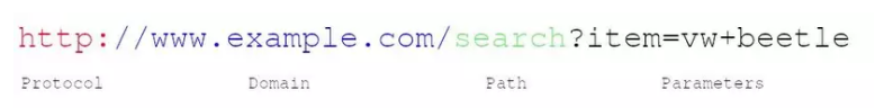

Trong đó:

- `Protocol`: Thường là phương thức HTTP (hoặc HTTPs - phương thức bảo mật nâng cấp của HTTP). Các phương thức đáng chú ý khác: FTP (File Transfer Protocal), SMTP (Simple Mail Transfer Protocol) ...
- `Domain`: Tên dùng để định danh một hoặc nhiều địa chỉ IP, nơi mà tài nguyên đang được lưu trữ.
- `Path`: Chỉ định vị trí tài nguyên trên máy chủ. Nó sử dụng chung logic như vị trí tài nguyên được sử dụng trên thiết bị (máy chủ server)
- `Parameters`: Các dữ liệu thêm được sử dụng để xác định hoặc sàng lọc tài nguyên trên server.

### 6. HTTP Cookie

#### 6.1 HTTP Cookie là gì ?

**Cookie HTTP** là một phần dữ liệu mà máy chủ gửi đến web trình duyệt. Sau đó, trình duyệt web lưu trữ cookie HTTP trên máy tính của người dùng và gửi nó trở lại cùng một máy chủ trong các yêu cầu sau này, nó được sử dụng để xác định khách hàng và hoạt động như một cách để duy trì thông tin.

**HTTP Cookie** còn được gọi là **cookie web** hoặc **cookie trình duyệt**. Và nó thường được gọi là **cookie**.

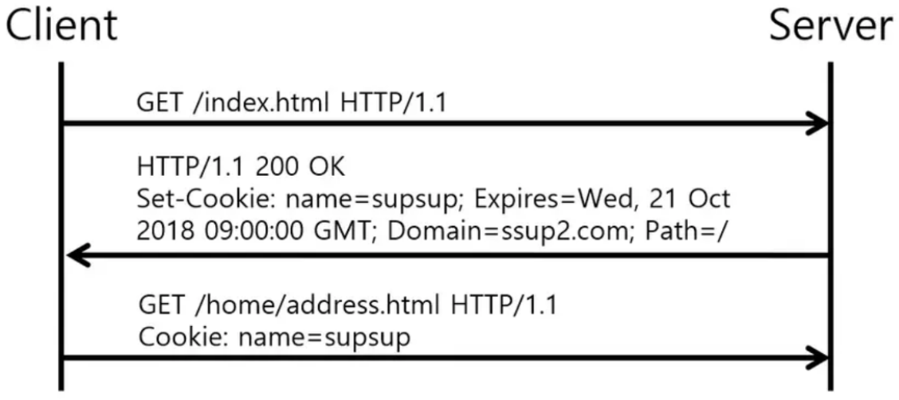

Như ta biết HTTP request chỉ là **stateless**, vì khi ta gửi hai yêu cầu HTTP tuần tự đến máy chủ, không có liên kết nào giữa chúng. Nói cách khác, máy chủ không thể biết liệu hai yêu cầu có phải từ cùng một trình duyệt web hay không.

Do đó, Cookie được sử dụng để cho biết liệu hai yêu cầu có đến từ cùng một trình duyệt web hay không. **Cookie** phục vụ các **mục đích** sau:

- Quản lý Session - cookie cho phép bạn quản lý và duy trì bất kỳ lịch sử browsing nào mà máy chủ(host) cần ghi nhớ. Chẳng hạn như thông tin đăng nhập, giỏ hàng, v.v.
- Cá nhân hóa - cookie cho phép bạn lưu trữ thông tin người dùng, chủ đề và cài đặt cụ thể cho người dùng.
- Cookie xác thực - được sử dụng để lưu trữ thông tin liên quan đến trạng thái của người dùng hiện đang đăng nhập vào máy chủ. Loại cookie này lưu trữ thông tin về tài khoản của người dùng, được sử dụng để tiếp tục phiên làm việc. Nếu không có cookie này, người dùng sẽ phải xác thực lại mỗi khi thực hiện yêu cầu HTTP.
- Theo dõi - cookie giúp ghi lại và phân tích các hành vi của người dùng trong quảng cáo.

HTTP Cookies thường bao gồm các thông tin như:

|**Thông tin** |**Giải thích chi tiết** |
|------------------|-----------------------------|
| **Name** | Tên duy nhất xác định cookie. Tên cookie **không phân biệt chữ hoa chữ thường** → nghĩa là `Username` và `username` là **cùng một cookie**. |
| **Value** | Giá trị chuỗi của cookie. Giá trị này **phải được mã hóa URL** để tránh lỗi ký tự đặc biệt. |
| **Domain** | Domain xác định **phạm vi hợp lệ** của cookie. Trình duyệt chỉ gửi cookie đến các domain khớp với giá trị này. |
| **Path** | Đường dẫn (không bao gồm domain) chỉ định **vị trí cụ thể** mà cookie sẽ được gửi đến. <br>Ví dụ: nếu cookie có `Path=/dom`, thì nó chỉ được gửi khi truy cập vào `https://www.yourwebsite.com/dom`, còn khi truy cập `https://www.yourwebsite.com` thì **không gửi cookie**. |
| **Expiration** | Xác định **thời điểm hết hạn** của cookie. Giá trị ở định dạng GMT, ví dụ: `"Wdy, DD-Mon-YYYY HH:MM:SS GMT"`. <br>Nếu có thời gian hết hạn, cookie sẽ **được lưu lại trong trình duyệt ngay cả khi người dùng đóng trình duyệt**. |
| **Secure flag** | Nếu được bật, cookie **chỉ được gửi qua kết nối bảo mật SSL/TLS** (`https://`), và **không gửi qua http**. |

#### 6.2 How Cookie work ?

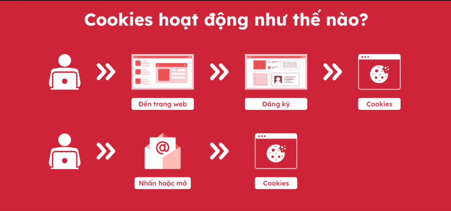

Cookies hoạt động bằng cách thiết lập một kênh liên lạc quan trọng giữa trình duyệt web của người dùng và máy chủ. Quá trình này bắt đầu khi người dùng truy cập một trang web, yêu cầu máy chủ gửi hướng dẫn đến trình duyệt một tệp văn bản nhỏ chứa dữ liệu theo cặp khóa-giá trị.

Những cookies này sau đó được trình duyệt lưu trữ cục bộ trên thiết bị của người dùng. Khi người dùng truy cập lại cùng một trang web trong tương lai, trình duyệt sẽ tự động đưa các cookies có liên quan vào các yêu cầu đối với máy chủ. Thông qua cơ chế này, máy chủ có thể xác định và nhận ra người dùng, tạo ra một trải nghiệm duyệt web cá nhân hóa hơn.

**Khởi tạo Cookie**:

- Khi người dùng truy cập vào trang web lần đầu tiên, header mà trình duyệt gửi lên sẽ có dạng sau:

```ruby
GET /index.html HTTP/1.1
Host: www.example.org
```

- Đồng thời, lúc này server không tìm thấy cookie trên request người dùng, chính vì vậy nó sẽ khởi tạo cookie bằng cách gửi lại header như sau:

```ruby
HTTP/1.0 200 OK
Content-type: text/html
Set-Cookie: theme=light
Set-Cookie: sessionToken=abc123; Expires=Wed, 09 Jun 2021 10:18:14 GMT
Set-Cookie: status=active; Max-Age: 300
Set-Cookie: name=tien; Expires=Wed, 09 Jun 2021 10:18:14 GMT; Max-Age: 300
```

- Có thể thấy có 2 cookie được tạo ra:

  - Cookie theme không có Expires, có nghĩa là nó sẽ bị mất sau khi đóng trình duyệt.
  - Cookie sessionToken có thêm Expires, có nghĩa là nó sẽ chỉ bị mất khi hết thời gian hoặc bị xóa bơi người dùng.
  - Cookie status có trường Max-Age, có nghĩa là cookie sẽ bị mất sau: 300 giây. Trong trường hợp cả Expire và Max-Age đều có trong cookie thì Max-Age sẽ được ưu tiên hơn.

- Sau khi cookie được khởi tạo trên trình duyệt người dùng, các request khác của người dùng lên server sẽ có header dạng như sau:( Trình duyệt chỉ gửi lại cho server keyvalue)

```ruby
GET /spec.html HTTP/1.1
Host: www.example.org
Cookie: theme=light; sessionToken=abc123
```

=>Mọi cookies được liên kết với một miền(Domain) và đường dẫn(Path) cụ thể đảm bảo tính bảo mật tránh nguy cơ truy cập trái phép.

### 7. Domain and Path

2 giá trị này dùng để nói cho trình duyệt biết nơi cookie thuộc về. Vì lý do bảo mật nên cookie chỉ được set domain là domain hiện tại mà trình duyệt truy cập.
  
- `Domain` chỉ định tên miền (website) mà cookie này “thuộc về”, tức là chỉ được gửi lại cho các request thuộc domain đó.
- `Path` chỉ định đường dẫn (path) trên domain mà cookie được gửi kèm khi truy cập.

```ruby
HTTP/1.0 200 OK
Set-Cookie: LSID=DQAAAK…Eaem_vYg; Path=/accounts; Expires=Wed, 13 Jan 2021 22:23:01 GMT; Secure; HttpOnly
Set-Cookie: HSID=AYQEVn…DKrdst; Domain=.foo.com; Path=/; Expires=Wed, 13 Jan 2021 22:23:01 GMT; HttpOnly
Set-Cookie: SSID=Ap4P…GTEq; Domain=foo.com; Path=/; Expires=Wed, 13 Jan 2021 22:23:01 GMT; Secure; HttpOnly
```

Với dòng đầu tiên có cookie `LSID`, ta có thể thấy rằng:

- Không có trường Domain, trường P`ath=/accounts`. Điều này có nghĩa là `Domain` sẽ tự được lấy từ request
- Dòng thứ 2 và dòng thứ 3 có `Domain=.foo.com` hay `Domain=foo.com` và có cùng `Path=/`. Điều này có nghĩa là `domain foo.com` hay bất cứ sub-domain nào dạng: `sub.foo.com` hay `tien.foo.com` đều có quyền thao tác đến cookie này.

| Thuộc tính | Giá trị mặc định                                       |
| ---------- | ------------------------------------------------------ |
| `Domain`   | Domain của trang hiện tại (ví dụ đang ở `example.com`) |
| `Path`     | Đường dẫn của URL hiện tại (ví dụ `/account/login`)    |

### 8. Session

#### 8.1 Session là gì ?

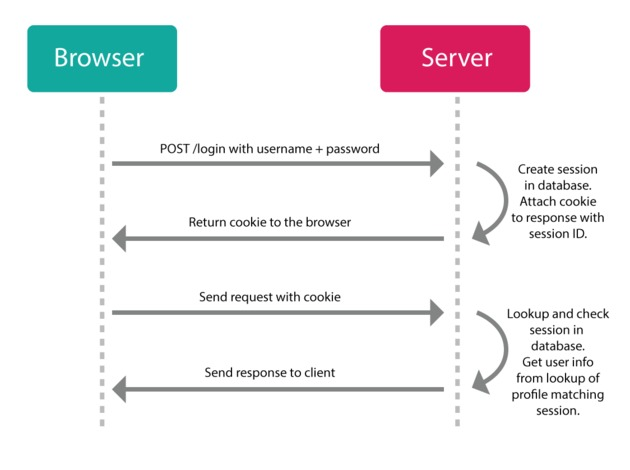

Session là cơ chế lưu trữ và quản lý dữ liệu tạm thời, liên quan đến người dùng trong quá trình tương tác với ứng dụng web. Nó giúp duy trì trạng thái và thông tin người dùng giữa các yêu cầu (request) khác nhau, cho phép ứng dụng web ghi nhớ và truy xuất dữ liệu người dùng một cách an toàn và hiệu quả.

Thông qua Session, ứng dụng web có thể lưu trữ các thông tin như đăng nhập, giỏ hàng, tùy chọn cài đặt và nhiều dữ liệu khác liên quan đến người dùng cụ thể.

Session thường được sử dụng để xác thực và quản lý phiên làm việc của người dùng, cho phép chuyển đổi qua lại giữa các website khác nhau mà không cần đăng nhập lại.

#### 8.2 Cơ chế hoạt động in 1 Session

| **Bước** | **Hành động / Mô tả chi tiết** |
|--------------|----------------------------------|
| **B1 - Browser → Server:** `POST /login` với `username + password` | Trình duyệt (client) gửi yêu cầu đăng nhập đến server qua phương thức **POST**, trong phần **body** có thông tin đăng nhập. |
| **B2 - Server xử lý:** Tạo Session trong database | Server kiểm tra thông tin đăng nhập (**username & password**). Nếu đúng:<br>→ Tạo một bản ghi **session** trong cơ sở dữ liệu (ví dụ `session_id = 123abc`).<br>→ Gắn session này với tài khoản người dùng. |
| **B3 - Server → Browser:** Gửi cookie chứa session ID | Server trả về phản hồi (**Response**) và thêm vào header **Set-Cookie**, ví dụ:<br>`Set-Cookie: session_id=123abc; HttpOnly; Secure`.<br>Trình duyệt tự động lưu cookie này. |
| **B4 - Browser → Server:** Gửi yêu cầu khác kèm cookie | Ở các **request** tiếp theo (ví dụ: truy cập trang cá nhân), trình duyệt sẽ tự động gửi kèm cookie trong header:<br>`Cookie: session_id=123abc`.<br>→ Đây là cách để server biết *“người gửi request này chính là user đã đăng nhập trước đó”*. |
| **B5 - Server xử lý cookie:** Tra cứu session trong database | Server nhận được `session_id` → tra trong **database**:<br>• Nếu tồn tại và hợp lệ → lấy thông tin user tương ứng.<br>• Nếu không tồn tại / hết hạn → yêu cầu đăng nhập lại. |
| **B6 - Server → Browser:** Trả về phản hồi | Sau khi xác thực thành công session, server gửi lại **response** chứa nội dung yêu cầu (ví dụ: thông tin hồ sơ người dùng). |


**Ghi nhớ**:

- HTTP không lưu session – chính ứng dụng web (server-side) làm điều đó.

- Cookie chỉ là phương tiện truyền session ID, không chứa toàn bộ dữ liệu phiên.

- Một số web hiện đại có thể dùng token (JWT) thay cho session truyền thống.

### 9. Proxy

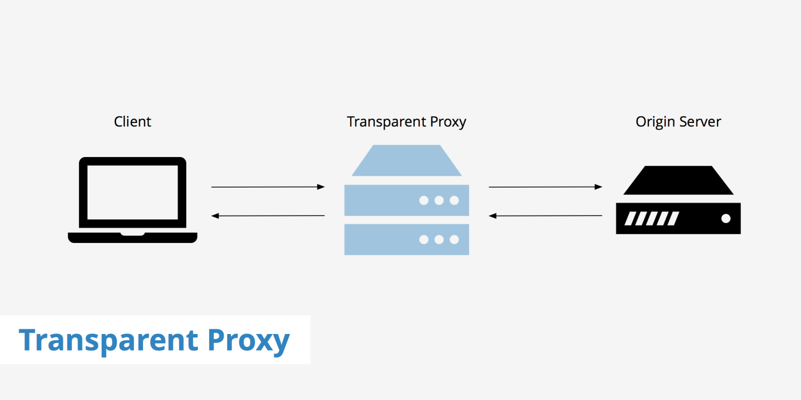

Proxy là máy chủ trung gian giữa client (người dùng) và server (Internet). Nó có địa chỉ IP riêng, một cổng truy cập cố định, và có thể là một phần mềm hoặc thiết bị mạng (router, gateway, server).

Proxy nhận yêu cầu từ client, xử lý hoặc kiểm soát, rồi chuyển tiếp yêu cầu tới server thật và trả lại phản hồi cho client.

#### 9.1 Chức năng chính của Proxy

- Caching (lưu trữ tạm): giảm tải mạng, tăng tốc truy cập.

- Filtering (lọc nội dung): chặn web độc hại, kiểm soát truy cập.

- Load balancing (cân bằng tải): phân phối yêu cầu tới nhiều máy chủ.

- Authentication (xác thực): yêu cầu người dùng đăng nhập để ra Internet.

- Logging (ghi nhật ký): theo dõi và lưu log truy cập.

#### 9.2 Các loại Proxy phổ biến

| Loại | Đặc điểm |
|-------|----------|
| Máy chủ Proxy Web | Khi một người dùng gửi yêu cầu truy cập một trang web, yêu cầu đó được gửi đến Proxy server thay vì trực tiếp đến máy chủ của trang web. Proxy server này sau đó gửi yêu cầu đó đến máy chủ của trang web và nhận phản hồi từ máy chủ. Cuối cùng, Proxy server chuyển phản hồi đó đến người dùng.|
| Máy chủ nguồn mở  | Máy chủ này giúp ẩn danh mọi thông tin cá nhân của người dùng. Nó được sử dụng để định tuyến lưu lượng truy cập qua các mạng khác nhau nhằm gây khó khăn trong việc theo dõi địa chỉ của người dùng, đồng thời ngăn chặn sự tấn công trái phép từ tin tặc. |
| Máy chủ ẩn danh 12 cấp | Loại Proxy này sử dụng mã hóa để ẩn tất cả các thông tin liên lạc ở nhiều cấp độ. Dữ liệu được mã hóa sau đó được chuyển tiếp qua các bộ định tuyến mạng có mặt ở các vị trí khác nhau. |
| Forward Proxy | Là loại Proxy phổ biến nhất, Forward Proxy hoạt động như trung gian giữa người dùng và internet. Khi người dùng gửi yêu cầu đến một trang web, yêu cầu này sẽ được gửi đến Proxy trước, sau đó Proxy sẽ chuyển tiếp yêu cầu đến trang web và nhận phản hồi, trả về cho người dùng. |
| Reverse Proxy server  | Reverse Proxy server hoạt động ngược lại với Forward Proxy. Reverse Proxy được đặt trước máy chủ web và nhận các yêu cầu từ internet. Proxy sau đó sẽ chuyển tiếp yêu cầu đến máy chủ web phù hợp và trả về phản hồi cho người dùng.|
| Anonymous Proxy | Loại Proxy Server không tiết lộ địa chỉ IP của người dùng cho các trang web mà họ truy cập. Nhờ đó dễ dàng bảo vệ danh tính của người dùng và ngăn chặn việc theo dõi hoạt động trực tuyến của họ. Anonymity Proxy cũng ngăn chặn các trang web sử dụng vị trí địa lý của người dùng để cung cấp nội dung tiếp thị cụ thể.|
| High Anonymity Proxy | Đây là loại Proxy định kỳ thay đổi địa chỉ IP xuất hiện trên máy chủ web, gây khó khăn cho việc theo dõi lưu lượng truy cập của người dùng. Trong các loại Proxy, Proxy ẩn danh cao được đánh giá là một trong những cách an toàn và hiệu quả nhất để truy cập web.|
| Transparent Proxy | Đây là một loại Proxy server hoạt động như một cổng trung gian giữa người dùng và internet mà không làm thay đổi hoặc mã hóa dữ liệu. Nó giúp kiểm soát và giám sát lưu lượng mạng mà không làm ảnh hưởng đến quá trình tương tác với website của người dùng. |
| Common Gateway Interface Proxy (CGI Proxy) | Loại Proxy này dựa trên CGI, một giao thức cho phép máy chủ web thực thi các chương trình trên máy chủ để đáp ứng yêu cầu của người dùng. Tập lệnh CGI hoạt động như một Proxy, thay mặt bạn tìm nạp các trang web.|
| Suffix Proxy | Proxy máy chủ Suffix về cơ bản sẽ thêm tên Proxy vào URL. Loại Proxy này không đảm bảo tính ẩn danh cấp cao. Nó được sử dụng để bỏ qua các bộ lọc web. |
| Rotating Proxies | Đây là một loại Proxy web thay đổi địa chỉ IP thường xuyên. Điều này có nghĩa là mỗi lần người dùng thực hiện một yêu cầu thông qua Proxy, một địa chỉ IP khác được sử dụng sẽ khiến các trang web khó theo dõi hoạt động trực tuyến của người dùng hơn.|
| DNS Proxy | DNS Proxy hoạt động như một trung gian giữa thiết bị của bạn và máy chủ Hệ thống tên miền (DNS). Nó chuyển tiếp các yêu cầu và phản hồi DNS của người dùng, có khả năng mang lại một số lợi thế so với việc truy vấn trực tiếp máy chủ DNS. |

### 10. HTTP Message

HTTP message là cách mà data chuyển giữa người dùng và server. Có 2 loại message:

- `request`: gửi bởi người dùng tới server để trigger 1 action nào đó

- `responses`: kết quả trả về từ server

Cấu trúc HTTP message:

- `start-line`: miêu tả request để thực hiện (GET, POST, PUT, …), trạng thái thành công hay thất bại (qua các mã code)

- `HTTP headers`: có thể có hoặc không, chứa các thông tin của request (host, content-length, encoding, …) hoặc miêu tả phần body của message

- `Dòng kẻ trống`: là phần phần tách giữa header vs body

- `body`: Phần thân tùy chọn chứa dữ liệu được liên kết với request (như nội dung của biểu mẫu HTML) hoặc tài liệu được liên kết với reponse.

### 11. HTTP Request/Responses


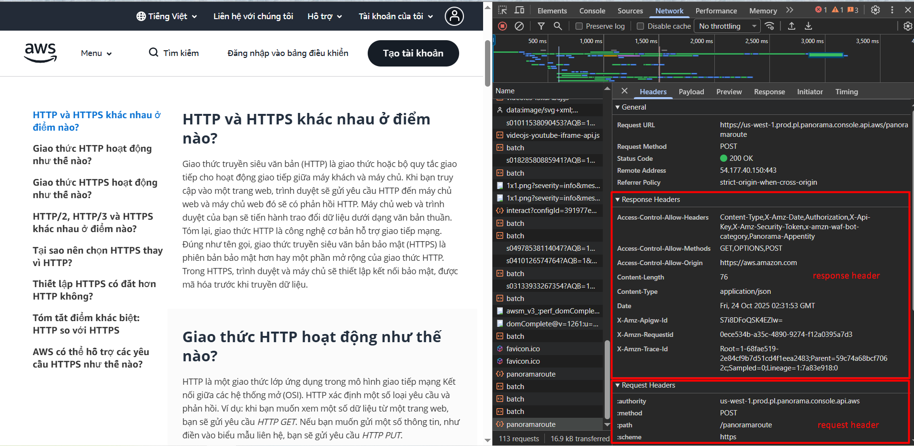

#### 11.1 HTTP Request

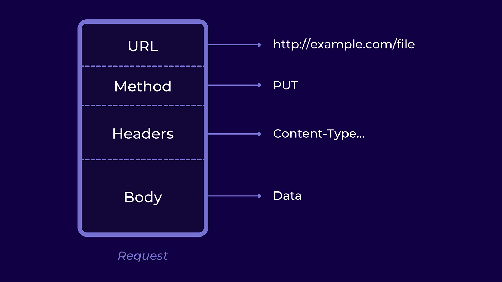

**HTTP Request Form**:

Nội dung của một HTTP Request bao gồm:

- **Request Line**: Dòng lệnh chính (phương thức, tài nguyên, phiên bản HTTP). (vd: GET /index.html HTTP/1.1)

  - `GET`: Phương thức HTTP.
  - `/index.html`: Đường dẫn tài nguyên.
  - `HTTP/1.1`: Phiên bản HTTP.

- **Request Headers**: Các thông tin bổ sung

  - Referer header: cho biết URL nguồn từ đâu.
  - Host header: Tên miền của máy chủ (vd: example.com).
  - User-Agent header: Thông tin về trình duyệt, hệ điều hành của client (vd: Mozilla/5.0).
  - Accept header: Các loại dữ liệu mà client có thể xử lý (HTML, JSON, XML,...) (vd: text/html).
  - Cookie header: submit thêm các tham số từ cookie tới server.
  - Content-Type header: Loại dữ liệu gửi đi (ví dụ: JSON, XML).
  - ...

- **Request Body** (tuỳ chọn): Dữ liệu gửi lên (thường gặp trong POST, PUT).

Giao thức HTTP định nghĩa một tập các phương thức request, client có thể sử dụng một trong các phương thức này để tạo request tới HTTP server. Một số phương thức phổ biến:

| Phương thức | Mục đích sử dụng | Mô tả chi tiết |
|-------------|------------------|----------------|
| **GET**     | Lấy dữ liệu      | Dùng để truy vấn dữ liệu từ server, không làm thay đổi trạng thái tài nguyên. |
| **HEAD**    | Kiểm tra metadata| Giống GET nhưng chỉ lấy header, không có body trong response. |
| **POST**    | Gửi dữ liệu      | Gửi dữ liệu mới lên server, thường dùng để tạo mới tài nguyên hoặc thực hiện hành động. |
| **PUT**     | Thay thế dữ liệu | Gửi dữ liệu để thay thế toàn bộ nội dung của tài nguyên hiện tại. |
| **PATCH**   | Cập nhật dữ liệu | Cập nhật một phần dữ liệu của tài nguyên (không thay thế toàn bộ như PUT). |
| **DELETE**  | Xóa dữ liệu      | Yêu cầu server xóa một tài nguyên cụ thể. |
| **TRACE**   | Kiểm tra đường đi| Server trả lại nội dung của request để chẩn đoán, kiểm tra đường đi của request từ client. |
| **CONNECT** | Tạo kết nối      | Dùng để thiết lập kết nối mạng (thường là qua proxy), ví dụ: tạo tunnel HTTPS. |
| **OPTIONS** | Tùy chọn hỗ trợ  | Yêu cầu server liệt kê các phương thức được hỗ trợ cho tài nguyên được chỉ định. |

#### 11.2 HTTP Response

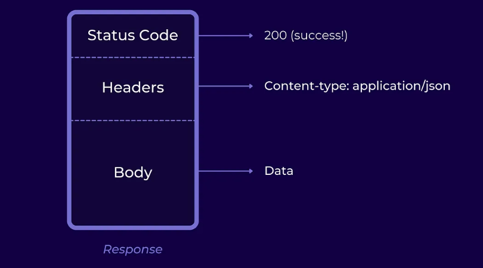

Phản hồi của máy chủ gồm 3 phần chính:

- Status Line: Trạng thái của phản hồi. (vd: HTTP/1.1 200 OK).
- Response Headers: Thông tin về phản hồi.(Na ná HTTP Request)
- Response Body: Nội dung tài nguyên

Các mã trạng thái cho biết kết quả xử lý yêu cầu của máy chủ:

**1xx – Informational (Thông tin):**

| Mã trạng thái | Tên | Ý nghĩa |
|---------------|-----|---------|
| 100 | Continue | Yêu cầu ban đầu đã được chấp nhận, client có thể tiếp tục gửi yêu cầu. |
| 101 | Switching Protocols | Server đồng ý chuyển giao giao thức như yêu cầu của client. |
| 102 | Processing | Server đã nhận yêu cầu và đang xử lý, nhưng chưa có phản hồi hoàn tất. |

**2xx – Success (Thành công):**

| Mã trạng thái | Tên | Ý nghĩa |
|---------------|-----|---------|
| 200 | OK | Yêu cầu thành công và có dữ liệu trả về. |
| 201 | Created | Yêu cầu thành công, tài nguyên đã được tạo mới. |
| 202 | Accepted | Yêu cầu đã nhận, đang xử lý nhưng chưa hoàn tất. |
| 204 | No Content | Yêu cầu thành công nhưng không có dữ liệu trả về. |

**3xx – Redirection (Chuyển hướng):**

| Mã trạng thái | Tên | Ý nghĩa |
|---------------|-----|---------|
| 301 | Moved Permanently | Tài nguyên đã được chuyển vĩnh viễn sang URL khác. |
| 302 | Found | Tài nguyên tạm thời ở URL khác. |
| 304 | Not Modified | Tài nguyên không thay đổi kể từ lần cuối client yêu cầu. |

**4xx – Client Error (Lỗi từ phía client):**

| Mã trạng thái | Tên | Ý nghĩa |
|---------------|-----|---------|
| 400 | Bad Request | Cú pháp yêu cầu không hợp lệ. |
| 401 | Unauthorized | Chưa xác thực hoặc xác thực không hợp lệ. |
| 403 | Forbidden | Từ chối truy cập dù đã xác thực. |
| 404 | Not Found | Không tìm thấy tài nguyên yêu cầu. |
| 405 | Method Not Allowed | Phương thức không được phép sử dụng với tài nguyên này. |

**5xx – Server Error (Lỗi từ phía server):**

| Mã trạng thái | Tên | Ý nghĩa |
|---------------|-----|---------|
| 500 | Internal Server Error | Lỗi phía server, không rõ nguyên nhân cụ thể. |
| 501 | Not Implemented | Server không hỗ trợ chức năng yêu cầu. |
| 502 | Bad Gateway | Server trung gian nhận được phản hồi không hợp lệ từ server khác. |
| 503 | Service Unavailable | Server hiện không thể xử lý vì quá tải hoặc bảo trì. |
| 504 | Gateway Timeout | Server trung gian không nhận được phản hồi kịp thời từ server gốc. |

### 12. Các loại kết nối trong HTTP

**Kết nối không duy trì (Stateless):**

- Mỗi yêu cầu là độc lập, không lưu trạng thái của các lần trao đổi trước.
- Ví dụ: Mỗi lần tải trang sẽ tạo một kết nối mới.

**Persistent Connection (HTTP/1.1 trở lên):**

- Kết nối được giữ mở cho nhiều yêu cầu (giảm chi phí thiết lập kết nối lại).
- Được kích hoạt bằng header:

  ```ruby
  Connection: keep-alive
  ```

## II. HTTPs

### 1. Khái niệm HTTPs

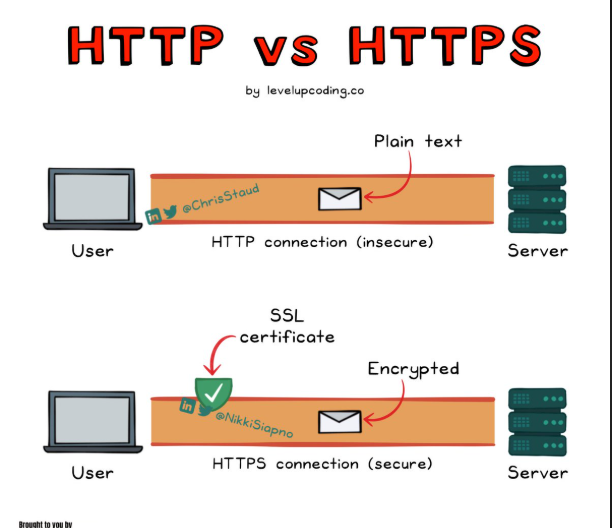

Giao thức HTTPS (HyperText Transfer Protocol Secure) là phiên bản bảo mật của giao thức HTTP, thiết kế để bảo vệ dữ liệu khi truyền qua internet bằng cách mã hóa thông tin. HTTPS thêm một lớp bảo mật bằng cách kết hợp HTTP với công nghệ mã hóa SSL (Secure Sockets Layer) và TLS (Transport Layer Security).

### 2. Cơ chế hoạt động HTTPs

HTTPS hoạt động bằng cách mã hóa dữ liệu truyền tải giữa client (trình duyệt) và server (máy chủ web), sử dụng giao thức TLS (Transport Layer Security) hoặc SSL (Secure Sockets Layer).

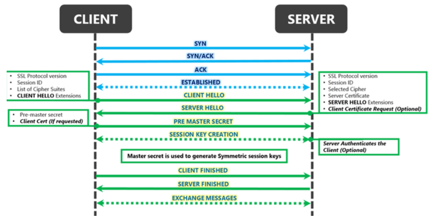

**Quy trình thiết lập kết nối HTTPS (TLS/SSL Handshake)** gồm 5 bước: Client Hello -> Server Hello -> Xác thực chứng chỉ -> Trao đổi khóa -> Mã hóa kết nối

`Bước 1`: **Client Hello**

Khi người dùng truy cập một trang web sử dụng HTTPS, trình duyệt (client) gửi một yêu cầu tới máy chủ (server). Yêu cầu bao gồm:

- **Phiên bản TLS/SSL:** Các phiên bản giao thức mà trình duyệt hỗ trợ (ví dụ: TLS 1.2, TLS 1.3).
- **Danh sách các thuật toán mã hóa (Cipher Suites):** Các phương pháp mã hóa mà trình duyệt có thể sử dụng (ví dụ: AES, RSA, ECDSA).
- **Random Number (Số ngẫu nhiên):** Một số ngẫu nhiên dùng để tạo khóa phiên (session key) sau này.

Ví dụ dữ liệu Client gửi đi:

```ruby
Client Hello:
    TLS Version: TLS 1.3
    Cipher Suites: AES_256_GCM, CHACHA20_POLY1305
    Random Number: 12345abc
```

`Bước 2`: **Server Hello**

Máy chủ phản hồi lại trình duyệt với các thông tin sau:

- **Phiên bản TLS/SSL:** Máy chủ chọn phiên bản giao thức phù hợp nhất.
- **Thuật toán mã hóa (Cipher Suite):** Máy chủ chọn thuật toán mã hóa tốt nhất mà cả hai bên đều hỗ trợ.
- **Random Number:** Một số ngẫu nhiên do máy chủ tạo ra.
- **Chứng chỉ số (SSL/TLS Certificate):** Chứng minh danh tính của máy chủ.

```ruby
Server Hello:
    TLS Version: TLS 1.3
    Chosen Cipher Suite: AES_256_GCM
    Random Number: xyz789
    Certificate: example.com (Đã được xác thực)
```

`Bước 3`: **Xác thực chứng chỉ SSL/TLS**

Khi nhận được tin "server hello" từ server, client sẽ lấy SSL certificate trong tin nhắn đó và gửi yêu cầu tới CA (là nơi cấp SSL certificate cho server) để xác thực xem mình có đang nhận tin từ chính chủ hay không:

- **Tính hợp pháp:** Chứng chỉ được cấp bởi tổ chức chứng thực đáng tin cậy (CA – Certificate Authority).
- **Hạn sử dụng:** Chứng chỉ có còn hợp lệ không (thời gian bắt đầu và kết thúc).
- **Tên miền khớp:** Tên miền trên chứng chỉ phải khớp với tên miền truy cập.

*Nếu chứng chỉ không hợp lệ, trình duyệt sẽ cảnh báo: "Kết nối không an toàn" (Your connection is not private).*

`Bước 4`: **Trao đổi khóa phiên (Session Key Exchange)**

Nếu chứng chỉ hợp lệ, trình duyệt và máy chủ sẽ tạo một khóa phiên bí mật (Session Key) để mã hóa dữ liệu. 2 phương pháp chính để tạo khóa phiên:

- **RSA (Rivest–Shamir–Adleman)** – Cũ hơn:
  - Máy chủ gửi Public Key (khóa công khai) cho trình duyệt.
  - Trình duyệt tạo Session Key và mã hóa nó bằng Public Key.
  - Máy chủ giải mã bằng Private Key (khóa riêng).
- **ECDHE (Elliptic Curve Diffie-Hellman Ephemeral)** – Hiện đại:
  - Cả hai bên sử dụng thuật toán Diffie-Hellman để tạo khóa phiên chung mà không cần gửi khóa qua mạng.
  - An toàn hơn vì không cần truyền khóa trực tiếp.

`Bước 5`: **Hoàn tất Handshake & Bắt đầu mã hóa**

Sau khi chia sẻ khóa thành công, kết nối an toàn được thiết lập. Tất cả dữ liệu tiếp theo sẽ được mã hóa bằng khóa phiên.

Các phương thức mã hóa phổ biến:

| Phương thức | Mô tả |
|-----------|-------------|
| AES-256-GCM | Mã hóa đối xứng, nhanh và an toàn. |
| CHACHA20-POLY1305 | Tối ưu cho thiết bị di động. |

`Bước 6`: **Truyền dữ liệu an toàn**

Mọi thông tin truyền đi (yêu cầu, phản hồi) đều được mã hóa:

- Dữ liệu nhạy cảm (mật khẩu, thẻ tín dụng).
- Cookie phiên làm việc (Session Cookies).

Ví dụ yêu cầu HTTPS mã hóa:

```ruby
GET /account HTTP/1.1
Host: example.com
Cookie: session_id=abcd1234
```

## III. DIFFERENT BETWEN HTTP AND HTTPS

| Tiêu chí | HTTP | HTTPS |
|-----------|-------------|---------|
| Bảo mật | Không mã hóa – Dữ liệu truyền tải có thể bị đánh cắp hoặc thay đổi. | Mã hóa – Dữ liệu được bảo vệ khỏi nghe lén, sửa đổi hoặc giả mạo. |
| Chứng chỉ SSL/TLS | Không sử dụng chứng chỉ bảo mật. | Có sử dụng chứng chỉ SSL/TLS để xác thực và mã hóa. |
| Cổng (Port) | 80 (Mặc định) | 443 (Mặc định) |
| Xác thực máy chủ | Không có xác thực, dễ bị tấn công giả mạo. | Có xác thực, đảm bảo kết nối với máy chủ đáng tin cậy. |
| Tốc độ | Nhanh hơn do không có quá trình mã hóa. | Chậm hơn một chút vì cần mã hóa dữ liệu. |
| An toàn dữ liệu | Dễ bị tấn công: - Man-in-the-Middle (MITM) - Eavesdropping (nghe lén). | An toàn hơn: Dữ liệu được mã hóa end-to-end. |
| Ứng dụng | Phù hợp với các trang công khai, không cần bảo mật (ví dụ: blog, diễn đàn mở). | Bắt buộc với các trang cần bảo mật như: - Giao dịch ngân hàng. - Đăng nhập tài khoản. - Thương mại điện tử. |
