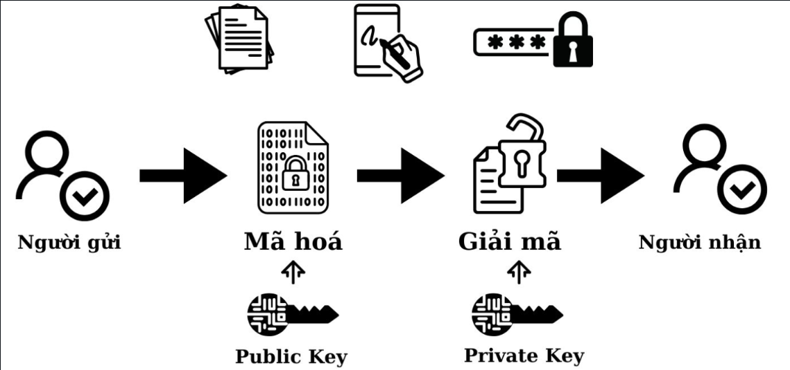
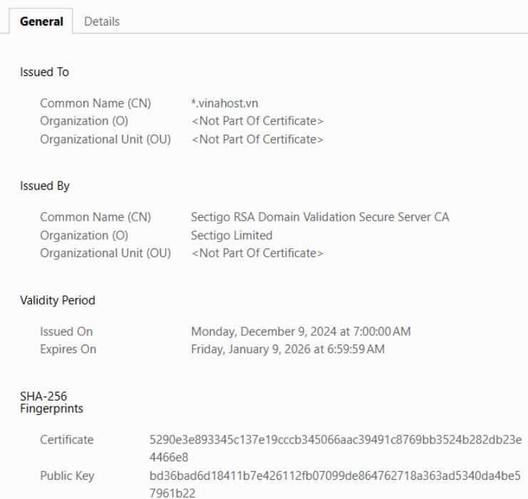

# SSL/TLS cer, CSR, Pub/Private Key, CA

## I.Private Key - Khóa bí mật | Public Key - Khóa công khai

### 1. Public Key và Private Key là gì?

Hệ thống CA (Certificate Authority) sử dụng mật mã bất đối xứng (Asymmetric Encryption) để mã hóa và giải mã dữ liệu. Hai thành phần chính của hệ thống này là:

**Public Key (khóa công khai):**

- Được cấp cùng với chứng chỉ SSL/TLS.
- Mọi người đều có thể sử dụng nó để mã hóa dữ liệu.
- Không thể dùng để giải mã dữ liệu đã được mã hóa bằng nó.

**Private Key (Khóa bí mật):**

- Chỉ thuộc về chủ sở hữu chứng chỉ (webserver).
- Được dùng để giải mã dữ liệu đã được mã hóa bằng Public Key.
- Server có thể bị giả mạo nếu bị lộ.

### 2. Cách hoạt động



1. Khi truy cập <https://mydomain.com>, trình duyệt nhận Public Key từ chứng chỉ SSL của webserver.
2. Trình duyệt dùng Public Key để mã hóa dữ liệu gửi đi.
3. Chỉ Private Key trên webserver mới có thể giải mã dữ liệu đó.

Hệ thống này đảm bảo dữ liệu được mã hóa trước khi gửi qua mạng và chỉ có webserver mới có thể đọc được nó.

### 3. Public Key và Private Key trong SSL/TLS

**Tạo Private Key & Public Key bằng OpenSSL:**

Có thể tạo cặp khóa bằng lệnh sau:

```ruby
openssl genrsa -out mydomain.key 2048
```

- `mydomain.key`: Private Key (Chỉ máy chủ mới có quyền truy cập).

Tiếp theo, tạo `Public Key` từ `Private Key`:

```ruby
openssl rsa -in mydomain.key -pubout -out mydomain.pub
```

- `mydomain.pub`: Public Key

*Lưu ý:*

- Private Key tuyệt đối không được chia sẻ.
- Public Key có thể chia sẻ công khai (nằm trong chứng chỉ SSL).

## CSR (Certificate Signing Request) - Yêu cầu cấp chứng chỉ

**CSR (Certificate Signing Request)** là một tệp chứa thông tin quan trọng được gửi đến CA (Certificate Authority) để yêu cầu cấp chứng chỉ SSL/TLS.

### 1. CSR chứa những thông tin gì?

- Tên miền (Common Name - CN): Ví dụ: `<www.example.com>`
- Tên tổ chức (Organization - O): Ví dụ: `Example Inc.`
- Bộ phận (Organizational Unit - OU): Ví dụ: `IT Department`
- Thành phố (Locality - L): Ví dụ: `Hanoi`
- Bang/Tỉnh (State - ST): Ví dụ: `Hanoi`
- Quốc gia (Country - C): Ví dụ: `VN`
- Public Key (Khóa công khai)
- Chữ ký số (Được tạo bằng Private Key)

*Lưu ý:* CSR không chứa Private Key.

### 2. Cách tạo CSR

Trên webserver (Ubuntu, CentOS), có thể tạo CSR (Certificate Signing Request) bằng OpenSSL theo các bước sau:

`Bước 1`: Tạo Private Key

Đầu tiên, tạo Private Key với độ dài 2048-bit:

```ruby
openssl genrsa -out mydomain.key 2048
```

- Tạo ra file `mydomain.key` -> Private Key

`Bước 2`: Tạo CSR từ Private Key

```ruby
openssl req -new -key mydomain.key -out mydomain.csr
```

Hệ thống sẽ yêu cầu nhập thông tin:

```ruby
Country Name (2 letter code) [US]: VN
State or Province Name (full name) [Some-State]: Hanoi
Locality Name (eg, city) []: Hanoi
Organization Name (eg, company) [Internet Widgits Pty Ltd]: My Company
Organizational Unit Name (eg, section) []: IT Department
Common Name (e.g. server FQDN or YOUR name) []: www.example.com
Email Address []: admin@example.com
```

- Tạo ra file `mydomain.csr` -> CSR, gửi cho CA để cấp chứng chỉ SSL.

`Bước 3`: Kiểm tra CSR

Xác minh nội dung của CSR vừa tạo:

```ruby
openssl req -noout -text -in mydomain.csr
```

Bạn sẽ thấy thông tin về Public Key, CN (Common Name), O (Organization), v.v.

`Bước 4`: Gửi CSR cho CA để cấp chứng chỉ

Nếu dùng Let’s Encrypt, có thể dùng Certbot để tự động cấp SSL:

```ruby
certbot certonly --webroot -w /var/www/html -d example.com
```

Nếu dùng DigiCert, Sectigo, GlobalSign, hãy gửi file mydomain.csr đến CA.

CA sẽ cấp file chứng chỉ SSL (.crt), bạn cài đặt vào webserver.

### 3. CSR được dùng như thế nào

- Sau khi tạo CSR, bạn gửi tệp này cho CA (Let's Encrypt, DigiCert, Sectigo, v.v.).
- CA sẽ xác minh danh tính của bạn và ký CSR bằng Private Key của CA để tạo chứng chỉ SSL hợp lệ.
- Sau đó, bạn nhận được chứng chỉ SSL (`.crt`) để cài đặt trên webserver.

## SSL/TLS Certificate - Chứng chỉ SSL/TLS

### 1. SSL/TLS Certificate là gì?

`SSL/TLS Certificate (Chứng chỉ SSL/TLS)` là một tệp dữ liệu số được sử dụng để mã hóa dữ liệu giữa trình duyệt (client) và webserver (server), giúp đảm bảo bảo mật và tính toàn vẹn của dữ liệu.

`SSL (Secure Sockets Layer)` và `TLS (Transport Layer Security)` đều là giao thức mã hóa, nhưng TLS là phiên bản nâng cấp của SSL. Hiện nay, TLS (đặc biệt là TLS 1.2 và TLS 1.3) được sử dụng thay thế SSL.

### 2. Cấu trúc của một chứng chỉ SSL/TLS



Chứng chỉ SSL chứa các thông tin quan trọng, bao gồm:

- **Common Name (CN):** Tên miền được bảo vệ (ví dụ: `<www.example.com>`).
- **Organization (O):** Tên tổ chức sở hữu chứng chỉ.
- **Issuer (CA - Certificate Authority):** Tổ chức cấp chứng chỉ (Let's Encrypt, DigiCert, Sectigo, v.v.).
- **Serial Number:** Số sê-ri duy nhất của chứng chỉ.
- **Validity Period:** Ngày cấp và ngày hết hạn.
- **Public Key:** Dùng để mã hóa dữ liệu.
- **Signature Algorithm:** Thuật toán mã hóa được sử dụng (RSA, ECC, v.v.)

### 3. Các loại chứng chỉ do CA cấp

**Domain Validation (DV) SSL - Xác thực tên miền:**

- Xác thực quyền sở hữu tên miền (domain).
- Cấp phát nhanh (chỉ vài phút), không cần giấy tờ công ty.
- Dùng cho website cá nhân, blog, trang tin tức.
- Ví dụ: `Let's Encrypt`, `Sectigo DV SSL`.

**Organization Validation (OV) SSL - Xác thực tổ chức:**

- Xác thực tên miền + thông tin công ty (giấy phép đăng ký kinh doanh).
- Hiển thị thông tin doanh nghiệp khi kiểm tra chứng chỉ.
- Dùng cho website công ty, doanh nghiệp.
- Ví dụ: `GlobalSign OV SSL`, `DigiCert OV SSL`.

**Extended Validation (EV) SSL - Xác thực mở rộng:**

- Xác thực tên miền + tổ chức + địa chỉ thực tế + pháp lý.
- Cấp độ bảo mật cao nhất, thường dùng cho ngân hàng, thương mại điện tử.
- Ví dụ: `DigiCert EV SSL`, `Sectigo EV SSL`.

### 4. Kiểm tra chứng chỉ SSL

**Kiểm tra trên trình duyệt:**

1. Vào trang wev HTTPS.
2. nhấp vào biểu tượng ổ khóa.
3. Chọn Certificate (Chứng chỉ) để xem thông tin.

**Kiểm tra bằng OpenSSL:**

```ruby
openssl s_client -connect mydomain.com:443 -showcerts
```

**Kiểm tra hạn SSL bằng lệnh:**

```ruby
openssl x509 -in mydomain.crt -noout -dates
```

## CA (Certificate Authority) - Tổ chức phát hành chứng chỉ

### 1. CA (Certificate Authority) là gì?

**CA (Certificate Authority)** là tổ chức phát hành, xác thực và quản lý chứng chỉ số (SSL/TLS) để bảo mật các kết nối trên internet.

- CA là bên thứ ba đáng tin cậy, giúp đảm bảo rằng website hoặc dịch vụ thực sự thuộc về tổ chức hoặc cá nhân mà nó tuyên bố.
- Các trình duyệt (Chrome, Firefox, Edge, Safari...) có danh sách các CA được tin cậy, và nếu một trang web có chứng chỉ SSL từ CA hợp lệ, nó sẽ hiển thị biểu tượng ổ khóa.

*Ví dụ về CA nổi tiếng:*

| CA | Đặc điểm |
|-----------|-------------|
| `Let's Encrypt` | Miễn phí, tự động hóa, phổ biến nhất hiện nay |
| `DigiCert` | CA thương mại, cấp chứng chỉ EV (Extended Validation) |
| `GlobalSign` | Cung cấp chứng chỉ SSL doanh nghiệp |
| `Sectigo (trước đây là Comodo)` | Một trong những CA lớn nhất thế giới |
| `GoDaddy` | Ngoài hosting, cũng cung cấp chứng chỉ SSL |
| `Entrust` | CA cấp cao với nhiều dịch vụ bảo mật |

### 2. CA hoạt động như thế nào?

`Bước 1`: Tạo CSR (Certificate Signing Request)

Để có được chứng chỉ SSL, trước tiên máy chủ web cần tạo một CSR

```ruby
openssl req -new -newkey rsa:2048 -nodes -keyout mydomain.key -out mydomain.csr
```

- `mydomain.key`: Khóa riêng tư (Private Key).
- `mydomain.csr`: Tệp CSR chứa thông tin công khai.

`Bước 2`: Gửi CSR cho CA

- Chủ website gửi CSR đến một CA để yêu cầu chứng chỉ.
- CA kiểm tra tính hợp lệ của domain hoặc tổ chức trước khi cấp chứng chỉ.

`Bước 3`: CA cấp chứng chỉ SSL

- Sau khi xác minh, CA cấp chứng chỉ số .crt (hoặc .pem) mà Webserver có thể sử dụng.
- Chứng chỉ này có Public Key, dùng để mã hóa dữ liệu khi kết nối HTTPS.

`Bước 4`: Cài đặt chứng chỉ trên Webserver

*Ví dụ: cài đặt trên Apache:*

```ruby
<VirtualHost *:443>
    ServerName mydomain.com
    SSLEngine on
    SSLCertificateFile /etc/ssl/certs/mydomain.crt
    SSLCertificateKeyFile /etc/ssl/private/mydomain.key
    SSLCertificateChainFile /etc/ssl/certs/ca-bundle.crt
</VirtualHost>
```

*Ví dụ: cài đặt trên Nginx:*

```ruby
server {
    listen 443 ssl;
    server_name mydomain.com;

    ssl_certificate /etc/ssl/certs/mydomain.crt;
    ssl_certificate_key /etc/ssl/private/mydomain.key;
}
```

Sau đó restart webserver để áp dụng:

```ruby
sudo systemctl restart apache2   # Với Apache
sudo systemctl restart nginx     # Với Nginx
```

`Bước 5`: Trình duyệt xác minh chứng chỉ

- Khi người dùng truy cập <https://mydomain.com>, trình duyệt kiểm tra xem chứng chỉ có hợp lệ không.
- Nếu chứng chỉ từ CA được tin cậy, kết nối sẽ được mã hóa và hiển thị biểu tượng ổ khóa

### 3. Chuỗi chứng chỉ tin cậy (Certificate chain)

Khi một CA cấp chứng chỉ, nó không hoạt động độc lập mà phải nằm trong chuỗi tin cậy.

**Root Certificate (Chứng chỉ gốc):**

- CA cấp cao nhất (ví dụ: `DigiCert`, `GlobalSign`).
- Được tích hợp sẵn trong hệ điều hành & trình duyệt.

**Intermediate Certificate (Chứng chỉ trung gian):**

- CA gốc cấp chứng chỉ này cho các tổ chức khác để cấp chứng chỉ cho website.
- Khi cài đặt SSL, cần kèm theo chứng chỉ trung gian (ca-bundle.crt) để tránh lỗi.

**End-Entity Certificate (Chứng chỉ website):**

- Đây là chứng chỉ được cài trên Webserver, giúp trình duyệt nhận diện trang web an toàn.
- Ví dụ về chuỗi chứng chỉ:

```ruby
Root CA -> Intermediate CA -> Website Certificate
```

Nếu thiếu Intermediate CA, trình duyệt sẽ báo lỗi "Untrusted Certificate".
