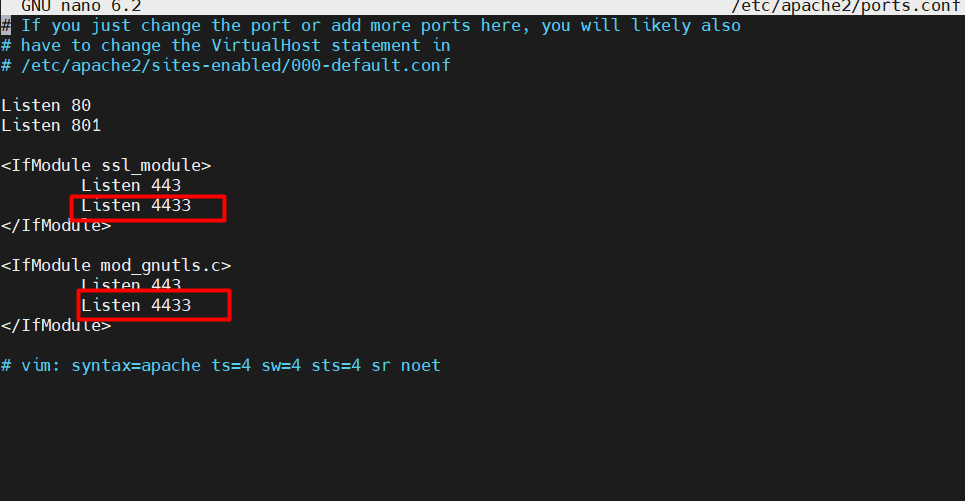
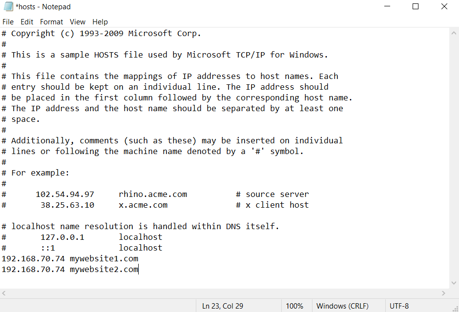
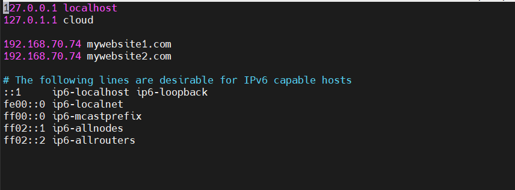
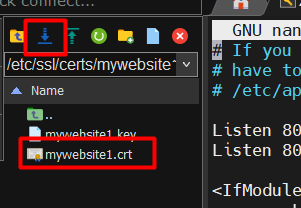
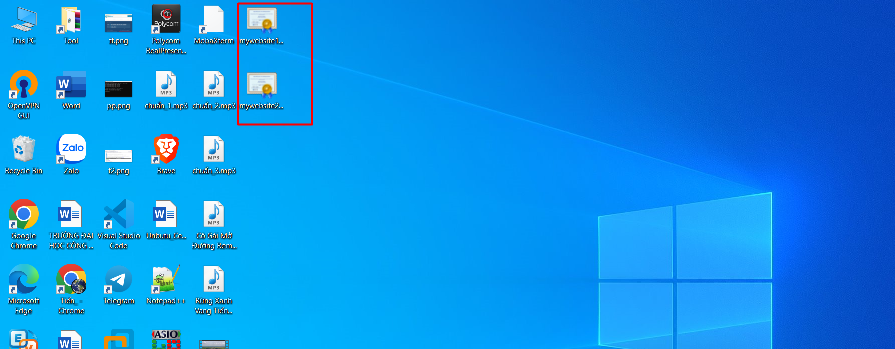
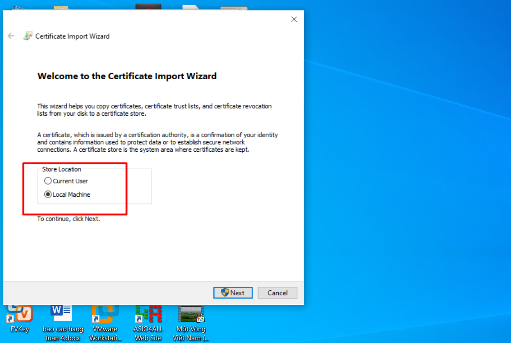
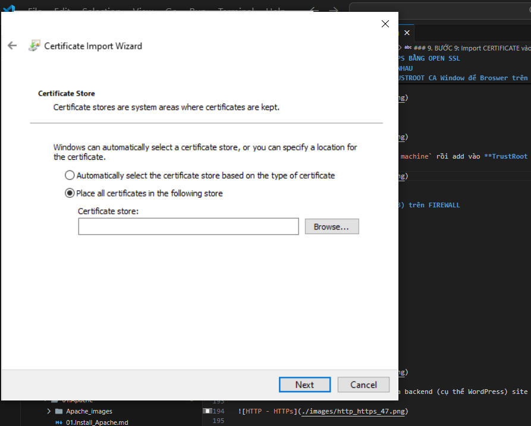
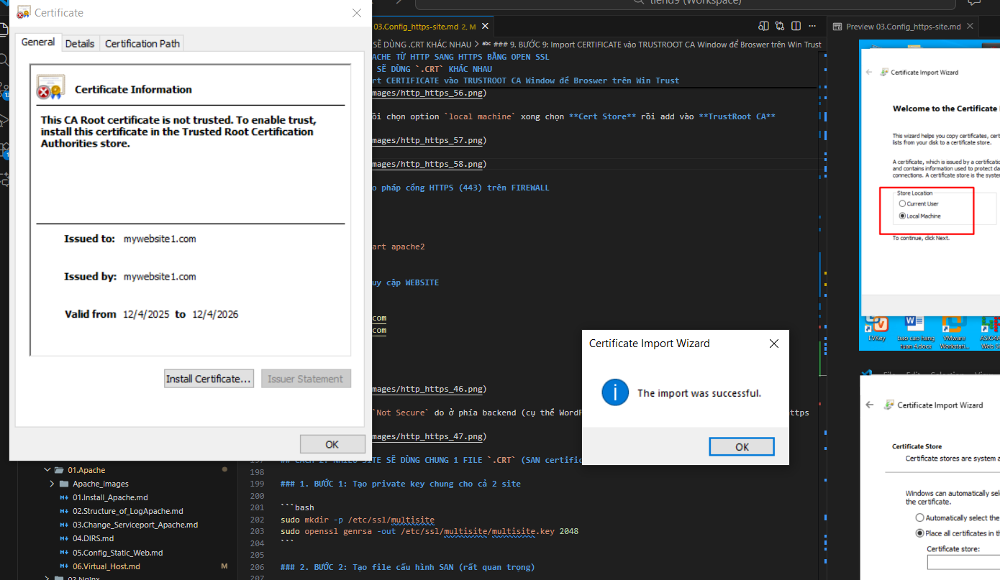
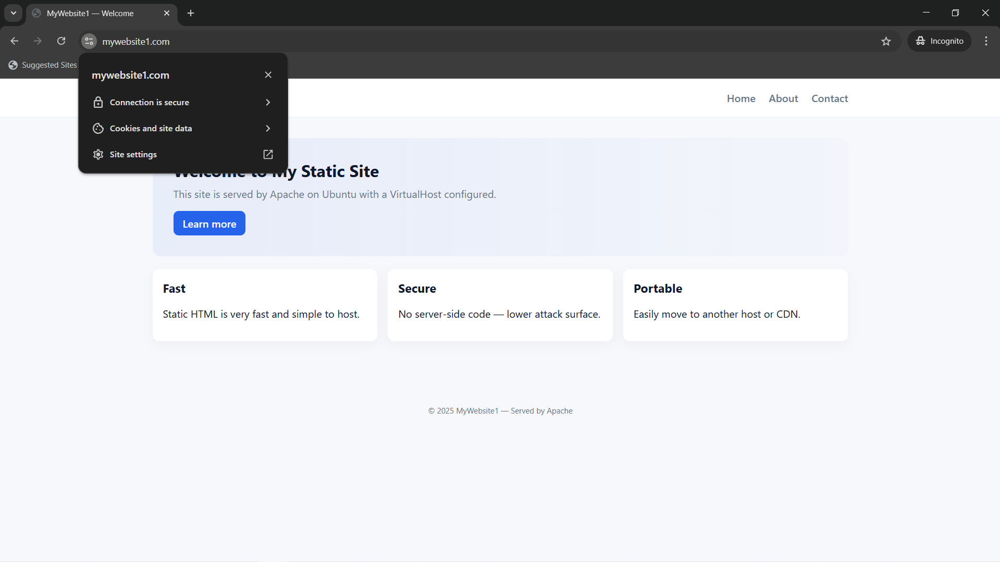
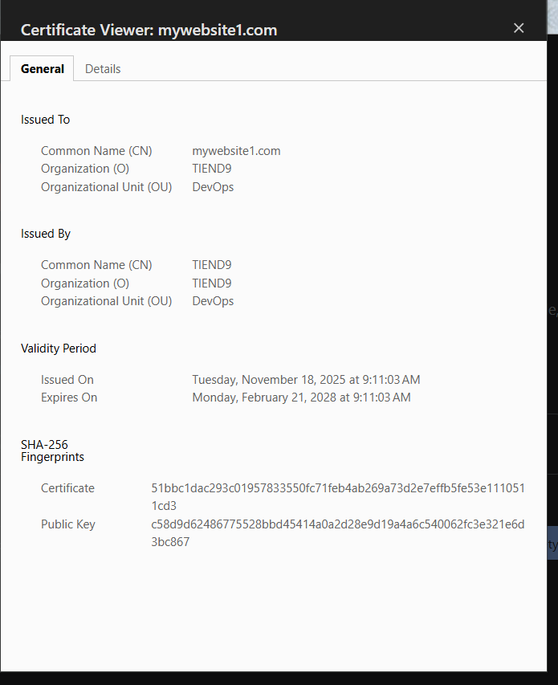

# CHUYỂN WEBSITE APACHE TỪ HTTP SANG HTTPS BẰNG OPEN SSL

Trước đó ta đang có 2 websever `mywebsite1.com` và `mywebsite2.com` chạy trên cổng dịch vụ `80` và cùng 1 địa chỉ IP.

## CÁCH 1: MỖI SITE SẼ DÙNG `.CRT` KHÁC NHAU

### 1. BƯỚC 1: Tạo thư mục chứa CRT cho từng site

**Website 1**:

```bash
sudo mkdir -p /etc/ssl/certs/mywebsite1
```

**Website 2**:

```bash
sudo mkdir -p /etc/ssl/certs/mywebsite2
```

### 2. Bước 2: Tạo Private Key + CRT cho từng website

**Website 1**:

```bash
sudo openssl req -x509 -newkey rsa:2048 -nodes \
 -keyout /etc/ssl/private/mywebsite1.key \
 -out /etc/ssl/certs/mywebsite1/mywebsite1.crt \
 -days 365 \
 -subj "/C=VN/ST=HN/L=Hanoi/O=TIEND9/OU=DevOps/CN=mywebsite1.com" \
 -addext "subjectAltName=DNS:mywebsite1.com"
```

**Website 2**:

```bash
sudo openssl req -x509 -newkey rsa:2048 -nodes \
 -keyout /etc/ssl/private/mywebsite2.key \
 -out /etc/ssl/certs/mywebsite2/mywebsite2.crt \
 -days 365 \
 -subj "/C=VN/ST=HN/L=Hanoi/O=TIEND9/OU=DevOps/CN=mywebsite2.com" \
 -addext "subjectAltName=DNS:mywebsite2.com"
```

**Trong đó**:

- `-x509`: tạo chứng chỉ X.509 (thường dùng cho SSL/TLS).
- `-nodes`: không mã hóa key bằng passphrase (ngăn Apache hỏi passphrase khi khởi động).
- `-days 365`: chứng chỉ có hiệu lực 1 năm.
- `-newkey rsa:2048`: tạo key RSA 2048-bit mới.
- `-keyout` và `-out`: đường dẫn lưu key và certificate.
- `/CN=mywebsite1.com`: Common Name = tên domain của bạn.
- `-addext "subjectAltName=DNS:mywebsite1.com"`: SAN của cert này
- `"\"` dấu này là dấu ngăn cách 1 lệnh (nếu không có phải viết liền cùng 1 dòng và không được có kí tự đằng sau).Nếu cố tình viết xuống dòng thì bash sẽ báo lỗi không tìm thấy lệnh.

**Lưu ý**:

- `domain` khi ta truy cập phải khới với `Common Name` khi ta tạo cert
- Khi gen cert ta bắt buộc phải có SAN, lý do là từ năm 2017 tất cả browser hiện đại(Chrome, Firefox, Edge, Safari) đã không còn dùng CN để kiểm tra hostname của certificate, bắt buộc phải kiểm tra SAN. Điều này nằm trong chuẩn: `RFC 2018`
- Khi ta thêm SAN, ví dụ: `-addext "subjectAltName=DNS:mywebsite1.com"`, lúc này cert chứa `SAN = mywebsite1.com(cái browser thực sự dùng)` Browser kiểm tra SAN:

  ```bash
  Hostname: mywebsite1.com
  SAN list: mywebsite1.com
  ```

  -> `MATCH` -> **Browser Trust**

### 3. BƯỚC 3: Tạo 2 VirtualHosts HTTPS (port 443)

**Website 1**:

```bash
sudo nano /etc/apache2/sites-available/mywebsite1-ssl.conf
```

`/etc/apache2/sites-available/mywebsite1-ssl.conf`

```bash
<VirtualHost *:443>
    ServerName mywebsite1.com
    ServerAlias www.mywebsite1.com
    DocumentRoot /var/www/mywebsite1.com

    SSLEngine on
    SSLCertificateFile /etc/ssl/certs/mywebsite1/mywebsite1.crt
    SSLCertificateKeyFile /etc/ssl//private/mywebsite1.key

    <Directory /var/www/mywebsite1.com>
        AllowOverride All
        Require all granted
    </Directory>

    ErrorLog ${APACHE_LOG_DIR}/mywebsite1-ssl-error.log
    CustomLog ${APACHE_LOG_DIR}/mywebsite1-ssl-access.log combined
</VirtualHost>
```

**Website 2**:

```bash
sudo nano /etc/apache2/sites-available/mywebsite2-ssl.conf
```

`/etc/apache2/sites-available/mywebsite2-ssl.conf`

```bash
<VirtualHost *:4433>
    ServerName mywebsite2.com
    ServerAlias www.mywebsite2.com
    DocumentRoot /var/www/mywebsite2.com

    SSLEngine on
    SSLCertificateFile /etc/ssl/certs/mywebsite2/mywebsite2.crt
    SSLCertificateKeyFile /etc/ssl/private/mywebsite2.key

    <Directory /var/www/mywebsite2.com>
        AllowOverride All
        Require all granted
    </Directory>

    ErrorLog ${APACHE_LOG_DIR}/mywebsite2-ssl-error.log
    CustomLog ${APACHE_LOG_DIR}/mywebsite2-ssl-access.log combined
</VirtualHost>
```

**Lưu ý:** Khi ta cấu hình Https ta cũng phải đỏi cổng như khi ta làm http không ta xài `curl` IP sẽ gây ra Conflict

### 4. BƯỚC 4: Chỉnh cấu hình trong `/etc/apache2/ports.conf`

- Ta chỉnh cổng lắng nghe trong con Ubuntu:



### 5. BƯỚC 5: Sửa file Hosts trên máy Window và trên con Ubuntu

**Trên Window(Clients)** :

- Vào NotePad chạy quyền `administrator` add 2 dòng này xuống cuối cùng.



**Trên Ubuntu(Sever)** :

- Truy cập /etc/host add 2 dòng này vào



### 6. BƯỚC 6: Import CERTIFICATE vào TRUSTROOT CA Ubuntu để tránh cảnh báo

**Ubuntu client**:

```bash
sudo cp /etc/ssl/certs/mywebsite1/mywebsite1.crt /usr/local/share/ca-certificates/
sudo update-ca-certificates
sudo cp /etc/ssl/certs/mywebsite2/mywebsite2.crt /usr/local/share/ca-certificates/
sudo update-ca-certificates
```

**Lưu ý**: Đây là bước ta add file `.crt` và TrustRoot CA trên con máy ảo Ubuntu

### 7. BƯỚC 7: Bật cả 2 Site HTTPS

```bash
sudo a2ensite mywebsite1-ssl.conf
sudo a2ensite mywebsite2-ssl.conf
```

**Kiểm tra lại**:

```bash
sudo apache2ctl configtest
```

### 8. BƯỚC 8: Import CERTIFICATE vào TRUSTROOT CA Window để Broswer trên Win Trust

- Có thể dùng `mmc` để add certs
- Giả sử **máy local** chúng ta đang config con Unbuntu nhưng ta sẽ không thể truy cập vào website trên con Ubuntu nếu **máy của ta (con Window)** chưa **add file `.crt`** của con Ubuntu vào **TRUSTROOT CA**.

- Từ MobaXterm ta tải file `.crt` của 2 website về máy



- Double - Click vào file `.crt`



- Vào InstallCert rồi chọn option `local machine` xong chọn **Cert Store** rồi add vào **TrustRoot CA**







### 9. BƯỚC 9: Cho pháp cổng HTTPS (443) trên FIREWALL hoặc add rule trên VPN

```bash
sudo ufw enable
sudo ufw allow 443
sudo systemctl restart apache2
```

### 10. BƯỚC 10: Active Module SSL and Install OpenSSL

```bash
sudo a2enmod ssl
sudo systemctl restart apache2
```

### 11. BƯỚC 11: Truy cập WEBSITE có thể dùng Tab ẩn danh truy cập dể không xoá cache

```ruby
https://mywebsite1.com
https://mywebsite2.com
```

### 12. KẾT QUẢ



-Trang web vẫn hiện `Not Secure` do ở phía backend (cụ thể WordPress) site URL vẫn để là http thay vì của https



- Từ giờ 1 ai đó trong dải mạng `192.168.70.74` muốn truy cập trang web của mình cấu hình thì chỉ cần chỉnh file /etc/hosts trong máy và đưa cert web site đó vào Trustroot CA trong máy tính của mình là có thể truy cập được

## CÁCH 2: NHIỀU SITE SẼ DÙNG CHUNG 1 FILE `.CRT` (SAN certificate)

### 1. BƯỚC 1: Tạo private key chung cho cả 2 site

```bash
sudo mkdir -p /etc/ssl/multisite
sudo openssl genrsa -out /etc/ssl/multisite/multisite.key 2048
```

### 2. BƯỚC 2: Tạo file cấu hình SAN (rất quan trọng)

**Tạo file**:

```bash
sudo nano /etc/ssl/multisite/san.cnf
```

**Dán vào**:

```bash
[ req ]
default_bits       = 2048
prompt             = no
default_md         = sha256
req_extensions     = req_ext
distinguished_name = dn

[ dn ]
C  = VN
ST = HN
L  = Hanoi
O  = TIEND9
OU = DevOps
CN = mywebsite1.com

[ req_ext ]
subjectAltName = @alt_names

[ alt_names ]
DNS.1 = mywebsite1.com
DNS.2 = www.mywebsite1.com
DNS.3 = mywebsite2.com
DNS.4 = www.mywebsite2.com
```

=> File này tạo 1 cert chung chứa cả 2 domain.

### 3. BƯỚC 3: Tạo CSR từ key + SAN config

```bash
sudo openssl req -new -key /etc/ssl/multisite/multisite.key \
 -out /etc/ssl/multisite/multisite.csr \
 -config /etc/ssl/multisite/san.cnf
```

### 4. BƯỚC 4: CA ký MULTI-DOMAIN CERT

Giả sử mày đã có CA rồi (`myCA.key` + `myCA.crt`)

```bash
sudo openssl x509 -req \
 -in /etc/ssl/multisite/multisite.csr \
 -CA /etc/ssl/myCA/myCA.crt \
 -CAkey /etc/ssl/myCA/myCA.key \
 -CAcreateserial \
 -out /etc/ssl/multisite/multisite.crt \
 -days 365 \
 -sha256 \
 -extfile /etc/ssl/multisite/san.cnf \
 -extensions req_ext
```

**Kết quả**:

- `multisite.key` (key dùng chung)
- `multisite.crt` (cert chứa cả 2 domain)

=>Bây giờ mày có 1 cert dùng cho 2 site.

### 5. BƯỚC 5: Apache cho cả 2 website dùng chung 1 cert

**Website 1**: (port 443)

```bash
<VirtualHost *:443>
    ServerName mywebsite1.com
    DocumentRoot /var/www/mywebsite1.com

    SSLEngine on
    SSLCertificateFile /etc/ssl/multisite/multisite.crt
    SSLCertificateKeyFile /etc/ssl/multisite/multisite.key
</VirtualHost>
```

**Website 2**: (port 443)

```bash
<VirtualHost *:443>
    ServerName mywebsite2.com
    DocumentRoot /var/www/mywebsite2.com

    SSLEngine on
    SSLCertificateFile /etc/ssl/multisite/multisite.crt
    SSLCertificateKeyFile /etc/ssl/multisite/multisite.key
</VirtualHost>
```

=> Cả 2 website dùng chung cert & key

**Quan trọng**:

- Browser sẽ không lỗi nếu:

  - cert chứa SAN của 2 domain
  - client đã import myCA.crt (CA duy nhất)
  