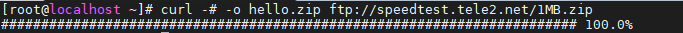
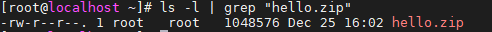
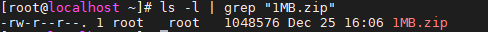
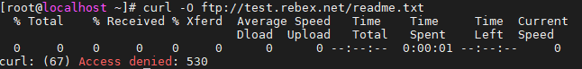
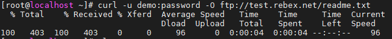
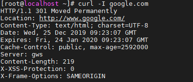
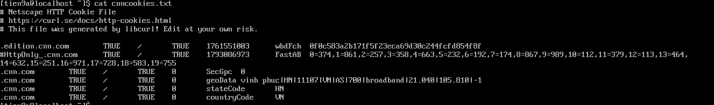
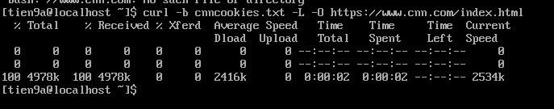
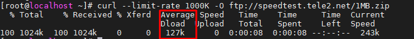

# Lệnh `curl`

## I. Khái niệm

Lệnh `curl` là một công cụ dòng lệnh để truyền dữ liệu đi hoặc từ một máy chủ, sử dụng cho bất kì giao thức nào được hỗ trợ (HTTP, FTP, IMAP, POP3, SCP, SFTP, SMTP, TFTP, TELNET, LDAP hoặc FILE). `curl` được cung cấp bởi Libcurl.

Lệnh này được ưa chuộng để tự động hóa, vì nó được thiết kế để hoạt động mà không có sự tương tác của người dùng. `curl` có thể vận chuyển nhiều tập tin cùng lúc.

## II. Cú pháp

```ruby
curl [options] [URL...]
```

## III. Cài đặt

Trên CentOS:

```ruby
# yum install curl
```

Trên Debian/Unbuntu:

```ruby
sudo apt-get install curl
```

## IV. Ví dụ và các option

### 1. Hiển thị nội dung của URL trên màn hình

`# curl [url]`

```ruby
[root@localhost ~]# curl google.com

<HTML><HEAD><meta http-equiv="content-type" content="text/html;charset=utf-8">
<TITLE>301 Moved</TITLE></HEAD><BODY>
<H1>301 Moved</H1>
The document has moved
<A HREF="http://www.google.com/">here</A>.
</BODY></HTML>
```

Có thể tải nhiều nhiều trang tương tự nhau:

```ruby
curl http://site.{one, two, three}.com
```

Các trang với chuỗi số:

```ruby
curl ftp://ftp.example.com/file[1-20].jpeg
```

### 2. Đồng hồ đo tiến độ (Process Meter)

Nếu bạn muốn theo dõi quá trình tải file như tốc độ truyền, lượng dữ liệu được truyền, thời gian còn lại, ... Ta thêm option `-#`.

Ví dụ:

```ruby
curl -# -o hello.zip ftp://speedtest.tele2.net/1MB.zip
```



### 3. Lưu file tải về với tên tùy chọn

`curl -o [file_name] [url]`

```ruby
# curl -o hello.zip ftp://speedtest.tele2.net/1MB.zip
```



### 4. Tải file với tên giống trên URL

`curl -O [url]`

```ruby
[root@localhost ~]# curl -O ftp://speedtest.tele2.net/1MB.zip
```



Tải xuống nhiều tệp:

```ruby
# curl -O [url_1] -O [url_2] ...
```

### 5. Tiếp tục tải xuống các file bị gián đoạn

`curl -C - [url]`

```ruby
curl -C - -O ftp://speedtest.tele2.net/1MB.zip
```

### 6. Tải file có yêu cầu xác thực từ FTP Server

`# curl -u {username}:{password} [FTP_URL]`

Ví dụ: Tải file có xác thực theo cách thông thường sẽ bị lỗi

```ruby
[root@localhost ~]# curl -O ftp://test.rebex.net/readme.txt
```



Sử dụng option `-u` và nhập username và password thì quá trình tải xuống không có lỗi.

```ruby
# curl -u demo:password -O ftp://test.rebex.net/readme.txt
```



=> Đây là một server FTP công khai của Rebex, dùng để test kết nối FTP, FTPS, SFTP.
Mục tiêu: giúp kỹ sư mạng, DevOps, system engineer thử các lệnh FTP/SFTP mà không cần dựng server thật.

**Cấu trúc đăng nhập mặc định:**

| **Thông tin** | **Giá trị** |
|----------------|--------------|
| **Server** | `test.rebex.net` |
| **Protocol** | `FTP` hoặc `SFTP` |
| **Port** | `21 (FTP)`, `22 (SFTP)` |
| **User** | `demo` |
| **Password** | `password` |

### 7. Truy vấn HTTP Header

`curl -I [URL]`

Ví dụ:



### 8. Lưu trữ 1 cookie

`# curl -c [tên_file_cookie] [url] -O`

`-c` = `--cookie`

Ví dụ

```ruby
# curl -c cnncookies.txt -L https://www.cnn.com/index.html -O
```

Nó đang thực hiện 3 hành động chính cùng lúc, cụ thể từng phần như sau:

0. `curl`: Là công cụ dòng lệnh dùng để gửi HTTP request — tải file, gửi API, đăng nhập, v.v.
1. `-c cnncookies.txt`: lưu tất cả cookie mà server trả về (qua header Set-Cookie) vào file cnncookies.txt theo định dạng Netscape. File này có thể dùng lại ở request sau bằng `-b cnncookies.txt`.
2. `-L`: Cho phép `curl` theo dõi các redirect (HTTP 3xx). CNN gần như luôn redirect từ `http://` → `https://`, hoặc sang trang consent/region.Nếu không có `-L`, `curl` sẽ dừng lại ở dòng thông báo “Redirecting…”.
3. `-O`:Dùng để lưu file với đúng tên gốc trên server. Ở đây, <https://www.cnn.com/index.html> → curl sẽ lưu file index.html về thư mục hiện tại.

=>Lệnh này đang: Gửi yêu cầu GET tới <https://www.cnn.com/index.html>, tự động theo redirect, tải file HTML về (giữ nguyên tên `index.html`), và lưu cookie mà server trả về vào file `cnncookies.txt`.Ta có thể check file `cnncookies.txt` trả về

```ruby
cat cnncookies.txt
```



### 9. Gửi cookies

Nếu trước đó ta đã dùng `-c cnncookies.txt` để lưu cookie, dùng `-b` để gửi lại:

```ruby
curl -b cnncookies.txt -L -O https://www.cnn.com/index.html
```

`-b cnncookies.txt` sẽ đọc file cookie theo định dạng Netscape và gửi các cookie phù hợp với domain.

`# curl -c [tên_file_cookie] [url]`



### 10. Giới hạn download

`curl --limit-rate [value] [URL]`

Tốc độ download sẽ được giữ xung quanh giới hạn ta đặt.

`value` : đơn vị là bytes.

Ví dụ:

```ruby
curl --limit-rate 1000K -O ftp://speedtest.tele2.net/1MB.zip
```



### 11. Mô phỏng các Method HTTP

Cú pháp:

```ruby
# curl -X [Method] [URL] -H "<Content_Type_Header>" -d "<data>"
```

**Trong đó**:

- `-X [Method]`: Khai báo method sử dụng `GET`, `POST`, `DELETE`, `PUT`
- `-H "<Content_Type_Header>"`: Header với kiểu nội dung của nó

  - `-H "Content-Type`: application/x-www-form-urlencoded" : Data dạng không mã hóa
  - `-H "Content-Type`: application/json": Data dạng Json

- `[URL]` : url trang web
- -`d <data>` : dữ liệu kèm Method. Có thể dùng string hoặc file.

  - Dạng không mã hóa: `-d "param1=value1&param2=value2"` hoặc `-d @data.txt`
  - Dạng Json: `-d '{"key1":"value1", "key2":"value2"}`' hoặc `-d @data.json`

**Ví dụ**: POST với data là username và password lên 1 trang đăng nhập của 1 web:

- POST dạng không mã hóa:

```ruby
# curl -X POST http://localhost:3000/data -d "param1=value1&param2=value2" 
```

hoặc có Header:

```ruby
# curl -X POST http://localhost:3000/data -H "Content-Type: application/x-www-form-urlencoded" -d "param1=value1&param2=value2"  
```

Với file:

```ruby
# curl -X POST http://localhost:3000/data -d "@data.txt" 
```

- POST dạng Json

```ruby
# curl -X POST http://localhost:3000/data -H "Content-Type: application/json" -d '{"key1":"value1", "key2":"value2"}' 
```

Với file:

```ruby
# curl -X POST http://localhost:3000/data -d "@data.json" 
```

File `data.txt`

```ruby
param1=value1&param2=value2
```

File `data.json`

```json
{
  "key1":"value1",
  "key2":"value2"
}
```

## V. TỔNG QUAN CÁC LỆNH CẦN NẮM RÕ

### 1. Cơ bản & HTTP

| Mục đích | Lệnh | Giải thích |
|-----------|------|-------------|
| Lấy header phản hồi | `curl -I https://example.com` | Kiểm tra HTTP status, header của server |
| Xem chi tiết request/response | `curl -v https://example.com` | Hiển thị quá trình kết nối, SSL, header… |
| Gửi request GET | `curl https://api.github.com/users/tiend9` | Lấy dữ liệu từ API |
| Gửi request POST | `curl -X POST -H "Content-Type: application/json" -d '{"a":1}' https://api.example.com/data` | Gửi JSON body tới API |
| Gửi PUT/PATCH | `curl -X PUT -H "Content-Type: application/json" -d '{"a":2}' https://api.example.com/data/1` | Cập nhật dữ liệu |
| Gửi DELETE | `curl -X DELETE https://api.example.com/data/1` | Xóa dữ liệu trên API |
| Lưu kết quả ra file | `curl -o result.json https://api.example.com/data` | Ghi output vào file |
| Lấy mã trạng thái HTTP | `curl -o /dev/null -s -w "%{http_code}\n" https://example.com` | Chỉ in ra mã 200, 404, 500… |
| Gửi kèm token auth | `curl -H "Authorization: Bearer $TOKEN" https://api.example.com/me` | Xác thực với API có bảo mật |
| Upload file | `curl -X POST -F "file=@/path/file.log" https://example.com/upload` | Gửi file lên server |

---

### 2. Dành cho Cloud / System Engineer

| Mục đích | Lệnh | Giải thích |
|-----------|------|-------------|
| Kiểm tra DNS / IP cụ thể | `curl --resolve myapp.local:80:10.0.0.15 http://myapp.local` | Giả lập DNS để test routing hoặc load balancer |
| Kiểm tra service nội bộ | `curl http://localhost:8080/healthz` | Check health endpoint trong container/pod |
| Kiểm tra chứng chỉ SSL | `curl -vI https://example.com` | Hiển thị thông tin chứng chỉ HTTPS |
| Kiểm tra tốc độ tải | `curl -o /dev/null -s -w "Total: %{time_total}s\n" https://example.com` | Đo thời gian phản hồi server |
| Test API cloud | `curl "https://ec2.amazonaws.com/?Action=DescribeInstances&Version=2016-11-15"` | Gửi request trực tiếp đến AWS API |
| Test qua proxy | `curl -x http://proxy.company.com:8080 https://example.com` | Gửi request qua proxy nội bộ |
| Bỏ qua xác thực SSL | `curl -k https://localhost:8443` | Test local HTTPS (không cần cert hợp lệ) |
| Ghi log request ra file | `curl -v https://example.com 2> curl.log` | Debug chi tiết request |

### 3. Các tùy chọn hữu ích

| Tùy chọn | Tác dụng |
|-----------|----------|
| `-X` | Chỉ định phương thức (GET, POST, PUT, DELETE…) |
| `-H` | Thêm header tùy chỉnh |
| `-d` | Gửi dữ liệu trong body |
| `-F` | Gửi dữ liệu dạng form/file |
| `-o` | Ghi output ra file |
| `-s` | Chế độ im lặng (không in ra terminal) |
| `-v` | Hiển thị chi tiết (verbose) |
| `-k` | Bỏ qua SSL verify |
| `--resolve` | Ghi đè DNS mapping |
| `-w` | In thông tin tùy chỉnh sau khi tải (status, time, size…) |

### 4.  Mẹo thêm

- Dùng `curl --help` để xem danh sách đầy đủ tùy chọn.
- Dùng `curl -V` để xem phiên bản và module hỗ trợ (như OpenSSL, libz...).
- Có thể combine nhiều flag, ví dụ:

```ruby
  curl -sk -H "Authorization: Bearer $TOKEN" https://myapi.local/healthz
```

### 5. So sánh lệnh `curl` giữa Ubuntu và CentOS

| Mục so sánh | Ubuntu (Debian-based) | CentOS (RHEL-based) | Ghi chú |
|--------------|------------------------|----------------------|----------|
| **Cài đặt curl** | `sudo apt install curl -y` | `sudo dnf install curl -y` *(hoặc `yum` với bản cũ)* | Cả hai dùng gói `curl` giống nhau |
| **Vị trí binary** | `/usr/bin/curl` | `/usr/bin/curl` | Giống nhau |
| **Phiên bản mặc định** | Thường mới hơn (vì Ubuntu cập nhật nhanh hơn) | Thường cũ hơn một chút | Có thể ảnh hưởng đến TLS/SSL version hoặc flag mới |
| **Thư viện SSL mặc định** | OpenSSL | NSS hoặc OpenSSL (tùy bản) | Có thể khác về thông báo lỗi SSL |
| **Cách dùng lệnh cơ bản** | Giống hệt (`curl -v -I https://example.com`) | Giống hệt | 100% tương thích |
| **Proxy / Network config** | Dùng `http_proxy`, `https_proxy` env var | Giống hệt | Không khác |
| **Xử lý chứng chỉ nội bộ (self-signed)** | `curl -k https://localhost` | Giống hệt | Không khác |
| **Tích hợp với `ca-certificates`** | `sudo apt install ca-certificates` | `sudo dnf install ca-certificates` | Cần thiết nếu gặp lỗi SSL |
| **File cấu hình người dùng** | `~/.curlrc` | `~/.curlrc` | Giống nhau |
| **Kiểm tra phiên bản** | `curl --version` | `curl --version` | Giống nhau hoàn toàn |
| **Debug mạng nội bộ / DNS test** | Giống nhau (`--resolve`, `-v`, `-w`) | Giống nhau | Không khác |
