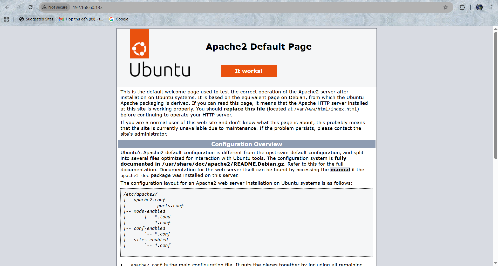
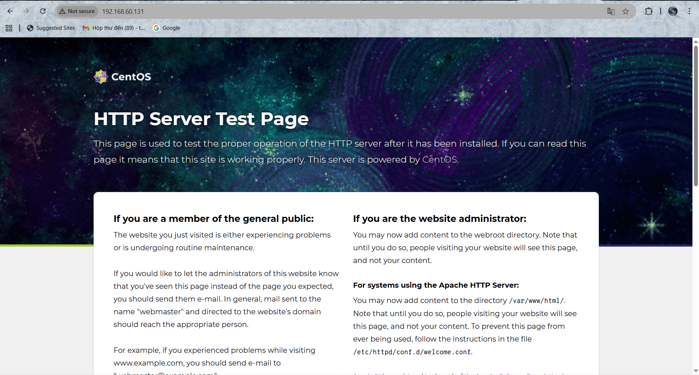

# INSTALL APACHE ON UBUNTU AND CENTOS

## I. TRÊN UBUNTU

### 1. BẢNG 1 — Các bước cài đặt & Quản lý Apache2 trên Ubuntu

|  **Bước** |  **Lệnh** |  **Mục đích / Giải thích** |
|-------------|-------------|-------------------------------|
|  **1. Cập nhật hệ thống** | `sudo apt update && sudo apt upgrade -y` | Cập nhật danh sách gói và cài đặt bản vá bảo mật mới nhất. |
|  **2. Cài đặt Apache2** | `sudo apt install apache2 -y` | Cài web server Apache (phiên bản 2.x). |
|  **3. Kiểm tra trạng thái dịch vụ** | `sudo systemctl status apache2` | Kiểm tra Apache đang chạy hay không (**active (running)** là OK). |
|  **Khởi động thủ công (nếu chưa chạy)** | `sudo systemctl start apache2` | Bật dịch vụ Apache. |
|  **4. Cho phép khởi động cùng hệ thống** | `sudo systemctl enable apache2` | Cho phép Apache tự khởi động khi bật máy. |
|  **5. Mở port trên firewall (UFW)** | `sudo ufw allow 'Apache Full'` \|\| `sudo ufw reload`(Mở 2 cổng)`sudo ufw allow 80/tcp`(Mở cổng 80 thui nếu chưa mở https) | Mở cổng **80 (HTTP)** và **443 (HTTPS)**. |
|  **6. Kiểm tra web server** | Truy cập `http://localhost/` hoặc `http://<IP_ubuntu>/` | Nếu thấy trang “Apache2 Ubuntu Default Page” → thành công |
|  **7. Các file & thư mục quan trọng** |  |  |
| ├─ **Web root** | `/var/www/html/` | Chứa file web (index.html, site...). |
| ├─ **File cấu hình chính** | `/etc/apache2/apache2.conf` | Cấu hình toàn hệ thống Apache. |
| ├─ **Virtual Host mặc định** | `/etc/apache2/sites-available/000-default.conf` | Chỉnh port, document root, log... |
| ├─ **Log truy cập** | `/var/log/apache2/access.log` | Nhật ký truy cập. |
| └─ **Log lỗi** | `/var/log/apache2/error.log` | Nhật ký lỗi hệ thống. |
|  **8. Nạp lại cấu hình** | `sudo systemctl reload apache2` | Nạp lại cấu hình mà không dừng dịch vụ. |
|  **9. Khởi động lại dịch vụ** | `sudo systemctl restart apache2` | Restart hoàn toàn Apache. |
|  **10. Kiểm tra phiên bản** | `apache2 -v` | Xem phiên bản hiện tại *(VD: Apache/2.4.57 (Ubuntu))*. |

### 2. BẢNG 2 —Các bước gỡ bỏ & Reset Apache2 về mặc định

|  **Tác vụ** |  **Lệnh** |  **Giải thích** |
|----------------|-------------|-------------------|
|  **Gỡ cài đặt Apache2** | `sudo apt remove apache2 -y` | Gỡ phần mềm Apache2 nhưng **giữ lại file cấu hình**. |
|  **Gỡ hoàn toàn (kèm cấu hình)** | `sudo apt purge apache2 -y` | Xóa sạch Apache2 và toàn bộ file cấu hình. |
|  **Dọn dẹp gói không cần thiết** | `sudo apt autoremove -y` | Loại bỏ các gói phụ thuộc còn sót lại. |
|  **Xóa thư mục cấu hình còn lại** | `sudo rm -rf /etc/apache2` | Dọn sạch thư mục cấu hình thủ công. |
|  **Cài đặt lại mới hoàn toàn** | `sudo apt install apache2 -y` | Cài lại Apache từ đầu (fresh setup). |
|  **Kiểm tra sau khi cài lại** | `sudo systemctl status apache2` | Đảm bảo dịch vụ chạy bình thường. |

### 3. Mẹo

**Mẹo:** Sau khi thay đổi cấu hình, có thể dùng  
> `sudo systemctl reload apache2` để **nạp lại cấu hình mà không ngắt dịch vụ**,  
> hoặc `sudo systemctl restart apache2` để **khởi động lại hoàn toàn**.



## II. TRÊN CENTOS

### 1. Bảng 1 - Các bước cài đặt và quản lí Apache2 trên CentOS

| **Bước** | **Lệnh / Thao tác** | **Giải thích** |
|-----------|---------------------|----------------|
| **1. Cập nhật hệ thống** | `sudo yum update -y` | Cập nhật danh sách gói và bản vá mới nhất. |
| **2. Cài đặt Apache (httpd)** | `sudo yum install httpd -y` | Gói `httpd` là Apache Web Server trên CentOS/RHEL. |
| **3. Khởi động dịch vụ** | `sudo systemctl start httpd` and `sudo systemctl status httpd` | Bắt đầu chạy Apache và kiểm tra trạng thái hoạt động. |
| **4. Kích hoạt tự động khởi động cùng hệ thống** | `sudo systemctl enable httpd` | Đảm bảo Apache tự chạy khi khởi động lại máy. |
| **5. Mở cổng tường lửa** | `sudo firewall-cmd --permanent --add-service=http` and `sudo firewall-cmd --permanent --add-service=https` and `sudo firewall-cmd --reload` | Cho phép truy cập HTTP (80) và HTTPS (443). |
| **6. Kiểm tra hoạt động** | Truy cập: `http://localhost`hoặc `http://<IP_CentOS>` | Nếu thấy trang **Apache Test Page**, nghĩa là cài thành công. |
| **7. Thư mục & file cấu hình** | `/var/www/html` and `/etc/httpd/conf/httpd.conf` and `/var/log/httpd/access_log` and `/var/log/httpd/error_log` | Thư mục web chính, file cấu hình và log. |
| **8. Kiểm tra & khởi động lại** | `sudo apachectl configtest` and `sudo systemctl restart httpd` | Kiểm tra cấu hình và khởi động lại dịch vụ nếu cần. |

**Kiểm tra nhanh:**

```ruby
curl http://localhost
```

### 2. Bảng 2 - Gỡ bỏ & Reset Apache (httpd) về mặc định trên CentOS

| **Bước** | **Lệnh / Thao tác** | **Giải thích** |
|-----------|---------------------|----------------|
| **1. Dừng dịch vụ Apache** | `sudo systemctl stop httpd` | Dừng dịch vụ web server đang chạy. |
| **2. Vô hiệu hóa khởi động tự động** | `sudo systemctl disable httpd` | Ngăn Apache tự động khởi động cùng hệ thống. |
| **3. Gỡ gói cài đặt Apache** | `sudo yum remove httpd httpd-tools -y` | Gỡ bỏ toàn bộ gói httpd và công cụ liên quan. |
| **4. Xóa thư mục cấu hình còn sót lại** | `sudo rm -rf /etc/httpd` | Xóa cấu hình chính của Apache. |
| **5. Xóa thư mục web và log** | `sudo rm -rf /var/www /var/log/httpd /var/run/httpd` | Dọn sạch nội dung web và file log của Apache. |
| **6. Kiểm tra xem Apache đã bị xóa chưa** | `rpm -qa \| grep httpd` | Nếu không có kết quả, nghĩa là Apache đã bị gỡ bỏ hoàn toàn. |
| **7. (Tùy chọn) Làm sạch cache của yum** | `sudo yum clean all` | Xóa cache các gói đã tải. |
| **8. Cài lại Apache về mặc định (nếu muốn)** | `sudo yum install httpd -y` | Cài lại phiên bản Apache gốc mới, không còn cấu hình cũ. |
| **9. Khởi động lại dịch vụ sau khi cài lại** | `sudo systemctl start httpd` and `sudo systemctl enable httpd` | Khởi động và bật tự động Apache mới. |

**Kiểm tra lại sau khi reset:**

```ruby
httpd -v
systemctl status httpd
```

### 3. Lưu ý

Sau khi gỡ bỏ, toàn bộ cấu hình tùy chỉnh và website sẽ bị xóa vĩnh viễn.

Nếu chỉ muốn reset cấu hình mà không gỡ, chỉ cần:

```ruby
sudo rm -rf /etc/httpd/conf.d/*
sudo cp /etc/httpd/conf/httpd.conf.rpmnew /etc/httpd/conf/httpd.conf
```

rồi restart lại:

```ruby
sudo systemctl restart httpd
```

