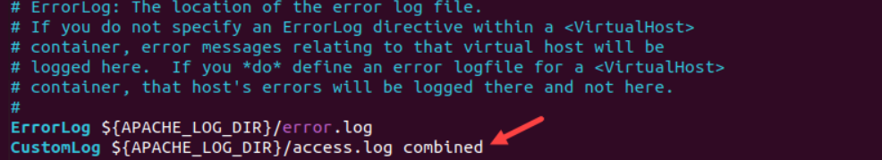

# TÌM HIỂU FILE LOG APACHE

## I. APACHE LOG LÀ GÌ ?

**Nhật ký Apache** (Log apache) ghi lại các sự kiện được xử lý bởi máy chủ web Apache, bao gồm các yêu cầu từ các máy tính khác, phản hồi do Apache gửi và các hành động nội bộ của máy chủ Apache.

Quản trị viên máy chủ, nhà phát triển và nhà phân tích sử dụng các nhật ký này để chẩn đoán sự cố, giám sát bảo mật và phân tích các mẫu lưu lượng truy cập trên máy chủ web. Dưới đây là tổng quan chi tiết về từng loại nhật ký.

Nhật ký Apache được chia thành hai loại chính:

- **Nhật ký truy cập** - Access Log
- **Nhật ký lỗi** - Error log

## II. CÁC LOẠI APACHE LOG

| Nhóm                      | Loại log                | Mục tiêu                                       |
| ------------------------- | ----------------------- | ---------------------------------------------- |
| **Lõi hệ thống**       | Error Log               | Theo dõi lỗi `403`,`404`,`500`                    |
| **Lưu lượng**          | Access Log              | Theo dõi request                                  |
| **Tùy chỉnh**           | Custom Log              | Ghi theo format riêng                            |
| **Phụ trợ / nâng cao** | Forensic, LogIO, Syslog | Debug chuyên sâu, bảo mật, phân tích hiệu năng    |

### 1. ACCESS LOG

**Nhật ký truy cập**: (Access log)cung cấp thông tin chi tiết về người gửi yêu cầu đến máy chủ và dữ liệu họ yêu cầu. Mỗi nhật ký yêu cầu chứa các thông tin chi tiết, chẳng hạn như địa chỉ IP của máy khách , dấu thời gian, URL được yêu cầu , mã phản hồi HTTP và kích thước nội dung phản hồi.

**Công dụng chính**:

- Phân tích lưu lượng truy cập trang web.
- Phát hiện các mối đe dọa bảo mật tiềm ẩn và tối ưu hóa hiệu suất máy chủ web.
- Đưa ra các quyết định quan trọng liên quan đến bảo mật và tối ưu hóa máy chủ.

**Vị trí File Log** : Vị trí file Log nằm ở vị trí khác nhau với mỗi Distro Linux khác nhau

- Dối với Ubuntu và Debian: `/var/log/apache2/access.log`


- Đối với CentOS và RHEL: `/var/log/httpd/access_log`(Đối với CentOS7/8) và `/journalctl -u httpd`(Đối với CentOS9)


**Ví dụ về cấu trúc của 1 Access Log**:


- `192.168.60.1`: là địa chỉ IP máy khách
- `- -`: Trình giữ chỗ cho người dùng từ xa và đã được xác thực , nếu có. Mục nhập ví dụ không có thông tin cụ thể và các dấu gạch ngang là trình giữ chỗ.
- `[28/Oct/2025:03:23:20 +0000]`: Dấu thời gian yêu cầu có ngày, giờ và múi giờ chính xác.
- `"GET / HTTP/1.1"`: Phương thức yêu cầu ( GET), URL ( /) và phiên bản giao thức HTTP ( HTTP/1.1).
- `200`: Mã trạng thái HTTP mà máy chủ trả về. Mục nhập ví dụ hiển thị 200, cho biết yêu cầu đã thành công.
- `3460`: Kích thước phản hồi tính bằng byte . Giá trị ví dụ cho thấy máy chủ đã gửi 3460 byte trở lại máy khách. - `-`: Trường giới thiệu chứa trang web hướng khách hàng đến URL được yêu cầu. Giá trị ví dụ không khả dụng.
- `Mozilla/5.0 (Window NT 10.0; Win64; x64) AppleWebKit/537`: Chuỗi tác nhân người dùng được gửi từ trình duyệt web của máy khách . Chuỗi này chứa phiên bản trình duyệt và hệ điều hành ( Window).

### 2. ERROR LOG

**Nhật kí lỗi**:Nhật ký lỗi Apache chứa các báo cáo lỗi nghiêm trọng mà máy chủ gặp phải. Nhật ký ghi lại nhiều loại lỗi và chi tiết khác nhau, chẳng hạn như dữ liệu kết nối SSL/TLS , thay đổi trạng thái máy chủ, lỗi nội bộ hoặc lỗi máy khách, v.v.

**Công dụng chính**: là để khắc phục sự cố và theo dõi các vấn đề của máy chủ. Những nhật ký này là một tài sản quan trọng khi máy chủ gặp lỗi. Quản trị viên máy chủ sử dụng những nhật ký này để xác định và giải quyết sự cố nhanh chóng, đồng thời đảm bảo thời gian ngừng hoạt động tối thiểu.

**Ví trí File Log**: Vị trí file Log nằm ở vị trí khác nhau với mỗi Distro Linux khác nhau

- Đối với Ubuntu và Debian: `/var/log/apache2/error.log`


- Đối với CentOS và RHEL:`/var/log/httpd/error_log`(Đối với CentOS7/8) và `/journalctl -u httpd`(Đối với CentOS9)


**Ví dụ về cấu trúc của 1 Error Log**:

```ruby
[Fri Feb 09 15:35:24.252107 2024] [core:notice] [pid 6672:tid 139657266624384] AH00094: Command line: '/usr/sbin/apache2'
```

- `[Fri Feb 09 15:35:24.252107 2024]`: Dấu thời gian khi bản ghi được thêm vào tệp nhật ký lỗi. Định dạng dấu thời gian là [Weekday Month Day Hour:Minute:Second.Microsecond Year].
- `[core:notice]`: Thành phần tạo ra mục nhập nhật ký ( core) và mức độ nghiêm trọng ( notice).
- `[pid 6672:tid 139657266624384]`: ID tiến trình ( pid 6672) và ID luồng ( tid 139657266624384) liên quan đến mục nhập.
- `AH00094: Command line: '/usr/sbin/apache2'`: Thông báo lỗi (Thông báo ví dụ cho biết Apache đang hiển thị thông tin dòng lệnh)

### 3. CUSTOM LOG

**Custom Log** trong Apache là file log do admin tự định nghĩa nội dung và định dạng, thông qua cặp chỉ thị:

- `LogFormat`: mô tả mẫu (format) log muốn ghi — gồm các biến (placeholders).
- `CustomLog`: chỉ định file đích và format nào sẽ dùng để ghi log.

=> **Nói cách khác:** **Custom Log** cho phép admin toàn quyền quyết định ghi cái gì và ghi ra đâu.

**Lưu ý**: Custom Log có thể cùng bản chất và khái niệm với Access Log, nhưng khác về vị trí file và định dạng nếu bạn tự định nghĩa.

**Công dụng chính**:

- Phân tích hành vi người dùng: Ghi riêng `IP`, `URL`, `User-Agent`
- Theo dõi hiệu suất: Thêm `%D` để xem thời gian xử lý request
- Theo dõi API: Tạo log riêng chỉ cho các route `/api/`
- Tích hợp với `ELK` / `Graylog` / `Loki`: Ghi log JSON để hệ thống đọc dễ hơn
- Ghi cho từng VirtualHost riêng biệt.

**Vị trí File Log**: Vị trí file Log nằm ở vị trí khác nhau với mỗi Distro Linux khác nhau

- Đối với Ubuntu và Debian: `/var/log/apache2/custom_access.log`
- Đối với CentOS 9 và RHEL : `/var/log/httpd/custom_access_log`

#### 3.1 Cách Add, Check Custom Log cho từng Vỉtual Host trên CentOS

**B1 -Hiểu nguyên nhân trước:**

| Tình huống                               | Giải thích                            | Cách xử lý                                         |
| ---------------------------------------- | ------------------------------------- | -------------------------------------------------- |
| File chưa xuất hiện                      | Apache chưa ghi request nào           | Gửi request thật (curl hoặc trình duyệt)           |
| File có trong config nhưng không sinh ra | Có thể do permission hoặc chưa reload | `sudo systemctl restart httpd` và kiểm tra quyền   |
| Không thấy dòng CustomLog                | Chưa khai báo trong file `.conf`      | Thêm thủ công vào `/etc/httpd/conf.d/yourapp.conf` |

- **Trên CentOS**: Để file `Custom Log` sinh ra thì Apache phải xử lí 1 request vào cái websever mà mình gửi thì lúc đó file Custom mới được tạo ra. (khi tra truy cập bằng trình duyệt hoặc xài lệnh `Curl`)
  
- Ví dụ mày có dòng này trong `/etc/httpd/conf/httpd.conf` hoặc `/etc/httpd/conf.d/myapp.conf`:

```ruby
CustomLog "logs/custom_access_log" combined
```

→ Thì Apache chưa tạo file `/var/log/httpd/custom_access_log` ngay. Nó sẽ chỉ tạo file đó khi có request HTTP tới server (ví dụ truy cập bằng trình duyệt hoặc curl).

**B2 - Kiểm tra cấu hình Apache có khai báo CustomLog chưa:**

- Chạy lệnh:

```ruby
grep -R "CustomLog" /etc/httpd/
```

- Nếu ra:

```ruby
/etc/httpd/conf/httpd.conf:CustomLog "logs/access_log" combined
/etc/httpd/conf.d/myapp.conf:CustomLog "logs/custom_access_log" combined
```

→ Nghĩa là Apache đã được cấu hình để ghi log custom.

- Nếu không thấy dòng chứa `custom_access_log`, thì mày chưa khai báo custom log thật.

→ Phải thêm thủ công vào `file .conf`.

**B3 - Cách khai báo custom log đúng trên CentOS 9:**

- Mở file virtual host (ví dụ):

```ruby
sudo vi /etc/httpd/conf.d/myapp.conf
```

- Thêm đoạn:

```ruby
<VirtualHost *:80>
    ServerName localhost
    DocumentRoot /var/www/html

    ErrorLog "logs/custom_error_log"
    CustomLog "logs/custom_access_log" combined
</VirtualHost>
```

- Lưu lại, sau đó:

```ruby
sudo systemctl restart httpd
```

**B4 - Kiểm tra hoạt động ghi log:**

- Chạy lệnh:

```ruby
curl http://localhost/
```

hoặc mở trình duyệt vào `http://<ip-server>.`

- Sau đó kiểm tra file log:

```ruby
ls -l /var/log/httpd/
```

- Giờ mày sẽ thấy file:

`custom_access_log`
`custom_error_log`

=> vừa được Apache tạo ra

**B5 - Nếu vẫn không xuất hiện - chỉnh quyền ghi log:**

- Kiểm tra quyền ghi log:

```ruby
sudo ls -ld /var/log/httpd
```

- Thư mục này phải thuộc về user chạy Apache, thường là apache:

```text
drwx------. 2 root apache 4096 Oct 30 21:22 /var/log/httpd`
```

- Nếu không, fix quyền:

```ruby
sudo chown -R apache:apache /var/log/httpd
```

- và restart lại:

```ruby
sudo systemctl restart httpd
```

#### 3.2 Cách Add, Check Log cho từng Virtual Host trên Ubuntu

Trên Ubuntu cũng na ná CentOS check GPT để cấu hình hiểu rõ vấn đề bản chất là được rồi :D

### 4. So sánh giữa 3 loại Log Access,Eror và Custom

| Tiêu chí              | **Access Log**                      | **Custom Log**                                      | **Error Log**              |
| --------------------- | ----------------------------------- | --------------------------------------------------- | -------------------------- |
| Mục đích              | Ghi mọi request HTTP                | Ghi request tùy chọn (lọc, format riêng, chia site) | Ghi lỗi, cảnh báo hệ thống |
| Định nghĩa bằng       | `CustomLog`                         | `CustomLog`                                         | `ErrorLog`                 |
| Module xử lý          | `mod_log_config`                    | `mod_log_config`                                    | Core logging               |
| Format log            | Dùng `LogFormat` (ví dụ “combined”) | Dùng `LogFormat` tự định nghĩa                      | Cố định, không format được |
| Có thể có nhiều file? | Có (mỗi VirtualHost 1 file)         | Có (tùy cấu hình)                                   | Có (tùy VirtualHost)       |
| Liên hệ với nhau      | Access log là custom log mặc định   | Là bản tùy biến mở rộng                             | Hoàn toàn tách biệt        |

### 5. Các loại log khác nữa

| Loại phụ                                  | Module tạo ra      | Mục đích                                                                     |
| ----------------------------------------- | ------------------ | ---------------------------------------------------------------------------- |
| **log_forensic**                      | `mod_log_forensic` | Ghi log từng request với ID duy nhất để phục vụ phân tích pháp lý / security |
| **logio**                             | `mod_logio`        | Thêm thông tin về **bytes in/out**              |
| **mod_cgi / mod_proxy / mod_rewrite log** | Tùy module         | Một số module tự sinh log riêng (ví dụ: proxy error, rewrite debug...)       |
| **Syslog integration**    | `mod_syslog`       | Gửi log về hệ thống syslog thay vì ghi file cục bộ         |

=> Có thể tự tìm hiểu thêm để hiểu sâu về quản lí log Apache

## III. LOG COLLECTOR

**Trình thu thập nhật ký**(Log Collector) là các giải pháp được thiết kế để cải thiện việc quản lý nhật ký Apache. Chúng cung cấp khả năng lưu trữ dữ liệu nhật ký tập trung và các tính năng quản lý nhật ký nâng cao. Điều này bao gồm các công cụ quản lý nhật ký, cải tiến bảo mật, trực quan hóa nhật ký và cơ chế cảnh báo.

**Các ví dụ phổ biến về bộ sưu tập nhật ký là:**

- **ELKstack**: Ngăn xếp này kết hợp Elasticsearch, Logstash và Kibana để tạo ra một giải pháp mạnh mẽ và tập trung cho việc thu thập nhật ký, mỗi giải pháp có một nhiệm vụ cụ thể.


- **Splunk**: Là một công cụ phân tích và quản lý nhật ký nổi tiếng. Nền tảng này cung cấp khả năng tìm kiếm nâng cao, nhiều tùy chọn giám sát và bảng điều khiển tùy chỉnh.
- **Apache Flume**: Hệ thống thu thập, tổng hợp và di chuyển dữ liệu nhật ký đến một bộ lưu trữ tập trung hoặc để xử lý thêm. Apache Flume dễ dàng xử lý nhiều nguồn, lý tưởng cho các môi trường phân tán quy mô lớn.


## IV. CẤU HÌNH APACHE LOG

Việc cấu hình nhật ký Apache giúp thay đổi hành vi và định dạng mặc định. Việc tùy chỉnh cài đặt nhật ký Apache cho phép đáp ứng các yêu cầu cụ thể, chỉ thu thập dữ liệu cần thiết và tăng hiệu quả quản lý nhật ký.

Truy cập các tệp cấu hình Apache bằng trình soạn thảo văn bản để cấu hình nhật ký Apache. **Vị trí tệp** là:

- Đối với Ubuntu và Debian: `/etc/apache2/apache2.conf`
- Đối với CentOS và RHEL: `/etc/httpd/httpd.conf`
- Đới với Window: Tệp cấu hình trên Windows sẽ khác và rất có thể nằm trong thư mục cài đặt. Ví dụ: `C:\Program Files\Apache Software Foundation\Apache2.4\conf\ .`

### 1. Thay đổi vị trí nhật ký Apache mặc định

Để thay đổi vị trí nhật ký mặc định, hãy thực hiện như sau:

#### B1. Mở tệp cấu hình Apache bằng trình soạn thảo văn bản. Đối với Nano, hãy chạy

```ruby
sudo nano /etc/apache2/apache2.conf
```

Việc chỉnh sửa cấu hình mặc định yêu cầu quyền quản trị viên.


#### B2. Xác định vị ErrorLog vị trí chỉ thị và thay đổi đường dẫn. Dòng lệnh trông như sau

`ErrorLog [path]/error.log`

Vị trí ErrorLog `apache.conf`. Chỉnh sửa đường dẫn hoặc tên tệp theo mong muốn


#### B3. Để thay đổi vị trí nhật ký truy cập, hãy sử dụng `CustomLog` chỉ thị

 Chỉ thị này bao gồm ít nhất hai đối số: đường dẫn chứa tên tệp và chuỗi định dạng nhật ký. Ví dụ:

`CustomLog [path]/access.log combined`



Nếu không có, hãy thêm chỉ thị vào tệp cấu hình và chọn đường dẫn tệp, tên và chuỗi định dạng nhật ký.

#### B4. Lưu các thay đổi và đóng trình soạn thảo

#### B5. Khởi động lại dịch vụ Apache

```ruby
sudo systemctl restart apache2
```

Các bản ghi sẽ được tạo ngay lập tức ở vị trí mới.

### 2. Chỉ thị LogLevel

**Chỉ thị LogLevel** dùng để kiểm soát mức độ nghiêm trọng của các thông báo được ghi vào nhật ký lỗi (error log).
Nó bao gồm một tham số, là một trong các mức log được định nghĩa sẵn.

**Ví dụ:**

`LogLevel notice`


Các cấp độ có sẵn và mô tả ngắn gọn của chúng được nêu trong bảng dưới đây:

|  Mức độ |  Sự miêu tả |
|------------|----------------|
| **emerg** | Trường hợp khẩn cấp và lỗi nghiêm trọng. Hệ thống không hoạt động. |
| **alert** | Hệ thống cần phải có hành động ngay lập tức để ngăn ngừa thiệt hại hoặc gián đoạn thêm. |
| **crit** | Sự kiện quan trọng. Lỗi này cần được xử lý ngay lập tức nhưng không gây ra lỗi hệ thống. |
| **error** | Lỗi xảy ra trong quá trình hoạt động bình thường. Hệ thống không cần xử lý ngay lập tức. |
| **warn** | Những vấn đề tiềm ẩn cần được lưu ý. Nếu không được giải quyết, chúng có thể dẫn đến sai sót. |
| **notice** | Sự kiện bình thường. Chúng chứa thông tin bổ sung về những thay đổi trong hành vi của hệ thống. |
| **info** | Các thông báo cung cấp hoạt động và sự kiện ghi nhật ký máy chủ thường xuyên. |
| **debug** | Tin nhắn có thông tin gỡ lỗi chi tiết. |
| **trace[1-8]** | Theo dõi tin nhắn với mức độ chi tiết tăng dần. |

Khi chọn một mức log, hãy lưu ý rằng nó cũng ghi lại các sự kiện có mức độ nghiêm trọng cao hơn trong nhật ký.
Ví dụ, nếu chỉ thị `LogLevel` được đặt là `crit`, thì log cũng sẽ bao gồm các thông báo ở mức `alert` và `emerg`.

Mức được khuyến nghị cho hoạt động bình thường là ít nhất là `crit`, vì nó bao gồm tất cả các cảnh báo cần được xử lý ngay lập tức.

Các mức debug và trace[1-8] rất hữu ích khi gỡ lỗi (`troubleshooting`), vì chúng ghi lại thông tin chi tiết về hoạt động của hệ thống.

### 3. Chỉ thị LogFormat

**Chỉ thị LogFormat** cho phép tùy chỉnh định dạng của nhật ký truy cập (access log).
Một định dạng tùy chỉnh sẽ kiểm soát thông tin nào được ghi trong mỗi mục log và chỉ hiển thị những dữ liệu cần thiết trong file access log.

Ngoài ra, cũng có các định dạng được định nghĩa sẵn (predefined formats).

**Cú pháp** của chỉ thị **LogFormat** gồm hai đối số:

- Chuỗi định dạng (format string)

- Tên định dạng log (log format nickname)

Ví dụ:

`LogFormat "[format string]" [nickname]`


Chuỗi **format string** chứa **các trình giữ chỗ (placeholders)**, chúng sẽ được **thay thế bằng các giá trị thực tế** khi ghi vào **nhật ký truy cập (access log)**.  

Các **trình giữ chỗ tiêu chuẩn** được liệt kê trong bảng dưới đây:

| Trình giữ chỗ | Sự miêu tả |
|------------------|---------------|
| **%h** | Địa chỉ IP của máy khách (máy chủ từ xa). |
| **%l** | Tên đăng nhập từ xa (identd nếu được cung cấp). |
| **%u** | Người dùng từ xa (đối với các yêu cầu đã xác thực). |
| **%t** | Dấu thời gian. |
| **%>s** | Trạng thái yêu cầu sau khi Apache xử lý. |
| **%b** | Kích thước phản hồi tính bằng byte. |
| **%{Referrer}i** | Tiêu đề người giới thiệu đến (Referrer header). |
| **%{User-Agent}i** | Chuỗi thông tin trình duyệt / thiết bị của người dùng (User-Agent). |

Biệt danh là một cách nhanh chóng để tham chiếu định dạng trong chỉ thị `CustomLog`. Thêm các trường, chuỗi ký tự và ký tự điều khiển kiểu C để tùy chỉnh đầu ra hơn nữa.

### 4. Log Rotation (Vòng xoáy Log)

**Xoay vòng nhật ký** là quy trình lưu trữ và quản lý nhật ký. Theo thời gian, các tệp nhật ký sẽ lớn dần và chiếm dụng dung lượng ổ đĩa. Các tệp nhật ký lớn sẽ ảnh hưởng đến hiệu suất máy chủ và cần được lưu trữ và quản lý thường xuyên.

=>**Logrotate** là công cụ giúp “xoay vòng” (rotate) log — nghĩa là tự động chia nhỏ, nén, và dọn dẹp file log cũ để tránh log phình to, đầy ổ đĩa.

**Ví dụ:**

- `/var/log/apache2/access.log` → sau 1 tuần sẽ được đổi tên thành
- `/var/log/apache2/access.log.1`, rồi nén thành `.gz` (ví dụ `access.log.1.gz`),

=>và Apache sẽ bắt đầu ghi vào file mới.

Vị trí chương trình khác nhau giữa các hệ thống. Sử dụng lệnh sau để xem đường dẫn chương trình:

`which rotatelogs`


=>Lệnh này in đường dẫn chính xác trong bảng điều khiển và xuất hiện trong cú pháp để xoay vòng nhật ký:

`[directive] "|[rotatelogs path] [log path] [time interval or size]"`

**Một ví dụ về việc luân chuyển nhật ký lỗi cho nhật ký lỗi trông như sau:**

`ErrorLog "|/usr/bin/rotatelogs ${APACHE_LOG_DIR}/error.log.%Y-%m-%d_%H-%M-%S 10"`


=>Ở đây, `|/usr/bin/rotatelogs` là đường dẫn tới chương trình được dùng để xoay vòng log (piped program),
`${APACHE_LOG_DIR}/error.log.%Y-%m-%d_%H-%M-%S` là đường dẫn file log có thêm dấu thời gian (timestamp),
và `10` là khoảng thời gian (tính bằng giây) giữa mỗi lần xoay log.

#### 4.1 Cách Rotate log bằng file confict logrotate trên Ubuntu or Debian

**Trên Ubuntu và Debian:**

Trên Ubuntu ta dùng `nano` truy cập vào file `/etc/logrotate.d/apache2` để chỉnh cấu hình mà ta muốn xoay log:

```ruby
sudo nano /etc/logrotate.d/apache2
```


| Dòng                                        | Ý nghĩa                                                                                                                                              |
| ------------------------------------------- | ---------------------------------------------------------------------------------------------------------------------------------------------------- |
| `/var/log/apache2/*.log { ... }`            | Áp dụng quy tắc này cho **tất cả file `.log`** trong thư mục `/var/log/apache2/` (bao gồm cả `access.log`, `error.log`, `custom_access.log` nếu có). |
| `weekly`                                    | Log sẽ được xoay vòng **hàng tuần** (cứ mỗi 7 ngày).                                                                                                 |
| `missingok`                                 | Nếu không tìm thấy file log (ví dụ log chưa được tạo), logrotate **không báo lỗi**.                                                                  |
| `rotate 52`                                 | Giữ tối đa **52 bản log cũ** (tương đương 1 năm nếu xoay vòng hàng tuần). Log cũ hơn sẽ bị xóa.                                                      |
| `compress`                                  | Sau khi xoay vòng, log cũ sẽ được **nén bằng gzip** → tiết kiệm dung lượng (ví dụ `access.log.1.gz`).                                                |
| `delaycompress`                             | Trì hoãn việc nén 1 chu kỳ → log mới xoay vòng gần nhất **sẽ không bị nén ngay**, giúp việc debug dễ hơn.                                            |
| `notifempty`                                | Nếu file log trống, **không xoay vòng** (không tạo bản mới vô ích).                                                                                  |
| `create 640 root adm`                       | Sau khi xoay vòng, tạo file log mới với **quyền 640** (`rw-r-----`), **chủ sở hữu root**, **nhóm adm**.                                              |
| `sharedscripts`                             | Đảm bảo đoạn `postrotate` chỉ chạy **một lần duy nhất** cho toàn bộ nhóm log (thay vì chạy lặp lại cho từng file).                                   |
| `postrotate ... endscript`                  | Chạy lệnh **sau khi xoay vòng**. Trong trường hợp này, nó **reload Apache** để Apache ghi log vào file mới.                                          |
| `if /etc/init.d/apache2 status > /dev/null` | Kiểm tra xem Apache đang chạy không; nếu có thì reload để kích hoạt file log mới.                                                                    |

**Ví dụ:**

- `/var/log/apache2/access.log` → sau 1 tuần sẽ được đổi tên thành
- `/var/log/apache2/access.log.1`, rồi nén thành `.gz` (ví dụ `access.log.1.gz`),

và Apache sẽ bắt đầu ghi vào file mới.

**Lưu ý:**

- File cấu hình này chạy tự động mỗi ngày thông qua cron:

`/etc/cron.daily/logrotate`

**Để chắc chắn không lỗi cú pháp**:

```ruby
sudo logrotate -d /etc/logrotate.d/apache2
```

(`-d` = debug, chạy thử mà không thực sự xoay log)

**Ta có thể test thủ công bằng lệnh**:

```ruby
sudo logrotate -f /etc/logrotate.d/apache2
```

(`-f` = force, ép xoay vòng ngay)

- Nếu mày thêm custom log riêng (vd: `/var/log/apache2/api_access.log`), logrotate vẫn áp dụng tự động vì có mẫu `*.log` bao trùm.

- Còn nếu muốn xoay log theo từng custom log riêng mà trước đó ta tạo thì ta truy cập vào file `/etc/logrotate.d/apache2-custom` và làm tương tự các bước trên mà ta đã cấu hình cho `/etc/logrotate.d/apache2`

### 5. Conditional Log - Ghi nhật kí có điều kiện

**Ghi nhật ký có điều kiện** cho phép lọc và chọn nhật ký dựa trên các thuộc tính yêu cầu cụ thể. Để bật và sử dụng ghi nhật ký có điều kiện, hãy làm như sau:

#### B1. Kích hoạt `mod_log_config` mô-đun trong tệp cấu hình Apache

```ruby
LoadModule log_config_module modules/mod_log_config.so
```

#### B2. Sử dụng `SetEnvIf`, lệnh này để thiết lập biến môi trường dựa trên một thuộc tính. Cú pháp chung là

```ruby
SetEnvIf [attribute] [regex] [variable]
```

Thuộc tính [attributte] là một trường tiêu đề yêu cầu HTTP, một thuộc tính yêu cầu hoặc một biến môi trường khác. Biểu thức chính quy [regex] khớp với thuộc tính[attribute], trong khi biến [variable] là tên với giá trị tùy chọn. Ví dụ:

`SetEnvIf Request_URI "^example$" dontlog`

Chỉ thị này sẽ so khớp với đường dẫn mẫu `(pattern path)` được cung cấp và gán giá trị không rỗng cho biến `(dontlog)` nếu khớp.

#### B3. Thêm biến [variable] vào CustomLog chỉ thị. Ví dụ

`CustomLog ${APACHE_LOG_DIR}/access.log combined env=!dontlog`

chỉ thị này ghi các mục log khi biến `(dontlog)` rỗng.

#### B4. Lưu và đóng tệp cấu hình

#### B5. Khởi động lại dịch vụ Apache để áp dụng các thay đổi

```ruby
sudo systemctl restart apache2
```

Làm việc với **Conditional Log** cho phép chỉ tập trung vào các nhật ký có liên quan, cải thiện hiệu quả ghi nhật ký và phân tích dữ liệu.

### 6. Change Log to JSON

#### a. JSON là gì?

**JSON** viết tắt của **JavaScript Object Notation** — là định dạng trao đổi dữ liệu nhẹ, dùng để lưu trữ và truyền dữ liệu giữa client và server.

#### b. Đặc điểm chính của JSON

|Đặc điểm                               |Mô tả                                            |
| ------------------------------------- |------------------------------------------------ |
| **Định dạng văn bản (text-based)**    | Dễ đọc, dễ ghi, có thể mở bằng bất kỳ trình soạn thảo nào.|
| **Cấu trúc dạng cặp “key : value”**   | Giống như object trong JavaScript.|
| **Độc lập ngôn ngữ**                  | Dù xuất phát từ JavaScript, JSON được hỗ trợ trong hầu hết mọi ngôn ngữ: Python, Java, PHP, Go, C++, v.v.|
| **Thường dùng trong API/Web Service** | Dữ liệu trả về từ API RESTful hầu hết ở dạng JSON.|

#### c. Cấu trúc JSON cơ bản

**Ví dụ:**

```ruby
{
  "name": "Tien",
  "age": 22,
  "skills": ["Linux", "DevOps", "Networking"],
  "active": true
}
```

**Giải thích:**

- "name" là key → "Tien" là value
- "skills" có giá trị là mảng (array)
- "active" có giá trị boolean (true/false)

#### d. Kiểu dữ liệu trong JSON

| Kiểu dữ liệu | Ví dụ              |
| ------------ | ------------------ |
| **String**   | `"Hello"`          |
| **Number**   | `123`              |
| **Boolean**  | `true`, `false`    |
| **Array**    | `["a", "b", "c"]`  |
| **Object**   | `{"key": "value"}` |
| **null**     | `null`             |

#### e. JSON được dùng ở đâu?

- Trao đổi dữ liệu giữa frontend và backend

  - Ví dụ: trình duyệt gửi request, server trả về JSON.

- Cấu hình hệ thống hoặc ứng dụng

  - Ví dụ: package.json, config.json

- Lưu trữ dữ liệu nhẹ

  - Dùng trong NoSQL DB như MongoDB, Firebase,...

#### f. Ví dụ thực tế (API)

**Khi mày gọi API:**

```ruby
nginx
GET https://api.github.com/users/octocat
```

**Server trả về JSON:**

```ruby
Json
{
  "login": "octocat",
  "id": 1,
  "public_repos": 8
}
```

#### g. Các bước chuyển Log(nhật kí) sang Json

**B1- Use Script**: Một ngôn ngữ script như **Python** hoặc **Bash** kết hợp biểu thức chính quy (regular expressions), xử lý chuỗi(string), và phân tích tệp theo từng dòng để chuyển đổi dữ liệu log thành các đối tượng JSON. Cách tiếp cận này mang lại toàn quyền kiểm soát quá trình chuyển đổi, nhưng đòi hỏi nhiều công sức hơn để xử lý các trường hợp đặc biệt.

**B2 - Use CLI**: Các công cụ dòng lệnh như `jq` hoặc `awk` không yêu cầu nhiều kiến thức lập trình để chuyển đổi văn bản log thành đối tượng JSON. Cách này phù hợp cho chuyển đổi nhanh hoặc các tác vụ thực hiện một lần.

**B3 - Use Framework and LogCollectionTool**: Những framework hoặc phần mềm phân tích log như `Apache Flume` hoặc `Logstash` là các giải pháp mạnh mẽ, có khả năng chuyển đổi dữ liệu tích hợp sẵn. Chúng cho phép nhận trực tiếp dữ liệu log từ Apache, phân tích và chuyển đổi thành định dạng JSON để sử dụng trong các hệ thống hoặc nền tảng lưu trữ khác.

### 7. Các cách cấu hình Apache Log khác

- Ngoài những cách quản lí và cấu hình file log Apache cơ bản mà ta dùng ở trên thì còn có 1 số cách quản lí khác nữa mà ta có thể dùng và trang web [này](https://last9.io/blog/apache-logs-explained/#create-automated-log-analysis-reports) có đầy đủ cách cấu hình nâng cao mà chúng ta cần.

## V. TABLE OF DEFAULT DIRECTIVES

### 1. Trên Ubuntu or Debian or Linux Mint


### 2. Trên Red Hat/Fedora/CentOS

| Directive                  | Cấu hình (Config File)                                                          | Đường dẫn / Giá trị (Path / Value)                                                          | Ghi chú                                                                         |
| -------------------------- | ------------------------------------------------------------------------------- | ------------------------------------------------------------------------------------------- | ------------------------------------------------------------------------------- |
| **AccessLog**              | `/etc/httpd/conf/httpd.conf` hoặc `/etc/httpd/conf.d/*.conf`                    | `/var/log/httpd/access_log`                                                                 | Mặc định log truy cập. Có thể đổi bằng `CustomLog` trong VirtualHost.           |
| **ErrorLog**               | `/etc/httpd/conf/httpd.conf` hoặc `/etc/httpd/conf.d/*.conf`                    | `/var/log/httpd/error_log`                                                                  | Mặc định log lỗi chung của server.                                              |
| **LogLevel**               | `/etc/httpd/conf/httpd.conf`                                                    | `warn` *(hoặc info, debug, error, crit...)*                                                 | Điều chỉnh mức chi tiết của log lỗi.                                            |
| **LogFormat (common)**     | `/etc/httpd/conf/httpd.conf`                                                    | `LogFormat "%h %l %u %t \"%r\" %>s %b" common`                                              | Định dạng log cơ bản — IP, user, thời gian, request, mã trạng thái, dung lượng. |
| **LogFormat (combined)**   | `/etc/httpd/conf/httpd.conf`                                                    | `LogFormat "%h %l %u %t \"%r\" %>s %b \"%{Referer}i\" \"%{User-Agent}i\"" combined`         | Định dạng mở rộng, bao gồm Referer và User-Agent.                               |
| **LogFormat (combinedio)** | `/etc/httpd/conf/httpd.conf` *(hoặc `/etc/httpd/conf.modules.d/00-logio.conf`)* | `LogFormat "%h %l %u %t \"%r\" %>s %b \"%{Referer}i\" \"%{User-Agent}i\" %I %O" combinedio` | Định dạng nâng cao, thêm byte vào/ra (input/output).                            |
| **CustomLog**              | `/etc/httpd/conf/httpd.conf` hoặc trong từng `/etc/httpd/conf.d/*.conf`         | `CustomLog "logs/access_log" combined`                                                      | Liên kết LogFormat cụ thể với file log thực tế.                                 |
| **ErrorLogFormat**         | `/etc/httpd/conf/httpd.conf` *(mới hơn Apache 2.4.26+)*                         | `ErrorLogFormat "[%{u}t] [%-m:%l] [pid %P:tid %T] [client %{c}a] %M"`                       | Cho phép tùy chỉnh format của log lỗi.                                          |
| **LogIOTrackTTFB**         | `/etc/httpd/conf/httpd.conf` hoặc module logio                                  | `LogIOTrackTTFB On`                                                                         | Ghi thời gian phản hồi (TTFB) — dùng khi bật module `mod_logio`.                |

