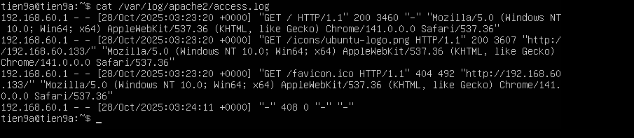

# STRUCTURE OF LOG APACHE

## I. APACHE LOG LÀ GÌ ?

**Nhật ký Apache** (Log apache) ghi lại các sự kiện được xử lý bởi máy chủ web Apache, bao gồm các yêu cầu từ các máy tính khác, phản hồi do Apache gửi và các hành động nội bộ của máy chủ Apache.

Quản trị viên máy chủ, nhà phát triển và nhà phân tích sử dụng các nhật ký này để chẩn đoán sự cố, giám sát bảo mật và phân tích các mẫu lưu lượng truy cập trên máy chủ web. Dưới đây là tổng quan chi tiết về từng loại nhật ký.

Nhật ký Apache được chia thành hai loại chính:

- **Nhật ký truy cập** - Access Log
- **Nhật ký lỗi** - Error log

## II. CÁC LOẠI APACHE LOG

| Nhóm                      | Loại log                | Mục tiêu                                       |
| ------------------------- | ----------------------- | ---------------------------------------------- |
| **Lõi hệ thống**       | Error Log               | Theo dõi lỗi `403`,`404`,`500`                    |
| **Lưu lượng**          | Access Log              | Theo dõi request                                  |
| **Tùy chỉnh**           | Custom Log              | Ghi theo format riêng                            |
| **Phụ trợ / nâng cao** | Forensic, LogIO, Syslog | Debug chuyên sâu, bảo mật, phân tích hiệu năng    |

### 1. ACCESS LOG

**Nhật ký truy cập**: (Access log)cung cấp thông tin chi tiết về người gửi yêu cầu đến máy chủ và dữ liệu họ yêu cầu. Mỗi nhật ký yêu cầu chứa các thông tin chi tiết, chẳng hạn như địa chỉ IP của máy khách , dấu thời gian, URL được yêu cầu , mã phản hồi HTTP và kích thước nội dung phản hồi.

**Công dụng chính**:

- Phân tích lưu lượng truy cập trang web.
- Phát hiện các mối đe dọa bảo mật tiềm ẩn và tối ưu hóa hiệu suất máy chủ web.
- Đưa ra các quyết định quan trọng liên quan đến bảo mật và tối ưu hóa máy chủ.

**Vị trí File Log** : Vị trí file Log nằm ở vị trí khác nhau với mỗi Distro Linux khác nhau

- Dối với Ubuntu và Debian: `/var/log/apache2/access.log`



- Đối với CentOS và RHEL: `/var/log/httpd/access_log`(Đối với CentOS7/8) và `/journalctl -u httpd`(Đối với CentOS9)


**Ví dụ về cấu trúc của 1 Access Log**:


- `192.168.60.1`: là địa chỉ IP máy khách
- `- -`: Trình giữ chỗ cho người dùng từ xa và đã được xác thực , nếu có. Mục nhập ví dụ không có thông tin cụ thể và các dấu gạch ngang là trình giữ chỗ.
- `[28/Oct/2025:03:23:20 +0000]`: Dấu thời gian yêu cầu có ngày, giờ và múi giờ chính xác.
- `"GET / HTTP/1.1"`: Phương thức yêu cầu ( GET), URL ( /) và phiên bản giao thức HTTP ( HTTP/1.1).
- `200`: Mã trạng thái HTTP mà máy chủ trả về. Mục nhập ví dụ hiển thị 200, cho biết yêu cầu đã thành công.
- `3460`: Kích thước phản hồi tính bằng byte . Giá trị ví dụ cho thấy máy chủ đã gửi 3460 byte trở lại máy khách. - `-`: Trường giới thiệu chứa trang web hướng khách hàng đến URL được yêu cầu. Giá trị ví dụ không khả dụng.
- `Mozilla/5.0 (Window NT 10.0; Win64; x64) AppleWebKit/537`: Chuỗi tác nhân người dùng được gửi từ trình duyệt web của máy khách . Chuỗi này chứa phiên bản trình duyệt và hệ điều hành ( Window).

### 2. ERROR LOG

**Nhật kí lỗi**:Nhật ký lỗi Apache chứa các báo cáo lỗi nghiêm trọng mà máy chủ gặp phải. Nhật ký ghi lại nhiều loại lỗi và chi tiết khác nhau, chẳng hạn như dữ liệu kết nối SSL/TLS , thay đổi trạng thái máy chủ, lỗi nội bộ hoặc lỗi máy khách, v.v.

**Công dụng chính**: là để khắc phục sự cố và theo dõi các vấn đề của máy chủ. Những nhật ký này là một tài sản quan trọng khi máy chủ gặp lỗi. Quản trị viên máy chủ sử dụng những nhật ký này để xác định và giải quyết sự cố nhanh chóng, đồng thời đảm bảo thời gian ngừng hoạt động tối thiểu.

**Ví trí File Log**: Vị trí file Log nằm ở vị trí khác nhau với mỗi Distro Linux khác nhau

- Đối với Ubuntu và Debian: `/var/log/apache2/error.log`


- Đối với CentOS và RHEL:`/var/log/httpd/error_log`(Đối với CentOS7/8) và `/journalctl -u httpd`(Đối với CentOS9)


**Ví dụ về cấu trúc của 1 Error Log**:

```ruby
[Fri Feb 09 15:35:24.252107 2024] [core:notice] [pid 6672:tid 139657266624384] AH00094: Command line: '/usr/sbin/apache2'
```

- `[Fri Feb 09 15:35:24.252107 2024]`: Dấu thời gian khi bản ghi được thêm vào tệp nhật ký lỗi. Định dạng dấu thời gian là [Weekday Month Day Hour:Minute:Second.Microsecond Year].
- `[core:notice]`: Thành phần tạo ra mục nhập nhật ký ( core) và mức độ nghiêm trọng ( notice).
- `[pid 6672:tid 139657266624384]`: ID tiến trình ( pid 6672) và ID luồng ( tid 139657266624384) liên quan đến mục nhập.
- `AH00094: Command line: '/usr/sbin/apache2'`: Thông báo lỗi (Thông báo ví dụ cho biết Apache đang hiển thị thông tin dòng lệnh)

### 3. CUSTOM LOG

**Custom Log** trong Apache là file log do admin tự định nghĩa nội dung và định dạng, thông qua cặp chỉ thị:

- `LogFormat`: mô tả mẫu (format) log muốn ghi — gồm các biến (placeholders).
- `CustomLog`: chỉ định file đích và format nào sẽ dùng để ghi log.

=> **Nói cách khác:** **Custom Log** cho phép admin toàn quyền quyết định ghi cái gì và ghi ra đâu.

**Lưu ý**: Custom Log có thể cùng bản chất và khái niệm với Access Log, nhưng khác về vị trí file và định dạng nếu bạn tự định nghĩa.

**Công dụng chính**:

- Phân tích hành vi người dùng: Ghi riêng `IP`, `URL`, `User-Agent`
- Theo dõi hiệu suất: Thêm `%D` để xem thời gian xử lý request
- Theo dõi API: Tạo log riêng chỉ cho các route `/api/`
- Tích hợp với `ELK` / `Graylog` / `Loki`: Ghi log JSON để hệ thống đọc dễ hơn
- Ghi cho từng VirtualHost riêng biệt.

**Vị trí File Log**: Vị trí file Log nằm ở vị trí khác nhau với mỗi Distro Linux khác nhau

- Đối với Ubuntu và Debian: `/var/log/apache2/custom_access.log`
- Đối với CentOS 9 và RHEL : `/var/log/httpd/custom_access_log`

#### 3.1 Cách Add, Check Custom Log cho từng Vỉtual Host trên CentOS

**B1 -Hiểu nguyên nhân trước:**

| Tình huống                               | Giải thích                            | Cách xử lý                                         |
| ---------------------------------------- | ------------------------------------- | -------------------------------------------------- |
| File chưa xuất hiện                      | Apache chưa ghi request nào           | Gửi request thật (curl hoặc trình duyệt)           |
| File có trong config nhưng không sinh ra | Có thể do permission hoặc chưa reload | `sudo systemctl restart httpd` và kiểm tra quyền   |
| Không thấy dòng CustomLog                | Chưa khai báo trong file `.conf`      | Thêm thủ công vào `/etc/httpd/conf.d/yourapp.conf` |

- **Trên CentOS**: Để file `Custom Log` sinh ra thì Apache phải xử lí 1 request vào cái websever mà mình gửi thì lúc đó file Custom mới được tạo ra. (khi tra truy cập bằng trình duyệt hoặc xài lệnh `Curl`)
  
- Ví dụ mày có dòng này trong `/etc/httpd/conf/httpd.conf` hoặc `/etc/httpd/conf.d/myapp.conf`:

```ruby
CustomLog "logs/custom_access_log" combined
```

→ Thì Apache chưa tạo file `/var/log/httpd/custom_access_log` ngay. Nó sẽ chỉ tạo file đó khi có request HTTP tới server (ví dụ truy cập bằng trình duyệt hoặc curl).

**B2 - Kiểm tra cấu hình Apache có khai báo CustomLog chưa:**

- Chạy lệnh:

```ruby
grep -R "CustomLog" /etc/httpd/
```

- Nếu ra:

```ruby
/etc/httpd/conf/httpd.conf:CustomLog "logs/access_log" combined
/etc/httpd/conf.d/myapp.conf:CustomLog "logs/custom_access_log" combined
```

→ Nghĩa là Apache đã được cấu hình để ghi log custom.

- Nếu không thấy dòng chứa `custom_access_log`, thì mày chưa khai báo custom log thật.

→ Phải thêm thủ công vào `file .conf`.

**B3 - Cách khai báo custom log đúng trên CentOS 9:**

- Mở file virtual host (ví dụ):

```ruby
sudo vi /etc/httpd/conf.d/myapp.conf
```

- Thêm đoạn:

```ruby
<VirtualHost *:80>
    ServerName localhost
    DocumentRoot /var/www/html

    ErrorLog "logs/custom_error_log"
    CustomLog "logs/custom_access_log" combined
</VirtualHost>
```

- Lưu lại, sau đó:

```ruby
sudo systemctl restart httpd
```

**B4 - Kiểm tra hoạt động ghi log:**

- Chạy lệnh:

```ruby
curl http://localhost/
```

hoặc mở trình duyệt vào `http://<ip-server>.`

- Sau đó kiểm tra file log:

```ruby
ls -l /var/log/httpd/
```

- Giờ mày sẽ thấy file:

`custom_access_log`
`custom_error_log`

=> vừa được Apache tạo ra

**B5 - Nếu vẫn không xuất hiện - chỉnh quyền ghi log:**

- Kiểm tra quyền ghi log:

```ruby
sudo ls -ld /var/log/httpd
```

- Thư mục này phải thuộc về user chạy Apache, thường là apache:

```text
drwx------. 2 root apache 4096 Oct 30 21:22 /var/log/httpd`
```

- Nếu không, fix quyền:

```ruby
sudo chown -R apache:apache /var/log/httpd
```

- và restart lại:

```ruby
sudo systemctl restart httpd
```

#### 3.2 Cách Add, Check Log cho từng Virtual Host trên Ubuntu

Trên Ubuntu cũng na ná CentOS check GPT để cấu hình hiểu rõ vấn đề bản chất là được rồi :D

### 4. So sánh giữa 3 loại Log Access,Eror và Custom

| Tiêu chí              | **Access Log**                      | **Custom Log**                                      | **Error Log**              |
| --------------------- | ----------------------------------- | --------------------------------------------------- | -------------------------- |
| Mục đích              | Ghi mọi request HTTP                | Ghi request tùy chọn (lọc, format riêng, chia site) | Ghi lỗi, cảnh báo hệ thống |
| Định nghĩa bằng       | `CustomLog`                         | `CustomLog`                                         | `ErrorLog`                 |
| Module xử lý          | `mod_log_config`                    | `mod_log_config`                                    | Core logging               |
| Format log            | Dùng `LogFormat` (ví dụ “combined”) | Dùng `LogFormat` tự định nghĩa                      | Cố định, không format được |
| Có thể có nhiều file? | Có (mỗi VirtualHost 1 file)         | Có (tùy cấu hình)                                   | Có (tùy VirtualHost)       |
| Liên hệ với nhau      | Access log là custom log mặc định   | Là bản tùy biến mở rộng                             | Hoàn toàn tách biệt        |

### 5. Các loại log khác nữa

| Loại phụ                                  | Module tạo ra      | Mục đích                                                                     |
| ----------------------------------------- | ------------------ | ---------------------------------------------------------------------------- |
| **log_forensic**                      | `mod_log_forensic` | Ghi log từng request với ID duy nhất để phục vụ phân tích pháp lý / security |
| **logio**                             | `mod_logio`        | Thêm thông tin về **bytes in/out**              |
| **mod_cgi / mod_proxy / mod_rewrite log** | Tùy module         | Một số module tự sinh log riêng (ví dụ: proxy error, rewrite debug...)       |
| **Syslog integration**    | `mod_syslog`       | Gửi log về hệ thống syslog thay vì ghi file cục bộ         |

=> Có thể tự tìm hiểu thêm để hiểu sâu về quản lí log Apache
