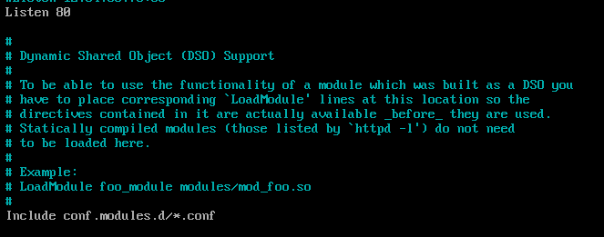
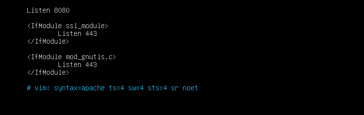

# CÁC BƯỚC ĐỔI PORT MẶC ĐỊNH CHẠY APACHE

## Bước 1: Mở file cấu hình port

Trên Ubuntu:

```ruby
sudo nano /etc/apache2/ports.conf
```

CentOS:

```ruby
sudo nano /etc/httpd/conf/httpd.conf
```

## Bước 2: Sửa dòng

Listen `80`

- Trên CentOS9:



- Trên Ubuntu


➡ Thành:

Listen `8080`

- Trên CentOS9:


- Trên Ubuntu:



## Bước 3: Trong file VirtualHost, đổi

<VirtualHost *:80>

➡ Thành:

<VirtualHost *:8080>

## Bước 4: Restart Apache

Trên Ubuntu:

```ruby
sudo systemctl restart apache2 
```

Trên CentOS9

```ruby
sudo systemctl restart httpd 
```
