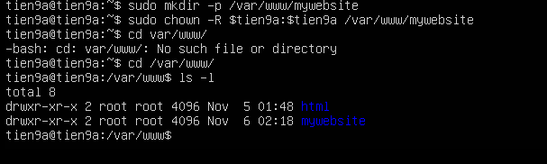
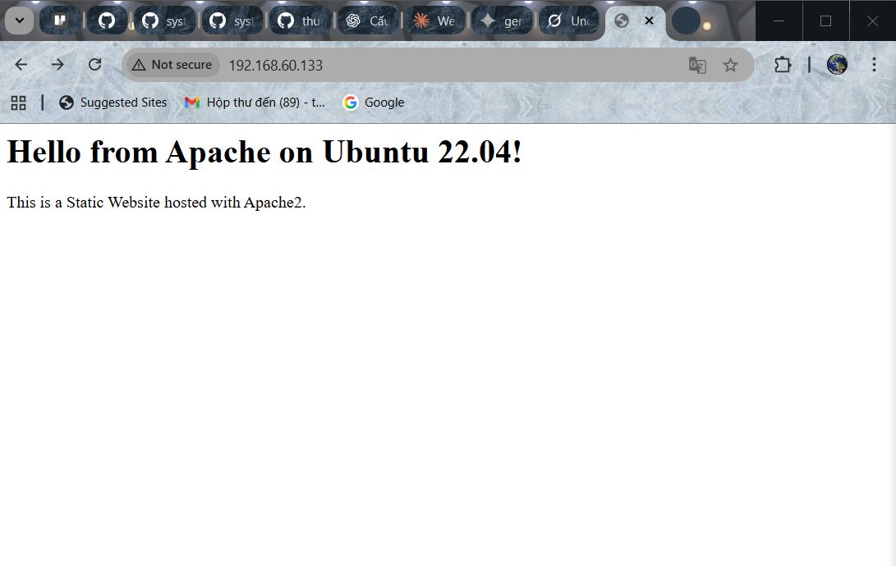

# CONFIG STATIC WEB

## I.TỔNG QUAN

Mặc định, Apache sử dụng thư mục `/var/www/html/` để lưu trữ website(hay còn gọi **website mặc định**). Có thể tạo một trang web và add nội dung tĩnh trong thư mục này hoặc cấu hình thư mục riêng.

Thông thường, website sẽ ưu tiên chạy vào file có trên index (ví dụ: `index.html`, `index.css`, `index.js`)

VD: Trong folder html có 3 file html như: `dashboard.html`, `card.html`, `index.html` thì khi đứng tại thư mục dashboard trên trình duyệt, file `index.html` sẽ được hiển thị.

## II. CÁC BƯỚC CẤU HÌNH 1 WEB TĨNH

### 1. TRÊN UBUNTU

#### Bước 1: Cài Apache trên Ubuntu(Ở các phần trước)

#### Bước 2: Tạo thư mục chứa file tĩnh

Tạo thư mục trống với câu lệnh `mkdir`:

Nếu ta muốn tạo 1 folder web site có tên `mywebsite` sử dụng lệnh:

```bash
sudo mkdir -p /var/www/mywebsite
```

Phân quyền cho User hiện tại:

```bash
 sudo chown -R $tien9a:$tien9a /var/www/mywebsite
```



#### Bước 3: Tạo file chứa nội dung web tĩnh

```bash
sudo touch /var/www/mywebsite/index.html
```

#### Bước 4: Thêm nội dung vào web tĩnh

Tạo file `index.html`:

```bash
sudo nano /var/www/mywebsite/index.html
```

Thêm nội dung ví dụ:

```html
<!DOCTYPE html>
<html>
  <head>
    <title>Welcome to My Static Site</title>
  </head>
  <body>
    <h1>Hello from Apache on Ubuntu 22.04!</h1>
    <p>This is a static website hosted with Apache2.</p>
  </body>
</html>
```

#### Bước 5: Tạo file Virtual Host riêng

Apache mặc định có site `/etc/apache2/sites-available/000-default.conf`. Ta tạo site riêng để quản lý dễ hơn:

```bash
sudo nano /etc/apache2/sites-available/mywebsite.conf
```

Thêm nội dung:

```apache
<VirtualHost *:80>
    ServerAdmin admin@mywebsite.com
    ServerName mywebsite.com
    ServerAlias www.mywebsite.com
    DocumentRoot /var/www/mywebsite

    <Directory /var/www/mywebsite>
        Options Indexes FollowSymLinks
        AllowOverride None
        Require all granted
    </Directory>

    ErrorLog ${APACHE_LOG_DIR}/mywebsite_error.log
    CustomLog ${APACHE_LOG_DIR}/mywebsite_access.log combined
</VirtualHost>
```

#### Bước 6: Kích hoạt website `mywebsite` và tắt site mặc định

```bash
sudo a2ensite mywebsite.conf
sudo a2dissite 000-default.conf
sudo systemctl reload apache2
```

#### Bước 7: Kiểm tra cấu hình trước khi khởi động lại

```bash
sudo apache2ctl configtest
```

Nếu hiển thị `Syntax OK` ->Cấu hình hợp lệ.

#### Bước 8: Kiểm tra hoạt động

Mở trình duyệt hoặc dùng lệnh `Curl`:

```bash
http://localhost
# hoặc
http://<địa_chỉ_IP_server>
```

Nếu thấy nội dung trang HTML bạn tạo ->**Thành công**



#### Bước 9: (Khuyến nghị)Cấu hình Website theo cấu trúc thư mục chuẩn cho web tĩnh

```bash
/var/www/mywebsite/
├── index.html
├── css/
│   └── style.css
├── js/
│   └── script.js
└── images/
    └── logo.png
```

### 2. Trên CentOS9

#### Bước 1: Tải Apache về VM trên CentOS9 
