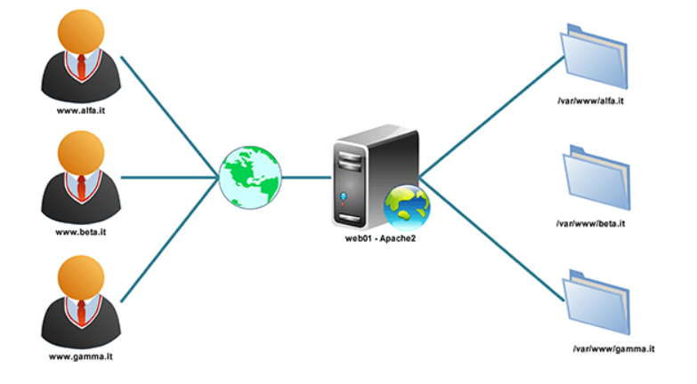
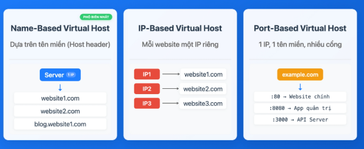
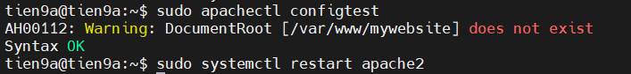
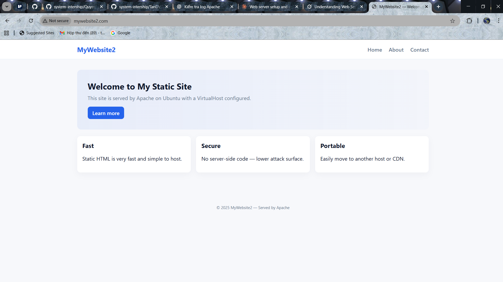
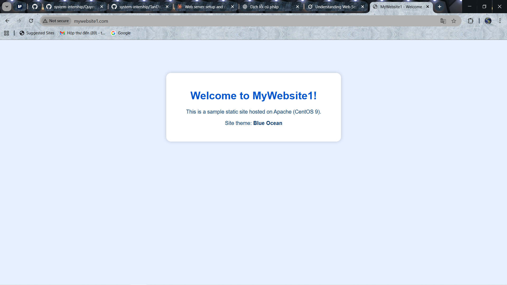
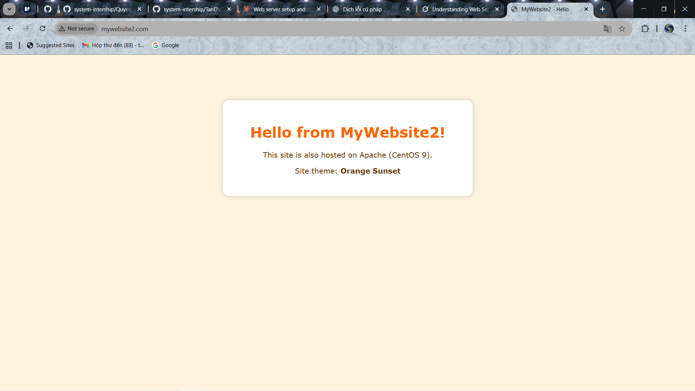

# TÌM HIỂU VỀ VIRTUAL HOST

Đối với quản trị viên hệ thống, nhà phát triển web hay chủ website, việc vận hành nhiều website trên một máy chủ duy nhất thường đặt ra bài toán về chi phí và quản lý. Để giải bài toán này thì chúng ta cần áp dụng **VirtualHost** để giải quyết.

## I. VIRTUAL HOST LÀ GÌ?



### 1. Khái niệm

Virtual Host (Máy chủ ảo) là một cấu hình trong web server (Apache or Ngnix) cho phép một máy chủ vật lý hoặc máy chủ ảo (VPS) duy nhất có thể phục vụ nhiều website hoặc tên miền khác nhau, có nghĩa là bạn không cần một server riêng(các thiết bị vật lí) cho mỗi website.

### 2. Phân loại



Có 3 loại Virtual host chính:

- **Name-based Virtual Host**: Dựa trên tên miền (domain) để phân biệt các website.

Ví dụ: `site1.com`, `site2.com` chạy trên cùng một server với một địa chỉ IP duy nhất.

- **IP-based Virtual Host**: Mỗi website có một địa chỉ IP riêng biệt. (Ít phổ biến hơn)

- **Port-based Virtual Host**: quản lý nhiều website dựa theo số Port được định nghĩa cùng với IP or Domain. Bên cạnh đó Port sử dụng còn tránh lặp lại với Port được mặc định của ứng dụng khác khi đang hoạt động.

### 3. Chức năng của VirtualHost

- **Phân biệt và định tuyến yêu cầu**: Dựa vào tên miền, địa chỉ IP hoặc cổng trong yêu cầu truy cập từ người dùng (client), web server sẽ xác định Virtual Host nào chịu trách nhiệm xử lý và trả về nội dung website tương ứng.

- **Quản lý tài nguyên**: Cho phép chia sẻ tài nguyên của server (CPU, RAM, băng thông) một cách hiệu quả cho nhiều website.

- **Phục vụ nội dung độc lập**: Mỗi Virtual Host có thể có thư mục chứa mã nguồn (document root), file log và các thiết lập cấu hình riêng biệt.

### 4. Cơ chế hoạt động của VirtualHosts


- Khi người dùng gõ một tên miền vào trình duyệt, HTTP Request được gửi đến máy chủ Web (Apache or Ngnix)

- Web Sever (ví dụ Apache hoặc Nginx) sẽ đọc thông tin trong Host header của yêu cầu HTTP để xác định tên miền mà người dùng muốn truy cập.

- Dựa vào tên miền này và các cấu hình Virtual Host đã được thiết lập, Web Server sẽ chuyển yêu cầu đến đúng thư mục chứa mã nguồn của website tương ứng

Cấu hình DNS đóng vai trò trỏ tên miền về địa chỉ IP của máy chủ.

### 5. Những lợi ích của Virtual Hosts

- Tiết kiệm chi phí và tài nguyên: Là lợi ích rõ ràng nhất, thay vì phải đầu tư nhiều máy chủ riêng cho mỗi website, bạn có thể chạy hàng chục, thậm chí hàng trăm website trên một VPS hoặc Server duy nhất, giúp chia sẻ hiệu quả tài nguyên phần cứng, giảm đáng kể chi phí đầu tư và vận hành.

- Quản lý tập trung hiệu quả: Việc quản lý nhiều website (cấu hình, file log, mã nguồn) trở nên dễ dàng hơn khi tất cả đều nằm trên một máy chủ. Các chỉ thị cấu hình như `ServerName` và `DocumentRoot` trong file cấu hình Virtual Host giúp bạn tổ chức và kiểm soát từng website một cách rõ ràng.

- Linh hoạt cho phát triển và thử nghiệm: Virtual Hosts cho phép bạn dễ dàng tạo ra các môi trường phát triển, thử nghiệm song song với website chính trên cùng một máy chủ, giúp việc kiểm thử các tính năng mới hoặc cập nhật không bị ảnh hưởng đến website đang hoạt động.

- Phân tách môi trường: Mặc dù chạy trên cùng server, mỗi Virtual Host có `DocumentRoot` và cấu hình riêng, giúp tạo ra sự tách biệt nhất định giữa các website, giảm thiểu rủi ro bảo mật lây lan và xung đột cấu hình giữa các trang.

- Tạo ra môi trường quản lí riêng : Trong 1 tổ chức họ có thể sử dụng nhiều tên miền để quản lí các phòng ban khác nhau.

### 6. Phân biệt Server, Host, Virtual Host và VPS

| **Khái niệm** | **Định nghĩa** | **Đặc điểm chính** | **Mối quan hệ** |
|----------------|----------------|--------------------|-----------------|
| **Server (Máy chủ)** | Một máy tính (vật lý hoặc ảo) mạnh mẽ, được thiết kế để lưu trữ, xử lý và cung cấp dữ liệu hoặc dịch vụ cho các máy tính khác (clients) qua mạng. | Cung cấp tài nguyên và dịch vụ. | Là nền tảng vật lý hoặc hạ tầng cơ bản. |
| **Host (trong hosting)** | Thường dùng để chỉ hành động hoặc dịch vụ cung cấp không gian lưu trữ và tài nguyên cần thiết để một website có thể hoạt động trên Internet. | Có thể là *shared hosting*, *VPS hosting*, *dedicated server hosting*. | Là dịch vụ được cung cấp trên một Server. |
| **VPS (Máy chủ riêng ảo)** | Một môi trường máy chủ ảo được tạo ra bằng cách phân chia một máy chủ vật lý thành nhiều máy chủ ảo độc lập. | Có tài nguyên riêng biệt, hệ điều hành riêng và quyền quản trị cao nhất (*root/administrator*). | Một Server vật lý có thể chứa nhiều VPS. VPS là một lựa chọn phổ biến để người dùng có toàn quyền cấu hình Virtual Hosts. |
| **Virtual Host** | Một cấu hình phần mềm trên web server cho phép một Server hoặc một VPS phục vụ nhiều website/tên miền khác nhau. | Không phải là một máy chủ vật lý hay VPS riêng biệt. Là một thiết lập logic trên web server. | Được cấu hình bên trong một web server chạy trên một Server vật lý hoặc một VPS. Mỗi VPS/Server có thể cấu hình nhiều Virtual Hosts. |

## II. CẤU HÌNH VIRTUAL HOST TRONG APACHE(CẤU HÌNH NHIỀU WEBSITE TRÊN 1 WEBSEVER)

### Yêu cầu bài toán

- Tạo 2 WebSite với 2 Domain khác nhau đó là `mywebsite1.com` và `mywebsite2.com` trên cùng 1 Websever Apache trên máy của bạn và cùng chung 1 địa chỉ IP

- Thực hành trên cả Ubuntu và CentOS9

### 1. Trên Ubuntu

#### Bước 1: Tạo cấu trúc thư mục

Cấu trúc thư mục sẽ lưu trữ dữ liệu của người dùng khi truy cập vào website. Bạn cần tạo thư mục gốc (`/var/www/directory`) cho mỗi tên miền, ví dụ `mywebsite1.com` và `mywebsite2.com`:

```bash
sudo mkdir -p /var/www/mywebsite1.com
sudo mkdir -p /var/www/mywebsite2.com
```

- `mkdir`: Viết tắt của "make directory", lệnh này được sử dụng để tạo thư mục.
- `-p`: Tùy chọn này có nghĩa là "parents". Nó cho phép lệnh tạo các thư mục cha nếu chúng chưa tồn tại. Trong trường hợp này, nếu `/var/www/mywebsite1.com` chưa tồn tại, nó sẽ được tạo trước khi `index.html` được tạo.

#### Bước 2: Cấp quyền truy cập

Mặc định, thư mục bạn vừa tạo thuộc quyền của tài khoản root. Để có thể sửa đổi các file trong thư mục này, bạn cần cấp quyền truy cập cho tài khoản người dùng bằng cách sau đây:

```bash
sudo chown -R $tien9a:$tien9a /var/www/mywebsite1.com
sudo chown -R $tien9a:$tien9a /var/www/mywebsite2.com
sudo chmod -R 755 /var/www
```

- `chown`: Viết tắt của "change owner", lệnh này được sử dụng để thay đổi quyền sở hữu của tệp hoặc thư mục.
- `-R`: Tùy chọn này có nghĩa là "recursive". Nó cho phép lệnh thay đổi quyền sở hữu của tất cả các tệp và thư mục con bên trong thư mục được chỉ định.
- `User`: user đầu là đặt người dùng sở hữu, user 2 là đặt nhóm người dùng sở hữu
- `chmod`: Viết tắt của "change mode", lệnh này được sử dụng để thay đổi quyền truy cập của tệp hoặc thư mục.
- `755`: Đây là mã quyền truy cập.Với:
  - `4`- là đọc, `2`-là viết , `1` là thực thi

#### Bước 3 : tạo File `index.html`

```bash
sudo touch /var/www/mywebsite1/index.html
sudo touch /var/www/mywebsite2/index.html
```

#### Bước 4: Tạo nội dung trang cho mỗi VirtualHost

Tạo một file HTML đơn giản làm trang mẫu cho mỗi tên miền. Ví dụ, cho `mywebsite1.com`, mở trình soạn thảo và tạo file HTML như sau:

```bash
sudo nano /var/www/mywebsite1.com/index.html
sudo nano /var/www/mywebsite2.com/index.html
```

Ghi đè nội dung mà ta muốn add vào trang sử dụng `html` and

- Ở `mywebsite1.com`:

```html
<!DOCTYPE html>
<html lang="vi">
<head>
  <meta charset="utf-8" />
  <meta name="viewport" content="width=device-width,initial-scale=1" />
  <title>MyWebsite1 — Welcome</title>
  <meta name="description" content="A simple static site served by Apache on Ubuntu" />
  <link rel="icon" href="/favicon.ico" />
  <link rel="stylesheet" href="/css/style.css" />
</head>
<body>
  <header class="site-header">
    <div class="container">
      <h1 class="brand">MyWebsite1</h1>
      <nav class="nav">
        <a href="/">Home</a>
        <a href="/about.html">About</a>
        <a href="/contact.html">Contact</a>
      </nav>
    </div>
  </header>

  <main class="container main">
    <section class="hero">
      <h2>Welcome to My Static Site</h2>
      <p class="lead">This site is served by Apache on Ubuntu with a VirtualHost configured.</p>
      <a class="btn" href="/about.html">Learn more</a>
    </section>

    <section class="cards">
      <article class="card">
        <h3>Fast</h3>
        <p>Static HTML is very fast and simple to host.</p>
      </article>

      <article class="card">
        <h3>Secure</h3>
        <p>No server-side code — lower attack surface.</p>
      </article>

      <article class="card">
        <h3>Portable</h3>
        <p>Easily move to another host or CDN.</p>
      </article>
    </section>
  </main>

  <footer class="site-footer">
    <div class="container">
      <small>© <span id="year"></span> MyWebsite1 — Served by Apache</small>
    </div>
  </footer>

  <script>
    // small nicety: update year
    document.getElementById('year').textContent = new Date().getFullYear();
  </script>
</body>
</html>
```

- Ở `website2.com`:

```html
<!DOCTYPE html>
<html lang="vi">
<head>
  <meta charset="utf-8" />
  <meta name="viewport" content="width=device-width,initial-scale=1" />
  <title>MyWebsite2 — Welcome</title>
  <meta name="description" content="A simple static site served by Apache on Ubuntu" />
  <link rel="icon" href="/favicon.ico" />
  <link rel="stylesheet" href="/css/style.css" />
</head>
<body>
  <header class="site-header">
    <div class="container">
      <h1 class="brand">MyWebsite2</h1>
      <nav class="nav">
        <a href="/">Home</a>
        <a href="/about.html">About</a>
        <a href="/contact.html">Contact</a>
      </nav>
    </div>
  </header>

  <main class="container main">
    <section class="hero">
      <h2>Welcome to My Static Site</h2>
      <p class="lead">This site is served by Apache on Ubuntu with a VirtualHost configured.</p>
      <a class="btn" href="/about.html">Learn more</a>
    </section>

    <section class="cards">
      <article class="card">
        <h3>Fast</h3>
        <p>Static HTML is very fast and simple to host.</p>
      </article>

      <article class="card">
        <h3>Secure</h3>
        <p>No server-side code — lower attack surface.</p>
      </article>

      <article class="card">
        <h3>Portable</h3>
        <p>Easily move to another host or CDN.</p>
      </article>
    </section>
  </main>

  <footer class="site-footer">
    <div class="container">
      <small>© <span id="year"></span> MyWebsite2 — Served by Apache</small>
    </div>
  </footer>

  <script>
    // small nicety: update year
    document.getElementById('year').textContent = new Date().getFullYear();
  </script>
</body>
</html>
```

#### Bước  5: Tạo file CSS và ghi đè nội dung nó vào như sau (làm y hệt như ta tạo `file.html` dùng `touch`và `chown` với folder `css`)

```bash
sudo nano /var/www/mywebsite1/css/style.css
sudo nano /var/www/mywebsite2/css/style.css
```

- Ở trang web1:

```css
:root{
  --bg:#f7f8fb;
  --card:#ffffff;
  --accent:#2563eb;
  --text:#0f172a;
  --muted:#64748b;
  --radius:12px;
  --container:1100px;
}
*{box-sizing:border-box}
body{
  margin:0;
  font-family:Inter,ui-sans-serif,system-ui,-apple-system,Segoe UI,Roboto,"Helvetica Neue",Arial;
  background:var(--bg);
  color:var(--text);
  -webkit-font-smoothing:antialiased;
}
.container{
  max-width:var(--container);
  margin:0 auto;
  padding:1rem;
}
.site-header{
  background:white;
  border-bottom:1px solid #e6eef8;
}
.site-header .container{
  display:flex;
  align-items:center;
  justify-content:space-between;
  gap:1rem;
}
.brand{margin:0;font-size:1.25rem;color:var(--accent)}
.nav a{
  margin-left:1rem;
  text-decoration:none;
  color:var(--muted);
  font-weight:600;
}
.nav a:hover{color:var(--accent)}
.main{padding:2rem 1rem}
.hero{
  background:linear-gradient(90deg, rgba(37,99,235,0.08), rgba(37,99,235,0.02));
  padding:2rem;
  border-radius:var(--radius);
  margin-bottom:1.25rem;
}
.hero h2{margin:0 0 .5rem;font-size:1.6rem}
.lead{color:var(--muted);margin:0 0 1rem}
.btn{
  display:inline-block;
  background:var(--accent);
  color:white;
  padding:.5rem .9rem;
  border-radius:8px;
  text-decoration:none;
  font-weight:600;
}
.cards{
  display:grid;
  grid-template-columns:repeat(auto-fit,minmax(200px,1fr));
  gap:1rem;
}
.card{
  background:var(--card);
  padding:1rem;
  border-radius:10px;
  box-shadow:0 6px 18px rgba(16,24,40,0.04);
}
.card h3{margin:0 0 .5rem}
.site-footer{
  margin-top:2rem;
  padding:1rem 0;
  text-align:center;
  color:var(--muted);
  font-size:.9rem;
}
@media (max-width:640px){
  .site-header .container{flex-direction:column;align-items:flex-start}
  .nav a{margin-left:0;margin-right:1rem}
}
```

- Ở trang web2:

```css
:root{
  --bg:#f7f8fb;
  --card:#ffffff;
  --accent:#2563eb;
  --text:#0f172a;
  --muted:#64748b;
  --radius:12px;
  --container:1100px;
}
*{box-sizing:border-box}
body{
  margin:0;
  font-family:Inter,ui-sans-serif,system-ui,-apple-system,Segoe UI,Roboto,"Helvetica Neue",Arial;
  background:var(--bg);
  color:var(--text);
  -webkit-font-smoothing:antialiased;
}
.container{
  max-width:var(--container);
  margin:0 auto;
  padding:1rem;
}
.site-header{
  background:white;
  border-bottom:1px solid #e6eef8;
}
.site-header .container{
  display:flex;
  align-items:center;
  justify-content:space-between;
  gap:1rem;
}
.brand{margin:0;font-size:1.25rem;color:var(--accent)}
.nav a{
  margin-left:1rem;
  text-decoration:none;
  color:var(--muted);
  font-weight:600;
}
.nav a:hover{color:var(--accent)}
.main{padding:2rem 1rem}
.hero{
  background:linear-gradient(90deg, rgba(37,99,235,0.08), rgba(37,99,235,0.02));
  padding:2rem;
  border-radius:var(--radius);
  margin-bottom:1.25rem;
}
.hero h2{margin:0 0 .5rem;font-size:1.6rem}
.lead{color:var(--muted);margin:0 0 1rem}
.btn{
  display:inline-block;
  background:var(--accent);
  color:white;
  padding:.5rem .9rem;
  border-radius:8px;
  text-decoration:none;
  font-weight:600;
}
.cards{
  display:grid;
  grid-template-columns:repeat(auto-fit,minmax(200px,1fr));
  gap:1rem;
}
.card{
  background:var(--card);
  padding:1rem;
  border-radius:10px;
  box-shadow:0 6px 18px rgba(16,24,40,0.04);
}
.card h3{margin:0 0 .5rem}
.site-footer{
  margin-top:2rem;
  padding:1rem 0;
  text-align:center;
  color:var(--muted);
  font-size:.9rem;
}
@media (max-width:640px){
  .site-header .container{flex-direction:column;align-items:flex-start}
  .nav a{margin-left:0;margin-right:1rem}
}
```

#### Bước 6: Tạo file cấu hình cho VirtualHosts

Apache mặc định có site `/etc/apache2/sites-available/000-default.conf`. Ta tạo site riêng để quản lý dễ hơn:

```bash
sudo nano /etc/apache2/sites-available/mywebsite1.conf
sudo nano /etc/apache2/sites-available/mywebsite2.conf
```

**Thêm nội dung**:

- Ở `mywebsite1.com`:

```apache
<VirtualHost *:80>
    ServerAdmin admin@mywebsite1.com
    ServerName mywebsite1.com
    ServerAlias www.mywebsite1.com
    DocumentRoot /var/www/mywebsite1.com

    <Directory /var/www/mywebsite1.com>
        Options Indexes FollowSymLinks
        AllowOverride None
        Require all granted
    </Directory>

    ErrorLog ${APACHE_LOG_DIR}/mywebsite1_error.log
    CustomLog ${APACHE_LOG_DIR}/mywebsite1_access.log combined
</VirtualHost>
```

- Ở `mywebsite2.com`:

```apache
<VirtualHost *:801>
    ServerAdmin admin@mywebsite2.com
    ServerName mywebsite2.com
    ServerAlias www.mywebsite2.com
    DocumentRoot /var/www/mywebsite2.com

    <Directory /var/www/mywebsite2.com>
        Options Indexes FollowSymLinks
        AllowOverride None
        Require all granted
    </Directory>

    ErrorLog ${APACHE_LOG_DIR}/mywebsite2_error.log
    CustomLog ${APACHE_LOG_DIR}/mywebsite2_access.log combined
</VirtualHost>
```

**Với**:

- `<VirtualHost *:80>`: Đây là thẻ cấu hình VirtualHost. `*` đại diện cho tất cả các địa chỉ IP trên máy chủ. `80` chỉ định cổng VirtualHost này lắng nghe.
- `ServerAdmin`:  tên miền chính của VirtualHost. Khi một yêu cầu HTTP đến máy chủ với tiêu đề Host là mywebsite1.com, Apache sẽ sử dụng cấu hình VirtualHost này để xử lý yêu cầu.
- `ServerAlias`: Chỉ định các tên miền phụ (alias) khác mà VirtualHost này cũng sẽ xử lý. Trong trường hợp này, nếu một yêu cầu HTTP đến máy chủ với tiêu đề Host là `www.mywebsite1.com`, Apache cũng sẽ sử dụng cấu hình VirtualHost này. Điều này cho phép người dùng truy cập trang web bằng cả `mywebsite1.com` và `www.mywebsite1.com`.
- `DocumentRoot`: Chỉ định thư mục gốc chứa các tệp trang web của VirtualHost. Khi một yêu cầu HTTP đến, Apache sẽ tìm kiếm các tệp trong thư mục này để phục vụ cho người dùng.
- `ErrorLog ${APACHE_LOG_DIR}/ubuntu1.com_error.log` hỉ định đường dẫn đến tệp nhật ký lỗi của VirtualHost. Tất cả các lỗi gặp phải khi xử lý các yêu cầu cho VirtualHost này sẽ được ghi vào tệp này. `${APACHE_LOG_DIR}` là một biến môi trường của Apache, thường trỏ đến thư mục `/var/log/apache2/`.
- `CustomLog ${APACHE_LOG_DIR}/ubuntu1.com_access.log combined`: Chỉ định đường dẫn đến tệp nhật ký truy cập của VirtualHost. Tất cả các yêu cầu HTTP đến VirtualHost này sẽ được ghi vào tệp này. combined là định dạng nhật ký, cung cấp thông tin chi tiết về các yêu cầu.

#### Bước 7: Kích hoạt VirtualHost

Chạy lệnh cấu hình :

```bash
sudo a2ensite mywebsite1.conf
sudo a2ensite mywebsite2.conf
```

- `a2ensite`: viết tắt của "Apache 2 enable site".
  - tạo các liên kết tượng trưng (symbolic links) từ các tệp cấu hình Virtual Host trong thư mục `/etc/apache2/sites-available/` đến thư mục `/etc/apache2/sites-enabled/`.
  - Apache chỉ đọc các tệp cấu hình trong thư mục `sites-enabled/`, do đó, việc tạo liên kết tượng trưng này kích hoạt cấu hình Virtual Host.

Tắt site mặc định (Nếu cần):

```bash
sudo a2dissite 000-default.conf
```

Kiểm tra lỗi cú pháp:

```bash
sudo apachectl configtest
```

- Trả về `Syntax OK` -> Thành công



Khởi động lại Apache:

```bash
sudo systemctl restart apache2
```

#### Bước 8: Cấu hình file hosts (Trên máy cục bộ vì truy cập website tại đó hoặc trên con VM)

**Trên máy cục bộ (Windows):**

Mở file `C:\Windows\System32\drivers\etc\hosts` trên Notepad với quyền `Admin`.

Thêm vào cuối file:

```ruby
192.168.60.133 mywebsite1.com
192.168.60.133 mywebsite2.com
```

**Trên VM (Ubuntu)**:

File nằm ở:

```bash
/etc/hosts
```

Chỉnh bằng:

```bash
sudo nano /etc/hosts
```

Bước 9: Truy cập trên trình duyệt

```ruby
http://mywebsite1.com
http://mywebsite2.com
```




### 2. Trên CentOS9

#### Bước 1: Active Apache

```bash
sudo dnf update -y
sudo dnf install httpd -y
sudo systemctl enable --now httpd
sudo systemctl status httpd
```

=> Thấy active (running) là OK.

#### Bước 2: Tạo thư mục web + phân quyền

```bash
sudo mkdir -p /var/www/mywebsite1.com
sudo mkdir -p /var/www/mywebsite2.com
sudo chown -R $tien9a:$tien9a /var/www/mywebsite1.com
sudo chown -R $tien9a:$tien9a /var/www/mywebsite2.com
sudo chmod -R 755 /var/www
```

#### Bước 3: Tạo nội dung trang web

- Ở website 1:

Tạo file `index.html`bằng `touch` và ghi đè nội dung bằng `nano`

```bash
sudo touch /var/www/mywebsite1.com/index.html
sudo nano /var/www/mywebsite1.com/index.html
```

Chèn nội dung html vào:

```html
<!DOCTYPE html>
<html lang="en">
<head>
  <meta charset="UTF-8">
  <title>MyWebsite1 - Welcome</title>
  <link rel="stylesheet" href="css/style.css">
</head>
<body>
  <div class="container">
    <h1>Welcome to MyWebsite1!</h1>
    <p>This is a sample static site hosted on Apache (CentOS 9).</p>
    <p>Site theme: <strong>Blue Ocean</strong></p>
  </div>
</body>
</html>
```

Tạo thư mục `css` + phân quyền:

```bash
sudo mkdir -p /var/www/mywebsite1.com/css
sudo chown -R $tien9a:$tien9a /var/www/mywebsite1.com/css
sudo chmod -R 755 /var/www/mywebsite1.com/css
```

Tạo file `style.css` bằng lệnh `touch` và ghi đè bằng `nano`:

```bash
sudo touch /var/www/mywebsite1.com/css/style.css
sudo nano /var/www/mywebsite1.com/css/style.css
```

Ghi đè vào file `style.css`:

```css
body {
  background-color: #e6f0ff;
  font-family: Arial, sans-serif;
  color: #003366;
  text-align: center;
  margin-top: 100px;
}
.container {
  background-color: white;
  display: inline-block;
  padding: 30px 60px;
  border-radius: 15px;
  box-shadow: 0 0 10px rgba(0,0,0,0.2);
}
h1 {
  color: #0055cc;
}
```

- Ở Website 2 (mywebsite2.com)

Tạo file `index.html` các bước tương tự như ở trang web1:

```bash
sudo nano /var/www/mywebsite2.com/index.html
```

Chèn nội dung `html` vào:

```html
<!DOCTYPE html>
<html lang="en">
<head>
  <meta charset="UTF-8">
  <title>MyWebsite2 - Hello</title>
  <link rel="stylesheet" href="css/style.css">
</head>
<body>
  <div class="container">
    <h1>Hello from MyWebsite2!</h1>
    <p>This site is also hosted on Apache (CentOS 9).</p>
    <p>Site theme: <strong>Orange Sunset</strong></p>
  </div>
</body>
</html>
```

Tạo folder `css` và file `style.css` tương tự như ở trang web 1:

Ghi đè nội dung css bằng trình `nano`:

```bash
sudo nano /var/www/mywebsite2.com/css/style.css
```

Đè nội dung vào :

```css
body {
  background-color: #fff3e0;
  font-family: Verdana, sans-serif;
  color: #663300;
  text-align: center;
  margin-top: 100px;
}
.container {
  background-color: white;
  display: inline-block;
  padding: 30px 60px;
  border-radius: 15px;
  box-shadow: 0 0 10px rgba(0,0,0,0.2);
}
h1 {
  color: #ff6600;
}
```

#### Bước 4: Tạo file cấu hình VirtualHost

Trên CentOS, file cấu hình Apache mặc định nằm ở: `/etc/httpd/conf.d/`.Ta tạo 2 file `conf` của 2 website cho ta dễ quản lí :

- Trang web1:

```bash
sudo nano /etc/httpd/conf.d/mywebsite1.com.conf
```

Đè nội dung này vào :

```ruby
<VirtualHost *:80>
    ServerAdmin admin@mywebsite1.com
    ServerName mywebsite1.com
    ServerAlias www.mywebsite1.com
    DocumentRoot /var/www/mywebsite1.com

    <Directory /var/www/mywebsite1.com>
        Options Indexes FollowSymLinks
        AllowOverride None
        Require all granted
    </Directory>

    ErrorLog /var/log/httpd/mywebsite1_error.log
    CustomLog /var/log/httpd/mywebsite1_access.log combined
</VirtualHost>
```

- Trang web2:

```bash
/etc/httpd/conf.d/mywebsite2.com.conf
```

Đè nội dung này vào :

```ruby
<VirtualHost *:80>
    ServerAdmin admin@mywebsite2.com
    ServerName mywebsite2.com
    ServerAlias www.mywebsite2.com
    DocumentRoot /var/www/mywebsite2.com

    <Directory /var/www/mywebsite2.com>
        Options Indexes FollowSymLinks
        AllowOverride None
        Require all granted
    </Directory>

    ErrorLog /var/log/httpd/mywebsite2_error.log
    CustomLog /var/log/httpd/mywebsite2_access.log combined
</VirtualHost>
```

#### Bước 5: Kiểm tra cấu hình Apache

```bash
sudo apachectl configtest
```

=> Phải ra: `Syntax OK`

#### Bước 6: Khởi động lại Apache

```bash
sudo systemctl restart httpd
```

#### Bước 7: Mở port 80 trên firewall

- Mở theo cách dịch vụ `http`:

```bash
sudo firewall-cmd --permanent --add-service=http
sudo firewall-cmd --reload
```

#### Bước 8: Sửa file hosts bên máy Windows (client)

Mở:

```ruby
C:\Windows\System32\drivers\etc\hosts
```

Ta có IP server là `192.168.60.131`.Thì thêm 2 dòng này vào cuối file `hosts`:

```ruby
192.168.60.131 mywebsite1.com
192.168.60.131 mywebsite2.com
```

Lưu lại (chạy Notepad bằng quyền Administrator).

#### Bước 9: Truy cập thử

Trên trình duyệt:

```ruby
http://mywebsite1.com
http://mywebsite2.com
```





## III. CÁC LỖI DỄ GẶP KHI CẤU HÌNH NHIỀU WEBSITE TRÊN 1 VIRTUAL HOST

- Luôn khởi động `restart` Apache mỗi lần cấu hình

- Kiểm tra xem Apache đã lắng nghe đúng port chưa

- Kiểm tra SeLinux & Firewall

- Kiểm tra File Virtual Hosts đã hoạt động hay chưa

- Kiểm tra file `/etc/hosts` bên máy Windows

- Chưa xoá cache của bên trình duyệt

- Cách khắc phục
  - Search log Apache tìm `errorlog` để giải quyết lỗi đang xảy ra.