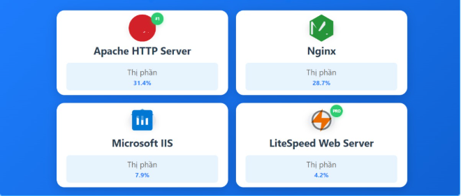

# TÌM HIỂU WEBSERVER

## WEBSERVER LÀ GÌ ?

### 1. Khái niệm

WebServer là phần mềm hoặc phần cứng có nhiệm vụ nhận yêu cầu (HTTP request) từ client (thường là trình duyệt) và trả về phản hồi (HTTP response) – thường là trang web, tài nguyên hoặc dữ liệu.

**Ví dụ**:

Khi ta gõ <https://www.google.com>, web server Google chính là máy đang gửi trang chủ về cho trình duyệt của ta.

### 2. Cấu trúc cơ bản của một Web Server

Một web server thường gồm 2 phần:

| Thành phần                   | Vai trò                                                                                                             |
| ---------------------------- | ------------------------------------------------------------------------------------------------------------------- |
|**Phần cứng (Hardware)** | Là **máy chủ (Server machine)** – có thể là máy thật hoặc máy ảo, lưu trữ các file web (HTML, CSS, JS, ảnh, API...) |
|**Phần mềm (Software)**   | Là **chương trình xử lý yêu cầu HTTP** – ví dụ: Apache, Nginx, IIS, Caddy…                                          |

### 3. Phân loại Webserver

**L1. Static webserver (Máy chủ tĩnh)**:

Phục vụ các nội dung cố định (HTML, CSS, JS, hình ảnh).
Ví dụ: Nginx, Apache.

**L2. Dynamic webserver (Máy chủ động)**:

Kết hợp máy chủ HTTP với phần mềm ứng dụng (PHP, Python, Node.js…).
Ví dụ: Apache + PHP, Nginx + FastCGI.

### 4. Chức năng của WebServer

- **Lưu trữ nội dung web**: Tài liệu HTML, CSS, JavaScript, hình ảnh, video…
- **Phản hồi yêu cầu HTTP/HTTPs**: Giao tiếp với trình duyệt của người dùng.
- **Phân phối nội dung tới người dùng và thực hiện các WebService**: Web Server gửi về các file hoặc dữ liệu cần thiết để trình duyệt hiển thị website cho người dùng cuối dưới dạng cả trang tĩnh lẫn trang động và thực hiện các dịch vụ web như truy xuất API để trích xuất **DATA** từ **DATABASE** or **Application Sever**
- **Xử lý tập lệnh động (Dynamic Content)**: Kết hợp với các ngôn ngữ lập trình (PHP, Python, Node.js, Java…) để xử lý nội dung động.
- **Bảo mật thông tin:** Hỗ trợ SSL/TLS để mã hóa dữ liệu truyền tải (HTTPS).
-**Ghi log & giám sát**: Theo dõi truy cập, ghi nhận lỗi và hiệu suất.

### 5. Cơ chế hoạt động của WebServer

Cách thức hoạt động của Web Server dựa trên mô hình client-server và diễn ra qua một chuỗi các bước phối hợp chặt chẽ giữa trình duyệt, hệ thống DNS, giao thức HTTP/HTTPS và máy chủ web. Quá trình này gồm các bước sau:

1. **Người dùng yêu cầu truy cập website**: Khi bạn nhập một địa chỉ website vào trình duyệt, trình duyệt sẽ kiểm tra bộ nhớ cache để tìm địa chỉ IP của tên miền này. Nếu chưa có, nó gửi yêu cầu đến hệ thống DNS để phân giải tên miền thành địa chỉ IP tương ứng.

2. **Thiết lập kết nối đến máy chủ web**: Sau khi nhận được địa chỉ IP, trình duyệt sẽ thiết lập kết nối với máy chủ web thông qua giao thức TCP/IP. Sau đó, trình duyệt gửi yêu cầu HTTP hoặc HTTPS tới web server, chứa thông tin tài nguyên mà người dùng muốn truy cập (chẳng hạn như tệp HTML, hình ảnh, dữ liệu…).

3. **Web server xử lý yêu cầu**: Máy chủ web tiếp nhận, phân tích và xác định loại tài nguyên được yêu cầu. Nếu là tài nguyên tĩnh (HTML, CSS, JS, hình ảnh), server sẽ tìm kiếm và gửi tệp này. Nếu là tài nguyên động (như `.php`, `.py`, `.jsp`…), web server sẽ chuyển tiếp yêu cầu tới phần mềm ứng dụng tương ứng hoặc truy vấn cơ sở dữ liệu để tạo ra nội dung động.

4. **Tạo và gửi phản hồi đến trình duyệt**: Web server xây dựng phản hồi HTTP/HTTPS với mã trạng thái (ví dụ `200 OK` hoặc `404 Not Found`), các thông tin header, kèm theo nội dung tài nguyên được yêu cầu, rồi gửi trả lại cho trình duyệt.

5. **Trình duyệt hiển thị trang web cho người dùng**: Trình duyệt nhận phản hồi, phân tích và hiển thị nội dung trang web lên màn hình(HTML,CSS,JS,Images), hoàn tất một chu trình truy cập website.

### 5. Cơ chế tối ưu và bảo mật của WebSever

Quy trình này diễn ra rất nhanh (chỉ trong vài phần nghìn giây), cho phép Web Server xử lý đồng thời hàng ngàn yêu cầu từ nhiều người dùng khác nhau. Máy chủ web còn đảm bảo bảo mật, quản lý phiên và kết nối linh hoạt với nhiều dịch vụ khác để duy trì hiệu suất website ổn định vè để tối ưu được vậy thì WebSever phải sử dụng các giải pháp sau:

1. **Caching (Bộ nhớ đệm)**: Lưu trữ tạm thời các phản hồi để phục vụ lại nhanh hơn.

2. **Load Balancing (Cân bằng tải)**: Phân phối yêu cầu giữa nhiều máy chủ backend để giảm tải.

3. **SSL/TLS Encryption:** Mã hóa thông tin bằng HTTPS để bảo mật dữ liệu.

4. **Access Control (Kiểm soát truy cập)**: Xác thực người dùng, giới hạn IP truy cập.

5. **Logging & Monitoring**: Ghi nhật ký yêu cầu (Access log, Error log) để theo dõi hoạt động.

### 6. Các loại WebSever phổ biến

- **Apache HTTP server**: Apache là web server được sử dụng rộng rãi nhất thế giới. Apache được phát triển và duy trì bởi một cộng đồng mã nguồn mở dưới sự bảo trợ của Apache Software Foundation. Apache được phát hành với giấy phép Apache License là được sử dụng tự do, miễn phí.

- **Nginx**: là một web server nhẹ, không chiếm nhiều tài nguyên của hệ thống. Nginx còn là một reserse proxy mã nguồn mở. Nginx khá là ổn định, cấu hình đơn giản và hiệu suất cao.

- **Internet Information Services (IIS)**: IIS do Microsoft phát triển, sản phẩm này được tích hợp cùng với hệ điều hành Windows Server. Trong IIS bao gồm nhiều dịch vụ như: dịch vụ Web Server, dịch vụ FTP Server.

**Apache Tomcat**: là một Java Servlet được phát triển bởi Apache Software Foundation. Tomcat thực thi các ứng dụng Java Servlet và JavaServer Pages (JSP). Tomcat cung cấp một máy chủ HTTP cho ngôn ngữ Java thuần túy.

**Lighttpd**: là một phần mềm mã nguồn mở, an toàn và linh hoạt, đặc biệt miễn phí và được phân phối theo giấy phép BSD. Lighttpd được viết bởi Jan Kneschke. Lighttpd chiếm ít tài nguyên, memory thấp, CPU nhỏ. Lighttpd được phát triển bằng ngôn ngữ C. chạy trên hệ điều hành Linux, Windows, Mac OS,…

### 7. So sánh giữa 2 loại WebSever phổ biến nhất hiện nay Apache và Nginx

| Tiêu chí | Apache | Nginx |
|-----------|-------------|---------|
| Hiệu suất | Tốt với nội dung động. | Tốt với nội dung tĩnh, tốc độ cao. |
| Cách xử lý | Quy trình (Process-based). | Sự kiện (Event-based). |
| Tính linh hoạt | Hỗ trợ nhiều module. | Ít module hơn, tối ưu hơn. |
| Dễ cấu hình | Cấu hình linh hoạt. | Cấu hình phức tạp hơn. |
| Ứng dụng phổ biến | Hosting PHP, WordPress. | Proxy ngược, CDN, microservices. |
