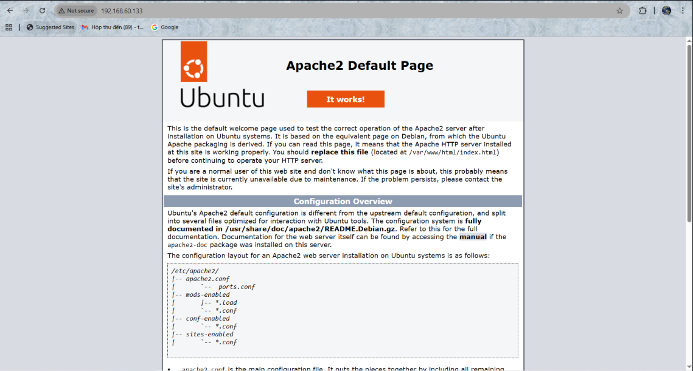

# TÌM HIỂU APACHE

## 1. Apache LÀ GÌ?

**Apache HTTP Server** (thường gọi là Apache) là một phần mềm máy chủ web (web server) mã nguồn mở, miễn phí, được phát triển và duy trì bởi Apache Software Foundation. Apache đóng vai trò chính trong việc nhận các yêu cầu từ trình duyệt (client) và phản hồi nội dung web (HTML, CSS, JS, hình ảnh,…) về trình duyệt.

### a. Kiến trúc tổng quan của Apache

- Apache hoạt động dựa trên mô hình client-server.
- Khi một trình duyệt web (client) gửi yêu cầu HTTP đến máy chủ Apache, máy chủ sẽ xử lý yêu cầu và gửi phản hồi HTTP chứa nội dung yêu cầu (ví dụ: trang web, hình ảnh, video) về cho trình duyệt.
- Kiến trúc của Apache được thiết kế theo dạng mô-đun (module-based), cho phép người dùng linh hoạt tùy chỉnh và mở rộng chức năng của máy chủ bằng cách thêm hoặc xóa các mô-đun.

### b. Các thành phần chính của Apache

**Core (Lõi):** Đây là thành phần cốt lõi của Apache, chịu trách nhiệm xử lý các yêu cầu HTTP cơ bản, quản lý tiến trình và luồng, và cung cấp các dịch vụ cơ bản khác.

**Modules (Mô-đun):** Apache hỗ trợ một loạt các mô-đun có thể được tải và cấu hình để mở rộng chức năng của máy chủ.

| Module | Chức năng |
|-----------|-------------|
| `mod_ssl` | Hỗ trợ kết nối an toàn qua HTTPS. |
| `mod_rewrite` | Viết lại URL (URL Rewriting). |
| `mod_php` | Chạy mã PHP (tạo nội dung động). |
| `mod_proxy` | Cấu hình Proxy và cân bằng tải. |
| `mod_security` | Tăng cường bảo mật (chống tấn công XSS). |
| `mod_cache` | Bộ nhớ đệm (Caching). |

**File cấu hình chính:**

- /etc/httpd/httpd.conf (Linux).
- C:\Program Files\Apache Group\Apache2\conf\httpd.conf (Windows).

## 2. Cài đặt và quản lí Apache

### a. Trên UbuntuServer

|  **Bước** |  **Lệnh** |  **Mục đích / Giải thích** |
|-------------|-------------|-------------------------------|
|  **1. Cập nhật hệ thống** | `sudo apt update && sudo apt upgrade -y` | Cập nhật danh sách gói và cài đặt bản vá bảo mật mới nhất. |
|  **2. Cài đặt Apache2** | `sudo apt install apache2 -y` | Cài web server Apache (phiên bản 2.x). |
|  **3. Kiểm tra trạng thái dịch vụ** | `sudo systemctl status apache2` | Kiểm tra Apache đang chạy hay không (**active (running)** là OK). |
|**Khởi động thủ công (nếu chưa chạy)** | `sudo systemctl start apache2` | Bật dịch vụ Apache. |
|**4. Cho phép khởi động cùng hệ thống** | `sudo systemctl enable apache2` | Cho phép Apache tự khởi động khi bật máy. |
|**5. Mở port trên firewall (UFW)** | `sudo ufw allow 'Apache Full'` \|\| `sudo ufw reload`(Mở 2 cổng)`sudo ufw allow 80/tcp`(Mở cổng 80 thui nếu chưa mở https) | Mở cổng **80 (HTTP)** và **443 (HTTPS)**. |
|**6. Kiểm tra web server** | Truy cập `http://localhost/` hoặc `http://<IP_ubuntu>/` | Nếu thấy trang “Apache2 Ubuntu Default Page” → thành công |
|**7. Các file & thư mục quan trọng** |  |  |
| ├─ **Web root** | `/var/www/html/` | Chứa file web (index.html, site...). |
| ├─ **File cấu hình chính** | `/etc/apache2/apache2.conf` | Cấu hình toàn hệ thống Apache. |
| ├─ **Virtual Host mặc định** | `/etc/apache2/sites-available/000-default.conf` | Chỉnh port, document root, log... |
| ├─ **Log truy cập** | `/var/log/apache2/access.log` | Nhật ký truy cập. |
| └─ **Log lỗi** | `/var/log/apache2/error.log` | Nhật ký lỗi hệ thống. |
|**8. Nạp lại cấu hình** | `sudo systemctl reload apache2` | Nạp lại cấu hình mà không dừng dịch vụ. |
|**9. Khởi động lại dịch vụ** | `sudo systemctl restart apache2` | Restart hoàn toàn Apache. |
|**10. Kiểm tra phiên bản** | `apache2 -v` | Xem phiên bản hiện tại *(VD: Apache/2.4.57 (Ubuntu))*. |

### b. Trên CentOS9

