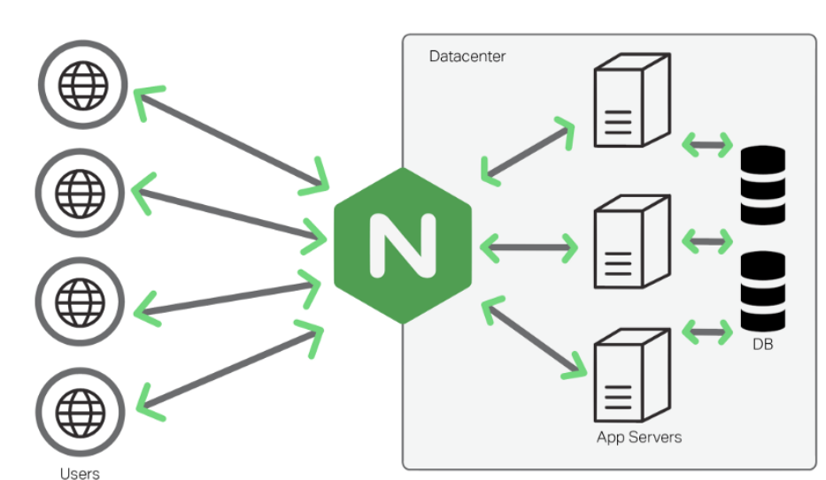
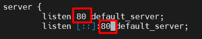
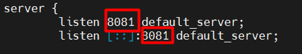
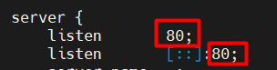
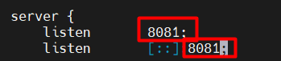

# TÌM HIỀU NGINX

## I. NGINX LÀ GÌ?



### 1. Khái niệm

Nginx là một máy chủ web mã nguồn mở mạnh mẽ và được biết đến rộng rãi trong việc phục vụ các trang web qua giao thức HTTP. Với khả năng xử lý hàng ngàn kết nối cùng một lúc, Web server này giúp giải quyết các vấn đề về cân bằng tải, bộ nhớ đệm và nhiều tác vụ khác.

### 2. Chức năng chính

- **Máy chủ web (Web server)**:

  - Nginx có khả năng phục vụ các trang web tĩnh (HTML, CSS, JavaScript, hình ảnh,...) và động (PHP, Python,...) một cách hiệu quả.
  - Nó nổi tiếng với khả năng xử lý số lượng lớn kết nối đồng thời mà vẫn duy trì hiệu suất cao.

- **Reverse proxy**:

  - Nginx có thể hoạt động như một reverse proxy, nhận các yêu cầu từ máy khách và chuyển tiếp chúng đến các máy chủ ứng dụng (backend servers).
  - Điều này giúp cải thiện hiệu suất, bảo mật và khả năng mở rộng của ứng dụng web.

- **Cân bằng tải (Load balancer)**:Nginx có thể phân phối lưu lượng truy cập đến nhiều máy chủ ứng dụng, giúp cân bằng tải và đảm bảo tính sẵn sàng cao của ứng dụng.

- **HTTP cache**:Nginx có thể lưu trữ các nội dung web tĩnh trong bộ nhớ cache, giúp giảm tải cho máy chủ ứng dụng và tăng tốc độ tải trang.

- **Hỗ trợ Web Socket**:Hỗ trợ WebSockets, bao gồm hoạt động như một proxy ngược và thực hiện cân bằng tải cho các ứng dụng WebSocket.

### 3. Đặc điểm nổi bật

- **Hiệu suất cao**: Nginx được thiết kế để xử lý số lượng lớn kết nối đồng thời một cách hiệu quả, đặc biệt là trong các môi trường có lưu lượng truy cập cao.

- **Tiêu thụ tài nguyên thấp**: Nginx sử dụng ít tài nguyên hệ thống (CPU, RAM) hơn so với một số máy chủ web khác, giúp tiết kiệm chi phí phần cứng.

- **Tính ổn định**:Nginx được biết đến với tính ổn định và khả năng hoạt động liên tục trong thời gian dài.

- **Cấu hình linh hoạt**:Nginx cung cấp một hệ thống cấu hình linh hoạt, cho phép người dùng tùy chỉnh để phù hợp với nhu cầu của mình.

### 4. Ứng dụng phổ biến

- Phục vụ các trang web có lưu lượng truy cập lớn.
- Xây dựng các hệ thống microservices.
- Triển khai các ứng dụng web động.
- Cải thiện hiệu suất và bảo mật của ứng dụng web.

## II. CÀI ĐẶT NGINX

### 1. Trên Ubuntu (20.04 / 22.04 / mới hơn)

#### Bước 1: Cập nhật hệ thống

```bash
sudo apt upgrade -y
```

#### Bước 2: Cài đặt Nginx

```bash
sudo apt install nginx -y
```

#### Bước 3: Kiểm tra dịch vụ

```bash
sudo systemctl status nginx
```

=>Nếu thấy trạng thái `active (running)` là Nginx đang chạy.

Nếu hiện:

```bash
nginx: [emerg] bind() to 0.0.0.0:80 failed (98: Address already in use)
```

=> Tức là cổng `80` đang bị chiếm bởi 1 dịch vụ khác, nên Nginx không thể "bind" vào đó để lắng nghe request. Đây là một lỗi rất thường gặp nếu ta đã cài sẵn Apache2 hoặc một web server khác.

#### Bước 4: Ngắt dịch vụ của WebSever Apache trước đó hoặc đổi Port dịch vụ Nginx sang cổng khác

**Cách 1 - Ngắt dịch vụ Apache trước đó:**

```bash
sudo systemctl stop apache2     #Dừng hẳn
sudo systemctl disable apache2  #Dừng tạm thời cho tới khi Reboot
sudo systemctl start nginx
sudo systemctl status nginx
```

**Cách 2 - Chạy cả 2 dịch vụ Apache và Nginx song song:**

- Đổi port của Nginx - Mở file cấu hình mặc định:

```bash
sudo nano /etc/nginx/sites-available/default
```  

- Tìm dòng:`listen 80 default_server` -> Đổi thành, ví dụ:`listen 8081 default_server`;

- Lưu file rồi kiểm tra cú pháp:

```bash
sudo nginx -t
```

- Nếu `OK`, thì reload:

```bash
sudo systemctl reload nginx
```

- Sau đó truy cập:

```ruby
http://<IP_máy_chủ>:8081
```

- Kiểm tra lại port đang mở

```bash
sudo ss -tuln | grep nginx
```

=>Sẽ thấy Nginx đang lắng nghe ở port `80` hoặc `8081` (tuỳ mày chỉnh). Ở đây ta sẽ sử dụng cách 2





#### Bước 5: Khởi động / Dừng / Tự khởi động cùng hệ thống

```bash
sudo systemctl start nginx      # Khởi động
sudo systemctl stop nginx       # Dừng
sudo systemctl restart nginx    # Khởi động lại
sudo systemctl enable nginx     # Tự khởi động cùng hệ thống
```

#### Bước 6: Kiểm tra trình duyệt

**Mở trình duyệt và truy cập**:

```ruby
http://<địa_chỉ_IP_máy_chủ>:Port
```

=> Nếu thấy trang `“Welcome to Nginx!` → thành công

- Nếu trình duyệt hiển thị trang chủ của Apache (vì Apache cùng hoạt động trên máy chủ) thì có thể cấu hình lại nginx như sau:
  - Mở file cấu hình nginx:

    ```plaintext
    sudo nano /etc/nginx/sites-available/default
    ```

  - Tìm dòng:

    ```plaintext
    root /var/www/html;

    đổi thành 

    root /var/www/nginx;
    ```

  - Vì nginx dùng `/var/www/html` để chạy website nhưng bị ghi đè bởi Apache, vậy nên đổi mặc định nginx thành `/var/www/nginx`
  - Tạo ra thư mục và file test:

    ```plaintext
    sudo mkdir /var/www/nginx
    echo "<h1>Welcomw to nginx on port 8081</h1>" | sudo tee /var/www/nginx/index.html
    ```

  - Tiến hành khởi động lại

    ```plaintext
    sudo systemctl restart nginx
    ```

Kết quả thành công:


### 2. Trên CentOS 9 (Stream)

#### Lưu ý

- CentOS 9 Stream không có gói nginx mặc định trong repo AppStream, nên ta dùng EPEL (Extra Packages for Enterprise Linux)

#### Bước 1 : Cập nhật hệ thống

```bash
sudo dnf update -y
```

#### Bước 2: Cài EPEL repo

```bash
sudo dnf install epel-release -y
```

#### Bước 3: Cài Nginx

```bash
sudo dnf install nginx -y
```

#### Bước 4: Khởi động và bật dịch vụ

```bash
sudo systemctl start nginx
sudo systemctl enable nginx
sudo systemctl status nginx
```

=>Trạng thái `active (running)` là OK

- Nếu trạng thái hiện:

```bash
nginx: [emerg] bind() to 0.0.0.0:80 failed (98: Address already in use)
```

#### Bước 5: Ngắt dịch vụ Apache or ChangePort on Nginx

**Cách 1**: Dừng Apache để chạy Nginx trên port 80

```bash
sudo systemctl stop httpd
sudo systemctl disable httpd
sudo systemctl restart nginx
sudo systemctl status nginx
```

**Cách 2**: Giữ Apache và đổi Nginx sang port `8081`

Mở file cấu hình chính của Nginx:

```bash
sudo nano /etc/nginx/nginx.conf
```

Tìm dòng:`listen 80`;và đổi thành:`listen 8081`;





Sau đó restart:

```bash
sudo systemctl start nginx
```

#### Bước 5: Mở port trên tường lửa (firewall)

```bash
sudo firewall-cmd --permanent --add-service=http
sudo firewall-cmd --permanent --add-service=https
sudo firewall-cmd --reload
```

#### Bước 6 : Kiểm tra trình duyệt

**Truy cập**:

```ruby
http://<IP_của_server>:Port
```

=>Nếu thấy trang mặc định Nginx → cài đặt thành công
