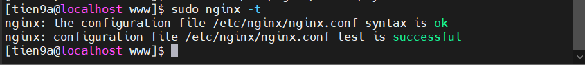
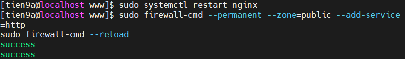
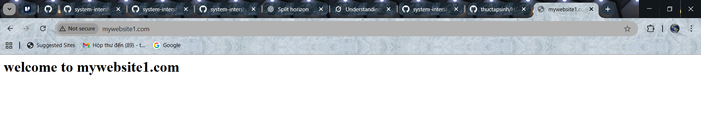
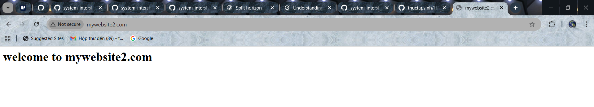
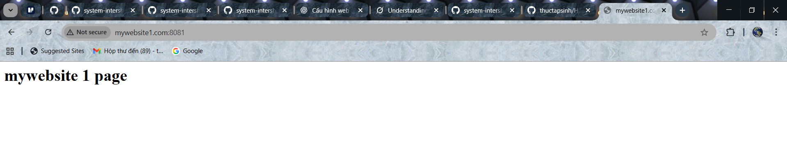
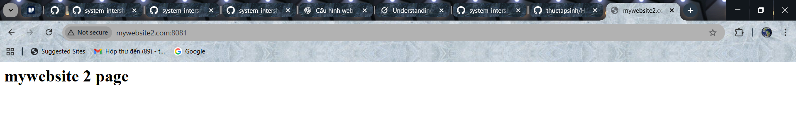

# VIRTUAL HOST

## I. VIRTUAL HOST TRONG NGINX

Trong Nginx, Virtual Host (hay còn gọi là Server Block) là một cấu trúc cho phép chạy nhiều website khác nhau trên cùng một máy chủ (server) duy nhất. Nó tương tự như khái niệm Virtual Host trong Apache.

Hiểu đơn giản: Tưởng tượng một máy chủ vật lý như một tòa nhà văn phòng lớn. Mỗi Virtual Host là một "văn phòng" riêng biệt bên trong tòa nhà đó. Mỗi "văn phòng" có địa chỉ riêng (tên miền) và có thể chứa một website hoàn toàn khác biệt.

**Chức năng chính của Virtual Host trong Nginx:**

- **Cho phép hosting nhiều tên miền trên một địa chỉ IP:**  Có thể chạy nhiều website với các tên miền khác nhau (ví dụ: example.com, another-site.net, my-blog.org) trên cùng một máy chủ có một địa chỉ IP duy nhất.

- **Phân chia cấu hình cho từng website:** Mỗi Virtual Host có một khối cấu hình riêng, cho phép bạn tùy chỉnh các thiết lập riêng biệt cho từng website, chẳng hạn như:

  - Thư mục gốc của website (root directory).
  - Các quy tắc xử lý request (ví dụ: chuyển hướng, rewrite).
  - Chứng chỉ SSL/TLS cho HTTPS.
  - Các thiết lập liên quan đến bảo mật và hiệu suất.

- **Quản lý dễ dàng:** Có thể quản lý từng website một cách độc lập thông qua các file cấu hình Virtual Host riêng biệt.

**Cách Nginx xác định Virtual Host nào sẽ xử lý request:**

Khi một người dùng truy cập vào một website trên server của bạn, Nginx sẽ xem xét các yếu tố sau để xác định Virtual Host nào sẽ xử lý request đó:

- **Tên miền (Server Name):** Đây là yếu tố quan trọng nhất. Nginx sẽ so sánh tên miền trong request của người dùng với các tên miền được cấu hình trong các Virtual Host.
- **Địa chỉ IP và cổng (Listen Directive):** Bạn có thể cấu hình Virtual Host lắng nghe trên một địa chỉ IP và cổng cụ thể.
- **Mặc định (Default Server):** Bạn có thể chỉ định một Virtual Host là mặc định. Virtual Host này sẽ xử lý các request không khớp với bất kỳ Virtual Host nào khác.

## II. CẤU HÌNH NHIỀU WEBSITE TRÊN 1 VIRTUAL HOST

### 1. Trên CentOS 9

`Bước 1`: Tạo thư mục và file cho từng website và phân quyền

Giả sử có 2 website:

- mywebsite1.com
- mywebsite2.com

Tạo thư mục chứa nội dung web + phân quyền:

```bash
sudo mkdir -p /var/www/mywebsite1.com
sudo mkdir -p /var/www/mywebsite2.com
sudo chown -R $tien9a:$tien9a /var/www/mywebsite1.com
sudo chown -R $tien9a:$tien9a /var/www/mywebsite2.com
sudo chmod -R 755 /var/www
```

Dùng `sudo touch`-> Tạo file `index.html` cho từng site:

```bash
sudo touch /var/www/mywebsite1.com/index.html
sudo touch /var/www/mywebsite2.com/index.html
echo "<h1>welcome to mywebsite1.com</h1>" | sudo tee /var/www/mywebsite1.com/index.html
echo "<h1>welcome to mywebsite2.com</h1>" | sudo tee /var/www/mywebsite2.com/index.html
```

- `echo "..." | sudo tee file.html`: Ghi nội dung vào file.

- `chown -R $tien9a:$tien9a`: gán quyền sở hữu cho user `nginx`.
- `chmod -R 755`: Cấp quyền đọc và ghi cho thư mục.

`Bước 2`: Cấu hình VirtualHost trong Nginx

Tạo file cấu hình cho từng website:

```bash
sudo nano /etc/nginx/conf.d/mywebsite1.com.conf
```

Thêm nội dung sau:

```bash
server {
    listen 80;
    server_name mywebsite1.com;
    root /var/www/mywebsite1.com;
    index index.html;

    location / {
        try_files $uri $uri/ =404;
    }
}
```

Tương tự tạo file cho mywebsite2.com:

```bash
sudo nano /etc/nginx/conf.d/mywebsite2com.conf
```

Thêm nội dung sau:

```bash
server {
    listen 80;
    server_name mywebsite2.com;
    root /var/www/mywebsite2.com;
    index index.html;

    location / {
        try_files $uri $uri/ =404;
    }
}
```

- `Listen 80`: Lắng nghe trên cổng 80.
- `server_name`: Tên miền của website.
- `root`: Thư mục chứa website.
- `index`: File mặc định sẽ được tải khi truy cập.
- `location /`: Xử lý yêu cầu đến thư mục gốc.

`Bước 3`: Kiểm tra và khởi động lại Nginx

Kiểm tra cấu hình:

```bash
sudo nginx -t
```

Kết quả đúng:



Khởi động lại nginx:

```bash
sudo systemctl restart nginx
```

`Bước 4`: Cấu hình firewall

Mở cổng HTTP (port 80):

```bash
sudo firewall-cmd --permanent --zone=public --add-service=http
sudo firewall-cmd --reload
```



`Bước 5`: Cấu hình file `hosts` trên máy tính cá nhân (windows)

Mở file `C:\Windows\System32\drivers\etc\hosts` bằng `Notepad` với quyền `Administrator`. Sau đó thêm vào cuối file:

```bash
192.168.60.131 mywebsite1.com
192.168.60.131 mywebsite2.com
```

Lưu và đóng `Notepad`.

`Bước 6`: Kiểm tra website trên trình duyệt.

```bash
http://mywebsite1.com
http://mywebsite2.com
```

Kết quả:





### 2. Trên Ubuntu

`Bước 1` Cài đặt Nginx trên Ubuntu Server

Trên máy ảo Ubuntu, chạy lệnh sau để cài đặt Nginx:

```bash
sudo apt update
sudo apt install nginx -y
```

Kiểm tra trạng thái nginx

```bash
sudo systemctl status nginx
```

Nếu thấy `active` (running), nghĩa là nginx đang chạy

Nếu `inactive`, hãy khởi chạy bằng lệnh dưới, sau đó kiểm tra trạng thái lần nữa:

```bash
sudo systemctl start nginx 
```

`Bước 2`: Xác định địa chỉ IP của máy ảo

Chạy lệnh sau để lấy địa chỉ IP nội bộ của máy ảo:

```bash
ip a | grep inet
```

Ghi nhớ địa chỉ IP này: `192.168.60.133`

`Bước 3`: Tạo thư mục cho từng website

Tạo thư mục chứa mã nguồn của `mywebsite1.com` và `mywebsite2.com`:

```bash
sudo mkdir -p /var/www/mywebsite1.com
sudo mkdir -p /var/www/mywebsite2.com
```

Tạo file `index.html` cho từng website:

```bash
sudo touch /var/www/mywebsite1.com/index.html
sudo touch /var/www/mywebsite2.com/index.html
echo "<h1>mywebsite 1 page</h1>" | sudo tee /var/www/mywebsite1.com/index.html

echo "<h1>mywebsite 2 page</h1>" | sudo tee /var/www/mywebsite2.com/index.html
```

Cấp quyền cho thư mục:

```bash
sudo chown -R www-data:www-data /var/www/mywebsite1.com
sudo chown -R www-data:www-data /var/www/mywebsite2.com
sudo chmod -R 755 /var/www
```

- `chown -R www-data:www-data`: Gán quyền sở hữu thư mục cho user www-data (user mặc định của Nginx).
- `chmod -R 755 /var/www`: Cấp quyền đọc và thực thi cho mọi user, nhưng chỉ user sở hữu mới có quyền ghi.

`Bước 4`: Cấu hình VirtualHost cho từng website

Tạo file cấu hình cho `mywebsite1.com`:

```bash
sudo nano /etc/nginx/sites-available/mywebsite1.com
```

Thêm nội dung sau:

```bash
server {
    listen 8081;
    server_name mywebsite1.com www.mywebsite1.com;
    root /var/www/mywebsite1.com;
    index index.html;

    location / {
        try_files $uri $uri/ =404;
    }
}
```

Tạo file cấu hình cho `mywebsite2.com`:

```bash
sudo nano /etc/nginx/sites-available/mywebsite2.com
```

Thêm nội dung sau:

```bash
server {
    listen 8081;
    server_name mywebsite2.com www.mywebsite2.com;
    root /var/www/mywebsite2.com;
    index index.html;

    location / {
        try_files $uri $uri/ =404;
    }
}
```

`Bước 5`: Kích hoạt VirtualHost

Tạo liên kết `sites-available` sang `sites-enabled`

```bash
sudo ln -s /etc/nginx/sites-available/mywebsite1.com /etc/nginx/sites-enabled/
sudo ln -s /etc/nginx/sites-available/mywebsite2.com /etc/nginx/sites-enabled/
```

- `ln -s`: Tạo liên kết mềm (symlink).
- `/etc/nginx/sites-enabled/`: Nginx chỉ load các file trong thư mục này, nên cần liên kết các file cấu hình từ `sites-available`.

Kiểm tra lại liên kết file:

```bash
ls -l /etc/nginx/sites-enabled/
```


`Bước 6`: Kiểm tra và restart Nginx

Chạy lệnh kiểm tra cấu hình:

```bash
sudo nginx -t
```

- `nginx -t`: Kiểm tra cú pháp cấu hình.

Nếu kết quả OK, khởi động lại Nginx:

```bash
sudo systemctl restart nginx
```

- `systemctl restart nginx`: Khởi động lại Nginx để áp dụng thay đổi.

`Bước 7`: Cấu hình file `hosts` trên máy tính cá nhân (windows)

Mở file `C:\Windows\System32\drivers\etc\hosts` bằng `Notepad` với quyền Administrator. Sau đó thêm vào cuối file:

```bash
192.168.60.133 mywebsite1.com
192.168.60.133 mywebsite2.com
```

Lưu và đóng `Notepad`.

`Bước 8`: Kiểm tra website trên trình duyệt.

*Lưu ý*: Vì đã cấu hình virtualhost ở `Bước 4` với cổng 8081 nên khi truy cập, cần thêm `:8081` đằng sau URL:

```plaintext
http://mywebsite1.com:8081
http://mywebsite2.com:8081
```

Kết quả:




