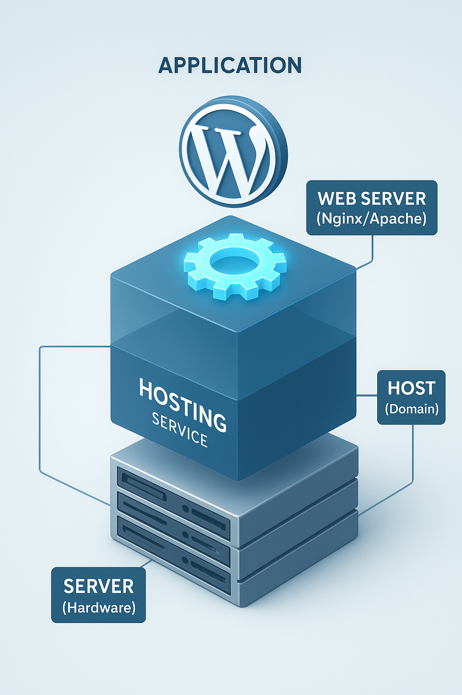
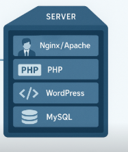
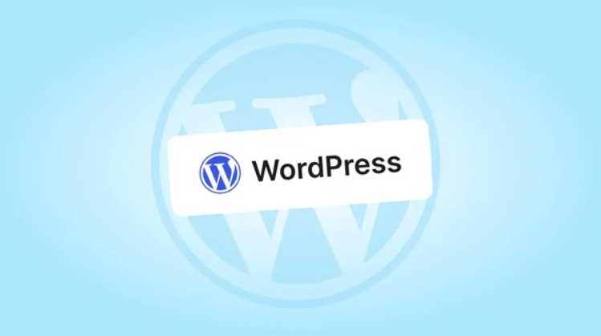
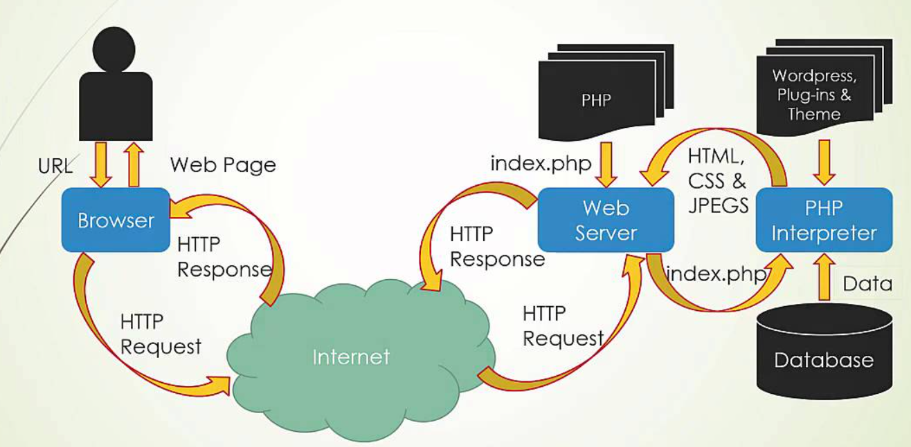
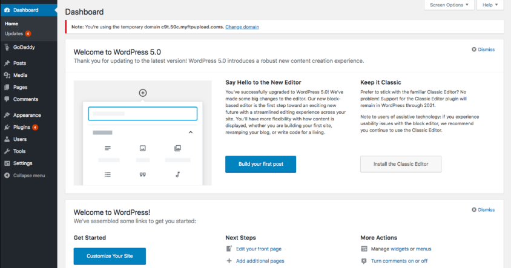
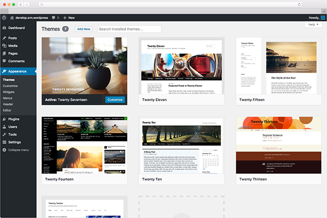
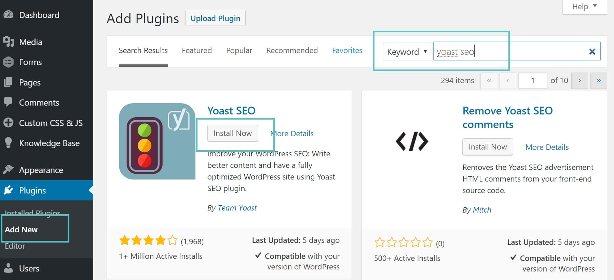
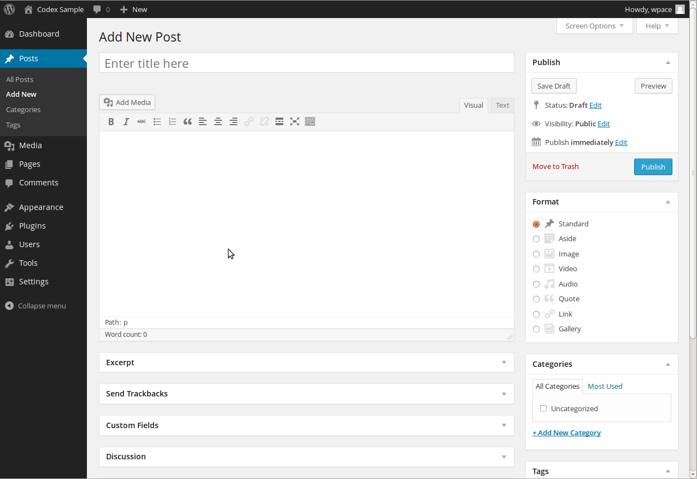
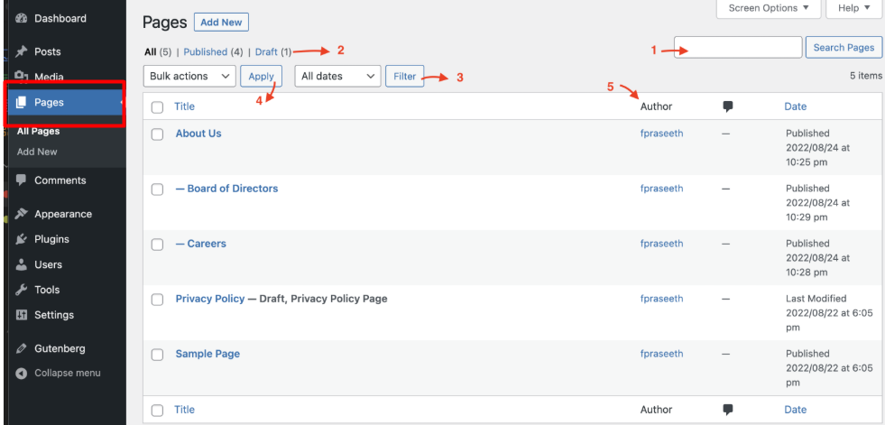
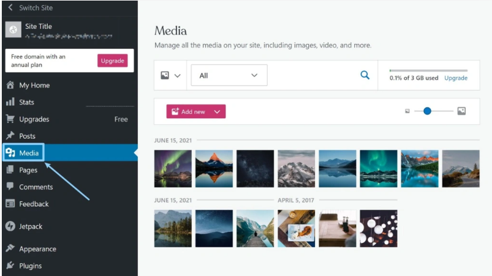

# TÌM HIỂU VỀ WORD PRESS

## TỔNG QUAN VỀ CÁC THUẬT NGỮ CẦN NẮM VỮNG

  
  

### 1. Phân loại chi tiết

#### A. SERVER (Máy chủ)

- **Định nghĩa:** Là phần cứng (Hardware) hoặc máy tính vật lý. Nó mạnh hơn máy tính cá nhân, chạy 24/7, có CPU, RAM, Ổ cứng lớn và hệ điều hành (OS) riêng (như Ubuntu, CentOS, Windows Server).
- **Vai trò:** Là nơi chứa mọi thứ: Source code, Database, các phần mềm quản lý.
- **Ví dụ đời thường:** Hãy tưởng tượng Server chính là **"Tòa nhà"**. Nó là cơ sở vật chất thực tế.

#### B. WEB SERVER (Máy chủ Web - Phần mềm)

- **Lưu ý quan trọng:** Trong ngữ cảnh LAMP/LEMP, Web Server là **Phần mềm (Software)**, KHÔNG phải phần cứng.
- **Định nghĩa:** Là phần mềm được cài đặt **trên** Server để xử lý các yêu cầu giao thức HTTP/HTTPS.
- **Vai trò:**
  - Nhận yêu cầu từ trình duyệt người dùng (VD: người dùng gõ `google.com`).
  - Tìm kiếm file tương ứng trong Server.
  - Trả kết quả (file HTML, ảnh...) lại cho người dùng.
- **Đại diện:** **Apache** (trong LAMP), **Nginx** (trong LEMP), IIS, LiteSpeed.
- **Ví dụ đời thường:** Web Server chính là **"Người quản lý/Lễ tân"** của tòa nhà. Khách đến gõ cửa hỏi "cho tôi xem phòng số 1", Lễ tân (Web Server) sẽ chạy vào lấy chìa khóa mở phòng số 1 cho khách xem.

#### C. HOSTING (Dịch vụ lưu trữ)

- **Định nghĩa:** Là một **Dịch vụ** thương mại. Các nhà cung cấp mua Server vật lý về, chia nhỏ tài nguyên ra thành nhiều gói nhỏ để cho khách hàng thuê.
- **Các loại hình:**
  - **Shared Hosting:** Một Server chia cho hàng trăm người dùng chung (giống ở ký túc xá/chung cư).
  - **VPS (Virtual Private Server):** Một Server vật lý chia ảo hóa thành các Server con riêng biệt (giống thuê căn hộ riêng).
- **Vai trò:** Giúp người dùng phổ thông có nơi lưu trữ web mà không cần tự mua máy chủ vật lý đắt tiền.
- **Ví dụ đời thường:** Hosting chính là **"Dịch vụ cho thuê phòng trọ"**. Bạn trả tiền tháng để được ở trong Tòa nhà (Server).

#### D. HOST (Máy trạm / Chủ thể)

- **Định nghĩa:** Thuật ngữ này rộng nhất và trừu tượng nhất.
  - **Trong mạng máy tính:** Host là bất kỳ thiết bị nào có địa chỉ IP và kết nối vào mạng (Máy tính của bạn cũng là host, Server cũng là host).
  - **Trong ngữ cảnh Web:** "Host" thường được dùng như một động từ (**to host** - lưu trữ). Hoặc dùng để chỉ máy chứa website.
  - **Virtual Host (trong Apache/Nginx):** Là cấu hình để một Web Server chạy được nhiều tên miền khác nhau.
- **Ví dụ đời thường:** Host có thể hiểu là **"Chủ nhà"** hoặc **"Địa chỉ nhà"** tùy ngữ cảnh.

### E. OS (Operate_Systems)

- **Định nghĩa:** Là hệ ĐH quản lí máy tính , dùng để điều khiển máy tính của bạn
- Nó là 1 thành phần con nằm trong **Sever**

### F. DATABASE (Cơ sở dữ liệu) - Chữ "M" trong LAMP/LEMP

- **Tại sao cần?**
  - WordPress có 2 phần dữ liệu:
    1. *Source Code (File):* Chứa code PHP, hình ảnh (Nằm trên ổ cứng Server).
    2. *Dữ liệu động (Data):* Bài viết, bình luận, thông tin user, mật khẩu, cấu hình (Nằm trong Database).
- **Vai trò:** Nếu ví Server là cái tủ lạnh, thì **Database** là những chiếc hộp nhựa để phân loại thức ăn (thịt, cá, rau) gọn gàng. Nếu không có Database, WordPress không biết lưu bài viết bạn vừa soạn vào đâu cả.
- **Phần mềm:** MySQL hoặc MariaDB.

### G. PHP (Trình xử lý ngôn ngữ) - Chữ "P" trong LAMP/LEMP

Bạn có Web Server (Nginx/Apache) và có mã nguồn WordPress (viết bằng PHP), nhưng 2 thằng này không tự nói chuyện được với nhau nếu thiếu **Trình thông dịch PHP**.

- **Tại sao cần?**
  - Web Server (đặc biệt là Nginx) chỉ hiểu file tĩnh (HTML, ảnh). Nó nhìn vào code PHP của WordPress nó sẽ không hiểu gì cả.
  - Cần phải cài **PHP** (hoặc **PHP-FPM** trong LEMP) để nó dịch code đó ra HTML cho Web Server hiểu.
- **Vai trò:** Nó là **"Động cơ"**. Vỏ xe là WordPress, Khung xe là Server, nhưng không có Động cơ (PHP) thì xe không chạy.

### H. DOMAIN & DNS (Tên miền & Hệ thống phân giải)

Trong danh sách cũ có chữ "Host", nhưng "Domain" cụ thể và thực tế hơn.

- **Tại sao cần?**
  - Server của bạn có địa chỉ là IP `192.168.1.10` (hoặc IP Public). Người dùng không thể nhớ số này. Họ cần gõ `google.com`.
- **DNS:** Là cuốn danh bạ giúp dịch từ `google.com` sang `IP`.
- **Vai trò:** Là **"Biển hiệu cửa hàng"**. Không có nó, khách không tìm thấy nhà hàng (Server) của bạn.

### 2. Bảng so sánh tóm tắt

| Thuật ngữ | Bản chất | Nhiệm vụ chính | Ví dụ cụ thể |
| :--- | :--- | :--- | :--- |
| **Server** | Phần cứng (Hardware) + OS | Cung cấp tài nguyên (CPU, RAM) để hệ thống chạy. | Máy Dell PowerEdge, Máy ảo trên Cloud. |
| **Web Server** | Phần mềm (Software) | "Hiểu" và trả lời các request từ trình duyệt (Chrome/Firefox). | **Apache, Nginx** (Trọng tâm bài thực tập). |
| **Hosting** | Dịch vụ (Service) | Gói dịch vụ bán cho khách hàng để chứa web. | HawkHost, Azdigi (Gói Shared Host), DigitalOcean (VPS). |
| **Host** | Thiết bị mạng / Khái niệm | Bất kỳ máy nào trong mạng, hoặc nơi chứa dữ liệu. | `localhost` (máy của bạn), Virtual Host. |
| **OS** | Hệ ĐH quản lí máy tính | quản lí phần cứng (Hardware) của máy tính CPU,RAM,Disks..|Linux,Windows,MAC,..|
| **DATABASE** | Cơ sở dữ liệu | Chứa dữ liệu Source Code và Dynamic Data mà WP lưu vào | MySQL or Maria DB |
| **PHP** | Ngôn ngữ lập trình | PHP hoạt động ở bên **Sever**, nó thực thi code và gửi dữ liệu lại về cho trình duyệt người dùng (người dùng sẽ không bao giờ thấy code php thực thi vì họ chỉ thấy k quả trả về) | Các lệnh call API tới database dùng PHP |
| **DOMAIN NAME & DNS** | Địa chỉ Website |Tên & Mã định danh cho website (DNS là hệ thống ánh xạ tên miền dựa địa chỉ IP) | google.com |

## I. WORD PRESS LÀ GÌ ?

### 1. Khái niệm WordPress

**WordPress** là hệ thống quản lí nội dung (**CMS-Content Management System** ) miễn phí và là mã nguồn mở được viết bằng **ngôn ngữ lập trình PHP** và **hệ quản trị dữ liệu MySQL** và. Cho phép người dùng tạo và quản lí các loại website khác nhau tuỳ theo nhu cầu sử dụng của người dùng.

WordPress phân phối theo giấy phép GPLv2 nên có thể tự do sử dụng, chỉnh sửa, và phân phối.

### 2. Chức năng của WordPress

- **Quản lý nội dung**:Dễ dàng tạo, chỉnh sửa, xóa và sắp xếp nội dung trên website một cách trực quan.
- **Hỗ trợ đa dạng loại nội dung**: Có thể tạo bài viết văn bản, hình ảnh, video, âm thanh và nhiều loại nội dung khác.
- **Phân quyền người dùng**: Tạo nhiều tài khoản người dùng với các vai trò và quyền hạn khác nhau (ví dụ: quản trị viên, biên tập viên,...)
- **Thân thiện với SEO**: WordPress được xây dựng với cấu trúc tốt cho **công cụ tìm kiếm (SEO)**, giúp website **dễ dàng được tìm thấy** trên Google và các công cụ tìm kiếm khác.

### 3. Ưu, Nhược điểm WordPress

| Ưu điểm | Nhược điểm |
|---------|------------|
| **Dễ sử dụng**: Phù hợp cho người mới bắt đầu với nhiều tính năng và công cụ hỗ trợ tích hợp. | **Bảo mật kém**: Dễ bị tấn công nếu không cập nhật phiên bản và plugin thường xuyên.|
| **Quản lý dễ dàng**: Giao diện khoa học, thân thiện, dễ thao tác với các mục như bài viết, giao diện, cài đặt. | **Phụ thuộc plugin bên thứ ba**: Có thể gây xung đột hoặc không tương thích với WordPress. |
| **Tối ưu SEO**: Các công cụ mặc định giúp tối ưu SEO hiệu quả cho website. | **Tốc độ tải trang chậm**: Sử dụng theme nặng hoặc nhiều plugin không hợp lý có thể ảnh hưởng hiệu suất. |
| **Thân thiện với di động**: Tùy chỉnh chức năng phù hợp với trải nghiệm người dùng trên điện thoại. | **Hạn chế của theme miễn phí**: Thiếu tính năng và khả năng tùy chỉnh, cần nâng cấp để đáp ứng nhu cầu. |
| **Tiết kiệm chi phí**: Nhiều theme và plugin miễn phí có sẵn.      |  |
| **Thiết kế đa dạng**: Hệ thống plugin và theme phong phú giúp tạo ra nhiều loại trang web mà không tốn thời gian.                                                                |  |
| **Hỗ trợ nhiều ngôn ngữ**: Hỗ trợ 52 ngôn ngữ, bao gồm Tiếng Việt. |  |
| Cộng đồng lớn mạnh: Cộng đồng thân thiện, hữu ích và sáng tạo.     |  |

### 4. Phân loại WordPress

`WordPress.com` và `WordPress.org` là hai phiên bản khác nhau của nền tảng WordPress:

**WordPress.com:**

- Là một nền tảng cung cấp dịch vụ tạo và quản lý trang web trực tuyến: Hoạt động dựa trên mô hình dịch vụ lưu trữ trực tuyến (hosted service), bạn không cần phải tự cài đặt WordPress lên máy chủ của mình.
- `.com` giới hạn phạm vi tùy chỉnh, bạn chỉ có thể sử dụng các theme và plugin được chọn sẵn bởi nền tảng. Không thể tự cài đặt theme và plugin từ bên ngoài.
- Quản lý và bảo mật máy chủ do `WordPress.com` đảm nhiệm, giúp người dùng tập trung vào nội dung và chạy trang web mà không phải quan tâm đến việc quản lý máy chủ.

**WordPress.org:**

- Là phiên bản mã nguồn mở của WordPress và được cung cấp miễn phí tại trang web `wordpress.org`.
- Bạn phải tự tải xuống mã nguồn và cài đặt WordPress lên máy chủ riêng của mình hoặc dịch vụ lưu trữ máy chủ của bên thứ ba.
- Bạn hoàn toàn tự do tùy chỉnh website, sử dụng bất kỳ theme và plugin nào bạn muốn. Điều này cho phép bạn tạo một trang web hoàn toàn độc đáo và theo ý muốn.
- Bạn phải tự chịu trách nhiệm quản lý và bảo mật máy chủ hoặc tùy chỉnh các thiết lập cần thiết để chạy WordPress.

Tóm lại, WordPress.com là phiên bản được quản lý và cung cấp dịch vụ trực tuyến, trong khi WordPress.org là phiên bản mã nguồn mở, cho phép bạn tự quản lý và tùy chỉnh hoàn toàn trang web của mình.

**So sánh `.com` và `.org`**:

| Tiêu chí | WordPress.com | WordPress.org |
| :--- | :--- | :--- |
| **Bản chất** | Dịch vụ trọn gói, đã bao gồm hosting. | Phần mềm mã nguồn mở, bạn phải tự cài đặt. |
| **Chi phí** | Có gói miễn phí (với nhiều hạn chế) và các gói trả phí hàng tháng. | Phần mềm miễn phí, nhưng bạn phải trả tiền cho tên miền và hosting. |
| **Tên miền** | Gói miễn phí có dạng `tenban.wordpress.com`. Muốn tên miền riêng phải trả phí. | Bạn có toàn quyền sử dụng tên miền riêng (ví dụ: `interdata.vn`). |
| **Tùy biến** | Hạn chế. Không thể cài đặt theme và plugin từ bên ngoài (trừ gói Business trở lên). | Toàn quyền tùy biến. Cài đặt bất kỳ theme và plugin nào bạn muốn. |
| **Kiếm tiền** | Hạn chế. Không được tự do đặt quảng cáo (trừ gói Business). | Tự do tuyệt đối. Bạn có thể kiếm tiền bằng mọi hình thức (quảng cáo, affiliate…). |
| **Bảo trì** | WordPress.com tự lo việc bảo trì, cập nhật, sao lưu. | Bạn phải tự chịu trách nhiệm về bảo trì, cập nhật, sao lưu. |
| **Phù hợp cho** | Người mới bắt đầu, blogger cá nhân không yêu cầu tùy biến cao, muốn sự đơn giản. | Doanh nghiệp, blogger chuyên nghiệp, cửa hàng online, người muốn toàn quyền kiểm soát website. |

### 5. Cơ chế hoạt động của WordPress

`Bước 1`: **Trình duyệt gửi yêu cầu (HTTP Request)**

- Người dùng nhập URL như <https://example.com/san-pham/may-giat-lg.>
- Trình duyệt gửi một HTTP request đến web server (nơi chứa website WordPress).
- Ví dụ: yêu cầu tới index.php, kèm theo thông tin như cookies, headers, query string...

`Bước 2`: **Web server nhận và chuyển đến `index.php`**

- Web server (Apache hoặc Nginx) định tuyến yêu cầu đến file `index.php` trong thư mục gốc của WordPress.
- Đây là **entry point (điểm vào)** cho mọi request trong WordPress.

`Bước 3`: **Tải `wp-blog-header.php` và `wp-load.php`**

- File `index.php` gọi `wp-blog-header.php`, từ đó gọi `wp-load.php`.
- `wp-load.php` dùng để nạp toàn bộ hệ thống WordPress core.

`Bước 4`: **WordPress khởi động hệ thống (Bootstrap)**

- WordPress sẽ:
  - Nạp **core files** (hàm, class,...).
  - Nạp **theme hiện tại**.
  - Nạp **plugin đã kích hoạt**.
  - Nạp file `functions.php` trong theme.
- Giai đoạn này còn gọi là  **WordPress Initialization**.

`Bước 5`: **Chạy các hooks đầu tiên (Actions & Filters)**

- WordPress sẽ kích hoạt các hook hệ thống như:
  - `plugins_loaded`
  - `init`
  - `wp_loaded`
- Lúc này các plugin hoặc custom code có thể can thiệp vào hệ thống.

`Bước 6`: **Phân tích URL với Rewrite & Routing**

- WordPress sử dụng **Rewrite Rules** để xác định URL đó ứng với nội dung gì:
  - Bài viết?
  - Trang tĩnh?
  - Danh mục?
  - Sản phẩm (Custom Post Type)?
- *Ví dụ:* `/san-pham/may-giat-lg` -> Custom Post Type `product`

`Bước 7`: **Truy vấn CSDL bằng WP_Query**

- WordPress tạo ra một đối tượng `WP_Query` để truy vấn cơ sở dữ liệu.
- Nó tìm kiếm post, page, hoặc CPT phù hợp với URL người dùng đã nhập.
- Dữ liệu được lấy từ các bảng như: `wp_posts`, `wp_postmeta`, `wp_terms`,...

`Bước 8`: **Render nội dung bằng Template Hierarchy**

- WordPress kiểm tra **cấu trúc giao diện (template hierarchy)** để xác định file hiển thị nội dung.
- Ví dụ:
  - Trang sản phẩm → `single-product.php` → nếu không có thì dùng `single.php` → nếu không có nữa thì dùng `index.php`.
- Gọi file như: `header.php`, `content.php`, `footer.php`,...

`Bước 9`: **Kết hợp dữ liệu + giao diện → Xuất HTML**

- Kết quả được "gắn" dữ liệu từ CSDL vào các template HTML.
- WordPress xuất nội dung cuối cùng ra trình duyệt dưới dạng: HTML, CSS, JS, hình ảnh, video,...

`Bước 10`: **Web server gửi HTTP Response về trình duyệt**

- Toàn bộ trang web được gửi lại dưới dạng HTTP Response.
- Trình duyệt nhận HTML/CSS và render ra website hoàn chỉnh cho người dùng xem.

**Những thành phần đóng vai trò quan trọng:**

| Thành phân         | Vai trò chính                               |
|--------------------|---------------------------------------------|
| `index.php`        | Entry point, khởi động toàn hệ thống        |
| `wp-load.php`      | Nạp cấu hình WordPress                      |
| `functions.php`    | Nạp chức năng tùy chỉnh của theme           |
| `WP_Query`         | Truy vấn dữ liệu                            |
| Rewrite Rules      | Xử lý URL đẹp (Pretty Permalink)            |
| Template Hierarchy | Xác định file nào dùng để hiển thị nội dung |

### 6. Thành phần giao diện làm việc trên WordPress

- **Dashboard**: Là bảng điều khiển trang web dành cho quản trị viên. Đó chính là màn hình đầu tiên mà người dùng nhìn thấy khi đăng nhập vào khu vực quản trị WordPress. **Dashboard** là nơi giúp người tạo lập và kiểm soát hầu hết các chức năng trên trên website của mình.

- **Themes WordPress (WordPress template)**: Là giao diện của website hoặc blog sử dụng WordPress. Có rất nhiều themes wordpress, bao gồm miễn phí và trả phí.

- **WordPress Plugin**: Đây là các thành phần mở rộng của WordPress, được chia sẻ trên kho Plugin của WordPress. Những Plugin này do chính những người trong nhóm sáng lập WordPress viết ra hoặc cũng có thể do người dùng tự viết và chia sẻ. Plugin này cũng có 2 dạng: 1 dạng miễn phí và 1 dạng phải trả phí.

- **Posts**: Là nơi tạo và quản lý các nội dung theo dạng blog, thường được sắp xếp theo thời gian và có thể gắn thẻ (tags) và danh mục (categories)

  - All posts: Quản lý tất cả các bài viết.
  - Add new: Đăng bài viết mới.
  - Categories: Quản lý tất cả các danh mục.
  - Tags: Quản lý tất cả các Post Tag.

**Trang (Pages)**: nơi tạo và quản lý các nội dung tĩnh, ít thay đổi như trang giới thiệu, trang liên hệ, trang dịch vụ, v.v.

**Thư viện Media (Media Library)**: nơi tải lên và quản lý các tệp đa phương tiện như hình ảnh, video, âm thanh để sử dụng trong bài viết và trang web

- **Comments**: Trang quản lý các ý kiến bình luận trên website của bạn. Bạn có thể xoá hoặc cấm bất kỳ người nào sử dụng chức năng này trên web của bạn.

- **Feedback**: Là trang quản lý những hồi âm, liên hệ của khách hàng gửi cho bạn.

- **Users**: Trang quản lý người dùng đã đăng ký sử dụng tại website của bạn. Bạn có thể thêm, xoá hoặc phân quyền cho bất kỳ người dùng nào tại trang này.

- **Users**: Trang quản lý người dùng đã đăng ký sử dụng tại website của bạn. Bạn có thể thêm, xoá hoặc phân quyền cho bất kỳ người dùng nào tại trang này.

- **Tools**: Trang quản lý xuất/nhập dữ liệu. Bạn có thể xuất ra file để làm file backup cho website phòng trường hợp website của bạn bị hack, bị mất dữ liệu trong tương lai, từ đó bạn có thể sử dụng công cụ import để khôi phục lại dữ liệu đã export.

- **Settings**: Trang chỉnh sửa các thông số chung cho website như url của web, timezone, Date Format, cấu trúc đường dẫn,…. Thông thường việc quản lý và chỉnh sửa thông số của các Plugin cũng được thực hiện tại đây.
