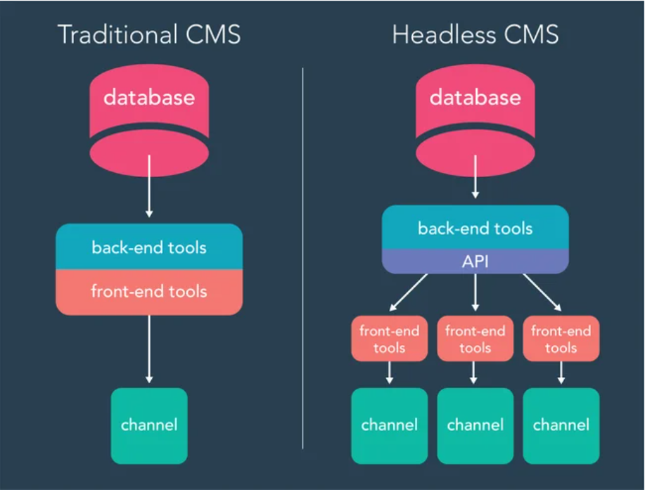
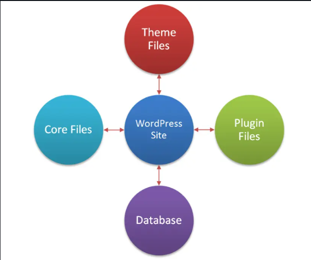

# TÌM HIỂU CÁC THÀNH PHẦN TRONG WORDPRESS

## I. WORDPRESS ARCHITECTURE

Kiến trúc WordPress là sự kết hợp giữa **lập trình thủ tục (procedural)**, các **mẫu hướng đối tượng (object-oriented patterns)** và **thiết kế hướng sự kiện (event-driven)**. Nó hoạt động dựa trên nền tảng **LAMP/LEMP stack cổ điển** (Linux, Apache/Nginx, MySQL/MariaDB, PHP).

Ở cấp độ cao nhất, WordPress hoạt động theo các tầng:

- Tầng Client (Người dùng): Trình duyệt (Người xem hoặc Admin) hoặc ứng dụng bên ngoài (thông qua REST API).
- Tầng Server (Máy chủ): Web Server (Nginx/Apache) + Trình thông dịch PHP.
- Tầng Ứng dụng (Application): WordPress Core (Xử lý logic, Định tuyến, Tải giao diện).
- Tầng Dữ liệu (Data): MySQL/MariaDB.

  - `channel` là 1 **kênh đầu ra** chính là **ứng dụng** mà chúng ta **thấy** trên **màn hình thiết bị của ta**

Ở cấp độ thấp hơn, WP chia ra làm 2 loại: **CMS cổ điển** và **Headless CMS**

### 1. Traditional CMS (CMS Truyền thống) - Hình bên trái

 Đây là kiểu "tất cả trong một" (All-in-one).

- **Cấu trúc**: Ta thấy cái hộp màu xanh và đỏ nó dính liền nhau không? Điều này có nghĩa là phần quản trị nội dung **(Back-end)** và phần hiển thị giao diện cho người xem **(Front-end)** bị **gắn chặt vào nhau.**
- **Cách hoạt động**: Khi ta viết bài, hệ thống sẽ lưu vào **Database**, sau đó chính **hệ thống đó** sẽ **render** ra giao diện **HTML** để hiển thị lên **trình duyệt**.
- **Đầu ra (Channel)**: Thường chỉ có **một đầu ra** duy nhất là **trang Web**.
- **Ví dụ**: Một trang WordPress bình thường. Ta cài **theme**, **viết bài**, và nó hiện lên web. Ta khó có thể lấy nội dung đó để hiển thị lên một cái App điện thoại hay đồng hồ thông minh một cách dễ dàng.

### 2. Headless CMS (CMS Không đầu) - Hình bên phải

Đây là kiểu **"chia để trị" (Decoupled)**.

- **Cấu trúc**: Phần **Back-end (quản lý nội dung)** và **Front-end (hiển thị)** bị **cắt đứt**. Phần **"đầu" (giao diện mặc định) đã bị chặt bỏ**, nên gọi là **"Headless"**.
- **Cầu nối (API)**: Thay vì dính liền, nó dùng một lớp ở giữa màu tím gọi là **API**.
- **Cách hoạt động**:

  - Ta viết bài, lưu vào Database.
  - Hệ thống Back-end chỉ làm nhiệm vụ lưu trữ và cung cấp **dữ liệu thô (thường là JSON)** qua **API**.
  - Nó không quan tâm việc hiển thị thế nào.

- **Đầu ra (Channels)**: Đây là sức mạnh chính. Từ một nguồn dữ liệu đó, API có thể bắn dữ liệu ra nhiều nơi cùng lúc:

  - 1 cái cho **Web (React/Vue)**.
  - 1 cái cho **App Mobile (iOS/Android)**.
  - 1 cái cho màn hình thông minh **(Smartwatch/IoT)**.

### 3. Tóm lại

- **Traditional CMS**: Giống như một nhà hàng phục vụ phở. Chỉ có thể nấu phở ra 1 cái bát và khách chỉ có thể ăn bằng bát

- **Headless CMS**: còn Headless CMS có thể phục vụ ra bát giấy, đóng lon xuất khẩu hay cặp lồng để mang đi và khách sẽ có nhiều lựa chọn để mang đi ăn hơn

- **WordPress**: Ngày xưa **WordPress** đại diện cho **Traditional CMS**. Nhưng từ khi xuất hiện **RESTful API**:

Ta vẫn dùng **WordPress Admin** để **viết bài**.
Nhưng mày **vứt bỏ** hoàn toàn hệ thống **Theme** của nó.
Mày dùng **React, Vue, hay Next.js** để **xây dựng giao diện riêng**, rồi **gọi dữ liệu** từ **WordPress** qua **API**

=> Thế nên, xu hướng bây giờ WordPress là một **Headless CMS**

## II. `WORKPRESS SITE` COMPONENTS

Để xây dựng một website bằng wordpress, cần hiểu rõ các thành phần chính tạo nên và vận hành website đó. các thành phần cần thiết được chia rõ ràng theo từng cấp độ từ hạ tầng cho đến giao diện và tính năng. Các thành phần bao gồm:

### 1. Hạ tầng (Hosting & Server)

| Thành phần | Vai trò |
|-----------|---------|
| **Webserver (Apache / Nginx)** | Xử lý yêu cầu từ trình duyệt, trả nội dung website. |
| **PHP** | Ngôn ngữ giúp WordPress hoạt động. |
| **MySQL/MariaDB** | Lưu trữ toàn bộ dữ liệu website. |
| **Domain name** | Địa chỉ truy cập website (vd: mysite.com). |
| **Laragon/XAMPP (Local)** | Môi trường chạy WordPress trên máy tính cá nhân. |

#### Các loại hosting

- **Shared Hosting:** chi phí thấp, nhiều giới hạn.
- **VPS:** máy chủ ảo riêng.
- **Dedicated Server:** toàn bộ máy chủ vật lý.
- **Managed WordPress Hosting:** tối ưu riêng cho WordPress.
- **Cloud Hosting:** linh hoạt, dễ mở rộng.

### 2. WordPress Core (Phần mềm trung tâm)

| Thành phần | Vai trò |
|-----------|---------|
| **WordPress Core** | Hệ thống file PHP xử lý toàn bộ chức năng WordPress. |
| **wp-config.php** | Cấu hình database, bảo mật, các thiết lập quan trọng. |
| **.htaccess / nginx.conf** | Cấu hình URL Rewrite, bảo mật, cache. |
| **wp-content/** | Nơi chứa theme, plugin, uploads và dữ liệu tùy biến. |

### 3. Giao diện (Themes)

| Thành phần | Vai trò |
|-----------|---------|
| **Theme** | Kiểm soát giao diện, bố cục, màu sắc website. |
| **File theme** | style.css, index.php, functions.php, single.php,... |
| **Child theme** | Tùy chỉnh giao diện mà không ảnh hưởng theme gốc. |

### 4. Chức năng mở rộng (Plugins)

| Thành phần | Vai trò |
|-----------|---------|
| **Plugins** | Thêm tính năng mới cho WordPress. |
| **Plugin phổ biến** | Yoast SEO, Contact Form 7, WooCommerce, Elementor, WP Rocket... |
| **Custom plugin** | Viết plugin riêng cho yêu cầu đặc biệt. |

### 5. Cơ sở dữ liệu (Database)

| Thành phần | Vai trò |
|-----------|---------|
| **MySQL/MariaDB** | Lưu bài viết, trang, user, setting,... |
| **Bảng quan trọng** | wp_posts, wp_users, wp_options, wp_terms,... |
| **phpMyAdmin** | Giao diện quản lý database. |

### 6. Nội dung website

| Thành phần | Vai trò |
|-----------|---------|
| **Pages (Trang)** | Nội dung tĩnh: Giới thiệu, Liên hệ, Dịch vụ,... |
| **Posts (Bài viết)** | Nội dung blog, tin tức. |
| **Media** | Hình ảnh, video, file trong thư viện Media Library. |
| **Menu** | Điều hướng website. |
| **Widgets** | Khối sidebar, footer, block nhỏ tùy theme hỗ trợ. |

### 7. Cấu hình & Cài đặt

| Thành phần | Vai trò |
|-----------|---------|
| **Cài đặt chung** | Tiêu đề, mô tả, ngôn ngữ, timezone,... |
| **Permalinks** | Cấu trúc đường dẫn URL thân thiện. |
| **Thành viên & phân quyền** | Admin, Editor, Author, Subscriber,... |
| **Cài đặt plugin/theme** | Qua Dashboard hoặc upload .zip. |

## DIR - ARCHITECTURE OF FILE WORDPRESS

wordpress/  
├── wp-admin/                    # Thư mục quản trị (Admin Dashboard)  
│   ├── css/                    # CSS cho admin  
│   ├── images/                 # Hình ảnh admin  
│   ├── includes/               # Files PHP core admin  
│   ├── js/                     # JavaScript admin  
│   ├── maint/                  # Maintenance tools  
│   ├── network/                # Network/Multisite admin  
│   ├── user/                   # User management  
│   ├── index.php              # Trang chủ admin dashboard  
│   ├── admin.php              # Core admin handler  
│   ├── edit.php               # Quản lý posts  
│   ├── post.php               # Tạo/sửa post  
│   ├── upload.php             # Quản lý media  
│   ├── themes.php             # Quản lý themes  
│   ├── plugins.php            # Quản lý plugins  
│   ├── users.php              # Quản lý users  
│   ├── options-general.php    # Settings  
│   └── ...  
│  
├── wp-content/                  # Thư mục nội dung (QUAN TRỌNG NHẤT!)  
│   ├── plugins/                # Các plugin đã cài  
│   │   ├── akismet/           # Plugin chống spam mặc định  
│   │   ├── hello.php          # Plugin hello dolly mặc định  
│   │   └── (các plugin khác)/  
│   │  
│   ├── themes/                 # Các theme (giao diện)  
│   │   ├── twentytwentyfour/  # Theme mặc định 2024  
│   │   ├── twentytwentythree/ # Theme mặc định 2023  
│   │   ├── twentytwentytwo/   # Theme mặc định 2022  
│   │   └── (các theme khác)/  
│   │  
│   ├── uploads/                # File upload (ảnh, video, PDF...)  
│   │   ├── 2025/              # Theo năm  
│   │   │   ├── 01/            # Theo tháng  
│   │   │   ├── 02/  
│   │   │   └── ...  
│   │   └── ...  
│   │  
│   ├── languages/              # File ngôn ngữ (i18n)  
│   ├── upgrade/                # Files tạm khi update  
│   ├── cache/                  # Cache (nếu dùng plugin cache)  
│   └── index.php              # File bảo vệ (prevent directory listing)  
│  
├── wp-includes/                 # Thư mục core WordPress (KHÔNG SỬA!)  
│   ├── css/                    # CSS core  
│   ├── images/                 # Hình ảnh core  
│   ├── js/                     # JavaScript core  
│   ├── certificates/           # SSL certificates  
│   ├── fonts/                  # Fonts  
│   ├── widgets/                # Widgets core  
│   ├── class-*.php            # Classes core  
│   ├── functions.php          # Core functions  
│   ├── plugin.php             # Plugin API  
│   ├── post.php               # Post functions  
│   ├── user.php               # User functions  
│   ├── formatting.php         # Formatting functions  
│   ├── version.php            # WordPress version info  
│   └── ...  
│  
├── wp-config.php               # File cấu hình QUAN TRỌNG NHẤT  
├── wp-config-sample.php        # Template file config  
├── index.php                   # File khởi động WordPress  
├── wp-login.php                # Trang đăng nhập  
├── wp-signup.php               # Trang đăng ký (multisite)  
├── wp-activate.php             # Kích hoạt account (multisite)  
├── wp-blog-header.php          # Load WordPress environment  
├── wp-load.php                 # Bootstrap WordPress  
├── wp-settings.php             # Setup WordPress environment  
├── wp-cron.php                 # Cron jobs (scheduled tasks)  
├── wp-links-opml.php           # Export links  
├── wp-mail.php                 # Post via email  
├── wp-trackback.php            # Trackback handler  
├── xmlrpc.php                  # XML-RPC API (remote publishing)  
├── license.txt                 # GPL license  
├── readme.html                 # Readme file  
└── .htaccess                   # Apache rewrite rules (nếu có)  
