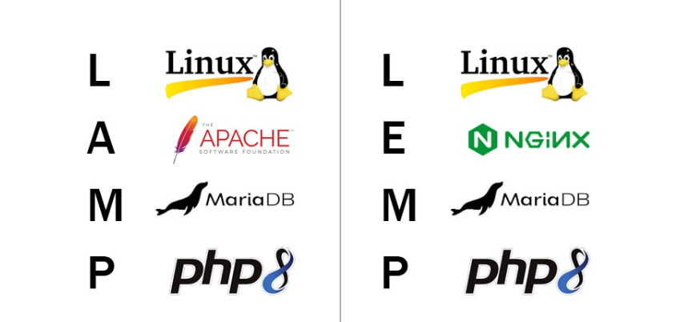

# TÌM HIỂU LAMP/LEMP STACKS

LAMP và LEMP là hai bộ phần mềm mã nguồn mở phổ biến được sử dụng rộng rãi để xây dựng và triển khai các ứng dụng web động, đặc biệt là các website. Chúng được gọi là "stack" vì chúng hoạt động cùng nhau theo lớp, với mỗi thành phần đảm nhận một vai trò cụ thể trong quá trình phục vụ nội dung web cho người dùng.

## 1. Điểm giống nhau (L - M - P)

Cả hai stack đều dùng chung 3 thành phần cốt lõi:

- `L - Linux` (Hệ điều hành): Là cái nền, cái móng. Linux (Ubuntu, CentOS, Debian...) là hệ điều hành mã nguồn mở, miễn phí và ổn định nhất cho server.
- `M - MySQL / MariaDB` (Cơ sở dữ liệu): Là cái kho. Nơi lưu trữ dữ liệu.
- `P - PHP` (Ngôn ngữ lập trình): Là đầu bếp. Người xử lý các yêu cầu logic.

## 2. Sự khác biệt: A vs E (Webserver)

Sự khác biệt nằm ở chữ cái thứ 2, quyết định cách server tiếp nhận và trả lời khách truy cập.

**LAMP Stack (L - Apache - M - P):**

- `A = Apache`: Đây là Webserver "gạo cội", ra đời từ năm 1995.
- **Cơ chế hoạt động**: Apache xử lý yêu cầu theo kiểu "mỗi khách một nhân viên" (Process-based). Khi có kết nối mới, nó tạo ra một luồng xử lý riêng.

- **Ưu điểm**:

  - **Linh hoạt**: Hỗ trợ file `.htaccess`. Đây là điểm cực mạnh cho WordPress. Bạn có thể cấu hình đường dẫn (permalink), chặn IP, cài bảo mật ngay trong thư mục web mà không cần khởi động lại server.
  - **Dễ dùng**: Hầu hết các **Shared Hosting** đều dùng LAMP vì dễ cho người dùng phổ thông tùy biến.
  - **Tương thích**: Hỗ trợ module cực nhiều, cài là chạy.

- **Nhược điểm**:

  - **Hiệu năng**: Khi lượng truy cập cực lớn (hàng nghìn người cùng lúc), Apache dễ bị "đuối" và tốn RAM vì phải tạo quá nhiều luồng xử lý.
  
**LEMP Stack (L - Nginx - M - P):**

- `E = Nginx`: (Đọc là "Engine-X", nên viết tắt là E). Ra đời năm 2004 để giải quyết vấn đề hiệu năng.
- **Cơ chế hoạt động**: Nginx xử lý theo kiểu "hướng sự kiện" (**Event-driven**). Một nhân viên có thể xử lý hàng ngàn yêu cầu cùng lúc không cần tạo luồng mới.

- **Ưu điểm**:

  - **Tốc độ**: Xử lý file tĩnh (ảnh, css, js) nhanh hơn Apache rất nhiều (nhanh hơn khoảng 2.5 lần).
  - **Chịu tải**: Tiêu tốn cực ít RAM. Có thể chịu được lượng truy cập khổng lồ mà không bị sập (đây là lý do các web lớn như Facebook, Netflix, Google dùng Nginx hoặc công nghệ tương tự).
  - **Reverse Proxy**: Nginx làm proxy (trung gian) cực tốt để cân bằng tải.

- **Nhược điểm**:

  - **Không hỗ trợ .htaccess**: Đây là điểm đau đầu nhất với người dùng WordPress mới. Mọi cấu hình rewrite url, chặn IP... phải viết vào file cấu hình của Server (nginx.conf) và cần khởi động lại dịch vụ.
  - **Cấu hình khó hơn**: Đòi hỏi kiến thức quản trị server tốt hơn.

## 3. Bảng so sánh nhanh

| Đặc điểm            | **LAMP (Apache)**                        | **LEMP (Nginx)**                                |
|---------------------|------------------------------------------|-------------------------------------------------|
| **Webserver**       | Apache HTTP Server                       | Nginx (Engine-X)                                |
| **File cấu hình**   | Hỗ trợ `.htaccess` (tiện lợi, linh hoạt) | Không hỗ trợ `.htaccess` → rewrite phức tạp hơn |
| **Hiệu năng**       | Tốt, phù hợp web vừa và nhỏ              | Rất cao, tối ưu cho web lớn, tải cao            |
| **Tài nguyên**      | Tốn RAM hơn khi nhiều traffic            | Tốn rất ít RAM, xử lý tốt ở tải lớn             |
| **Xử lý file tĩnh** | Bình thường                              | Rất nhanh                                       |
| **Độ khó**          | Dễ bắt đầu                               | Trung bình – khó hơn khi config                 |

## 4. Nên chọn cái nào cho WordPress?

**Chọn LAMP khi**:

- Bạn mới bắt đầu học làm web hoặc quản trị server.
- Bạn dùng **Shared Hosting** (hầu hết mặc định là **LAMP hoặc LiteSpeed** - một bản nâng cấp của Apache).
- Bạn cần sự tiện lợi của file `.htaccess` để cấu hình plugin (như **iThemes Security, WP Rocket, Yoast SEO** thường ghi quy tắc vào file này).

**Chọn LEMP khi**:

- Bạn dùng VPS hoặc Server riêng.
- Website của bạn có lượng truy cập lớn (traffic cao).
- Bạn muốn website tải nhanh nhất có thể.
- Bạn có kiến thức kỹ thuật để cấu hình Nginx (hoặc dùng các script cài tự động như **Laragon, VPSSIM, WordOps**...).
