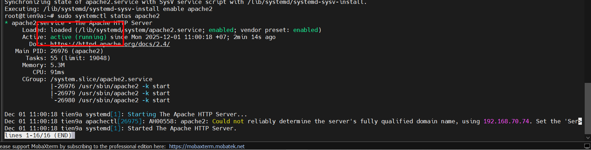

# BUILD WEBSITE LAMP/LEMP

## 1. Sơ đồ tư duy cho bài thực tập LAMP/LEMP

1. Bạn tạo một máy ảo trên VMware/VirtualBox => Bạn đang giả lập một **SERVER**.
2. Bạn gõ lệnh `apt install apache2` hoặc `apt install nginx` => Bạn đang cài đặt **WEB SERVER**.
3. Bạn cấu hình để máy đó chạy được WordPress => Bạn đang biến nó thành một **HOST** chứa web.
4. Nếu bạn làm xong, bạn bán quyền truy cập máy đó cho người khác => Bạn đang kinh doanh **HOSTING**.

**Function:**
> *"Trong mô hình LAMP, **Linux** đóng vai trò là hệ điều hành quản lý tài nguyên **Server**. **Apache**,**Nginx** đóng vai trò là **Web Server**, chịu trách nhiệm tiếp nhận request từ Client (trình duyệt) qua cổng 80/443 và điều phối việc xử lý mã nguồn PHP..."*

## 2. Mục tiêu

Dựng 2 website wordpress chạy trong máy ảo ubuntu sử dụng **LAMP (Linux + Apache + MySQL + PHP)** và **LEMP (Linux + Nginx + MySQL + PHP)**.

## 3. Các bước triển khai Web

### a, Với LAMP Stack

**`Bước 1`: Cập nhật hệ thống ubuntu**

```bash
sudo apt update
sudo apt upgrade -y
```

Việc cập nhật và nâng cấp đảm bảo có các gói mới nhất, ổn định và bảo mật.

**`Bước 2`: Cài đặt Apache webserver**

```bash
# Tải Apache
sudo apt install apache2 -y

# Khởi động Apache
sudo systemctl start apache2

# Để Apache khởi động cùng hệ thống
sudo systemctl enable apache2

# Kiểm tra trạng thái Apache
sudo systemctl status apache2
```

Sau khi cài đặt apache, kiểm tra trạng thái nếu thành công sẽ có dòng `active (running)`:

