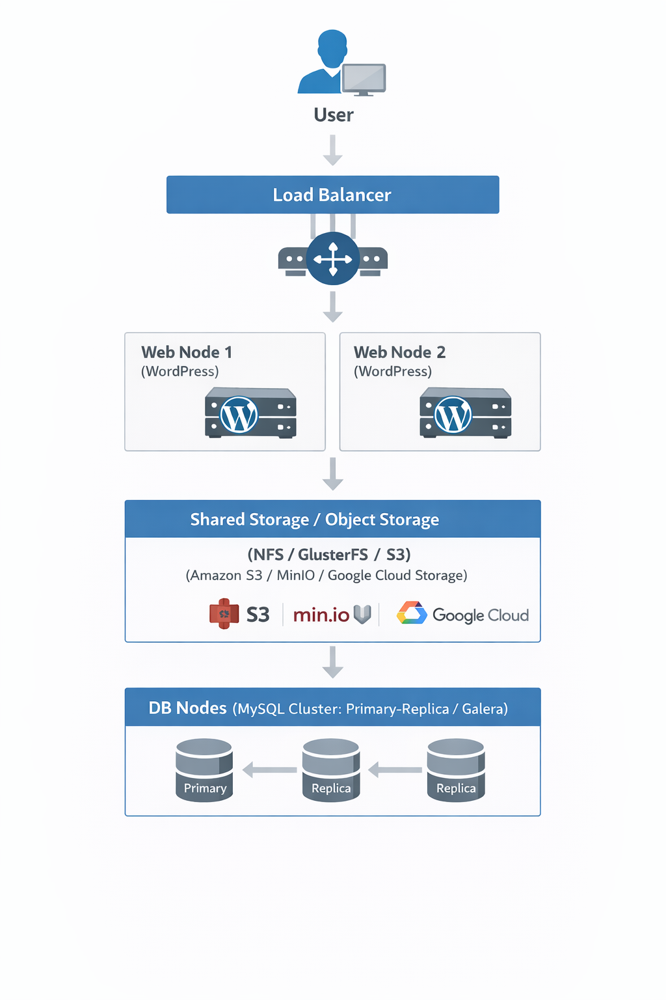

# WORDPRESSHA

Một trang web được triển khai thì có một thuật ngữ chúng ta cần quan tâm đó là **Traffic**(hay còn gọi là **lượt truy cập trang web**). Web càng lớn và càng phổ biến thì ta có lưu lượng **Traffic** càng nhiều. Vfa khi có lượng **Traffic** nhiều thì chúng ta sẽ cần phải quan tâm đến 1 khái niệm nữa đó là **WordpressHA** hay còn gọi là **WordpressHighAvailability**

Nói đến **Traffic** đối với team **SEO** và **Marketing** là 1 yếu tố mà họ cần để đánh giá chiến lược cho việc marketing trong tương lai. Ngoài ra, nói đến còn 1 số thuật ngữ chúng ta cần quan tâm đến

- **Pageviews (PV)**: số lần trang được tải (một người refresh nhiều lần vẫn tính nhiều)

- **Visits / Sessions**: số phiên truy cập (một người vào web rồi lướt trong một khoảng thời gian)

- **Users / Visitors**: số người dùng (thường là unique users)

- **Hits**: số request tới server (ít dùng để đánh giá vì 1 trang có thể tạo rất nhiều hit)

- **Traffic website**: cách nói chung cho tất cả mấy chỉ số trên



## I. GIỚI THIỆU TỔNG QUAN VỀ WORDPRESS HA

### 1. High Availability(HA) là gì ?

- HA (High Availability) = Tính sẵn sàng cao

- Mục tiêu của **HA** với **WordPress**:

  - Website luôn online
  - Một Sever `die` thì có Sever khác `thay thế` (tính reserved)
  - Giảm **downtime** (thời gian web sập) về mức thấp nhất
  - Tránh downtime để ảnh hưởng tới doanh thu và trải nghiệm của khách hàng

### 2. WordPressHA là gì ?

- **WordPressHA** là **kiến trúc/mô hình** triển khai WordPress cùng với:
  - Nhiều WebSever WordPress (có web dự phòng khi web chính `die`)
  - Có **Load Balancer** ở phía trước Sever nhằm cân bằng user (khi web chính vượt `limit traffic` nó sẽ san ra web dự phòng)
  - **Database & Storage** dùng chung

    - **Storage**: là nơi lưu trữ SourceCode và Data(Data user `UPLOAD` lên) một cách đảm bảo lâu dài, nơi chia sẻ data giữa các sever, nơi Backup & Recovery dữ liệu
    - Ngoài ra có nhiều kiểu **Storage** như: **Local Storage** (Ổ cắm trực tiếp vào Sever như SSD,HDD,NVMe), **Net Storage**(`NAS` - `NetworkAttachStorage`, `SAN`-`StorageAreaNetwork`) hay **CloudStorage**(`Object Storage` - S3, GCS -> Nơi lưu ảnh, file, backup; `Block Storage`- EBS ->gắn như ổ cứng hay `File Storage` - EFS,NFS->Dùng như thư mục)

  - Không có SPOF(Single point of failure hay điểm mà nếu nó sập cả sever sập theo)

### Kiến trúc và Thành phần trong WordPress HA


**Trong đó**:

#### Load balancer(Nginx/ HAProxy/ AWS ELB)

- **Khái niệm**: Là bộ chia tải (phân phối lưu lượng truy cập) và bảo vệ hệ thống khỏi sập

- **Tác dụng**:

  - Loại bỏ **SPOF**

  - Chia tải truy cập, **LB** chia đều request cho :

    - WP-Node-1
    - WP-Node-2
    - WP-Node-3  

    ->Mục đích: Không sever nào bị quá tải

  - Thực hiện **HealthCheck & FailOver**:

    - LB liên tục kiểm tra Nginx/Apache hoặc kiểm tra PHP-FPM (`FastCGI Process Manager` - Trình quản lí tiến trình PHP theo chuẩn Fast CGI)
    - Kiểm tra node lỗi -> Loại ngay khỏi pool
    - kiểm tra khi node hồi phục lại -> tự động nhận **Traffic** lại  

    ->Mục đich: User không thấy Downtime
  
  - Giữ **Session/Login** ổn định:

    - Trong **WordPress** có hỗ trợ **Login/Admin/WooCommerce cart** để giữ ổn định
    - Trong **LB** có hỗ trợ **StickySession**(Cơ chế LB nhằm đảm bảo trong phiên login 1 user chỉ gắn với 1 BackendSever duy nhất ) hoặc dùng cache **Redis** or **SessionDB**(dùng trong cơ chế LB - **SharedSessions**)

  - SSL Termination:

    - SSL xử lí tại **LoadBalancer**
    - BackEnd chỉ dùng HTTP nội bộ(Giảm tải WebSever, Dễ dàng quản lí chứng chỉ)

#### WebNode

- **Khái niệm**: một máy/**Instance**(**Instance** là một máy chủ ảo đang chạy, được tạo ra từ một **image** hay nó là 1 bản running copy của VM và nó được phân tài nguyên riêng)/Sever độc lập them gia vào hệ thống.

- Nó có thể là **VM**(EC2,OpenStack,VMware),**PhysicalSever**,**ContainerHost**

=> **Ngắn gọn hơn**: là máy chủ độc lập đảm nhiệm việc chạy các thành phần như **WP**, **DB** or **Storage**(tuỳ theo mô hình)

- **Tác dụng**:

  - Triển khai **WebNode** bằng cách chạy **Nginx/Apache**; **PHP-FPM**; **WordPressSourceCode** và **WebNode** sẽ có vai trò:  

    - Nhận Request từ LoadBalancer
    - Xử lí PHP
    - Trả HTML
  
  - Triển khai **DatabaseNode** bằng cách chạy **MySQL** or **MariaDB** và **DBNode** sẽ có vai trò :

    - Lưu dữ liệu **post**, **user**, **comment**, **option**

    ->Mục đích: Lưu data có mối quan hệ với nhau(Data của User). Và chạy **DBNode** theo mô hình **Primary(DB chính)** - **Replica(DB phụ)** nhằm đảm bảo tính **HA** hay dự phòng cho dữ liệu

  - Triển khai **StorageNode**(tuỳ mô hình) bằng cách chạy **NFS**/**GlusterFS**/**CephFS** hay ObjectStorage(MinIO) và nó sẽ có vai trò:

    - Lưu file upload của User
    - Dùng chung cho WebNode

#### Shared Storage và Object Storage

- **Khái niệm**

  - **Shared Storage** là kho lưu trữ dùng chung cho phép nhiều máy chủ truy cập đồng thời vào cùng một tập dữ liệu nhằm đảm bảo tính nhất quán trong kiến trúc **High Availability**.
  - **Object Storage** là kho lưu trữ dữ liệu dưới dạng **Object**, cho phép truy cập thông qua API, phù hợp cho việc lưu trữ dữ liệu phi cấu trúc với khả năng mở rộng lớn.

- **Đặc điểm**:

  - Đối với **Shared Storage**:

    - Dữ liệu dùng chung với nhiều máy.
    - Thường dùng dưới dạng file system(nhiều Sever dùng chung ổ đĩa logic hay còn gọi `mount disc`)
    - Giúp cho các WebNode sử dụng chung thư mục `wp-content` thông qua mạng

    ```scss
    Web Node 1  ─┐
             ├──(Network)──► NFS Server (/data/wp-content)
    Web Node 2  ─┘
    ```

  - Đối với **Object Storage**:

    - Mỗi **Object** gồm: Data, MetaData, Object ID -> Truy cập qua **API(HTTP/REST)**, không mount như ổ đĩa
    - Khả năng Scale rất lớn( khả năg chịu truy cập cũng như dung lượng file or object)
    - Không **mount** trực tiếp như file truyền thống
    - Phù hợp lưu file **tĩnh, ảnh, video, backup**

- **Tác dụng**:

  - Đối với **Shared Storage**:

    - Đảm bảo dữ liệu nhất quán: Mọi server nhìn thấy cùng 1 file
    - Loại bỏ SPOF ở tầng web: Web1 chết → Web2 vẫn dùng được data
    - Phục vụ hệ thống HA: WordPress HA - App chạy nhiều node
    - Giảm rủi ro mất dữ liệu: Dữ liệu không nằm cục bộ 1 server
    - Ví dụ như: `wp-content/uploads`, File cấu hình, Plugin/theme
  
  - Đối với **Object Storage**:

    - Lưu trữ dữ liệu phi cấu trúc với khả năng rất lớn
    - Phục vụ lượt truy cập đồng thời cao
    - Giảm tải cho websever
    - Backup & Archive
    - Ví dụ: ảnh, bài viết WordPress, Video, File download

#### DB Nodes(MySQL Cluster: Primary-Replica/Galera)

- **Khái niệm**: Tập hợp nhiều máy chủ cơ sở dữ liệu MySQL hoạt động cùng nhau trong một mô hình cluster(mô hình các nodes chạy như thể thống nhất), nhằm đảm bảo tính **HA**, **Data Consistency**, **Scalability**

- Trong kiến trúc WordPress HA, DB đóng vai trò lưu dữ liệu cốt lõi như: **posts, users, comments, options**

- DB Nodes có hai mô hình MySQL chính đó là **Primary/Replica** và **Galera**

- Với mô hình **Primary/Replica**:

  - Cách hoạt động:

    - **Primary node**: xử lí ghi(INSERT, UPDATE, DELETE)
    - **Replica node**: Đồng bộ dữ liệu đọc từ Primary và xử lí đọc SELECT

  - Đặc điểm cần lưu ý:

    - Ổn định, dễ triển khai và ổn định nhưng Primary là **SPOF**(Có thể delay dữ liệu), FailOver cần công cụ bổ trợ(Orchestrator,MHA)
    - Phù hợp website WordPress **read nhiều hơn write**, phù hợp đồ án hay hệ thống vừa và nhỏ.

  - Kiến trúc:

```pgsql
  Primary (Write)
     ↓ Replication
  Replica 1 (Read)
  Replica 2 (Read)
```  

- Với mô hình **Galera Cluster**:

  - Cách hoạt động :

    - Tất cả các node đều đọc được, ghi được
    - Dữ liệu nhất quán tuyệt đối

  - Đặc điểm cần lưu ý:

    - Không có **SPOF**
    - **FailOver** gần như **tức thì**
    - **Data consistency** cao
    - Cần số node lẻ tránh **split-brain**
    - Ghi đồng bộ **latency**(time nhận phản hồi) -> **Cao**
    - Phù hợp website cần HA cao, không chấp nhận mất Data, Production trong môi trường lớn.

  - Tác dụng **DBNodes**:

    - Đảm bảo dữ liệu không bị mất
    - WebNodes chết không ảnh hưởng dữ liệu
    - Có thể kết hợp:**Load Balancer** cho DB, **Read/ Write split**.

### Phân tích một số thuật ngữ phổ biến trong kiến trúc WordPressHA

#### Ở tầng cao nhất(Host,Node,VM)

##### Phân tích các thuật ngữ Image - Instance - Snapshot - Container

#### Ở tầng WebNode

##### PHP-FPM

**Khái niệm**: **PHP-FPM** là **Trình quản lí tiến trình** theo chuẩn **FastCGI**, cho phép sever như Nginx giao tiếp với PHP(hay xử lí PHP) một cách hiệu quả thay thế cho việc dùng `mod_php` cũ nhằm cải thiện hiệu năng web.

- **Hiểu đơn giản**:

  - Nginx nhận request
  - PHP-FPM xử lí PHP
  - Database lưu data

- **Đặc điểm nổi bật**:

  - Giúp xử lí Request PHP nhanh hơn, quản lí process PHP, hợp Sever tải cao thay thế cho dùng `mod_php`
  - FPM không phục vụ HTTP
  - PHP-FPM chạy riêng với Apache và nó nằm trong phần **WebNode**, không **standalone** (Mỗi **WebNode** có **PHP-FPM**->Không phụ thuộc web khác)
  - Khi một **WebNode** chết ->**Load Balancer** chuyển sang **WebNode** khác
  - PHP chết thì cũng chỉ có 1 **WebNode** bị ảnh hưởng

- **1 số Khái niệm trong PHP-FPM**:

  - **Process Manager Mode**

  | Mode     | Ý nghĩa                  |
  | -------- | ------------------------ |
  | static   | số process cố định       |
  | dynamic  | tự tăng giảm             |
  | ondemand | chỉ spawn khi có request |

  -> Production hay dùng **dynamic**
  
  - **Pool**:

    - Nhóm Process PHP
    - Mỗi site có Pool riêng

    ```ini
    [www]
    user = www-data
    listen = /run/php/php8.2-fpm.sock
    ```

- Các tham số hay gặp trong **PHP-FPM**:

```ini
pm = dynamic               --> Cơ chế: Dynamic(Process Manager Mode)
pm.max_children = 20       --> Số Process tối đa PHP có thể chạy đồng thời
pm.start_servers = 5       --> Số Process khởi tạo sẵn khi service start
pm.min_spare_servers = 5   --> Số Process rảnh tối thiểu luôn tồn tại
pm.max_spare_servers = 10  --> Số Process rảnh tối đa được giữ
```

- **PHP-FPM trong WordPress/Laravel**

  - Trong **WordPress**:

    - Nginx + PHP-FPM = Combo chuẩn
    - Mỗi site một pool -> Cách ly

  - Trong **Laravel**:

    - **Queue** + PHP-FPM = Scale tốt
    - **Horizon** dùng Process riêng

#### Ở tầng DBNode và StorageNode

##### Phân biệt 3 thuật ngữ Storage - Database - Cache

**Storage**: Nơi lưu trữ dữ liệu lâu dài, không quan tâm dữ liệu có cấu trúc hay không.

- **Đặc điểm**:

  - Lưu file, ảnh, video, backup, log
  - Dữ liệu tồn tại khi server tắt
  - Không (hoặc rất ít) logic xử lý dữ liệu

- **Ví dụ**:

  - HDD / SSD / NVMe
  - NAS / SAN
  - S3, EBS, EFS

=> Storage = cái kho

**Database**: Hệ thống lưu trữ dữ liệu có cấu trúc + cho phép truy vấn, tìm kiếm, xử lý logic.

- **Đặc điểm**:

  - Có schema
  - Hỗ trợ query (SQL / NoSQL)
  - Có index, transaction, constraint
  - Lưu lâu dài

- **Ví dụ**:

  - MySQL, PostgreSQL
  - MongoDB
  - Redis (khi dùng làm DB)

=> Database = cái tủ hồ sơ có phân loại

**Cache**: Bộ nhớ tạm để tăng tốc truy cập dữ liệu.

- **Đặc điểm**:

  - Rất nhanh
  - Không cần lưu lâu dài
  - Dữ liệu có thể mất bất cứ lúc nào
  - Giảm tải cho database

- **Ví dụ**:

  - Redis
  - Memcached
  - Browser cache

=> Cache = ghi chú dán ngoài bàn cho tiện lấy

**Bảng so sánh nhanh 3 thằng**:

| Tiêu chí                 | Storage | Database        | Cache       |
| ------------------------ | ------- | --------------- | ----------- |
| Lưu lâu dài              | Có      | Có              |Không        |
| Tốc độ                   | Chậm    | Trung bình      |Rất nhanh    |
| Có query                 | Không   | Có              |Không/hạn chế|
| Có cấu trúc              | Không   | Có              |Không        |
| Mục đích chính           | Lưu trữ | Quản lý dữ liệu |Tăng tốc     |
| Mất dữ liệu có sao không | Không   | Không           |Có           |

**Ví dụ trong hệ thống web thực tế**:

- Ảnh user upload → Storage (S3)
- Thông tin user → Database (MySQL)
- Session / data truy cập nhiều → Cache (Redis)

##### Phân biệt 3 thuật ngữ Block Storage, Shared Storage và Object Storage

**Block Storage (Disk)**:

- **Ví dụ**:

  - AWS EBS
  - GCP Persistent Disk
  - Azure Managed Disk
  - LVM / iSCSI (on-prem)

- **Đặc điểm**:

  - Giống ổ cứng
  - Gắn vào 1 VM
  - Hiệu năng cao

- **Dùng khi nào?**

  - Database (MySQL, PostgreSQL)
  - VM OS disk
  - Cần IOPS ổn định

- **Nhược điểm**:
  
  - Khi không share cho nhiều node

**File Storage/Shared Storage (Shared filesystem)**:

- **Ví dụ**:

  - NFS
  - GlusterFS
  - CephFS
  - AWS EFS
  - Azure File Storage

- **Đặc điểm**:

  - Mount dùng chung nhiều server
  - POSIX filesystem
  - Dễ dùng

- **Dùng khi nào?**

  - Web app cần shared file
  - WordPress (wp-content/uploads)
  - CI/CD artifacts

- **Nhược điểm**:

  - Hiệu năng kém hơn block
  - Scale lớn dễ đau đầu

**Object Storage (Cloud-native)**:

- **Ví dụ**:

  - AWS S3
  - MinIO
  - GCS
  - Azure Blob

- **Đặc điểm**:

  - Không mount kiểu disk
  - Truy cập qua API (HTTP)
  - Scale gần như vô hạn
  - Rẻ + bền

- **Dùng khi nào?**

  - Upload file
  - Backup
  - Media (image/video)
  - Log / archive

- **Nhược điểm**:

  - Không chạy DB trực tiếp

**Chọn Storage cho dự án THẬT (quan trọng nhất)**:

- **Web App / WordPress HA**:

  - Khuyên dùng:

    - **DB** → **Block**
    - **Media** → **Object**
    - Tránh **NFS** nếu có **S3**

| Thành phần          | Storage nên dùng |
| ------------------- | ---------------- |
| OS VM               | Block            |
| Database            | Block            |
| Upload file         | Object (S3)      |
| Shared plugin/theme | File hoặc Object |

- **Microservices / Cloud-native**

| Nhu cầu           | Chọn               |
| ----------------- | ------------------ |
| Stateless service |  Không cần         |
| Log               | Object             |
| Backup            | Object             |
| Config            | ConfigMap / Secret |

=> **Object Storage** là vua

- **CI/CD / DevOps toolchain**:

| Tool     | Storage        |
| -------- | -------------- |
| Jenkins  | Block + Object |
| GitLab   | Block          |
| Artifact | Object         |
| Backup   | Object         |

**Những sai lầm không được phạm khi triển khai Production**:

- Dùng NFS cho Database
- Dùng Object Storage làm filesystem
- Scale WordPress mà vẫn lưu upload local
- Không backup object storage

**Mô hình storage chuẩn DevOps (thực tế)**:

```scss
App (Stateless)
  ↓
Object Storage (S3 / MinIO)  ← uploads, logs, backup
  ↓
Block Storage (EBS)          ← database
```

