# BUILD WEBSITE LAMP Stack

## 1. Sơ đồ tư duy cho bài thực tập LAMP/LEMP

1. Bạn tạo một máy ảo trên VMware/VirtualBox => Bạn đang giả lập một **SERVER**.
2. Bạn gõ lệnh `apt install apache2` hoặc `apt install nginx` => Bạn đang cài đặt **WEB SERVER**.
3. Bạn cấu hình để máy đó chạy được WordPress => Bạn đang biến nó thành một **HOST** chứa web.
4. Nếu bạn làm xong, bạn bán quyền truy cập máy đó cho người khác => Bạn đang kinh doanh **HOSTING**.

**Function:**
> *"Trong mô hình LAMP, **Linux** đóng vai trò là hệ điều hành quản lý tài nguyên **Server**. **Apache**,**Nginx** đóng vai trò là **Web Server**, chịu trách nhiệm tiếp nhận request từ Client (trình duyệt) qua cổng 80/443 và điều phối việc xử lý mã nguồn PHP..."*

## 2. Mục tiêu

Dựng 2 website wordpress chạy trong máy ảo ubuntu sử dụng **LAMP (Linux + Apache + MySQL + PHP)** và **LEMP (Linux + Nginx + MySQL + PHP)**.

## 3. Các bước triển khai Web LAMP Stack

### **`Bước 1`: Cập nhật hệ thống ubuntu + Cài công cụ cần thiết**

```bash
sudo apt update
sudo apt upgrade -y
```

=> Việc cập nhật và nâng cấp đảm bảo có các gói mới nhất, ổn định và bảo mật.

```bash
sudo apt install wget unzip -y
```

=> Tải gói giải nén

### **`Bước 2`: Cài đặt Apache webserver**

```bash
# Tải Apache
sudo apt install apache2 -y

# Khởi động Apache
sudo systemctl start apache2

# Để Apache khởi động cùng hệ thống
sudo systemctl enable apache2

# Kiểm tra trạng thái Apache
sudo systemctl status apache2
```

Sau khi cài đặt apache, kiểm tra trạng thái nếu thành công sẽ có dòng `active (running)`:


### **`Bước 3`: Cài đặt MySQL về máy**

```bash
sudo apt install mysql-server -y
sudo mysql_secure_installation
```

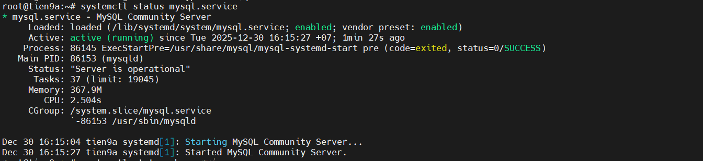

### **`Bước 4`: Cài PHP**

- Ubuntu 24.04 cài trong kho chính max nhất là PHP 8.3 cho lên nếu muốn tải an toàn phiên bản mới nhất 8.4 ta dùng PPA (PPA: Kho bên ngoài Ubuntu).

```bash
# Cài PHP PPA
sudo add-apt-repository ppa:ondrej/php
sudo apt update

# Cài các Module thường dùng
sudo apt install -y \
php8.4-cli php8.4-fpm php8.4-mysql php8.4-curl \
php8.4-gd php8.4-mbstring php8.4-xml php8.4-zip \
php8.4-opcache

# Bật cấu hình PHP-FPM cho Apache
sudo a2enconf php8.4-fpm

# Kiểm tra
php -v

# Restart Apache
sudo systemctl restart apache2
```

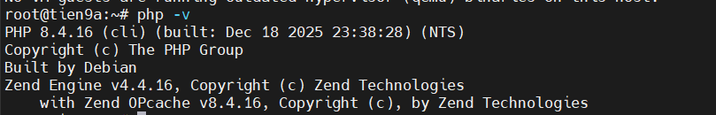

### **`Bước 5`: Đăng nhập MySQL cấp quyền và tạo DataBase cho riêng website WP**

- Các Bước tạo tài khoản, cấp quyền cho user `root`(Làm thực tế không nên xài `root` nhé!) và cài lớp bảo mật mình đã viết rồi bạn có thể tham khảo tại [đây](https://github.com/tiend9/system-intership/blob/master/TienHA/09.My_SQL/02.Install_CreateUser_MySQL.md)

- Tạo DataBase có tên là `WP_DB` để phục vụ cho website DB:

```sql
CREATE DATABASE WP_DB;
```

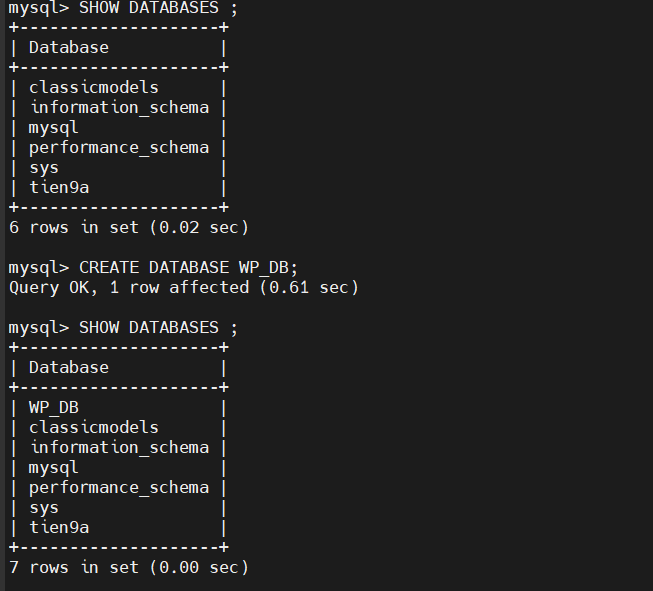

**`Bước 6`: Tải và cài đặt WordPress**

- Cài đặt gói hỗ trợ `php-gd`

```bash
apt -y install php-gd
```

- Tải xuống WordPress phiên bản mới nhất

```bash
curl -o wordpress.zip https://wordpress.org/latest.zip
```

- Check đường dẫn file tải về

```bash
ls -l | grep "wordpress.zip"
```

- Giải nén nó

```bash
unzip wordpress.zip
```

- Check đường dẫn file wordpress

```bash
ls -l | grep "wordpress"
```

- Chuyển hết các file trong thư mục WordPress sang file `var/www/html/wordpress`(đuôi `wordpress` tránh đụng web khác)

```bash
sudo mkdir -p /var/www/html/wordpress
sudo mv /root/wordpress/* /var/www/html/wordpress
```

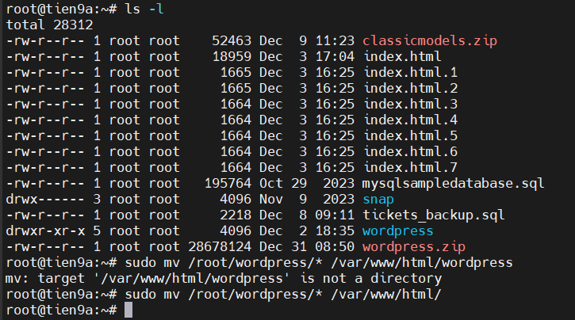

### **`Bước 7`: Cấu hình WordPress**

- Check list xem đã có file cấu hình `wp-config.php` trong đường dẫn `/var/www/html/wordpress`

```bash
ls -l /var/www/html/wordpress
```

- Chỉ có file `wp-config-sample.php` lên tiến hành copy lại như sau(Nhớ `cd` tới `/var/www/html/wordpress`)

```bash
cp wp-config-sample.php wp-config.php
```

- Chỉnh sửa cấu hình `wp-config.php`.Chỉnh lại tên `database`, `username`,`password` đã dặt ở trên (`db_name`:WP_DB,`username`:root,`pass`:1) và **lưu lại**

```bash
sudo nano wp-config.php
```

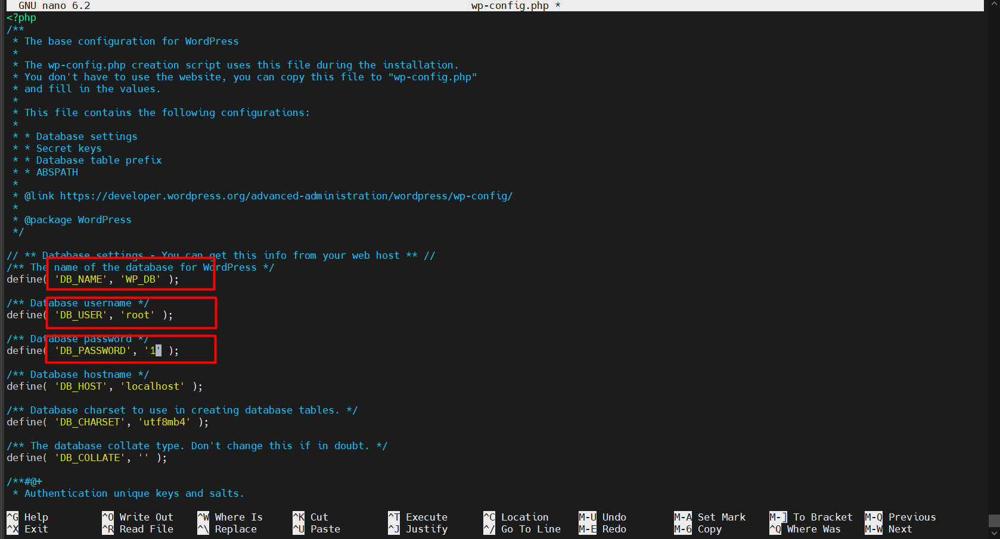

### **`Bước 8`: Tạo Apache Virtual Host**

- Thêm config Virtual Host vào:

```bash
sudo nano /etc/apache2/sites-available/wordpress.conf

# Chèn nội dung này vào
<VirtualHost *:802>
    ServerName wordpress.local
    ServerAlias www.wordpress.local
    DocumentRoot /var/www/html/wordpress

    <Directory /var/www/html/wordpress>
        AllowOverride All
        Require all granted
    </Directory>

    ErrorLog ${APACHE_LOG_DIR}/wordpress_error.log
    CustomLog ${APACHE_LOG_DIR}/wordpress_access.log combined
</VirtualHost>
```

=> **Add Rule** trên Cloud cho **cổng 802** và nhớ không trùng cổng với VirtualHost nào khác.

- Thêm Listen `Port 802` vào file `/etc/apache2/ports.conf`:

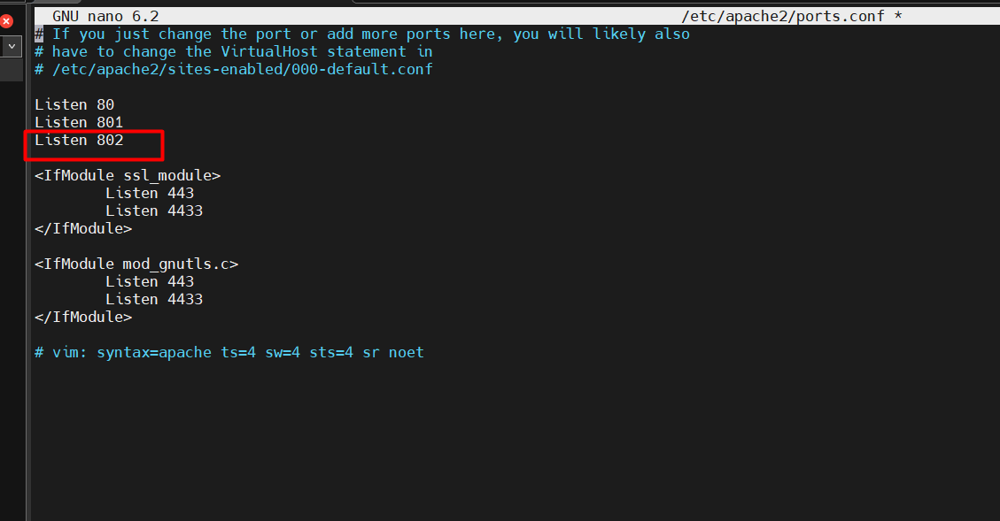

- Bật site và **Module Rewrite**:

```bash
sudo a2dissite 000-default.conf
sudo a2ensite wordpress.conf
sudo a2enmod rewrite
sudo systemctl reload apache2
```

### **`Bước 9`: Hoàn tất cài đặt giao diện**

- Trên trình duyệt gõ địa chỉ IP Sever vào URL, ta được giao diện như sau:

```text
http://192.168.70.74:802
```

### **`Bước 10`: Nhập thông tin để hoàn thiện nốt website và bấm Install**

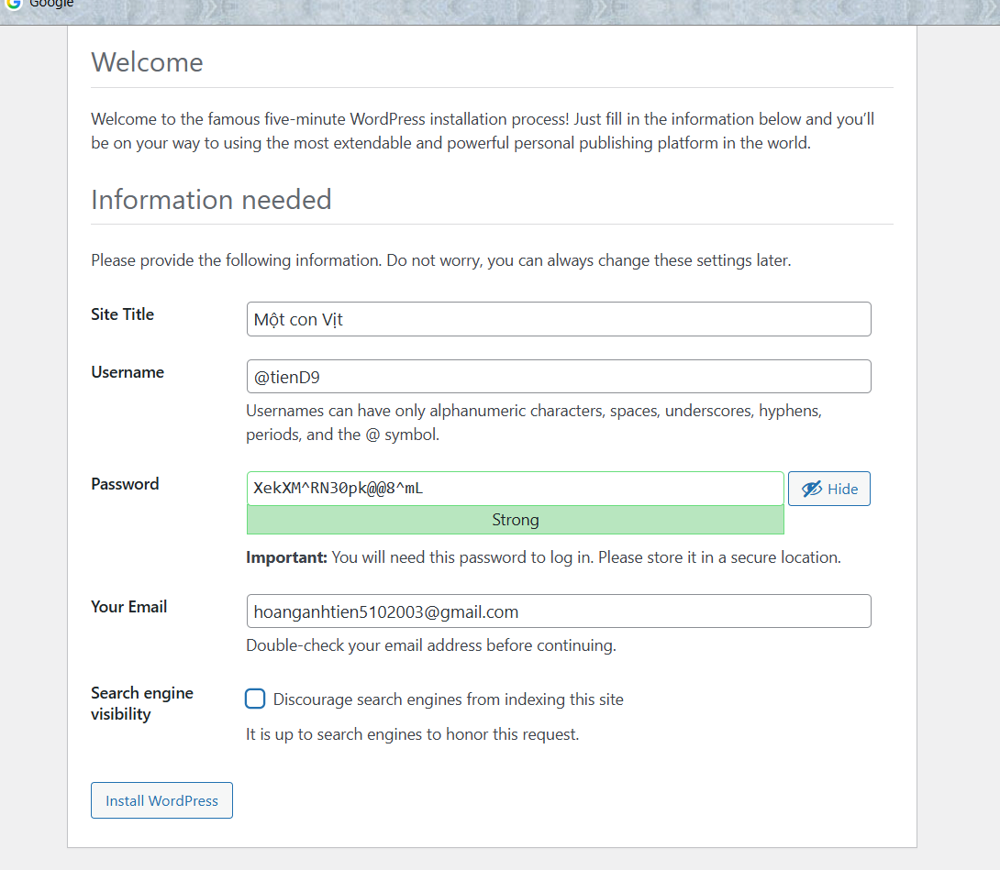

- Sau khi nhập xong ta bấm tải trang thì nó sẽ hiện trang web ra như sau:

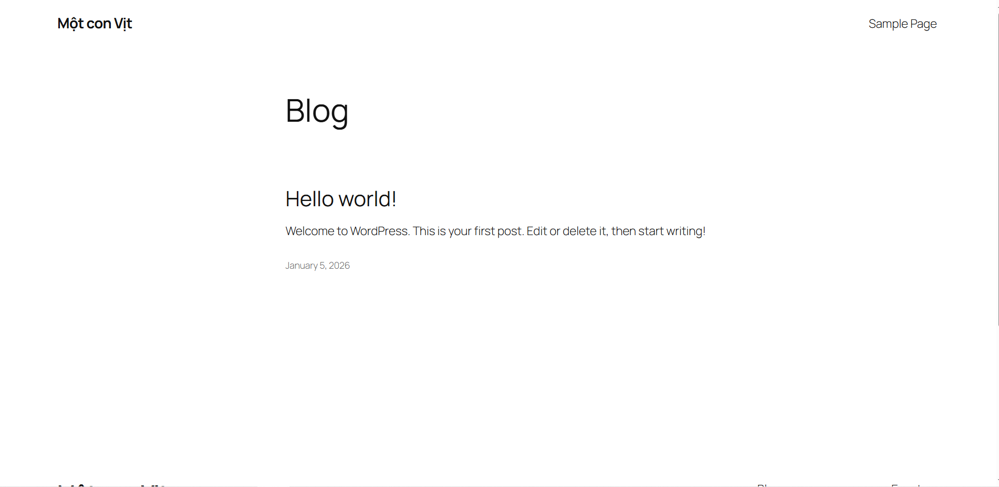

### **`Bước 11`: Tới bước này nếu quên mật khẩu mình tạo ra mình có thể đổi nó trên MySQL**

- Trên MySQL đăng nhập vào bằng tài khoản `root` rồi chọn truy vấn `WP_DB` mà ta sử dụng cho trang WordPress.

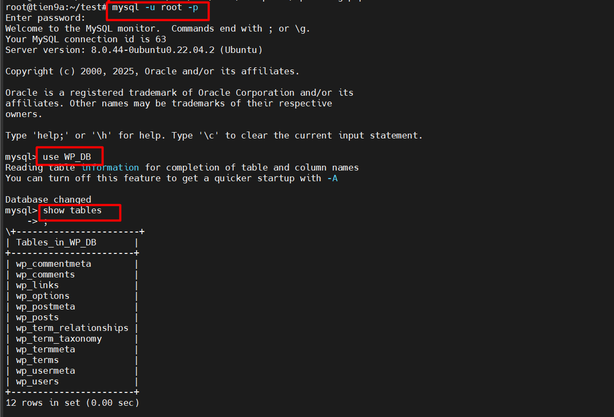

- Dùng `SELECT` để  truy vấn **ID**, **tên đăng nhập(user_login)**, **mật khẩu (user_pass)** trong bảng `wp_user` của Databases `WP_DB`

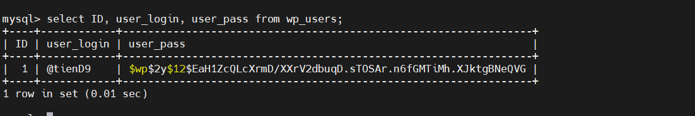

=> Đây mà dạng mã hoá **bcrypt** (one way hash) lên không thể giải lấy mật khẩu được cho lên chỉ có thể đổi mật khẩu và nhỡ cài mã hoá mất khẩu mới theo mã hoá bcrypt và chèn nó vào mã hoá cũ.

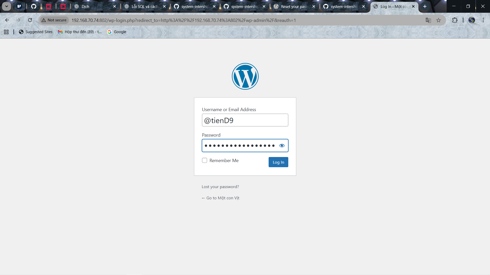

### **`Bước 12`: Đăng nhập vào trang WordPress**

- Sau khi đổi mật khẩu và đăng nhập vào trang wordpress ta sẽ được giao diện trang như sau:

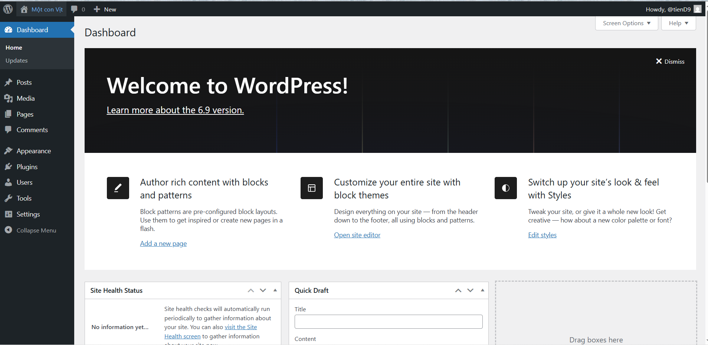

### **`Bước 13`: Phân quyền cho WordPress**

- Sau khi đăng nhập vào xong ta muốn post bài viết lên trang WordPress của mình sẽ xuất hiện lỗi sau:

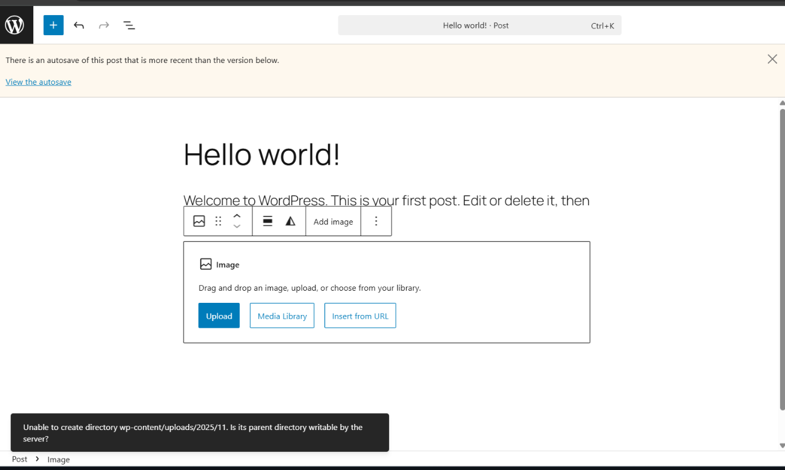

=> Sở dĩ hiển thị lỗi này là do chúng ta **chưa phân quyền** cho **user apache** để **user** đó **có quyền** tạo thư mục và upload file. Cú pháp chung:

```bash
sudo chown -R www-data:www-data /var/www/html/wordpress
# file 644, thư mục 755 (tùy chỉnh nếu cần)
sudo find /var/www/html/wordpress/ -type d -exec chmod 755 {} \;
sudo find /var/www/html/wordpress/ -type f -exec chmod 644 {} \;
systemctl restart apache2
```

- Trong đó:

  - `www-data` là user,group mặc định của apache (trên Ubuntu) hay `apache` trên CentOS
  - Các user apache đều có tên tài khoản và mật khẩu encryp được lưu trong file `/etc/apache2/htpasswd`

- Sau khi phân quyền xong thì ta đã có thể post lên như bình thường:

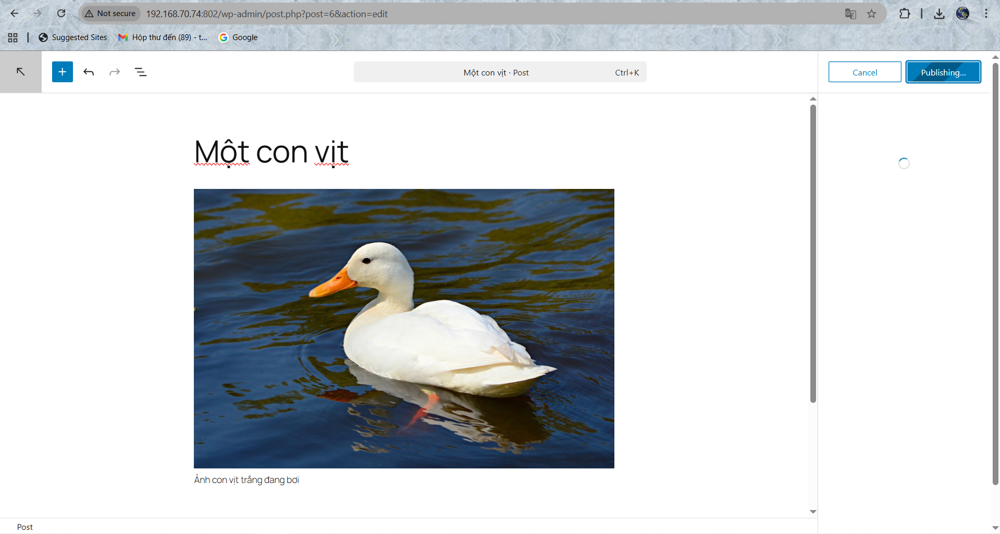
