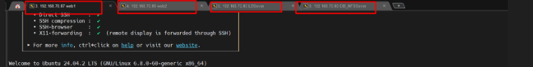
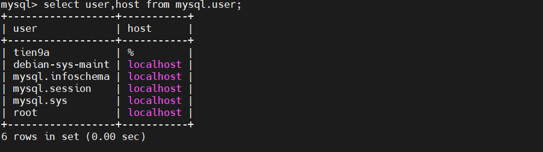
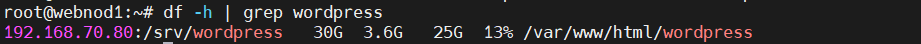
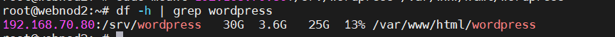
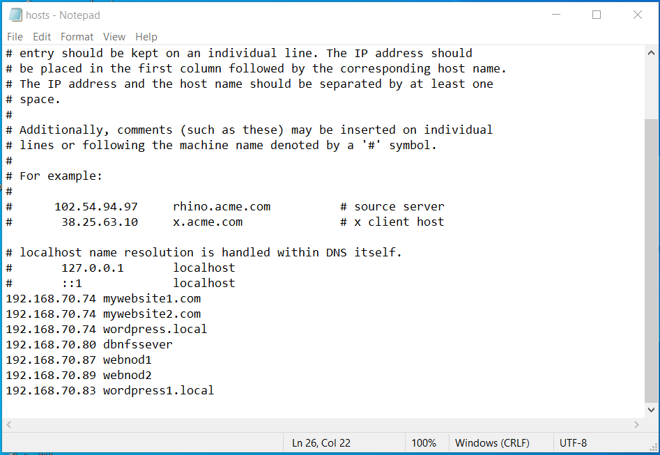
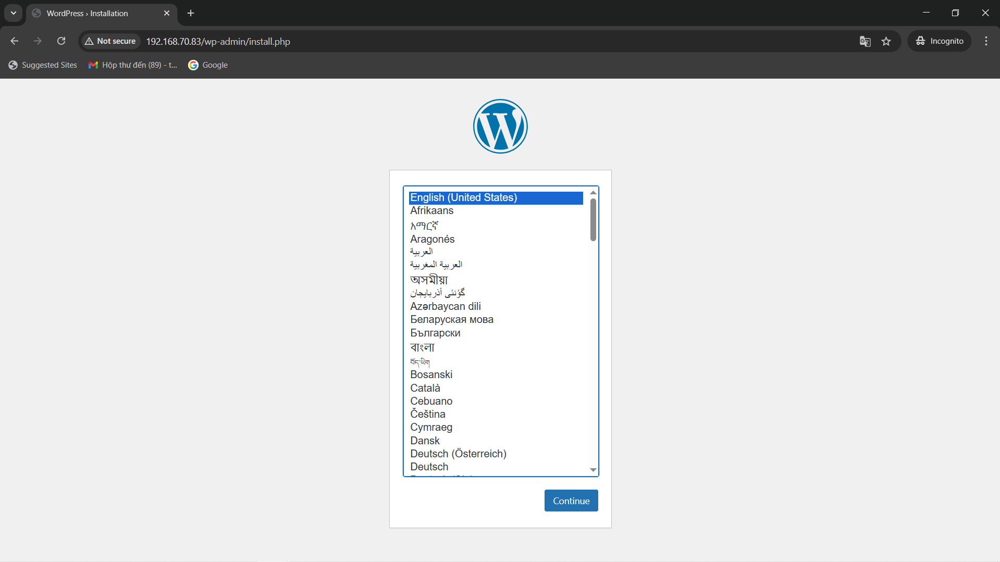
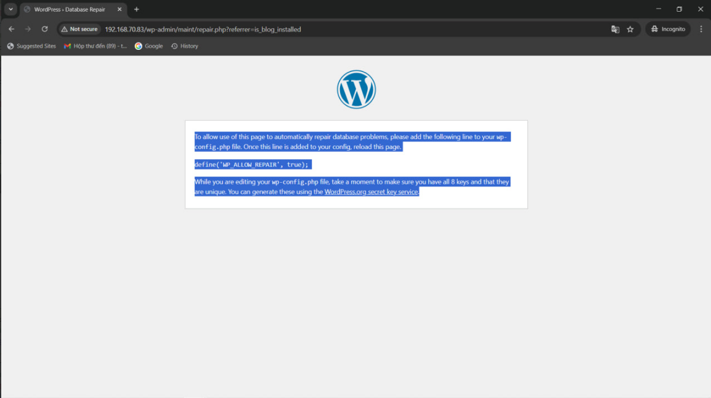
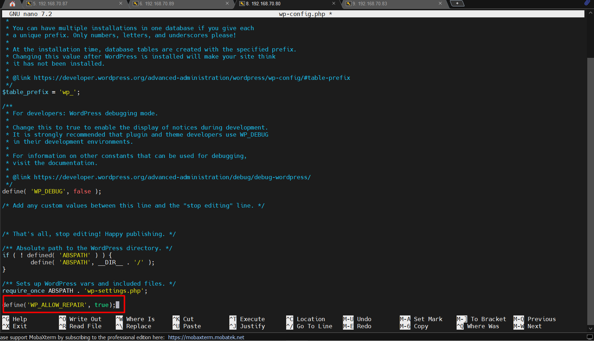
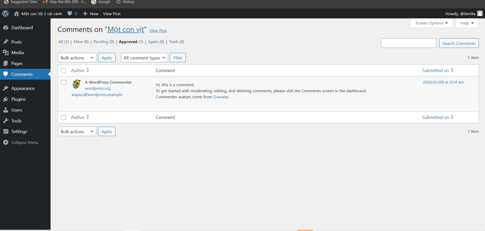
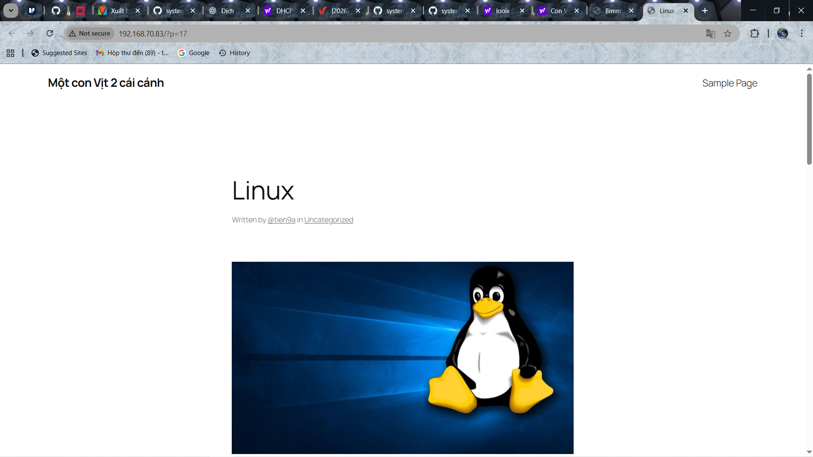

# LAB: TRIỂN KHAI WORDPRESS HIGH AVAILABILITY (HA)

## I. MỤC TIÊU LAB

Mục tiêu của Lab này là xây dựng một mô hình WordPress High Availability (HA) ở mức cơ bản nhằm:

- Hiểu cách hoạt động của WordPress trong môi trường nhiều node
- Thực hành kiến trúc Web HA phổ biến trong DevOps / Cloud
- Đảm bảo:

  - Cân bằng tải (Load Balancing)
  - Chia sẻ dữ liệu giữa các Web Server
  - Tách biệt tầng Web và Database

## II. KIẾN TRÚC TỔNG THỂ

**Mô hình triển khai:**

```pgsql
User
  ↓
Load Balancer
  ↓
Web Server 1 (WordPress)
Web Server 2 (WordPress)
  ↓
Shared Storage (NFS Server)
Database Server (MySQL – dùng chung tạm thời)
```

|    Máy ảo   |        OS    |        IP       |       Vai trò     |
| ----------- | ------------ | --------------- | ----------------- |
| web-Server1 | Ubuntu 24.04 | 192.168.70.87   | Web1              |
| web-Server2 | Ubuntu 24.04 | 192.168.70.89   | Web2              |
| LB-Server   | Ubuntu 24.04 | 192.168.70.83   | Load Balancer     |
| DB+NFS-Sever| Ubuntu 24.04 | 192.168.70.80   | DB + NFS Sever    |

=>Trong mô hình lab WordPress HA này, Load Balancer phân phối request đến hai Web Node, trong khi dữ liệu file được chia sẻ qua NFS và dữ liệu database được lưu tập trung trên một máy chủ MySQL dùng chung.(Trong mô hình này gộp chung NFS + DB Sever vào chung 1 Node cho tiện)

## III. THÀNH PHẦN TRONG LAB

### 1. Load Balancer (1 máy)

- Vai trò:

  - Nhận toàn bộ request từ người dùng
  - Phân phối request đến các Web Server phía sau
  - Tránh tình trạng 1 Web Server bị quá tải

- Công nghệ đề xuất:

  - Nginx hoặc HAProxy

- Chức năng chính

  - Round-robin load balancing
  - Health check Web Server
  - (Tuỳ chọn) Sticky Session

### 2. Web Server (2 máy)

- Vai trò

  - Chạy WordPress
  - Xử lý request PHP thông qua PHP-FPM
  - Không lưu trữ dữ liệu cục bộ (stateless)

- Công nghệ

  - Apache hoặc Nginx
  - PHP-FPM
  - WordPress source code

- Lưu ý

  - Hai Web Server dùng chung source WordPress
  - Không lưu file upload local

### 3. Shared Storage – NFS Server (1 máy)

- Vai trò

  - Lưu trữ dữ liệu dùng chung cho WordPress(wp-content/uploads, plugins, themes)

- Công nghệ

  - NFS (Network File System)

- Lợi ích

  - Khi upload ảnh từ Web Server 1 → Web Server 2 vẫn thấy
  - Đảm bảo tính nhất quán dữ liệu

- Lưu ý kỹ thuật

  - UID/GID user web (www-data) phải giống nhau trên các Web Server
  - Mount NFS vào cùng đường dẫn trên cả 2 Web Server

### 4 Database Server (1 máy – dùng chung tạm thời với NFS)

- Vai trò:

  - Lưu trữ toàn bộ dữ liệu: Bài viết, user, comment, cấu hình WordPress

- Công nghệ:

  - MySQL 8.x

- Lưu ý

  - Hiện tại Single Point of Failure
  - Chưa phải HA thực sự
  - Dùng để phục vụ mục đích lab
  - Trong thực tế sẽ nâng cấp thành:

    - MySQL Primary – Replica
    - Hoặc MySQL Galera Cluster

## IV. LUỒNG HOẠT ĐỘNG

1.Người dùng gửi request đến website

2.Load Balancer nhận request

3.Load Balancer phân phối request đến Web Server 1 hoặc 2

4.Web Server xử lý PHP (WordPress)

5.WordPress:

- Đọc/ghi dữ liệu từ MySQL Server
- Đọc/ghi file từ Shared Storage (NFS)

6.Response trả về người dùng

## V. LƯU Ý SIÊU QUAN TRỌNG

- **Không được cài WordPress 2 lần**

  - Không chạy `/wp-admin/install.php` nhiều lần

- **Không sửa file WordPress trên cả 2 web**

  - Chọn 1 con để thao tác(Thao tác trên con LBSever vì mount chung file `/srv/wordpress` - `/var/www/html/wordpress`)

- **Apache / PHP phải giống nhau**

  - Cùng Version PHP
  - Xài cùng Module
  - Xài cùng User `www-data`

## VI. CÁC BƯỚC THỰC HIỆN

### **`Bước 1:`: Tạo các cụm máy ảo để Lab WordPress HA**

- Trên Cloud VPN , ta tạo các cụm máy ảo để thực hành, cài đặt các gói cần thiết cho máy ảo



### **`Bước 2`: Cài và cấu hình MySQL và NFS Sever cho con máy đuôi `.80`**

- Cài MySQL Sever:

```bash
sudo apt update
sudo apt install mysql-server -y    # tuỳ chọn y là Yes mọi xác nhận
```

- Cấu hình MySQL cho phép truy cập từ xa:

```bash
sudo nano /etc/mysql/mysql.conf.d/mysqld.cnf
```

- Sửa:

```bash
bind-address = 0.0.0.0
```

- Add host name vào `/etc/hosts`:

```bash
# Truy cập file hosts
sudo nano /etc/hosts

# Thêm hostname
127.0.1.1 dbnfssever
```

- Restart:

```bash
sudo systemctl restart mysql
```

- Tạo Database và User trên WordPress:

```bash
# Đăng nhập vào MySql
mysql
```

- Tạo User `tien9a` có mật khẩu `tien@123` & Database dùng trong lab có tên `wordpressHA`

```sql
CREATE DATABASE wordpressHA;
DROP USER IF EXISTS 'tien9a'@'%';
CREATE USER 'tien9a'@'%' IDENTIFIED WITH mysql_native_password BY 'tien@123';
GRANT ALL PRIVILEGES ON wordpressHA.* TO 'tien9a'@'%';
FLUSH PRIVILEGES;
EXIT;
```



- Cài NFS Sever:

```bash
sudo apt install nfs-kernel-server -y #tuỳ chọn Yes mọi yêu cầu
```

- Tạo thư mục shared:

```bash
sudo mkdir -p /srv/wordpress # Tuỳ chọn p là nếu chư có /srv thì tạo luôn không báo lỗi
sudo chown -R www-data:www-data /srv/wordpress # /srv là thư mục chuẩn Linux dùng để chứa service cung cấp ra ngoài
sudo chmod 755 /srv/wordpress # www-đata là user mặc định mà apache đang chạy
```

- Export NFS:

```bash
sudo nano /etc/exports # File cấu hình NFS Sever(Thư mục nào được share, cho ai, IP được mount)
```

- Thêm IP subnet của dải máy:

```bash
/srv/wordpress 192.168.70.0/24(rw,sync,no_subtree_check)
```

- Apply Nốt là xong NFS Sever:

```bash
sudo exportfs -rav
sudo systemctl restart nfs-server
```

### **`Bước 3`: Cấu hình WebNode 1 & 2**

- **Lưu ý**: Làm trên cả 2 con máy ảo như nhau

- Thêm hostname vào trong file `/etc/hosts`:

```bash
# Trên webnod1
sudo nano /etc/hosts

# Add or sửa
127.0.1.1 webnod1

# Trên webnod2
sudo nano /etc/hosts

# Add or sửa
127.0.1.1 webnod2
```

- Cài Apache + PHP:

```bash
sudo apt update
sudo apt install apache2 php php-fpm php-mysql php-gd php-curl php-xml php-mbstring -y
```

- Mount 2 con vào file NFS chung(thao tác con này con kia tự động cập nhật)

```bash
sudo apt install nfs-common -y
sudo mkdir -p /var/www/html/wordpress

#Mount thử
sudo mount 192.168.70.80:/srv/wordpress /var/www/html/wordpress

#Check
df -h | grep wordpress
```

- Kết quả:





- Sau khi chạy `OK` thêm vào `/etc/fstab`:

```bash
sudo nano /etc/fstab

#Thêm
192.168.70.80:/srv/wordpress /var/www/html/wordpress nfs defaults 0 0
```

=> Sau bước này thì cả 2 con đã mount chung vào 1 file `/srv/wordpress` lên sau bước này ta chỉ cần cấu hình trên 1 con

- Sau đó cài WordPress chỉ cần cấu hình trên NFS Sever là được (192.168.70.80)

```bash
cd /srv
wget https://wordpress.org/latest.tar.gz
tar -xzf latest.tar.gz
chown -R www-data:www-data wordpress
chmod -R 755 wordpress
```

- Di chuyển copy thư mục `wp-config-sample.php` thành -> `wp-config.php`

```bash
cd /srv/wordpress
sudo cp wp-config-sample.php wp-config.php
```

- Sửa DB cho trang WP:

```bash
sudo nano wp-config.php
```

- Chỉnh:

```php
define('DB_NAME', 'wordpressHA');
define('DB_USER', 'tien9a');
define('DB_PASSWORD', 'tien@123');
define('DB_HOST', '192.168.70.80');
```

- Phân quyền cho WebNod trên con NFS Sever(2Web cx tự cập nhật too):

```bash
sudo chown -R www-data:www-data /srv/wordpress
sudo find /srv/wordpress -type d -exec chmod 755 {} \; # Tìm file và set quyền 755 cho nó
sudo find /srv/wordpress -type f -exec chmod 644 {} \; # Tìm file và set quyền 644 cho nó
```

- Tạo Apache Virtual Host(Bước này làm trên 2 WebNod)

```bash
sudo nano /etc/apache2/sites-available/wordpress.conf
```

- Chèn:

```apache
<VirtualHost *:80>
    ServerName wordpress.local
    DocumentRoot /var/www/html/wordpress

    <Directory /var/www/html/wordpress>
        AllowOverride All
        Require all granted
    </Directory>
</VirtualHost>
```

- Endable Module Rewrite và Restart service Apache:(Cả 2 WebNod nhé)

```bash
  sudo a2dissite 000-default.conf
  sudo a2ensite wordpress
  sudo a2enmod rewrite
  sudo systemctl restart apache2
```

### **`Bước 4`: Cấu hình Load Balancer**

- Chèn host name lb-sever vào file `/etc/hosts`

```bash
127.0.0.1 lb-sever
```

- Cài Nginx:

```bash
sudo apt update
sudo apt install nginx -y # Accepct all require
```

- Cấu hình Load Blancing:

```bash
sudo nano /etc/nginx/conf.d/wordpress.conf
```

- Chèn:

```nginx
upstream wordpress_backend {      # Tạo nhóm backend tên wordpress_backend
    server 192.168.70.87;         # Gồm 2 webnod đuôi .89,.87
    server 192.168.70.89;         # Mỗi request → gửi luân phiên tới 2 node.
}                                 # Nếu 1 node chết → node kia vẫn phục vụ

server {
    listen 80;                    # Lắng nghe cổng 80
    server_name wordpress1.local  # Chỉ nhận request của Host:wordpress1.local
    client_max_body_size 256M;    # Chỉ cho uploadfile max 256MB

    location / {
        proxy_pass http://wordpress_backend;  # Mọi request gửi cho 2 WebNod 

        proxy_set_header Host               $host; # Giữ nguyên domain user nhập
        proxy_set_header X-Real-IP          $remote_addr; # Gửi IP thật của client
        proxy_set_header X-Forwarded-For    $proxy_add_x_forwarded_for; # Forward đúng trang WP 
        proxy_set_header X-Forwarded-Proto  $scheme;  # Giúp hiểu đúng protocol
    }
}
```

- Apply nốt + tắt default site:

```bash
sudo rm /etc/nginx/sites-enabled/default
sudo nginx -t
sudo systemctl reload nginx
```

### **`Bước 5`: Thêm hostname các con sever trên máy local mà mình lab**



### **`Bước 6`: Kiểm tra lần cuối**

- Test WordPress: Truy cập WordPress bằng IP

```text
http://192.168.70.83 hoặc http://wordpress1.local
```

- Test HA:

  - Refresh liên tục
  - Check log Apache trên 2 webnode

- Test shared storage:

  - Upload ảnh, refresh vẫn còn.




- **Kết luận**: bản chất để Sever name con LB là `wordpress1.local` khác `wordpress.local` của 2 con webNod nó vẫn không ảnh hưởng gì tới 2 con WebNod

- Khi ta truy cập domain của LB (wordpress1.local)

  - Browser chỉ nói chuyện với LB  
  - LB chuyển request sang 2 WebNode  
  - Nội dung trả về LUÔN là từ WebNode, không bao giờ từ LB  

=> LB **không có website**, nó chỉ là **“người chuyển thư”.**

### `Bước 7`: Sau khi bấm `Install Wordpress` và truy cập vào trang sẽ bị lỗi `504` (Do LB Sever chưa nhận được phản hồi)



- Dịch nguyên văn lỗi và cách sửa mà WordPress gợi ý:

```bash
# Để cho phép sử dụng trang này nhằm tự động sửa chữa các vấn đề của cơ sở dữ liệu, vui lòng thêm dòng sau vào file wp-config.php của bạn.
#Sau khi thêm dòng cấu hình này, hãy tải lại (reload) trang.

cd /srv/wordpress
nano wp-config.php
define('WP_ALLOW_REPAIR', true);

# Sau khi out nano
sudo systemctl restart nfs-server

```

=> Thêm dòng trên vào cấu hình `wp-config.php` trên con NFS+DB Sever và nhớ `restart` sau khi cấu hình xong



- Sau khi xong thì cài tài khoản vào và dùng tài khoản tạo để đăng nhập 

- Sau đó thì post blog lên



=> Kết quả thành phẩm cuối cùng:


