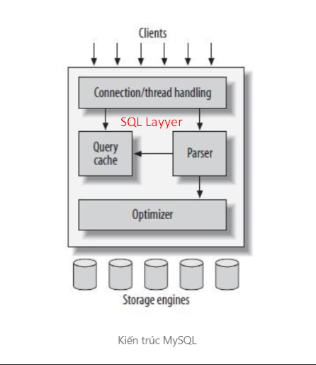

# TỔNG QUAN MY_SQL

## I. TỔNG QUAN VỀ DATABASE


Trong thời đại Internet ngày nay, Chúng ta tiếp xúc với **DataBase** (Cơ sở dữ liệu) mỗi ngày.

**Ví dụ**:

- Khi chúng ta nghe nhạc trên Spotify thì **danh sách nhạc** (playlist) chúng ta nghe chính là 1 **Database**.
- Khi chúng ta mua sắm đồ online thì chúng ta đang truy cập vào **cơ sở dữ liệu** giỏ hàng
- Khi bạn chụp ảnh và tải lên tài khoản của mình trên mạng xã hội như Facebook, **thư viện ảnh** của bạn sẽ trở thành cơ sở dữ liệu.  
...

### 1. Khái niệm về DATABASE & Các khái niệm liên quan

- **Database:** là một tập hợp dữ liệu có tổ chức, được lưu trữ và quản lý một cách có hệ thống trên máy tính, cho phép truy xuất, cập nhật và quản lý thông tin một cách hiệu quả.

- **DBMS(DataBase Management System):** **Hệ quản trị cơ sở dữ liệu** là phần mềm dùng để **tạo, quản lý, truy xuất** và **bảo vệ cơ sở dữ liệu**. Nói cách khác, **DBMS** là **“trung gian”** giữa **người dùng/ứng dụng** và **cơ sở dữ liệu**, **giúp dữ liệu** được **lưu trữ có tổ chức, an toàn** và **dễ truy cập**.

  - eg:

    - **Quan hệ (RDBMS)**: MySQL, PostgreSQL, Oracle, SQL Server
    - **Phi quan hệ (NoSQL)**: MongoDB, Cassandra, Redis
  
  - Mô hình tương tác của DBMS

```rust
Người dùng /Ứng dụng <--> DBMS <--> Database
```

- **RDB - Realational DB:** **RDB (Relational Database – Cơ sở dữ liệu quan hệ)** là loại cơ sở dữ liệu lưu trữ dữ liệu theo **dạng bảng (table)**, trong đó các bảng có thể **liên kết** với nhau thông qua các **khóa (keys)** để đảm bảo **tính nhất quán** và quan hệ giữa các dữ liệu.

- **SQL(Structured Query Language):** là ngôn ngữ khai báo **(declarative language)** để **tương tác(INSERT,SELECT,CREATE TABLE)** với **cơ sở dữ liệu quan hệ (RDB – Relational Database)**. Nó cho phép người dùng **tạo, truy vấn, cập nhật, và quản lý dữ liệu** trong các **bảng** một cách có **cấu trúc**.

- **NoSQL(Not Only SQL)** là một loại **cơ sở dữ liệu phi quan hệ**, được thiết kế để **lưu trữ và xử lý** dữ liệu có **cấu trúc linh hoạt**, không bắt buộc phải theo **schema** cố định như RDB. NoSQL ra đời để giải quyết các vấn đề về khả năng mở rộng và hiệu suất mà RDB gặp phải với **dữ liệu lớn**.

- **Schema (Sơ đồ dữ liệu / Cấu trúc cơ sở dữ liệu)** là bản thiết kế hoặc mô tả cấu trúc của cơ sở dữ liệu, xác định cách dữ liệu được tổ chức và các mối quan hệ giữa chúng.

### 2. Phân loại DataBase

Khi nói đến cơ sở dữ liệu thì có tổng 5 loại DB phổ biến:

- **Relational Database** (RDB – CSDL quan hệ)

  - **Định nghĩa**: Dữ liệu được lưu theo **bảng**, các bảng liên kết với nhau bằng **khóa chính và khóa ngoại**.
  - **Đặc điểm**: Dùng SQL, đảm bảo tính nhất quán và toàn vẹn dữ liệu.
  - **Ví dụ**: MySQL, PostgreSQL, Oracle, SQL Server.


- **NoSQL Database** (CSDL phi quan hệ)

  - **Định nghĩa**: Dữ liệu không theo bảng, linh hoạt, phù hợp dữ liệu lớn và phi cấu trúc.
  - **Các loại con**: Document (MongoDB), Key-Value (Redis), Column (Cassandra), Graph (Neo4j).


- **Hierarchical Database** (CSDL phân cấp)

  - **Định nghĩa**: Dữ liệu được lưu theo cấu trúc cây, mỗi bản ghi có một bản ghi cha và nhiều bản ghi con.
  - **Ví dụ**: IBM IMS


- **Network Database** (CSDL mạng)

  - **Định nghĩa**: Dữ liệu lưu theo mạng lưới, cho phép bản ghi liên kết với nhiều bản ghi khác, thích hợp dữ liệu phức tạp.
  - **Ví dụ**: IDMS

- **Object-oriented Database** (CSDL hướng đối tượng)

  - **Định nghĩa**: Dữ liệu lưu dưới dạng đối tượng, kết hợp với lập trình hướng đối tượng.
  - **Ví dụ**: db4o, ObjectDB

Nhưng tổng quan lai thì có 2 loại DB chính:

#### a. RDB – Relational Database (Cơ sở dữ liệu quan hệ)

- Là loại database lưu trữ dữ liệu theo bảng (table) gồm hàng và cột, có quan hệ giữa các bảng.
Dữ liệu có schema cố định (cấu trúc phải được định nghĩa trước).

- **Đặc điểm**:

  - Lưu trữ dạng **bảng**.
  - Hỗ trợ SQL để **truy vấn**.
  - Có **ràng buộc** như **khóa chính**, **khóa ngoại**.
  - Đảm bảo `ACID` (An toàn – nhất quán – riêng biệt – bền vững = English).
  - Tốt cho hệ thống yêu cầu tính chính xác cao.
  - Ứng dụng trong dự án cần tính bảo mật cao như: Bank,...

- Chức năng của **Khoá Chính(Pimary Key)**, **khoá ngoại(Foreign Key)** và **ràng buộc (Constraints)**:

##### Ràng buộc (Constraints)

- **Khái niệm**: Ràng buộc là quy tắc đặt trên cột hoặc bảng để đảm bảo dữ liệu chính xác – nhất quán – hợp lệ.

- **Các loại ràng buộc** trong **RDB**:

  - **PRIMARY KEY**: Đảm bảo duy nhất + không null.

  - **FOREIGN KEY**: Đảm bảo giá trị phải tồn tại ở bảng tham chiếu.

  - **UNIQUE**: Giá trị không được trùng.Khác PK ở chỗ: có thể chứa NULL và mỗi bảng có thể có nhiều UNIQUE.

  - **NOT NULL**: Bắt buộc phải có giá trị.

  - **DEFAULT**: Gán giá trị mặc định nếu không nhập.

  - **CHECK**: Kiểm tra điều kiện hợp lệ.

    - eg:

```sql
age INT CHECK (age >= 18)
```

##### Khóa chính (Primary Key – PK)

- **Khái niệm**: Khóa chính là **thuộc tính** (hoặc tập thuộc tính) dùng để **xác định** duy nhất **mỗi dòng** (record) trong bảng.

- **Đặc điểm**:

  - Duy nhất (unique).
  - Không được phép `NULL`.
  - Mỗi bảng **chỉ có** 1 khóa chính (có thể gồm nhiều cột → composite key).

- Ví dụ **Bảng Users**:

| id (PK) | name | email                             |
| ------- | ---- | --------------------------------- |
| 1       | Tien | [a@gmail.com](mailto:a@gmail.com) |
| 2       | Nam  | [b@gmail.com](mailto:b@gmail.com) |

- id là **primary key** → đảm bảo **không trùng** và **không null**.

- Mục đích:

  - Nhận diện bản ghi.
  - Tăng tốc tìm kiếm.
  - Dùng làm điểm liên kết giữa các bảng **(foreign key).**

##### Khóa ngoại (Foreign Key – FK)

- **Khái niệm**: Khóa ngoại là cột trong một bảng, **tham chiếu** đến **khóa chính** của bảng **khác** để tạo mối quan hệ (relationship).

- Công dụng:

  - Tạo liên kết giữa các bảng (1–N, N–N).
  - Đảm bảo tính đồng nhất dữ liệu.
  - Ngăn chặn **dữ liệu mồ côi (orphan records)**.

- Ví dụ:

| order_id | user_id (FK) | product |
| -------- | ------------ | ------- |
| 101      | 1            | Laptop  |
| 102      | 2            | Mouse   |

- user_id là FK, trỏ về id của bảng Users.

- Ràng buộc FK:

  - `ON DELETE CASCADE` → xóa user thì order cũng bị xóa theo.
  - `ON UPDATE CASCADE` → sửa id user thì tự cập nhật trên bảng phụ.

=> **Tại sao cần PK – FK – Constraints**?

- Đảm bảo tính nhất quán (consistency)
  - **eg**: FK ngăn việc tạo order của user không tồn tại.
- Ngăn lỗi nhập liệu: Ràng buộc `CHECK`, `NOT NULL` giúp dữ liệu hợp lệ.
- Quan trọng trong `ACID`
- Cơ sở để tạo quan hệ trong RDB

=> **RDB mạnh nhờ khả năng kết nối và ràng buộc chặt chẽ**.

#### b. NoSQL – Non-relational Database (Cơ sở dữ liệu phi quan hệ)

- Là loại database không dùng cấu trúc bảng, được thiết kế để xử lý lượng dữ liệu rất lớn, linh hoạt và dễ mở rộng ngang.

- Đặc điểm:

  - Không có **schema** cố định.
  - Dữ liệu có thể dạng: **Document (JSON,..)**, **Key–value**, **Column family**, **Graph**
  - Ưu tiên tốc độ và khả năng mở rộng.
  - Thường theo mô hình `BASE` (linh hoạt hơn `ACID`).
  - ứng dụng trong dự án có tính linh hoạt cao như: Big DATA,...

- các DataType in NoSQL

| Loại NoSQL                    | DataType đặc trưng                                              |
| ----------------------------- | --------------------------------------------------------------- |
| **Document (MongoDB)**        | JSON/BSON: string, number, boolean, array, object, date, binary |
| **Key-value (Redis)**         | string, list, set, sorted set, hash, bitmap, stream             |
| **Column family (Cassandra)** | text, int, bigint, uuid, boolean, blob, float, timestamp        |
| **Graph (Neo4j)**             | string, number, boolean, list, map, date/time, spatial          |

## II. TÌM HIỂU VỀ MYSQL

### 1. Khái niệm về MySQL

- MySQL là một hệ quản trị cơ sở dữ liệu quan hệ (RDBMS) sử dụng ngôn ngữ SQL để quản lý và truy vấn dữ liệu.

- MySQL vận hành theo mô hình client–server, trong đó dữ liệu được lưu trữ dưới dạng **bảng** (table) gồm **hàng** và **cột**, và các **bảng** có thể **liên kết** với nhau thông qua **khóa chính** – **khóa ngoại**. Và nó nằm trong LAMP, LEMP Stack.

### 2. Kiến trúc của MySQL



- **MySQL** thiết kế theo kiến trúc **Client-Server**
- **MySQL** thiết kế để người dùng cuối, tức là các Client, có thể truy cập các tài nguyên từ máy tính, tức là server, thông qua các dịch vụ mạng khác nhau.
- Kiến trúc của MySQL bao gồm các lớp chính sau:

#### a. Clients Layyer

- Công cụ Dòng lệnh (Command-line Tools): Ví dụ: `mysql` client.
- Các ứng dụng **phpMyAdmin, JDBC, Node.js, Python**… kết nối vào MySQL qua port **3306** (deafault MySQL port service).
- Kiểm tra quyền truy cập (`GRANT`, `REVOKE`).
- Quản lý kết nối (TCP/IP,...)
- Quản lý thread – mỗi client là một thread riêng.
- Khi bạn chạy `mysql -u root -p`, bạn đang tương tác với lớp này.

#### b. SQL Layer - Lớp xử lí truy vấn

- Lớp này quyết định cách MySQL phân tích và xử lý câu lệnh SQL. Đây là “bộ não” của MySQL.

- Thành phần trong SQL Layer
  
  - **Parser** (Bộ phân tích cú pháp)

    - Kiểm tra cú pháp SQL (`SELECT`, `FROM`, `WHERE` đúng chưa).
    - Chuyển câu SQL thành cấu trúc **cây** (**parse tree**).

  - **Preprocessor** (Bộ tiền xử lý)

    - Kiểm tra bảng có tồn tại không.
    - Kiểm tra tên cột có hợp lệ không.
    - Áp dụng quy tắc bảo mật.

  - **Optimizer** (Bộ tối ưu truy vấn)

    - Optimizer quyết định cách MySQL truy vấn nhanh nhất
    - Chọn index phù hợp
    - Quyết định join theo thứ tự nào
    - Tối ưu `WHERE`
    - Tối ưu `GROUP BY`
    - Tính toán **cost-based optimization**
    - Khi bạn dùng `EXPLAIN`, bạn xem được kế hoạch truy vấn của optimizer.

  - **Query executor** (Bộ thực thi truy vấn)

    - Lấy **plan** từ **Optimizer** và **thực thi**
    - Gửi **dữ liệu** xuống **Storage Engine**
    - **Trả kết quả về client**

-> Từ bản 8.0 trở đi thì Query cache đã bị xoá và thay bằng Query executor nhanh chóng và rõ ràng hơn.

#### c. Storage engines Layer – Lớp lưu trữ

- Đây là **nơi MySQL lưu trữ dữ liệu** thật sự.

- Điểm đặc biệt:

  - **MySQL hỗ trợ nhiều storage engine khác nhau trong cùng một server.**

- Các storage engine phổ biến:

| Engine      | Công dụng                                       |
| ----------- | ----------------------------------------------- |
| **InnoDB**  | Mặc định. Hỗ trợ ACID, transaction, foreign key |
| **MyISAM**  | Nhanh, nhẹ, không hỗ trợ transaction            |
| **Memory**  | Lưu RAM, siêu nhanh, dữ liệu tạm thời           |
| **CSV**     | Lưu file CSV                                    |
| **Archive** | Lưu log lâu dài, nén                            |

- InnoDB đặc biệt vì:

  - Có **buffer pool** để **cache data + index**
  - Hỗ trợ `ACID`
  - Hỗ trợ **row-level lock** (khóa từng dòng → tránh tranh chấp)
  - Có **redo log, undo log**
  - **Crash recovery** rất tốt

### 3. Đặc điểm MySQL

#### a. Ưu điểm

- Miễn phí, ổn định, cộng đồng cực lớn
- **Hiệu năng cực tốt**với workload đọc + ghi vừa và lớn
- Replication & HA **dễ cấu hình** hơn rất nhiều so với PostgreSQL
- JSON + Document Store giúp thay thế một phần MongoDB
- Giấy phép & mã nguồn mở
- Chạy đa nền tảng
- Hỗ trợ **SQL**, **Storage engines**, `ACID`
- **Replication** (sao chép) mạnh mẽ
- Bảo mật mạnh mẽ (SHA-256,SSL/TLS,...)
- Nhiều tính năng hiện đại từ **bản 8.0** và khả năng mở rộng ổn
- Hỗ trợ NoSQL và có thể Backup, Recovery.

#### b. Nhược điểm

- Không hỗ trợ đầy đủ CHECK constraint (đến 8.0.16 mới có nhưng vẫn phải bật explicitly)
- Một số tính năng nâng cao (parallel query, logical replication tốt) vẫn thua PostgreSQL
- Window Functions xuất hiện muộn hơn PostgreSQL ~10 năm
