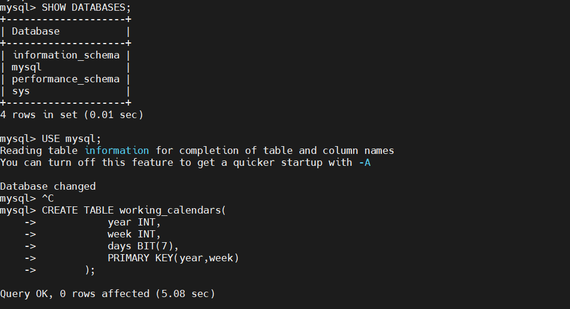
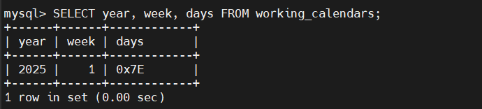
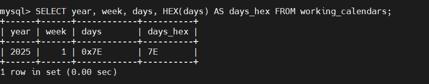
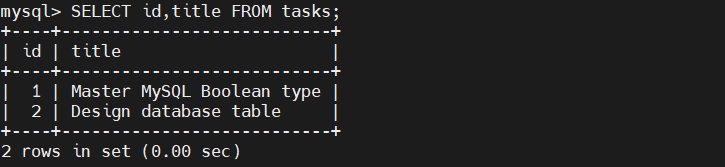

# DATA TYPE IN MY SQL

## 1. BIT

### Knowedge

- BIT là kiểu dữ liệu dùng để lưu trữ giá trị bit(0 và 1)

- Cú pháp:

  ```sql
  column_name BIT(n)
  ```

  - `1 <= n <= 64`, mặc định là 1

- BIT Literals:
  
  - Cú pháp:
  
    - `b'val'` hoặc `B'val'`
    - `0bval`
  
  - Ví dụ: `b'01'`, `B'11'`, `0b1010`

### Example

- Chọn DATABASE

```sql
SHOW DATABASES;
USE mysql;
```

- Tạo bảng:

  ```sql
  CREATE TABLE working_calendars(
      year INT,
      week INT,
      days BIT(7),
      PRIMARY KEY(year,week)
  );
  ```



- Chèn dữ liệu:

  ```sql
  INSERT INTO working_calendars(year, week, days) 
  VALUES(2025, 1, b'1111110');
  ```

- Khi `SELECT`:



  -> MySQL hiển thị dạng hex

- Hiển thị dạng nhị phân:



- MySQL sẽ không tự thêm `0` khi trả về, dùng `LPAD`:

  ```sql
  SELECT year, week, LPAD(BIN(days), 7, '0')
  FROM working_calendars;
  ```

## 2. INT

- `INT` trong MySQL dùng để lưu số nguyên (không có phần thập phân): ví dụ 1, 100, -10.

- Hỗ trợ cả số âm và số dương.

- MySQL cung cấp nhiều loại số nguyên theo kích thước: `TINYINT`, `SMALLINT`, `MEDIUMINT`, `INT/INTEGER`, `BIGINT`.

  | **Type**    | **Bytes** | **Signed (min → max)**   | **Unsigned (min → max)** |
  | ----------- | --------- | ------------------------ | ------------------------ |
  | TINYINT     | 1         | -128 → 127               | 0 → 255                  |
  | SMALLINT    | 2         | -32768 → 32767           | 0 → 65535                |
  | MEDIUMINT   | 3         | -8388608 → 8388607       | 0 → 16777215             |
  | INT/INTEGER | 4         | -2147483648 → 2147483647 | 0 → 4294967295           |
  | BIGINT      | 8         | -9223372036854775808 → … | 0 → 18446744073709551615 |

=> Có thể đặt thuộc tính `SIGNED`(âm) hoặc `UNSIGNED`(dương)

## 3. BOOLEAN

### Introduce

- MySQL không có kiểu BOOLEAN thật sự.

- Giá trị:

  - 0 -> FALSE
  - Non-zero -> TRUE

- BOOLEAN Literals:

  - Có thể dùng: `true`, `false`, `TRUE`, `FALSE`, `True`, `False`

    → MySQL chuyển thành 1 và 0.  

### Examples

- Tạo bảng:

  ```sql
  CREATE TABLE tasks (
      id INT AUTO_INCREMENT PRIMARY KEY,
      title VARCHAR(255) NOT NULL,
      completed BOOLEAN
  );
  ```

- Chèn dữ liệu:

  ```sql
  INSERT INTO tasks(title, completed)
  VALUES ('Master MySQL Boolean type', true),
        ('Design database table', false);
  ```

- Dùng `CHECK`:



### BOOLEAN OPERATOR

- Dùng `IS TRUE` thay vì `=`

  ```sql
  WHERE completed = TRUE;
  ```

- Lấy task chưa hoàn thành:

  ```sql
  WHERE completed = FALSE;
  ```

- Lấy task không phải TRUE:

  ```sql
  WHERE completed <> TRUE;
  ```

  - Bao gồm `0` và `NULL`-> Dùng `CHECK` tra

## 4. DECIMAL

### Introduction

`DECIMAL` dùng để lưu giá trị **số chính xác** (exact numeric), đặc biệt là **dữ liệu tiền tệ**.

Không giống như `FLOAT/DOUBLE`, `DECIMAL` không gây lỗi làm tròn do dùng lưu trữ dạng decimal chứ không phải **floating point**.

Cú pháp:

```sql
DECIMAL(P, D)

P (precision): tổng số chữ số (1–65)
D (scale): số chữ số sau dấu thập phân (0–30), và D ≤ P
```

- Ví dụ:

```sql
amount DECIMAL(6, 2);
```

Biến thể:

```sql
DECIMAL(P) = DECIMAL(P,0)
DECIMAL = DECIMAL(10,0)
```

## 5. DATETIME

### Kiến thức

- **DATETIME** lưu ngày + giờ theo định dạng:

  ```bash
  'YYYY-MM-DD HH:MM:SS'
  ```

### Chèn giá trị vào DATETIME

- Đúng định dạng:

  ```sql
  INSERT INTO table_name(dt) VALUES ('2023-12-31 15:30:45');
  ```

- Giá trị mặc định:

  ```sql
  NOW()              -- trả về datetime hiện tại
  CURRENT_TIMESTAMP  -- tương tự NOW()
  ```

- Ví dụ:

  ```sql
  started_at DATETIME NOT NULL DEFAULT CURRENT_TIMESTAMP
  ```

### Các hàm làm việc với DATETIME

#### NOW()

- Lấy thời gian hiện tại:

  ```sql
  SET @dt = NOW();
  SELECT @dt;
  ```

#### DATE()

- Lấy phần ngày:

  ```sql
  WHERE DATE(create_at) = '2025-11-27'
  ```

#### TIME()

- Lấy phần giờ:

  ```sql
  WHERE TIME(create_at) = '09:23:30'
  ```

### Tách từng thành phần thời gian

```sql
SELECT 
  YEAR(@dt),
  QUARTER(@dt),
  MONTH(@dt),
  WEEK(@dt),
  DAY(@dt),
  HOUR(@dt),
  MINUTE(@dt),
  SECOND(@dt);
```

... Còn nhiều hàm nữa tại [đây]<https://www.mysqltutorial.org/mysql-basics/mysql-datetime/>

## 6. TIMESTAMP

### TimeStamp ?

- **TIMESTAMP** lưu ngày + giờ theo định dạng cố định:

  ```bash
  YYYY-MM-DD HH:MM:SS
  ```

- Phạm vi:
  
  ```sql
  1970-01-01 00:00:01 UTC → 2038-01-19 03:14:07 UTC
  ```

- **TIMESTAMP** phụ thuộc Time Zone

- **TIMESTAMP** Tính năng tự động khởi tạo và cập nhật (Automatic Initialization & Updating):

  - Tự động lưu timestamp khi dòng được tạo
  - Tự động cập nhật timestamp khi dòng được chỉnh sửa

## 7. DATE

### Khái niệm

- `DATE` là 1 trong 5 kiểu thời gian của MySQL
- Định dạng:

  ```css
  YYYY-MM-DD
  ```

- Phạm vi:

  ```yaml
  1000-01-01 → 9999-12-31
  ```

### Các hàm xử lý trong DATE

- Lấy ngày giờ hiện tại:

  ```sql
  SELECT NOW();
  ```

- Lấy phần ngày của DATETIME:

  ```sql
  SELECT DATE(NOW());
  ```

- Lấy hệ thống ngày hiện tại:

  ```sql
  SELECT CURDATE();
  ```

... Còn nhiều hàm nữa check ở [đây]<https://www.mysqltutorial.org/mysql-basics/mysql-time/>

## 8. TIME

### Meaning

- Đùng để lưu thời gian trong ngày hoặc khoảng thời gian
- Định dạng:

  ```yaml
  HH:MM:SS
  ```

- Khai báo:

  ```sql
  column_name TIME;
  column_name TIME(N);   -- N = 0 đến 6 (microseconds)
  ```

## 9. CHAR

### Meaning?

- `CHAR` là fixed-length(độ dài cố định)
- Khai báo:

  ```sql
  CHAR(n)
  ```

  - MySQL luôn lưu đúng n ký tự bằng cách đệm dấu cách ở cuối (padding).

- Khi truy vấn, MySQL tự động bỏ dấu cách cuối (trừ khi bật chế độ `PAD_CHAR_TO_FULL_LENGTH`).

### Ví dụ

- Tạo bảng:

  ```sql
  CREATE TABLE mysql_char_test (
      status CHAR(3)
  );
  ```

- Thêm dữ liệu:

  ```sql
  INSERT INTO mysql_char_test(status)
  VALUES ('Yes'), ('No');
  ```

## So sánh giá trị CHAR

- MySQL bỏ qua **trailing spaces**(cách đuôi) khi so sánh với các toán tử:

  ```bash
  =, <>, >, <, <=, >=
  ```

- Nhưng với `LIKE`, MySQL không bỏ trailing spaces:

  ```sql
  status LIKE 'Y'   → không match 'Y '
  ```

## 10. VARCHAR

## Information

- `VARCHAR` là kiểu chuỗi độ dài biến đổi (`variable-length`)
- Chiều dài tối đa có thể khai báo:

  ```sql
  VARCHAR(65535)
  ```

- Dữ liệu vượt quá độ dài `VARCHAR` -> báo lỗi

- `VARCHAR` và khoảng trắng:

  - Không tự động padding (lót vào) như CHAR. MySQL giữ nguyên khoảng trắng khi lưu và khi truy vấn.

    ```sql
    INSERT INTO items(title) VALUES ('AB ');
    SELECT title, LENGTH(title) FROM items;
    ```

    - Kết quả:

      ```sql
      title = 'AB ', LENGTH = 3
      ```

- **Truncation**(cắt cụt) khi có trailing spaces(cách đuôi) làm vượt chiều dài:

  - Ví dụ:

    ```sql
    INSERT INTO items(title) VALUES ('ABC ');
    ```

    - Chuỗi thực tế dài 4 nhưng VARCHAR(3):

      - MySQL cắt bỏ trailing space để còn 'ABC'
      - Chèn thành công nhưng báo warning:

## 11. TEXT

### Concept

- `TEXT` là kiểu dữ liệu dùng để lưu chuỗi văn bản dài, từ vài byte tới vài GB.
- Không cần khai báo chiều dài như `CHAR/VARCHAR`.
- MySQL không pad hoặc trim khoảng trắng khi chèn hoặc truy vấn.
- Dữ liệu TEXT lưu trên đĩa, không nằm trong bộ nhớ → truy vấn chậm hơn `CHAR/VARCHAR`.

  | TEXT type      | Kích thước tối đa           | Overhead | Khi nào dùng  |
  | -------------- | --------------------------- | -------- | ---------------------------------------------------------- |
  | **TINYTEXT**   | 255 bytes (~255 ký tự)      | 1 byte   | Văn bản ngắn, không yêu cầu sắp xếp, ví dụ: trích dẫn blog |
  | **TEXT**       | 64 KB (~65,535 ký tự)       | 2 bytes  | Nội dung bài viết, mô tả sản phẩm                          |
  | **MEDIUMTEXT** | 16 MB (~16,777,215 ký tự)   | 3 bytes  | Văn bản lớn, sách, whitepaper                              |
  | **LONGTEXT**   | 4 GB (~4,294,967,295 ký tự) | 4 bytes  | Văn bản cực lớn, lưu trữ dữ liệu cực dài |

## 12. BINARY


## 13. VARBINARY

## 14. ENUM

## 15. BLOB
