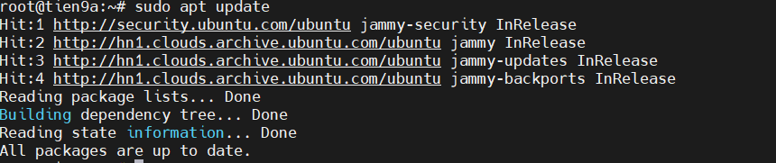
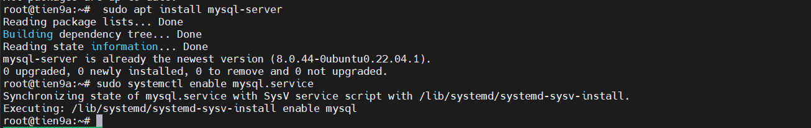
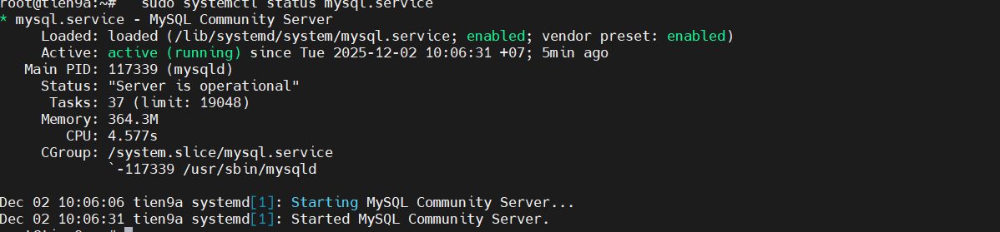
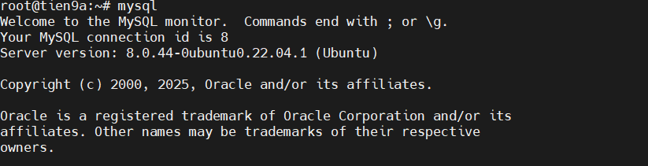
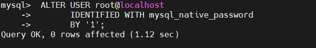
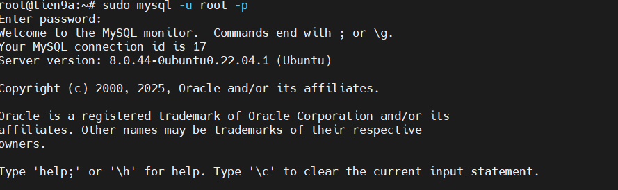
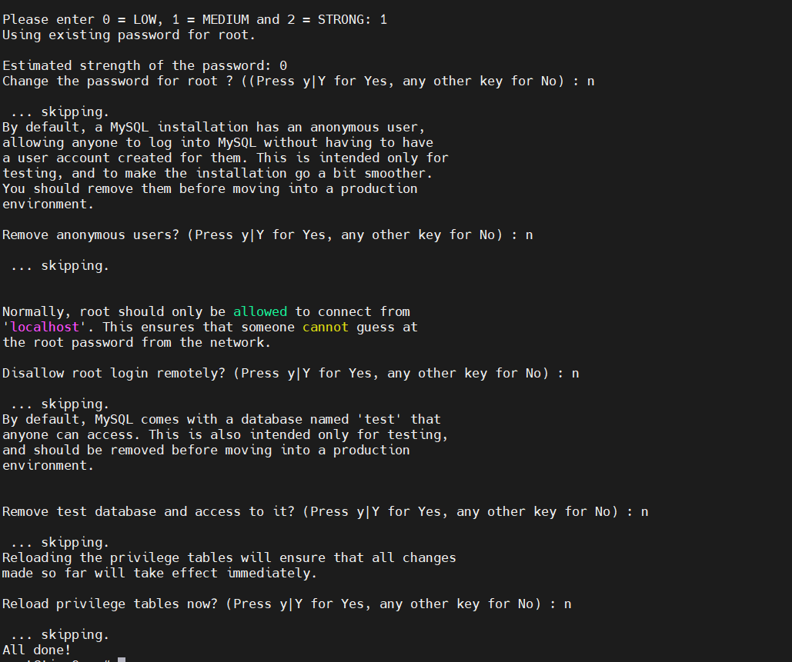
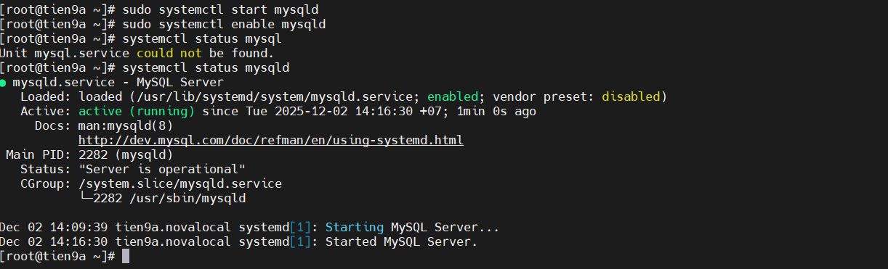
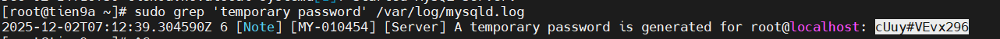
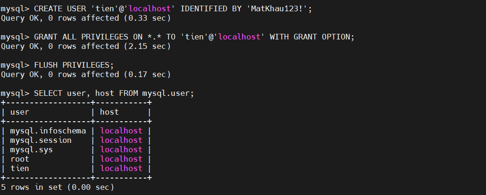

# INSTALL & CREATE USER MYSQL

## I. ON UBUNTU

### BƯỚC 1: ĐẢM BẢO CẬP NHẬT MỚI NHẤT VỀ CÁC GÓI CÓ SẴN

```bash
sudo apt update
sudo apt upgrade -y
```



### Bước 2: Tải MySQL server

  ```bash
  sudo apt install mysql-server
  ```

### Bước 3: Enable MySQL service để tự khởi động khi boot

  ```bash
  sudo systemctl enable mysql.service
  ```



### Bước 4: Start MySQL service

  ```bash
  sudo systemctl start mysql.service
  ```

### Bước 5: Kiểm tra lại MySQL service xem đã được khởi động chưa

  ```bash
  sudo systemctl status mysql.service
  ```



### Bước 6: Đăng nhập vào MySQL và thay đổi mật khẩu của root

- Đầu tiên, đăng nhập vào MySQL server

  ```bash
  sudo mysql
  ```



  -> Ta đã vào môi trường dòng lệnh mysql

- Tiếp theo, thay đổi mật khẩu của tài khoản root (giả sử đặt là `1`)

  ```sql
  ALTER USER root@localhost 
  IDENTIFIED WITH mysql_native_password  
  BY '1';
  ```



- Thoát ra khỏi MySQL database server:

  ```sql
  exit
  ```

- Thử đăng nhập vào máy chủ cơ sở dữ liệu MySQL bằng mật khẩu mới:

  ```bash
  mysql -u root -p
  ```

  - `u`: đăng nhập quyền cao nhất `root`
  - `p`: đăng nhập hỏi mk



- Đổi mật khẩu thành công, ta exit khỏi mysql client tool

  ```sql
  exit
  ```

### Bước 7: Bảo mật cài đặt SQL

  ```bash
  sudo mysql_secure_installation
  ```

- Lệnh này được sử dụng để tăng cường bảo mật cho MySQL Server sau khi cài đặt. Khi chạy, nó sẽ:

  - Yêu cầu nhập mật khẩu root hiện tại.
  - Đặt/đổi mật khẩu root nếu cần.
  - Loại bỏ các tài khoản người dùng ẩn danh (anonymous users).
  - Tắt truy cập root từ xa (remote root login) để tránh rủi ro bảo mật.
  - Xóa cơ sở dữ liệu test không cần thiết và cho phép mọi người truy cập.
  - Tải lại bản quyền để áp dụng các thay đổi ngay lập tức.

- Trả lời bằng cách nhập `Y/N`



## II. ON CENTOS 7

### Bước 1: Thêm repository MySQL

```bash
sudo yum install https://dev.mysql.com/get/mysql80-community-release-el8-1.noarch.rpm
```

**Lưu ý**: Nếu là CentOS 7, thay el8-1 bằng el7-1.

### Bước 2: Cập nhật repo

```bash
sudo yum update
```

### Bước 3: Cài MySQL Server

```bash
sudo yum install mysql-community-server -y
```

### Bước 4: Khởi động MySQL

```bash
sudo systemctl start mysqld
sudo systemctl enable mysqld   # tự động chạy khi boot
```



### Bước 5: Lấy mật khẩu root tạm thời

- Khi cài MySQL 8+, MySQL sẽ tạo root password tạm thời trong file log:

```bash
sudo grep 'temporary password' /var/log/mysqld.log
```



### Bước 6: Cấu hình mật khẩu root và bảo mật MySQL

- Chạy lệnh:

```bash
sudo mysql_secure_installation
```

- Bạn sẽ được hỏi:

- Nhập password tạm thời.
- Thay password root mới.
- Xóa user ẩn danh (recommend: Yes).
- Không cho phép root login từ xa (recommend: Yes).
- Xóa database test (recommend: Yes).
- Reload privilege tables (Yes).

### Bước 7: Tạo user mới và đặt mật khẩu

- Đăng nhập MySQL bằng root:

```sql
mysql -u root -p
```

- Nhập mật khẩu root mới vừa đặt.

- Tạo user mới:

```sql
CREATE USER 'tien'@'localhost' IDENTIFIED BY 'Tien5102003@';
GRANT ALL PRIVILEGES ON *.* TO 'tien'@'localhost' WITH GRANT OPTION;
FLUSH PRIVILEGES;
```

Kiểm tra:

```sql
SELECT user, host FROM mysql.user;
```



=> Xong, bạn đã cài MySQL và tạo user có mật khẩu.
