# LAB MÔ PHỎNG VỚI DATABASES THỰC TẾ

## I. LAB 1: MÔ PHỎNG KẾT NỐI TRUY VẪN TỪ XA VÀO CSDL CỦA MYSQL TRÊN CON UBUNTU (SEVER) BẰNG MÁY TÍNH CÁ NHÂN ( CLIENT)

### 1. Cài đặt MySQL Sever trên con Ubuntu

- Ta cài đặt MySQL Sever lên con Ubuntu bằng cách sau [đây](https://github.com/tiend9/system-intership/blob/master/TienHA/09.My_SQL/02.Install_CreateUser_MySQL.md)

### 2. Cấu hình để Ubuntu cho phép chấp nhận truy vấn từ xa

- **Bước1**: Sửa file config cho phép remote

```bash
sudo nano /etc/mysql/mysql.conf.d/mysqld.cnf
```

Tìm dòng:

```ini
bind-address = 127.0.0.1
```

-> Sửa thành:

```ini
bind-address = 0.0.0.0
```

- **Bước 2**: Tạo user MySQL cho phép remote (không dùng `root` vì có thể lớp secure mysql không cho phép)

  - `%` nghĩa là chấp nhận mọi IP
  - Nếu nó lỗi mật khẩu chưa mạnh thì tắt cái file `validate_password` đi

```sql
CREATE USER 'tien9a'@'%' IDENTIFIED BY '1';
GRANT ALL PRIVILEGES ON *.* TO 'tien9a'@'%' WITH GRANT OPTION;
FLUSH PRIVILEGES;
```

- **Bước 3**: Add Rule VPN hoặc `ufw allow 3306/TCP`(Mở cổng do tường lửa chặn)

- **Bước 4**: Rồi **restart** MySQL

```bash
sudo systemctl restart mysql
```

### 3. Cài đặt MySQL WorkBench trên lap cá nhân (Windows)

- Nếu là Windows, tải xuống trình cài đặt MySQL để cài đặt các sản phẩm MySQL:

  - `MySQL Server` – Đây là Máy chủ cơ sở dữ liệu MySQL.
  - `MySQL Workbench` – Đây là công cụ máy khách để tương tác với Máy chủ cơ sở dữ liệu MySQL thông qua GUI.
  - `MySQL Shell` – Đây là giao diện Javascript, Python hoặc SQL tương tác hỗ trợ phát triển và quản trị cho MySQL Server. (Giống WorkBench nhưng quản trị nâng cao hơn)

- Chúng tôi sẽ sử dụng MySQL Installer 8.0.34 để cài đặt MySQL Server và các sản phẩm liên quan như MySQL Workbench và MySQL Shell. Bấm vào link [này](http://dev.mysql.com/downloads/installer/)

- Còn trong lab này ta tải WorkBench cho lab cá nhân, ta tải bằng link [này](https://dev.mysql.com/downloads/workbench/)

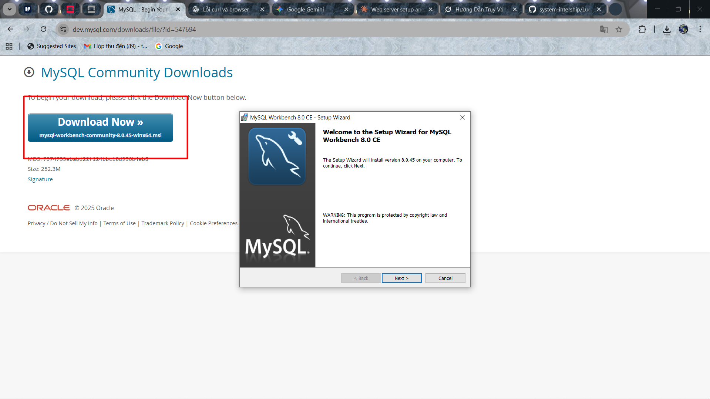

- Chọn Thư mục để lưu cấu hình & install:

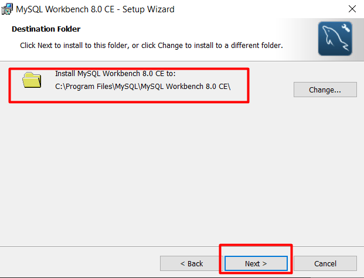

- Chọn Mode người dùng: Để `Custom` dùng tính năng gì thì tải tính năng đó khác với `Complete` là tải AllFeatures

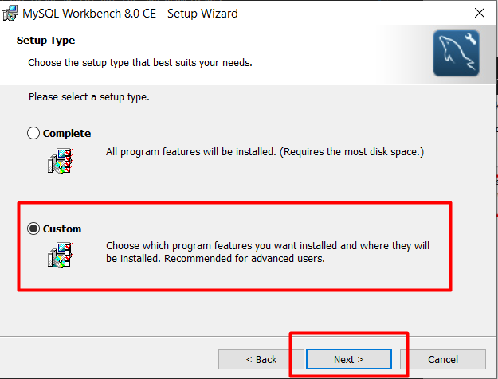

- Chỉnh vài features mình muốn cài và **Next** để Hoàn tất **Install**

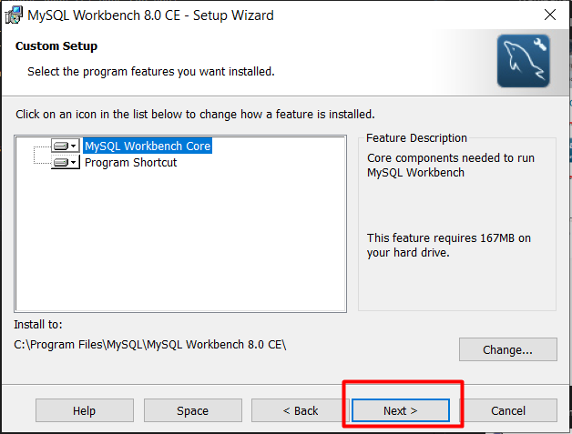

- Rồi ấn **INSTALL** để cài về máy Lap Window của mình

- Sau khi Install xong thì sẽ hiện ra giao diện như sau là thành công :

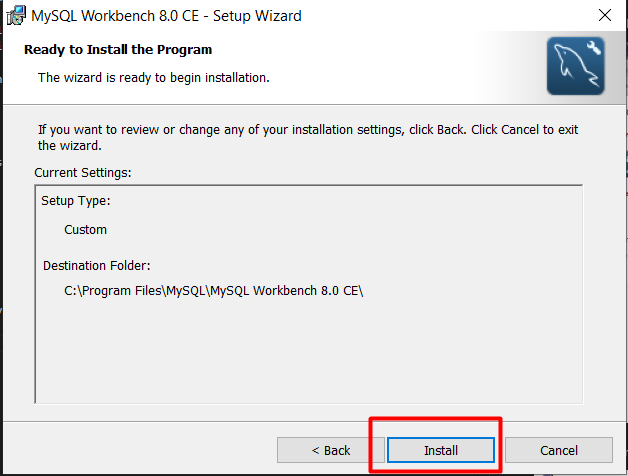

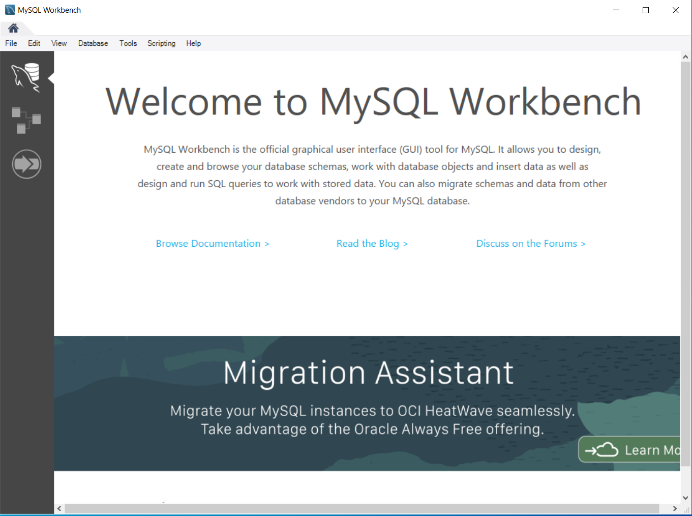

### 4. Thực hiện kết nối MySQL Sever (on Ubuntu) bằng MySQLWorkBench (on Window)

Sau khi cài đặt MySQL Server , bạn có thể kết nối với nó bằng bất kỳ chương trình máy khách nào như máy khách dòng lệnh mysql và MySQL workbench.

- **Bước 1**: Khởi chạy MySQL WorkBench

  - Bạn có thể ấn kết nối với Máy chủ MySQL bằng cách sử dụng menu **Cơ sở dữ liệu** -> **Connect to Database**
  - Hoặc có thể nhập nút `+` nằm bên dưới nằm bên cạnh **MySQL connection**

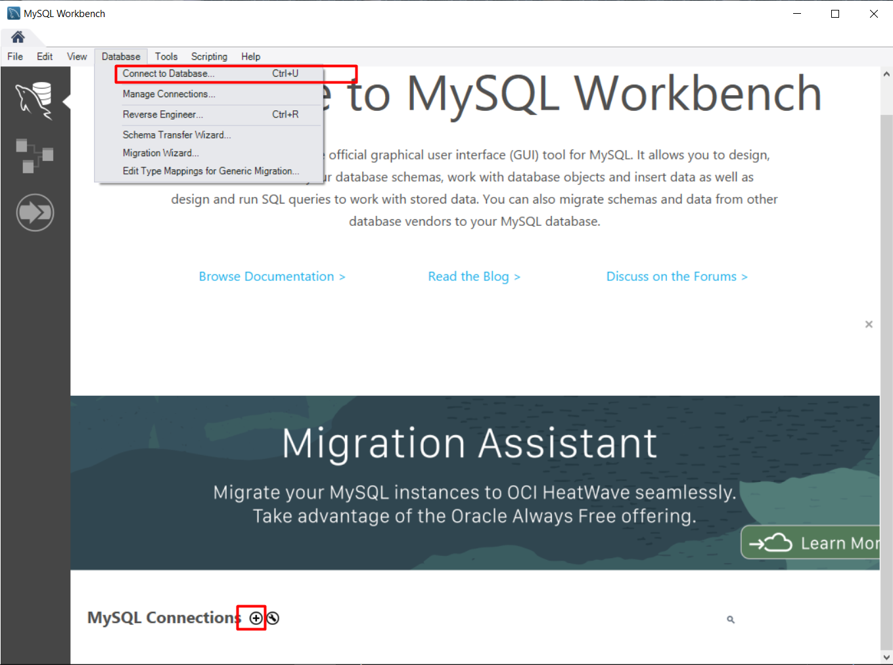

- **Bước 2**: Nhập tên kết nối. Bạn có thể đặt tên tùy ý. Theo mặc định, tên người dùng là `root`. Nếu bạn sử dụng tài khoản người dùng khác, bạn có thể thay đổi tên trong hộp văn bản Tên người dùng .

  - Host name là Public IP của máy ảo Ubuntu cài mysql Sever
  - Usename là tài khoản mà ta muốn truy cập ở đây ta dùng `tien9a`

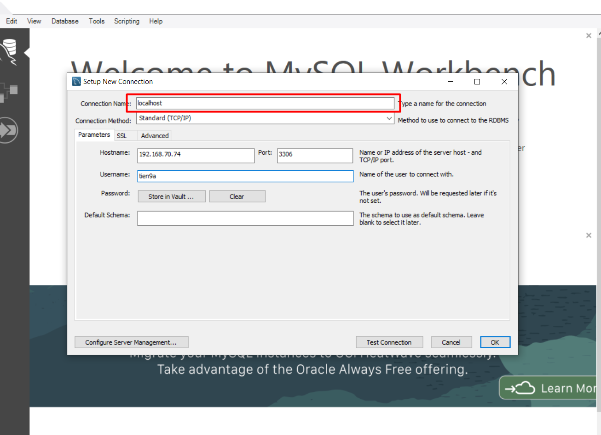

- **Bước 3**: Nhấp vào `Store in Vault` ...nút để nhập mật khẩu cho tài khoản người dùng đã cung cấp. Một cửa sổ sẽ hiển thị. Bạn nhập mật khẩu và nhấp vào nút `OK` dể lưu cấu hình kết nối.

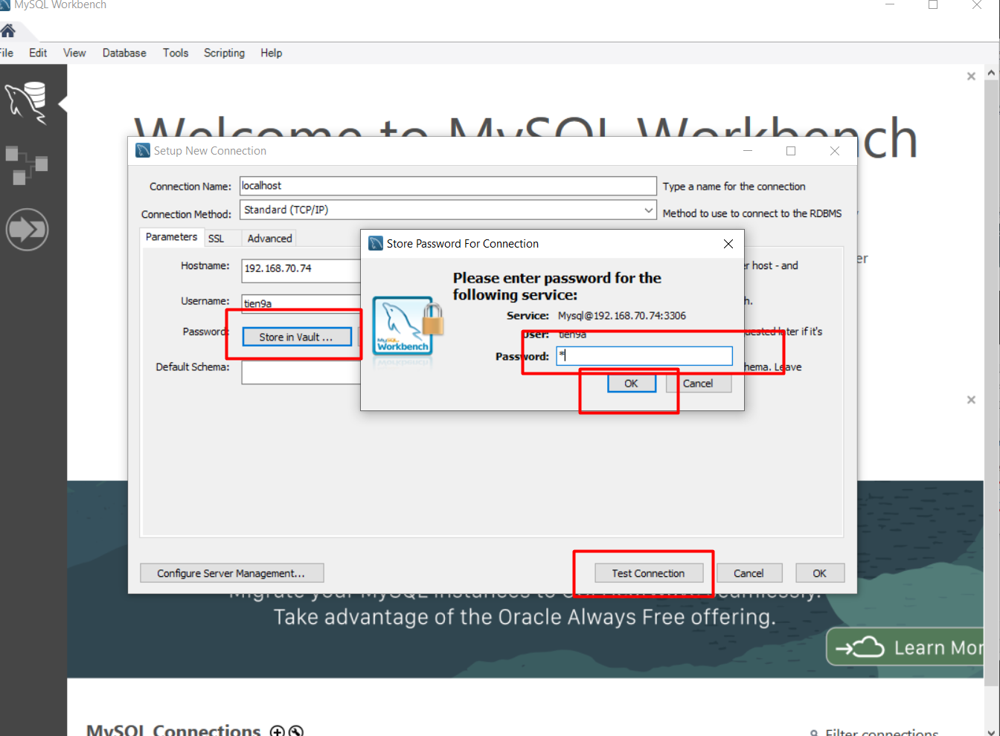

**Kết quả**:

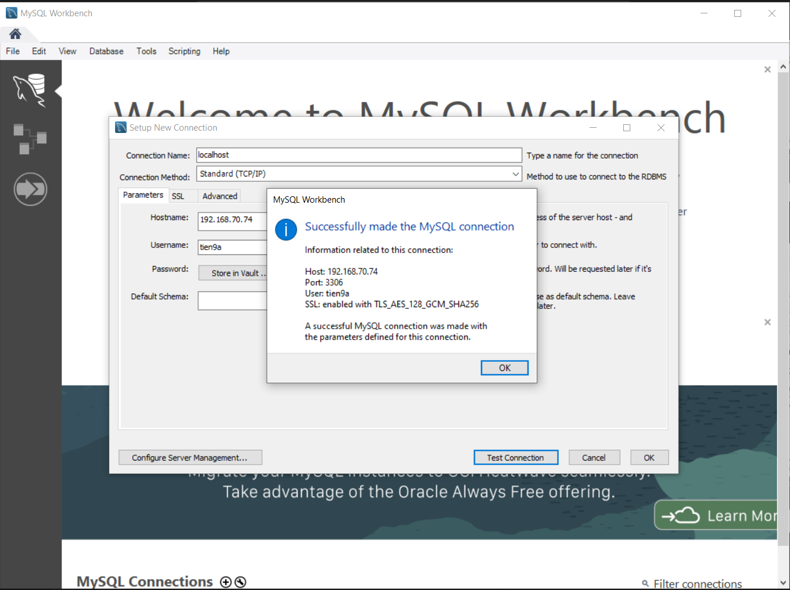

- **Bước 4**: Nhấp vào kết nối mới tạo trong **MySQL Connections** để kết nối với Máy chủ MySQL:

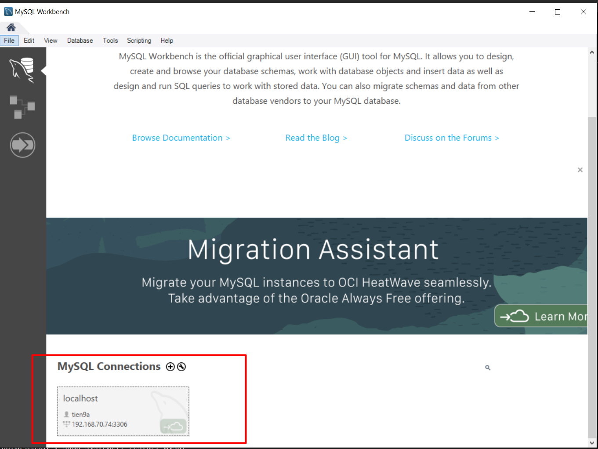

- **Bước 5**: Màn hình MySQL Workbench hiển thị các lược đồ hiện tại và một khung để nhập truy vấn:


**Ví dụ**:

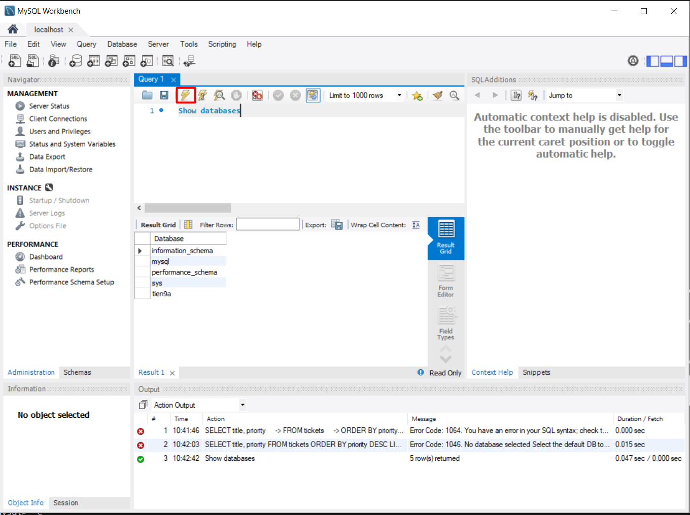

## II. LAB 2: Mô phỏng thực hành với CSDL Mẫu (`classicmodels`)

### 1. Tổng quan về `classicmodels`

- `classicmodels`: là CSDL mẫu để giúp bạn làm quen và thao tác với MySQL một cách nhanh chóng và hiệu quả.

- `classicmodels`: là một cơ sở dữ liệu mô phỏng hoạt động của một công ty chuyên kinh doanh mô hình xe cổ. Bộ dữ liệu này chứa đầy đủ **thông tin thường gặp trong môi trường doanh nghiệp**, bao gồm:
  
  - **Khách hàng**
  - **Sản phẩm**
  - **Đơn hàng**
  - **Chi tiết đơn hàng**
  - **Nhân viên**
  - **văn phòng** và **nhiều dữ liệu liên quan khác**...

=> **Cơ sở dữ liệu mẫu này** sẽ được **dùng xuyên suốt trong các ví dụ MySQL** — từ **truy vấn đơn giản** cho đến **stored procedure** phức tạp, **giúp minh họa rõ ràng cách MySQL hoạt động trong thực tế**.

### 2. Lab tải file CSDL mẫu vào MySQL (on UBUNTU)

- **Bước 1**: Tải về cơ sở dữ liệu mẫu MySQL. Bạn có thể tải bộ dữ liệu mẫu tại liên kết sau: <https://www.mysqltutorial.org/wp-content/uploads/2023/10/mysqlsampledatabase.zip>

  - On Ubuntu Sever: Tải file nén `.zip` đặt tên file `classicmodels.zip` luôn

  - Cấu trúc **lược đồ (Schema)** của cơ sở dữ liệu mẫu `classicmodels`

    - `customers` – lưu thông tin khách hàng
    - `products` – danh sách sản phẩm mô hình xe
    - `productlines` – danh sách dòng sản phẩm
    - `orders` – lưu các đơn hàng của khách
    - `orderdetails` – lưu chi tiết từng đơn hàng
    - `payments` – lưu các khoản thanh toán của khách
    - `employees` – thông tin nhân viên và cấu trúc báo cáo (ai quản lý ai)
    - `offices` – dữ liệu văn phòng kinh doanh

  - Bức hình dưới đây minh họa **sơ đồ quan hệ (ERD)** của cơ sở dữ liệu mẫu:

```bash
curl -o classicmodels.zip https://www.mysqltutorial.org/wp-content/uploads/2023/10/mysqlsampledatabase.zip
```

  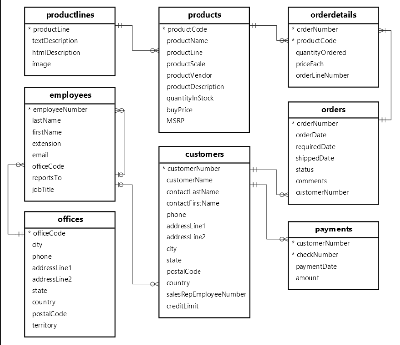

- **Bước 2**: Sau khi tải xong dùng lệnh `grep` check xem file `.zip` đã được cài đặt chưa

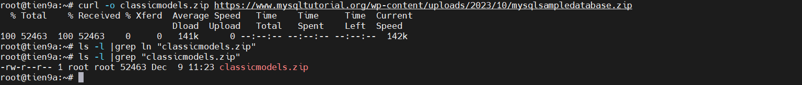

- **Bước 3**: Và ta sẽ giải nén tệp `classicmodels.zip`. Trước tiên cần phải tải gói unzip
  
  - `d`: tuỳ chọn lưu vào đường dẫn này

```bash
sudo apt update
sudo apt install unzip -y
unzip classicmodels.zip -d /root
```

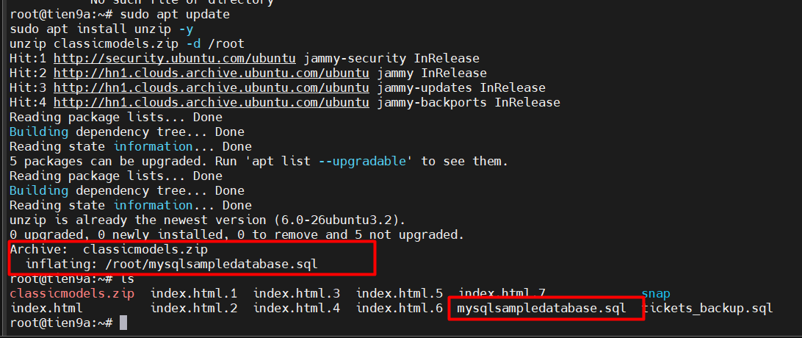

=> file `.zip` đã được giải nén thành `mysqlsampledatabase.sql` vào trong thư mục `/root`

- **Bước 4**: Đăng nhập vào MySQL trên Ubuntu nhập mật khẩu user là sẽ vào được

```bash
mysql -u tien9a -p
```

- **Bước 5**: Sử dụng lệnh `source` để tải tài nguyên từ máy vào MySQL.

```sql
source /root/mysqlsampledatabase.sql
```

- **Bước 6**: Sử dụng `SHOW DATABASES` để liệt kê tất cả cơ sở dữ liệu trong máy chủ hiện tại và sử dụng lệnh `USE` để chọn DATABASES để chúng ta truy vấn.

```bash
show databases;
use classicmodels
```

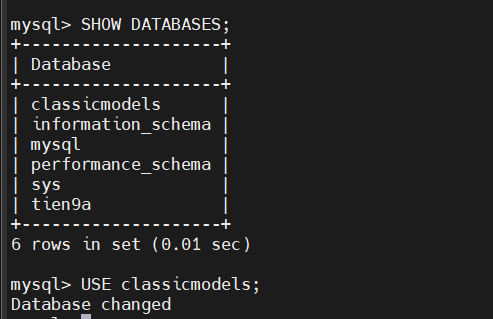
