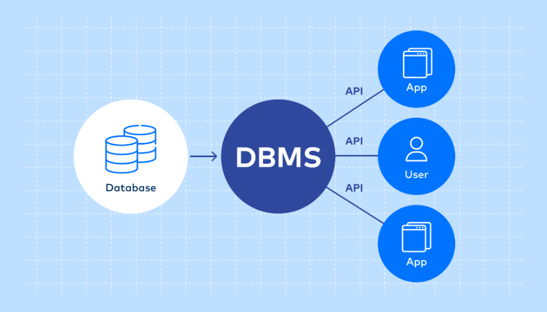
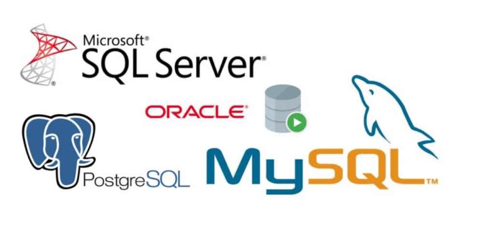
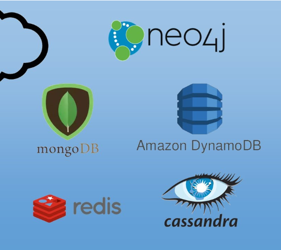
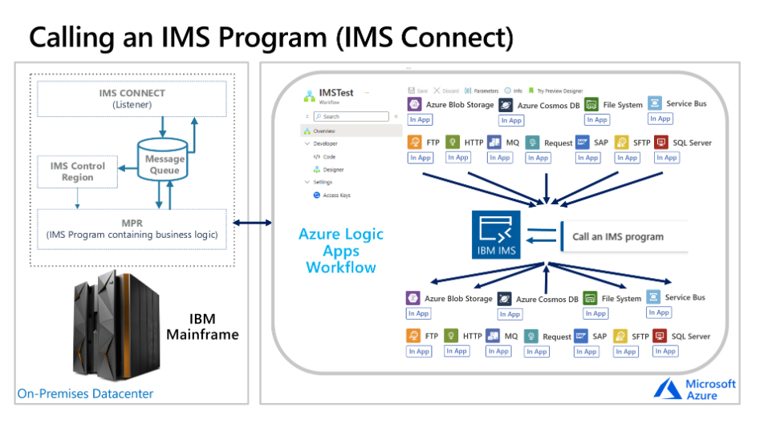

# TỔNG QUAN MY_SQL

## I. TỔNG QUAN VỀ DATABASE



Trong thời đại Internet ngày nay, Chúng ta tiếp xúc với **DataBase** (Cơ sở dữ liệu) mỗi ngày.

**Ví dụ**:

- Khi chúng ta nghe nhạc trên Spotify thì **danh sách nhạc** (playlist) chúng ta nghe chính là 1 **Database**.
- Khi chúng ta mua sắm đồ online thì chúng ta đang truy cập vào **cơ sở dữ liệu** giỏ hàng
- Khi bạn chụp ảnh và tải lên tài khoản của mình trên mạng xã hội như Facebook, **thư viện ảnh** của bạn sẽ trở thành cơ sở dữ liệu.  
...

### 1. Khái niệm về DATABASE & Các khái niệm liên quan

- **Database:** là một tập hợp dữ liệu có tổ chức, được lưu trữ và quản lý một cách có hệ thống trên máy tính, cho phép truy xuất, cập nhật và quản lý thông tin một cách hiệu quả.

- **DBMS(DataBase Management System):** **Hệ quản trị cơ sở dữ liệu** là phần mềm dùng để **tạo, quản lý, truy xuất** và **bảo vệ cơ sở dữ liệu**. Nói cách khác, **DBMS** là **“trung gian”** giữa **người dùng/ứng dụng** và **cơ sở dữ liệu**, **giúp dữ liệu** được **lưu trữ có tổ chức, an toàn** và **dễ truy cập**.

  - eg:

    - **Quan hệ (RDBMS)**: MySQL, PostgreSQL, Oracle, SQL Server
    - **Phi quan hệ (NoSQL)**: MongoDB, Cassandra, Redis
  
  - Mô hình tương tác của DBMS

```rust
Người dùng /Ứng dụng <--> DBMS <--> Database
```

- **RDB - Realational DB:** **RDB (Relational Database – Cơ sở dữ liệu quan hệ)** là loại cơ sở dữ liệu lưu trữ dữ liệu theo **dạng bảng (table)**, trong đó các bảng có thể **liên kết** với nhau thông qua các **khóa (keys)** để đảm bảo **tính nhất quán** và quan hệ giữa các dữ liệu.

- **SQL(Structured Query Language):** là ngôn ngữ khai báo **(declarative language)** để **tương tác(INSERT,SELECT,CREATE TABLE)** với **cơ sở dữ liệu quan hệ (RDB – Relational Database)**. Nó cho phép người dùng **tạo, truy vấn, cập nhật, và quản lý dữ liệu** trong các **bảng** một cách có **cấu trúc**.

- **NoSQL(Not Only SQL)** là một loại **cơ sở dữ liệu phi quan hệ**, được thiết kế để **lưu trữ và xử lý** dữ liệu có **cấu trúc linh hoạt**, không bắt buộc phải theo **schema** cố định như RDB. NoSQL ra đời để giải quyết các vấn đề về khả năng mở rộng và hiệu suất mà RDB gặp phải với **dữ liệu lớn**.

- **Schema (Sơ đồ dữ liệu / Cấu trúc cơ sở dữ liệu)** là bản thiết kế hoặc mô tả cấu trúc của cơ sở dữ liệu, xác định cách dữ liệu được tổ chức và các mối quan hệ giữa chúng.

### 2. Phân loại DataBase

Khi nói đến cơ sở dữ liệu thì có tổng 5 loại DB phổ biến:

- **Relational Database** (RDB – CSDL quan hệ)

  - **Định nghĩa**: Dữ liệu được lưu theo **bảng**, các bảng liên kết với nhau bằng **khóa chính và khóa ngoại**.
  - **Đặc điểm**: Dùng SQL, đảm bảo tính nhất quán và toàn vẹn dữ liệu.
  - **Ví dụ**: MySQL, PostgreSQL, Oracle, SQL Server.



- **NoSQL Database** (CSDL phi quan hệ)

  - **Định nghĩa**: Dữ liệu không theo bảng, linh hoạt, phù hợp dữ liệu lớn và phi cấu trúc.
  - **Các loại con**: Document (MongoDB), Key-Value (Redis), Column (Cassandra), Graph (Neo4j).



- **Hierarchical Database** (CSDL phân cấp)

  - **Định nghĩa**: Dữ liệu được lưu theo cấu trúc cây, mỗi bản ghi có một bản ghi cha và nhiều bản ghi con.
  - **Ví dụ**: IBM IMS



- **Network Database** (CSDL mạng)

  - **Định nghĩa**: Dữ liệu lưu theo mạng lưới, cho phép bản ghi liên kết với nhiều bản ghi khác, thích hợp dữ liệu phức tạp.
  - **Ví dụ**: IDMS

- **Object-oriented Database** (CSDL hướng đối tượng)

  - **Định nghĩa**: Dữ liệu lưu dưới dạng đối tượng, kết hợp với lập trình hướng đối tượng.
  - **Ví dụ**: db4o, ObjectDB

Nhưng tổng quan lai thì có 2 loại DB chính:

#### a. RDB – Relational Database (Cơ sở dữ liệu quan hệ)

- Là loại database lưu trữ dữ liệu theo bảng (table) gồm hàng và cột, có quan hệ giữa các bảng.
Dữ liệu có schema cố định (cấu trúc phải được định nghĩa trước).

- **Đặc điểm**:

  - Lưu trữ dạng **bảng**.
  - Hỗ trợ SQL để **truy vấn**.
  - Có **ràng buộc** như **khóa chính**, **khóa ngoại**.
  - Đảm bảo `ACID` (An toàn – nhất quán – riêng biệt – bền vững = English).
  - Tốt cho hệ thống yêu cầu tính chính xác cao.
  - Ứng dụng trong dự án cần tính bảo mật cao như: Bank,...

- Chức năng của **Khoá Chính(Pimary Key)**, **khoá ngoại(Foreign Key)** và **ràng buộc (Constraints)**:

##### Ràng buộc (Constraints)

- **Khái niệm**: Ràng buộc là quy tắc đặt trên cột hoặc bảng để đảm bảo dữ liệu chính xác – nhất quán – hợp lệ.

- **Các loại ràng buộc** trong **RDB**:

  - **PRIMARY KEY**: Đảm bảo duy nhất + không null.

  - **FOREIGN KEY**: Đảm bảo giá trị phải tồn tại ở bảng tham chiếu.

  - **UNIQUE**: Giá trị không được trùng.Khác PK ở chỗ: có thể chứa NULL và mỗi bảng có thể có nhiều UNIQUE.

  - **NOT NULL**: Bắt buộc phải có giá trị.

  - **DEFAULT**: Gán giá trị mặc định nếu không nhập.

  - **CHECK**: Kiểm tra điều kiện hợp lệ.

    - eg:

```sql
age INT CHECK (age >= 18)
```

##### Khóa chính (Primary Key – PK)

- **Khái niệm**: Khóa chính là **thuộc tính** (hoặc tập thuộc tính) dùng để **xác định** duy nhất **mỗi dòng** (record) trong bảng.

- **Đặc điểm**:

  - Duy nhất (unique).
  - Không được phép `NULL`.
  - Mỗi bảng **chỉ có** 1 khóa chính (có thể gồm nhiều cột → composite key).

- Ví dụ **Bảng Users**:

| id (PK) | name | email                             |
| ------- | ---- | --------------------------------- |
| 1       | Tien | [a@gmail.com](mailto:a@gmail.com) |
| 2       | Nam  | [b@gmail.com](mailto:b@gmail.com) |

- id là **primary key** → đảm bảo **không trùng** và **không null**.

- Mục đích:

  - Nhận diện bản ghi.
  - Tăng tốc tìm kiếm.
  - Dùng làm điểm liên kết giữa các bảng **(foreign key).**

##### Khóa ngoại (Foreign Key – FK)

- **Khái niệm**: Khóa ngoại là cột trong một bảng, **tham chiếu** đến **khóa chính** của bảng **khác** để tạo mối quan hệ (relationship).

- Công dụng:

  - Tạo liên kết giữa các bảng (1–N, N–N).
  - Đảm bảo tính đồng nhất dữ liệu.
  - Ngăn chặn dữ liệu mồ côi **(orphan records)**.

- Ví dụ:

| order_id | user_id (FK) | product |
| -------- | ------------ | ------- |
| 101      | 1            | Laptop  |
| 102      | 2            | Mouse   |

- user_id là FK, trỏ về id của bảng Users.

- Ràng buộc FK:

  - `ON DELETE CASCADE` → xóa user thì order cũng bị xóa theo.
  - `ON UPDATE CASCADE` → sửa id user thì tự cập nhật trên bảng phụ.

=> **Tại sao cần PK – FK – Constraints**?

- Đảm bảo tính nhất quán (consistency)
  - **eg**: FK ngăn việc tạo order của user không tồn tại.
- Ngăn lỗi nhập liệu: Ràng buộc `CHECK`, `NOT NULL` giúp dữ liệu hợp lệ.
- Quan trọng trong `ACID`
- Cơ sở để tạo quan hệ trong RDB

=> **RDB mạnh nhờ khả năng kết nối và ràng buộc chặt chẽ**.

#### b. NoSQL – Non-relational Database (Cơ sở dữ liệu phi quan hệ)

- Là loại database không dùng cấu trúc bảng, được thiết kế để xử lý lượng dữ liệu rất lớn, linh hoạt và dễ mở rộng ngang.

- Đặc điểm:

  - Không có **schema** cố định.
  - Dữ liệu có thể dạng: **Document (JSON,..)**, **Key–value**, **Column family**, **Graph**
  - Ưu tiên tốc độ và khả năng mở rộng.
  - Thường theo mô hình `BASE` (linh hoạt hơn `ACID`).
  - ứng dụng trong dự án có tính linh hoạt cao như: Big DATA,...