# QUERYING DATA

## 1. `SELECT` - Các truy vấn cơ bản

### `SELECT`

- câu lệnh `SELECT` sử dụng để chọn dữ liệu từ một bảng trong cơ sở dữ liệu.

- Cú pháp chuẩn:

```sql
SELECT select_list
FROM table_name;
```

- `SELECT` không cần `FROM`:

```sql
SELECT select_list;
or
SELECT 1+1;
```

-> Dùng để hiển thị nội dung or tính toán, chạy hàm và xử lí biểu thức.

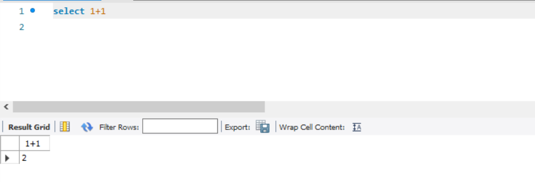

- Dùng hàm trong `SELECT` vì nó có nhiều hàm built-in (hàm chuỗi, hàm toán, hàm thời gian...):

```sql
SELECT NOW()
```

-> Trả về giờ, ngày và tháng hiện tại của nơi máy chủ đặt

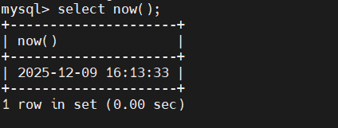

```sql
SELECT CONCAT('John',' ','Doe');
```

-> Nối lại 2 chuỗi vào với nhau

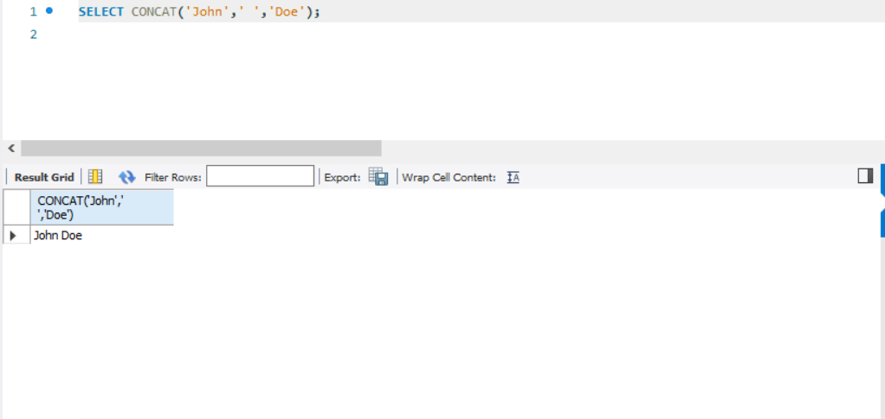

- Trong SQL, AS là viết tắt của từ "Alias" trong tiếng Anh, nghĩa là bí danh:

  - `Column Alias` = Bí danh cột
  - `Table Alias` = Bí danh bảng

- Từ "AS" thực ra không phải viết tắt của một cụm dài, mà nó là viết rút gọn từ “alias” (bí danh). Một số tài liệu gọi nó là keyword for aliasing.

- Ví dụ:

```sql
SELECT salary AS luong, name AS ten_nhanvien
FROM employees;
```

- Ta có thể dùng AS (Alias - Bí danh cột) để dặt tên cột dễ đọc hơn. Cú pháp:

  - `expression` là hàm biểu thức

```sql
SELECT expression AS column_alias;
```

- Ta có thể gỡ biệt danh too. Cú pháp:

```sql
SELECT expression column_alias;
```

- Nếu biệt danh có dấu cách thì ta để trong dấu ngoặc phẩy :

```sql
SELECT CONCAT('Jane',' ','Doe') AS 'Full name';
```

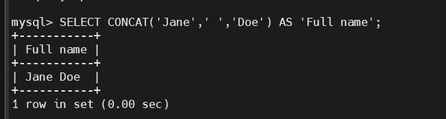

### `SELECT FROM`

- Câu lệnh này dùng để truy vấn dữ liệu (1 cột or nhiều cột) từ một hay nhiều bảng . Cú pháp câu lệnh như sau:

```sql
SELECT select_list
FROM table_name;
```

- Trong đó:

  - `select_list` là chỉ định một hoặc nhiều cột mà bạn muốn chọn dữ liệu sau từ khoá `SELECT`, nếu có quá nhiều cột thì phải phân tách bằng dấu phẩy.
  - `table_name` là chỉ định tên của bảng mà bạn muốn chọn sau từ khoá `FROM`.
  - Dấu `;` là tuỳ chọn, dùng để đánh dấu kết thúc câu lệnh. Nếu có 2 hay nhiều câu lệnh thì phải phân tách với nhau bằng dấu `;` để MySQL thực thiện riêng lẻ.
  - Không bắt buộc viết SQL bằng chữ in hoa vì nó có thể nhận diện được hết.
  - Khi `excute` thì SQL sẽ tiến hành mệnh đề `From` trước rồi mới đến `Select`.

- **Example(Dùng `classicmodel.sql`)**: Chúng ta sử dụng bảng `employees`

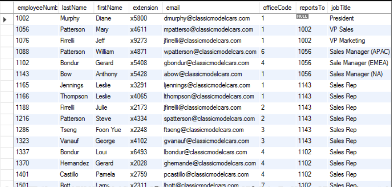

- Ta dùng `SELECT FROM` để lấy hết họ của nhân viên :

```sql
SELECT lastNAME FROM employees;
```

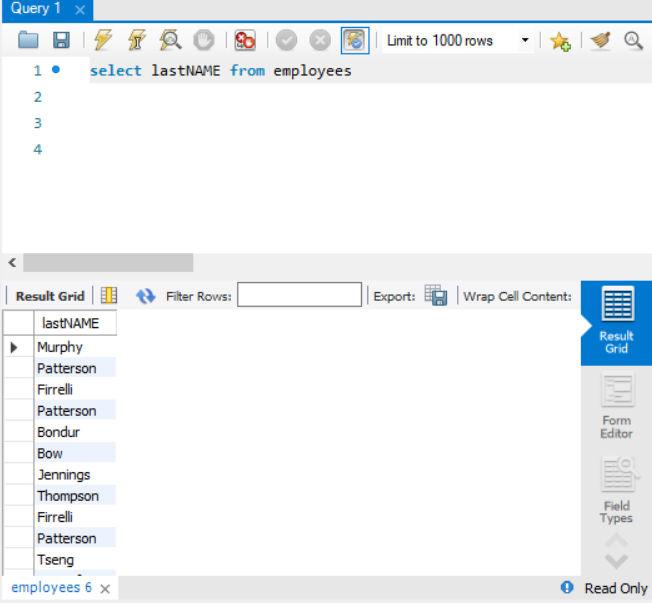

-> Kết quả từ câu lệnh được gọi là 1 **tập kết quả** vì nó là 1 tập hợp các hàng được trả về từ truy vấn

- Sử dụng `SELECT FROM` để lấy tên, họ và chức danh công việc nhân viên:

```sql
SELECT
    lastName,
    firstName,
    jobTitle
FROM
    employees;
```

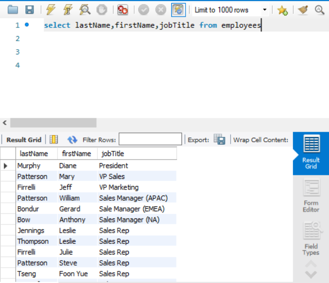

- Sử dụng `SELECT *` để trích xuất dữ liệu tất cả các cột của bảng

```sql
SELECT * FROM employees;
```

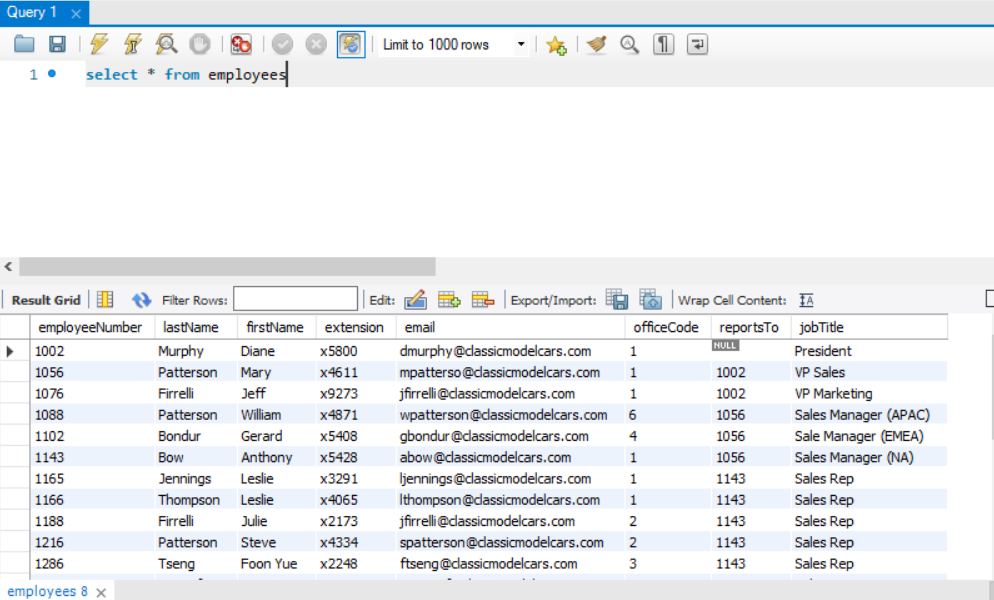

### `SELECT DISTINCT`- DISTINCT: DUY NHẤT

- Khi truy vấn dễ gặp lại các hàng trùng lặp cho nên sử dụng mệnh đề `DISTINCT` để loại bỏ chúng. Cú pháp câu lệnh như sau:

```sql
SELECT DISTINCT
      select_list
FROM
      table_name
WHERE
      search_condition
ORDER BY
      sort_expression;
```

- Trong đó:

  - Ta truy vấn giá trị từ 1 hoặc nhiều cột mà ta muốn chọn sau các từ khoá `SELECT DISTINCT`
  - Nếu chỉ truy vấn 1 cột thì mệnh đề `DISTINCT` đánh giá tính duy nhất của các hàng dựa trên các giá trị cột đó.
  - Nếu ta truy vấn 2 cột trở lên thì mệnh đè `DISTINCT` sẽ sử dụng giá trị của cột để đánh giá tính duy nhất của các hàng.
  - Khi `excute` thì SQL sẽ đánh giá mệnh đề `DISTINCT` sau mệnh đề `FROM`, `WHERE`, `SELECT` và trước mệnh đề `ORDER BY`.

- **Example(Dùng `classicmodel.sql`)**: Chúng ta sử dụng bảng `employees`

- Liệt kê các họ từ `employees` bằng `SELECT`:

```sql
SELECT
      lastName
FROM
      employees
ORDER BY
      lastName;
```

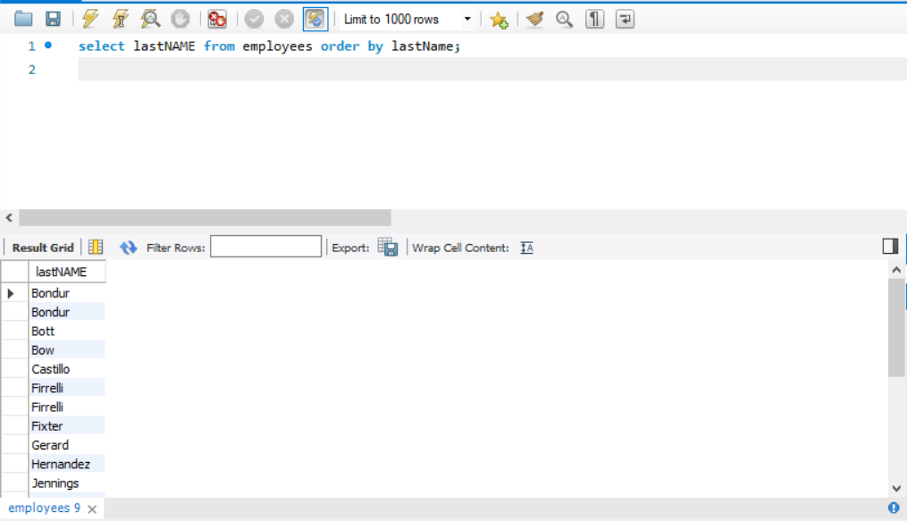

-> Ta có thể thấy 1 số nhân viên có cùng họ như là `Bondur`,`Firrelli`

- Liệt kê các họ duy nhất bằng cách thêm mệnh đè `DISTINCT`:

```sql
SELECT DISTINCT
      lastName
FROM
      employees
ORDER BY
      lastName;
```

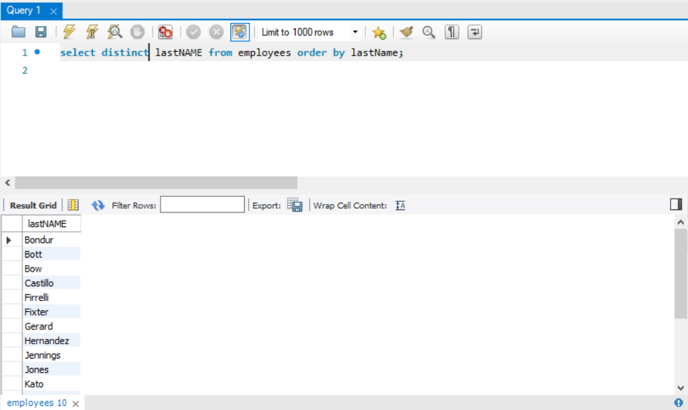

->Mệnh đề `DISTINCT` đã loại bỏ trùng lặp khỏi kết quả

#### Giá trị `DISTINCT` và `NULL` trong MySQL

- KHi bạn truy vấn một cột có giá trị `NULL` trong mệnh đè `DISTINCT`, mệnh đề `DISTINCT` sẽ chỉ giữ lại 1 giá trị `NULL` duy nhất vì nó coi tất cả các giá trị `NULL` đều giống nhau.

- **Example**: Cột `state` trong bảng `customer` có các giá trị `NULL` và khi ta dùng mệnh đề `DISTINCT` để truy vấn thì kết quả sẽ hiện như sau:

```sql
SELECT DISTINCT
      state
FROM
      customers;
```

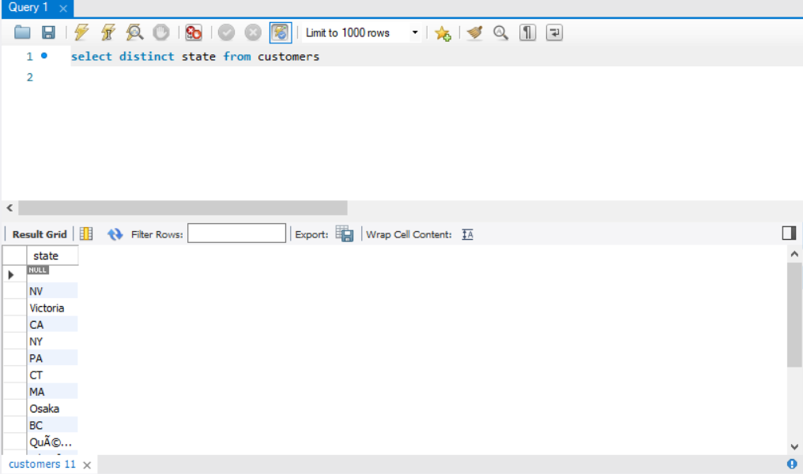

#### Dùng mệnh đề `DISTINCT` trong MySQL với nhiêu cột

- Khi bạn truy vấn nhiều cột trong mệnh đè `DISTINCT` thì mệnh đề `DISTINCT` sẽ kết hợp các giá trị trong các cột đó đẻ xác định tính duy nhất các hàng trong kết quả.

- **Example**: Lấy tổ hợp duy nhất giữa 2 cột `state` và `city` từ bảng `customers` bằng cú pháp:

```sql
SELECT DISTINCT
      city, state
FROM
      customers
WHERE
      state is NOT NULL
ORDER BY
      state,
      city;
```

- Kết quả:

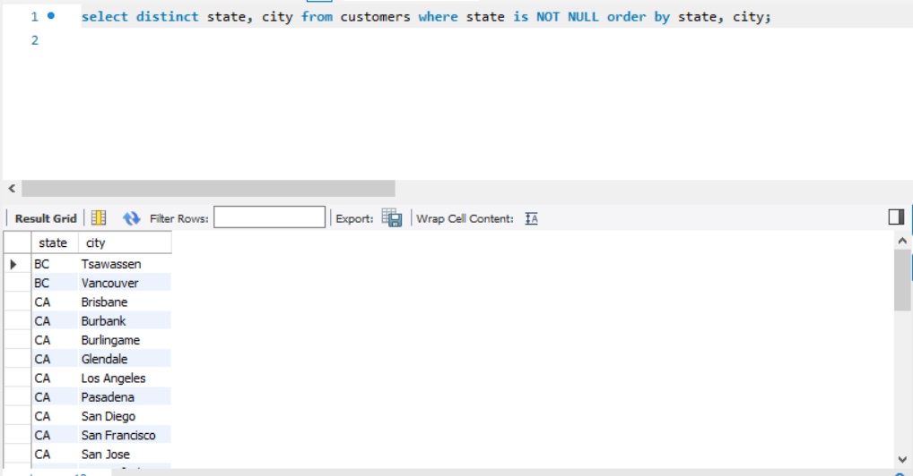

- Giả sử ta không sử dụng mệnh đề `DISTINCT` thì sao ?

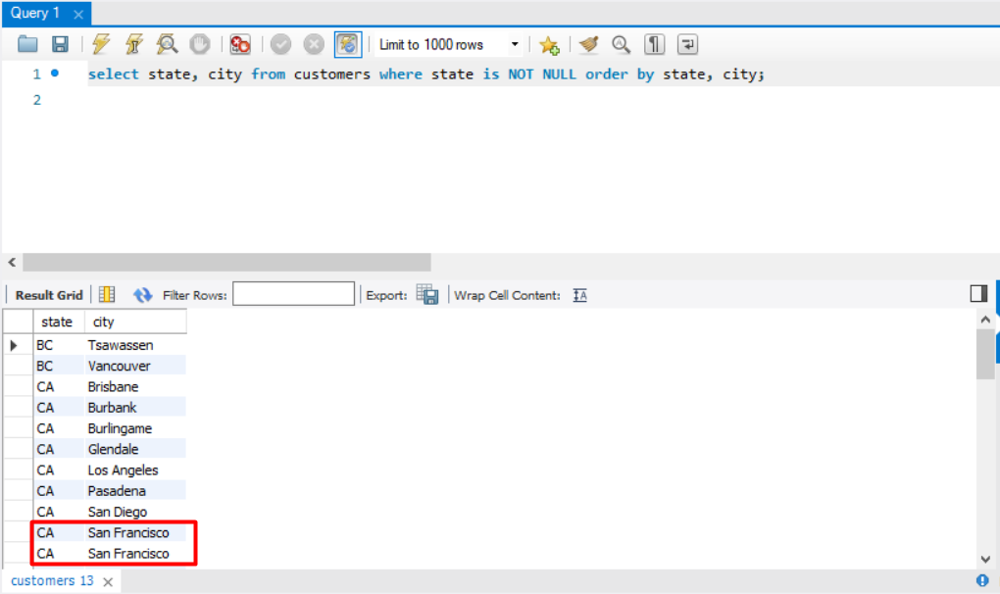

=> Ta sẽ gặp sự trùng lặp giữa `state` và `city`

### Table & Column Aliases

- MySQL hỗ trợ hai loại bí danh: **bí danh cột** và **bí danh bảng**. Chúng dùng để **gán tên tạm thời** bảng or cột.

#### Bí danh cột (Column Alias)

- **Column Alias** dùng để gán tên tạm thời cho một cột trong kết quả tập truy vấn bằng cú pháp:

```sql
SELECT
   [column_1 | expression] AS descriptive_name
FROM table_name;
```

- Nếu bí danh chứa khoảng cách thì phải đặt vào trong dấu ngoặc phẩy :

```sql
SELECT
   [column_1 | expression] AS `descriptive name`
FROM table_name;
```

- Ngoài ra ta có thể gán bí danh cho 1 biểu thức

- **Examples**: bảng `employees`trong `classicmodel.sql`

- Truy vấn sau liệt kê tên và họ của nhân viên và sửa dụng hàm `CONCAT_WS` để nối **Họ** + **Tên** thành **Họ tên đầy đủ**:

```sql
SELECT
     CONCAT_WS(',',lastName, firstName)
FROM
     employees;
```

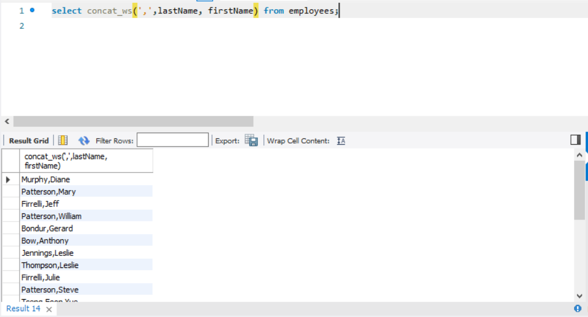

- Ta có thể thấy tiêu đề cột rất khó đọc cho lên ta cần gán bí danh cột cho tập kết quả này và cú pháp đó như sau:

```sql
SELECT
     CONCAT_WS(',',lastName, firstName) AS `Full Name`
FROM
     employees;
```

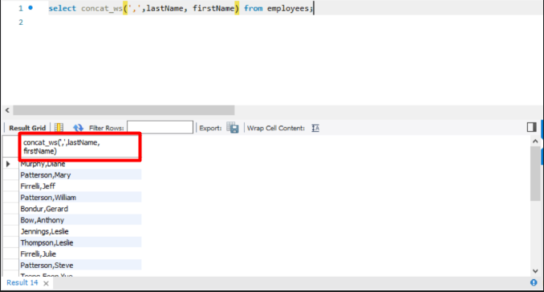

- Sau khi add bí danh cột:


- Trong SQL, ta có thể sử dụng bí danh cột trong mệnh đề `ORDER BY`, `GROUP BY` và `HAVING` để tham chiếu đến cột.

- ví dụ với `ORDER BY`: Sắp xếp các tên theo bảng chữ cái:

```sql
SELECT
     CONCAT_WS(',',lastName, firstName) AS `Full Name`
FROM
     employees
ORDER BY
     `Full Name`;
```


- ví dụ với `GROUP BY` và `HAVING`: Liệt kê các đơn hàng có số tiền lớn hơn `60000` trong bảng `orderdetails`:

```sql
SELECT
      orderNumber `Order no.`,
      SUM(priceEach * quantityOrdered) Total
FROM
      orderdetails
GROUP BY
      `Order no.`
HAVING
      Total > 60000;
```

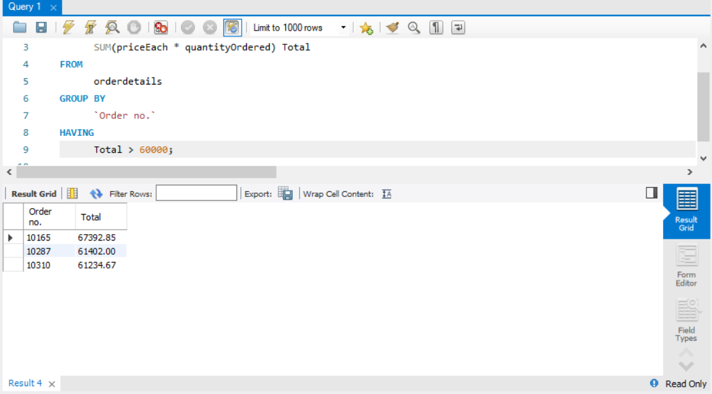

#### Bí danh bảng (Table Alias)

- Truy vấn bảng để gán tên tạm thời cho một bảng trong truy vấn. Cú pháp như sau:

```sql
table_name AS table_alias
```

- **Example**: Gán bảng `employees` bằng bí danh `e`:

```sql
SELECT * FROM employees e;
```

- Sau khi đặt bí danh bảng xong ta có thể truy vấn một cột trong bảng bằng cú pháp sau:

```sql
table_alias.column_name
```

- Thực hành lấy cột `firstName` và `lastName` trong bảng `employees`:

```sql
SELECT
      e.firstName, e.lastName
FROM
      employees e
ORDER BY
      e.firstName;
```

- **EXample(2 bảng bị trùng tên 1 cột )**: Bảng `customers` và bảng `orders` bị trùng 1 cột`customerNumber`:

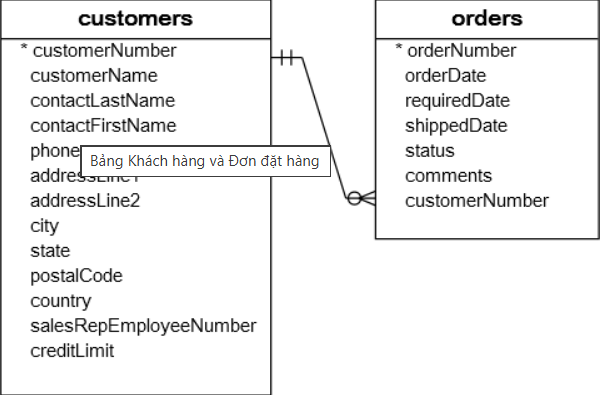

=> Để tránh lỗi này ta sử dụng bí danh bảng để phân biệt dữ liệu cột `customerNumber` trong 2 bảng, tránh xung đột và nhầm lẫn.

### `WHERE`

- Mệnh đè `WHERE` là một mệnh đề **lọc** của lệnh `SELECT` để **lọc hàng từ tập kết quả**. Cú pháp nó như sau :

```sql
SELECT
      select_list
FROM
      table_name
WHERE
      search_condition;
```

- Trong đó:

  - `search condition` là sự kết hợp của 1 hoặc nhiều biểu thức sử dụng toán tử logic `AND`, `OR` và `NOT`.
  - `SELECT` trả về bất kì hàng nào thoả mãn `search_condition`
  - Khi sử dụng SELECT với mệnh đề `WHERE`, MySQL sẽ đánh giá mệnh đề `WHERE` sau mệnh đề `FROM` và trước mệnh đề `SELECT` và `ORDER BY`

- **Example**(Sử dụng bảng `employees`): Sử dụng mệnh đề `WHERE` để tìm tất cả nhân viên có chức danh công việc là 'Sales Rep':

```sql
SELECT
      firstName
      lastName
      jobtitle
FROM
      employees
WHERE
      jobtitle = 'Sale Rep';
```

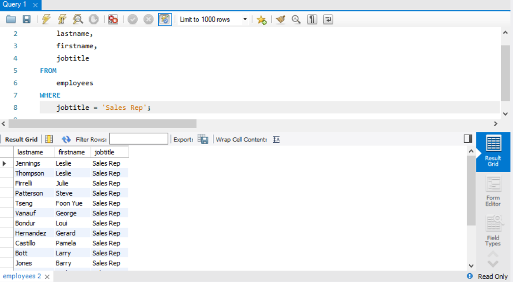

->Trong ví dụ này, câu lệnh `SELECT` sẽ kiểm tra tất cả các hàng của bảng `employees` và chỉ chọn những hàng có giá trị nằm trong cột `jobTitle` có giá trị `Sales Rep`.

