# QUERYING DATA

## 1. `SELECT` - Các truy vấn cơ bản

### `SELECT`

- câu lệnh `SELECT` sử dụng để chọn dữ liệu từ một bảng trong cơ sở dữ liệu.

- Cú pháp chuẩn:

```sql
SELECT select_list
FROM table_name;
```

- `SELECT` không cần `FROM`:

```sql
SELECT select_list;
or
SELECT 1+1;
```

-> Dùng để hiển thị nội dung or tính toán, chạy hàm và xử lí biểu thức.


- Dùng hàm trong `SELECT` vì nó có nhiều hàm built-in (hàm chuỗi, hàm toán, hàm thời gian...):

```sql
SELECT NOW()
```

-> Trả về giờ, ngày và tháng hiện tại của nơi máy chủ đặt


```sql
SELECT CONCAT('John',' ','Doe');
```

-> Nối lại 2 chuỗi vào với nhau


- Trong SQL, AS là viết tắt của từ "Alias" trong tiếng Anh, nghĩa là bí danh:

  - `Column Alias` = Bí danh cột
  - `Table Alias` = Bí danh bảng

- Từ "AS" thực ra không phải viết tắt của một cụm dài, mà nó là viết rút gọn từ “alias” (bí danh). Một số tài liệu gọi nó là keyword for aliasing.

- Ví dụ:

```sql
SELECT salary AS luong, name AS ten_nhanvien
FROM employees;
```

- Ta có thể dùng AS (Alias - Bí danh cột) để dặt tên cột dễ đọc hơn. Cú pháp:

  - `expression` là hàm biểu thức

```sql
SELECT expression AS column_alias;
```

- Ta có thể gỡ biệt danh too. Cú pháp:

```sql
SELECT expression column_alias;
```

- Nếu biệt danh có dấu cách thì ta để trong dấu ngoặc phẩy :

```sql
SELECT CONCAT('Jane',' ','Doe') AS 'Full name';
```


### `SELECT FROM`

- Câu lệnh này dùng để truy vấn dữ liệu (1 cột or nhiều cột) từ một hay nhiều bảng . Cú pháp câu lệnh như sau:

```sql
SELECT select_list
FROM table_name;
```

- Trong đó:

  - `select_list` là chỉ định một hoặc nhiều cột mà bạn muốn chọn dữ liệu sau từ khoá `SELECT`, nếu có quá nhiều cột thì phải phân tách bằng dấu phẩy.
  - `table_name` là chỉ định tên của bảng mà bạn muốn chọn sau từ khoá `FROM`.
  - Dấu `;` là tuỳ chọn, dùng để đánh dấu kết thúc câu lệnh. Nếu có 2 hay nhiều câu lệnh thì phải phân tách với nhau bằng dấu `;` để MySQL thực thiện riêng lẻ.
  - Không bắt buộc viết SQL bằng chữ in hoa vì nó có thể nhận diện được hết.
  - Khi `excute` thì SQL sẽ tiến hành mệnh đề `From` trước rồi mới đến `Select`.

- **Example(Dùng `classicmodel.sql`)**: Chúng ta sử dụng bảng `employees`


- Ta dùng `SELECT FROM` để lấy hết họ của nhân viên :

```sql
SELECT lastNAME FROM employees;
```


-> Kết quả từ câu lệnh được gọi là 1 **tập kết quả** vì nó là 1 tập hợp các hàng được trả về từ truy vấn

- Sử dụng `SELECT FROM` để lấy tên, họ và chức danh công việc nhân viên:

```sql
SELECT
    lastName,
    firstName,
    jobTitle
FROM
    employees;
```


- Sử dụng `SELECT *` để trích xuất dữ liệu tất cả các cột của bảng

```sql
SELECT * FROM employees;
```


### `SELECT DISTINCT`- DISTINCT: DUY NHẤT

- Khi truy vấn dễ gặp lại các hàng trùng lặp cho nên sử dụng mệnh đề `DISTINCT` để loại bỏ chúng. Cú pháp câu lệnh như sau:

```sql
SELECT DISTINCT
      select_list
FROM
      table_name
WHERE
      search_condition
ORDER BY
      sort_expression;
```

- Trong đó:

  - Ta truy vấn giá trị từ 1 hoặc nhiều cột mà ta muốn chọn sau các từ khoá `SELECT DISTINCT`
  - Nếu chỉ truy vấn 1 cột thì mệnh đề `DISTINCT` đánh giá tính duy nhất của các hàng dựa trên các giá trị cột đó.
  - Nếu ta truy vấn 2 cột trở lên thì mệnh đè `DISTINCT` sẽ sử dụng giá trị của cột để đánh giá tính duy nhất của các hàng.
  - Khi `excute` thì SQL sẽ đánh giá mệnh đề `DISTINCT` sau mệnh đề `FROM`, `WHERE`, `SELECT` và trước mệnh đề `ORDER BY`.

- **Example(Dùng `classicmodel.sql`)**: Chúng ta sử dụng bảng `employees`

- Liệt kê các họ từ `employees` bằng `SELECT`:

```sql
SELECT
      lastName
FROM
      employees
ORDER BY
      lastName;
```


-> Ta có thể thấy 1 số nhân viên có cùng họ như là `Bondur`,`Firrelli`

- Liệt kê các họ duy nhất bằng cách thêm mệnh đè `DISTINCT`:

```sql
SELECT DISTINCT
      lastName
FROM
      employees
ORDER BY
      lastName;
```


->Mệnh đề `DISTINCT` đã loại bỏ trùng lặp khỏi kết quả

#### Giá trị `DISTINCT` và `NULL` trong MySQL

- KHi bạn truy vấn một cột có giá trị `NULL` trong mệnh đè `DISTINCT`, mệnh đề `DISTINCT` sẽ chỉ giữ lại 1 giá trị `NULL` duy nhất vì nó coi tất cả các giá trị `NULL` đều giống nhau.

- **Example**: Cột `state` trong bảng `customer` có các giá trị `NULL` và khi ta dùng mệnh đề `DISTINCT` để truy vấn thì kết quả sẽ hiện như sau:

```sql
SELECT DISTINCT
      state
FROM
      customers;
```


#### Dùng mệnh đề `DISTINCT` trong MySQL với nhiêu cột

- Khi bạn truy vấn nhiều cột trong mệnh đè `DISTINCT` thì mệnh đề `DISTINCT` sẽ kết hợp các giá trị trong các cột đó đẻ xác định tính duy nhất các hàng trong kết quả.

- **Example**: Lấy tổ hợp duy nhất giữa 2 cột `state` và `city` từ bảng `customers` bằng cú pháp:

```sql
SELECT DISTINCT
      city, state
FROM
      customers
WHERE
      state is NOT NULL
ORDER BY
      state,
      city;
```

- Kết quả:


- Giả sử ta không sử dụng mệnh đề `DISTINCT` thì sao ?


=> Ta sẽ gặp sự trùng lặp giữa `state` và `city`

### Table & Column Aliases

- MySQL hỗ trợ hai loại bí danh: **bí danh cột** và **bí danh bảng**. Chúng dùng để **gán tên tạm thời** bảng or cột.

#### Bí danh cột (Column Alias)

- **Column Alias** dùng để gán tên tạm thời cho một cột trong kết quả tập truy vấn bằng cú pháp:

```sql
SELECT
   [column_1 | expression] AS descriptive_name
FROM table_name;
```

- Nếu bí danh chứa khoảng cách thì phải đặt vào trong dấu ngoặc phẩy :

```sql
SELECT
   [column_1 | expression] AS `descriptive name`
FROM table_name;
```

- Ngoài ra ta có thể gán bí danh cho 1 biểu thức

- **Examples**: bảng `employees`trong `classicmodel.sql`

- Truy vấn sau liệt kê tên và họ của nhân viên và sửa dụng hàm `CONCAT_WS` để nối **Họ** + **Tên** thành **Họ tên đầy đủ**:

```sql
SELECT
     CONCAT_WS(',',lastName, firstName)
FROM
     employees;
```


- Ta có thể thấy tiêu đề cột rất khó đọc cho lên ta cần gán bí danh cột cho tập kết quả này và cú pháp đó như sau:

```sql
SELECT
     CONCAT_WS(',',lastName, firstName) AS `Full Name`
FROM
     employees;
```


- Sau khi add bí danh cột:


- Trong SQL, ta có thể sử dụng bí danh cột trong mệnh đề `ORDER BY`, `GROUP BY` và `HAVING` để tham chiếu đến cột.

- ví dụ với `ORDER BY`: Sắp xếp các tên theo bảng chữ cái:

```sql
SELECT
     CONCAT_WS(',',lastName, firstName) AS `Full Name`
FROM
     employees
ORDER BY
     `Full Name`;
```


- ví dụ với `GROUP BY` và `HAVING`: Liệt kê các đơn hàng có số tiền lớn hơn `60000` trong bảng `orderdetails`:

```sql
SELECT
      orderNumber `Order no.`,
      SUM(priceEach * quantityOrdered) Total
FROM
      orderdetails
GROUP BY
      `Order no.`
HAVING
      Total > 60000;
```


#### Bí danh bảng (Table Alias)

- Truy vấn bảng để gán tên tạm thời cho một bảng trong truy vấn. Cú pháp như sau:

```sql
table_name AS table_alias
```

- **Example**: Gán bảng `employees` bằng bí danh `e`:

```sql
SELECT * FROM employees e;
```

- Sau khi đặt bí danh bảng xong ta có thể truy vấn một cột trong bảng bằng cú pháp sau:

```sql
table_alias.column_name
```

- Thực hành lấy cột `firstName` và `lastName` trong bảng `employees`:

```sql
SELECT
      e.firstName, e.lastName
FROM
      employees e
ORDER BY
      e.firstName;
```

- **EXample(2 bảng bị trùng tên 1 cột )**: Bảng `customers` và bảng `orders` bị trùng 1 cột`customerNumber`:


=> Để tránh lỗi này ta sử dụng bí danh bảng để phân biệt dữ liệu cột `customerNumber` trong 2 bảng, tránh xung đột và nhầm lẫn.

### `WHERE`

- Mệnh đè `WHERE` là một mệnh đề **lọc** của lệnh `SELECT` để **lọc hàng từ tập kết quả**. Cú pháp nó như sau :

```sql
SELECT
      select_list
FROM
      table_name
WHERE
      search_condition;
```

- Trong đó:

  - `search condition` là sự kết hợp của 1 hoặc nhiều biểu thức sử dụng toán tử logic `AND`, `OR` và `NOT`.
  - `SELECT` trả về bất kì hàng nào thoả mãn `search_condition`
  - Khi sử dụng SELECT với mệnh đề `WHERE`, MySQL sẽ đánh giá mệnh đề `WHERE` sau mệnh đề `FROM` và trước mệnh đề `SELECT` và `ORDER BY`

- **Example(Sử dụng bảng `employees`)**: Sử dụng mệnh đề `WHERE` để tìm tất cả nhân viên có chức danh công việc là 'Sales Rep':

```sql
SELECT
      firstName
      lastName
      jobtitle
FROM
      employees
WHERE
      jobtitle = 'Sale Rep';
```


->Trong ví dụ này, câu lệnh `SELECT` sẽ kiểm tra tất cả các hàng của bảng `employees` và chỉ chọn những hàng có giá trị nằm trong cột `jobTitle` có giá trị `Sales Rep`.

#### **Example(Sử dụng `WHERE` với toán tử `AND`)**

- Sử dụng mệnh đè `WHERE` để tìm những nhân viên có chức danh công việc là `Sale Rep` và mã văn phòng là 1:

```sql
SELECT
      lastName,
      firstName,
      jobtitle,
      officeCode
FROM
      employees
WHERE
      jobtitle = 'Sale Rep' AND officeCode = 1;
```

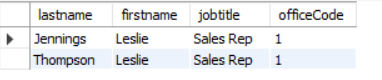

-> Toán tử `AND` dùng để kết hợp 2 điều kiện

#### **Example(Sử dụng `WHERE` với toán tử `OR`)**

- Sử dụng mệnh đè `WHERE` để tìm những nhân viên có chức danh công việc là `Sale Rep` hoặc mã văn phòng là 1:

```sql
SELECT
      lastName,
      firstName,
      jobtitle,
      officeCode
FROM
      employees
WHERE
      jobtitle = 'Sale Rep' OR officeCode = 1;
ORDER BY
      officeCode ,
      jobtitle;
```

-> `OR` trả về kết quả thoả mãn 1 trong nhiều điều kiện.

#### **Example(Sử dụng `WHERE` với toán tử `BETWEEN`)**

- Cú pháp chung

```sql
expression BETWEEN low AND high
```

- Giả sử tìm các nhân viên văn phòng làm việc có mã văn phòng từ 1 -> 3:

```sql
SELECT
      CONCAT_WS(',',lastName, firstName) AS `Full Name`,
      officeCode
FROM
      employees
WHERE
      officeCode BETWEEN 1 AND 3
ORDER BY
      officeCode;
```

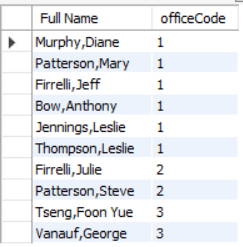

-> `BETWEEN AND` trả về giá trị trong 1 phạm vi chỉ định

#### **Example(Sử dụng `WHERE` với toán tử `LIKE`)**

- Toán tử `LIKE` xác định `TRUE` nếu giá trị **khớp** với **mẫu pattern**:

  - `%` khớp với chuỗi bất kì (kể cả rỗng)
  - `_` khớp với đúng một kí tự

- Giả sử, tìm họ nhân viên kết thúc bằng `son`:

```sql
SELECT
      firstName,
      lastName
FROM
      employees
WHERE
      lastName LIKE '%son'
ORDER BY
      firstName;
```

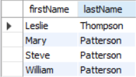

#### **Example(Sử dụng `WHERE` với toán tử `IN`)**

- Toán tử `IN` sẽ trả giá trị nếu giá trị đó khớp với một giá trị trong danh sách. Cú pháp chung:

```sql
value IN (value1, value2, ...)
```

- Giả sử tìm nhân viên thuộc văn phòng phòng 1,3,5

```sql
SELECT
      lastName,
      firstName
      officeCode
FROM
      employees
WHERE
      officeCode IN (1,3,5)
ORDER BY
      officeCode;
```

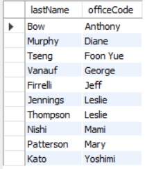

#### **Example(Sử dụng `WHERE` với toán tử `ISNULL`)**

Để kiêm tra giá trị là NULL hay không

value IS NULL

- Giả sử tìm nhân viên có giá trị `reportsTo` là `NULL`:

```sql
SELECT 
  lastName,
  firstName,
  reportsTo
FROM
  employees
WHERE reportsTo IS NULL;
```

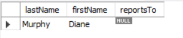

#### **Example(Sử dụng `WHERE` với toán tử so sánh)**

- Các toán tử so sánh:

  | Toán tử    | Ý nghĩa           |
  | ---------- | ----------------- |
  | =          | Bằng              |
  | <> hoặc != | Không bằng        |
  | <          | Nhỏ hơn           |
  | >          | Lớn hơn           |
  | <=         | Nhỏ hơn hoặc bằng |
  | >=         | Lớn hơn hoặc bằng |

- Tìm nhân viên không phải `Sales Rep`:
  
  ```sql
  SELECT 
    lastName,
    firstName,
    jobTitle
  FROM 
    employees
  WHERE 
    jobTitle <> 'Sales Rep';
  ```

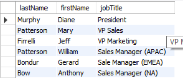

- Tìm nhân viên có mã văn phòng > 5:

  ```sql
  SELECT
    lastName,
    firstName,
    officeCode
  FROM
    employees
  WHERE
    officeCode > 5;
  ```

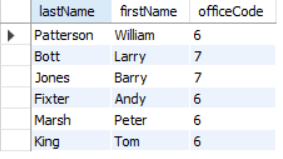

### `AND`

- MySQL không có kiểu dữ liệu **Boolean** tích hợp sẵn. Thay vào đó, nó sử dụng số `0` làm giá trị `FALSE` và các giá trị `khác 0` làm giá trị `TRUE`.

Toán tử `AND` là một toán tử logic **kết hợp hai hoặc nhiều biểu thức Boolean** và trả về `1`, `0` hoặc `NULL`:

```sql
A AND B
```

- Có thể sử dụng `SELECT` để sử dụng toán tử `AND`

- Toán tử `AND` kết hợp với mệnh đề `WHERE`

### Các toán tử khác

- Các toán tử khác cũng giống or tương tự như toán tử `AND`

### `LIMIT`

- `LIMIT` dùng để giới hạn số lượng **hàng(rows)** được trả về trong câu lệnh `SELECT`

- `LIMIT` có thể nhận 1 hoặc 2 tham số, và cả 2 **đều phải** là **số nguyên không âm**

- Cú pháp với 2 tham số:

```sql
SELECT select_list
FROM table_name
LIMIT [offset,] row_count;
```

- Trong đó:

  - offset: vị trí bắt đầu (hàng đầu tiên có offset = 0)
  - row_count: số lượng hàng tối đa muốn lấy

- Ví dụ:

```sql
LIMIT 5, 10;
```

-> Bắt đầu từ hàng thứ 6, lấy 10 hàng

- Cú pháp với 1 tham số:

```sql
LIMIT row_count;
```

tường đương:

```sql
LIMIT 0, row_count;
```

-> lấy row_count hàng từ đầu bảng

- Cú pháp thay thế:

```sql
LIMIT row_count OFFSET offset;
```

- Ví dụ:

```sql
LIMIT 10 OFFSET 20;
```

-> lấy 10 hàng bắt đầu từ hàng 21

- Ví dụ sau minh hoạ cho mệnh đề `LIMIT` đó:

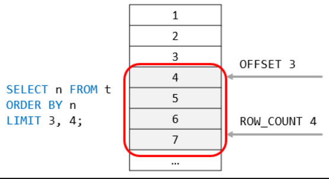

#### `LIMIT` kết hợp với `ORDER BY`

- Nếu không có `ORDER BY`, kết quả từ `LIMIT` sẽ không được sắp xếp.

- Giả sử ta lấy 5 khách hàng có credit cao nhất (hoặc thấp nhất)

  - Cao nhất:

```sql
SELECT 
      customerNumber, 
      customerName,
      creditLimit
FROM
      customers
ORDER BY
      creditLimit DESC
LIMIT
      5;
```

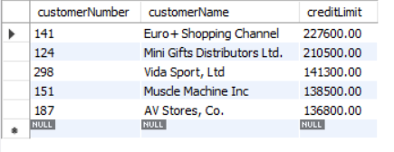

-> `DESC` xếp theo thứ tự giảm dần, thay `ASC` xếp theo thứ tự tăng dần

#### Dùng mệnh đề `LIMIT` để phân trang

- Giả sử mỗi trang chứa

- Số lượng dòng:

  ```sql
  SELECT COUNT(*) FROM customers;
  ```

- Trang 1(dòng 1 -> 10):

  ```sql
  SELECT customerNumber, customerName
  FROM customers
  ORDER BY customerName
  LIMIT 10;
  ```

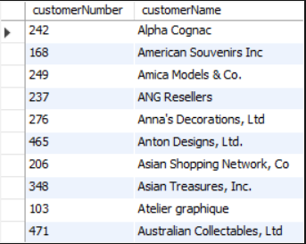  

- Trang 2(dòng 11 -> 20):

  ```sql
  SELECT customerNumber, customerName
  FROM customers
  ORDER BY customerName
  LIMIT 10, 10;
  ```

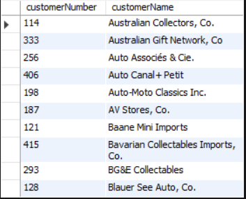

-> Lúc này lệnh `LIMIT 10, 10` là phân trang từ dòng `11`-> `20`

#### Lấy giá trị lớn thứ n

- Dùng:

```sql
LIMIT n-1,1
```

- Giả sử lấy khách có credit cao thứ 2:

```sql
SELECT customerName, creditLimit
FROM customers
ORDER BY creditLimit DESC
LIMIT 1, 1;
```

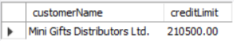

#### Dùng `LIMIT` kết hợp với `DISTINCT`

- MySQL sẽ dừng tìm kiếm khi đủ số lượng hàng `DISTINCT` cần trả về.

- Lấy 5 tiểu bang(state) không trùng nhau:

```sql
SELECT DISTINCT state
FROM customers
WHERE state IS NOT NULL
LIMIT 5;
```

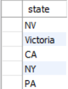

## 2. Joins - Kết hợp nhiều bảng

### `JOIN`

- 1 Relational Database (CSDL quan hệ) gồm nhiều bảng có liên kết với nhau thông qua các cột chung, thường là `Foregion Key`.

- Ví dụ, trong sample db ta có bảng `orders` và `orderdetails` được liên kết với nhau thông qua cột `orderNumber`

  > Để lấy đầy đủ thông tin của một đơn hàng, bạn cần truy vấn dữ liệu từ cả bảng `orders` lẫn `orderdetails`.

- Đó là lý do `join` được sử dụng

- `Join` là phương thức liên kết dữ liệu giữa 1 bảng(`self join`) hoặc nhiều bảng dựa trên giá trị của các cột chung.

- MySQL hỗ trợ các loại join sau:

  - Inner join
  - Left join
  - Right join
  - Cross join

=> Các mệnh đề `join` được sử dụng trong câu lệnh `SELECT` và xuất hiện sau mệnh đề `FROM`

#### Tạo các bảng mẫu

- Tạo 2 bảng mẫu `members` và `committees:

```sql
CREATE TABLE members (
    member_id INT AUTO_INCREMENT,
    name VARCHAR(100),
    PRIMARY KEY (member_id)
);

CREATE TABLE committees (
    committee_id INT AUTO_INCREMENT,
    name VARCHAR(100),
    PRIMARY KEY (committee_id)
);
```

- Chèn dữ liệu vào bảng:

```sql
INSERT INTO members(name)
VALUES('John'),('Jane'),('Mary'),('David'),('Amelia');

INSERT INTO committees(name)
VALUES('John'),('Mary'),('Amelia'),('Joe');
```

- Truy vấn dữ liệu:

```sql
SELECT memberID, name FROM members;
SELECT committeesID, name FROM committes;
```

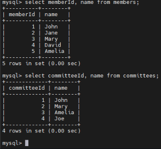

-> Có thể thấy 2 bảng có 1 vài thành viên trùng nhau.

#### Mệnh đề `INNER JOIN`

- Cú pháp cơ bản của `INNER JOIN` để nối 2 bảng `table_1` và `table_2`:

```sql
SELECT columnList
FROM table_1
INNER JOIN table_2 on joinCondition;
```

- `INNER JOIN` kết hợp 2 bảng dựa trên  1 điều kiện gọi là `join predicate`(điều kiện nối).

- `INNER JOIN` bao gồm hàng khớp nhau của cả 2 bảng.

- **Example**: Tìm các thành viên đồng thời là thành viên của `committees` và `members`:

```sql
SELECT 
    m.member_id, 
    m.name AS member, 
    c.committee_id, 
    c.name AS committee
FROM
    members m
INNER JOIN committees c ON c.name = m.name;
```

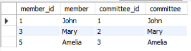

#### Mệnh đè `LEFT JOIN`

- `LEFT JOIN` cũng cần 1 diều kiện nối 2 bảng bằng `LEFT JOIN`, khái niệm `left table` và `right table` được sử dụng

- `LEFT JOIN` chọn dữ liệu từ bảng bên trái. Với mỗi hàng trong bảng trái, `LEFT JOIN` sẽ so sánh với từng hàng trong bảng phải

- Nếu giá trị khớp sẽ tạo 1 hàng mới

- Nếu giá trị không khớp thì vẫn tạo hàng mới nhưng giá trị của các cột của `right table` sẽ hiện là `NULL`

- Cú pháp:

```sql
SELECT column_list
FROM table_1
LEFT JOIN table_2 ON join_condition;
```

- `Left join` cũng hỗ trợ mệnh đề `USING` nếu cả hai bảng dùng chung một cột để so khớp:

```sql
SELECT column_list
FROM table_1
LEFT JOIN table_2 USING (column_name);
```

- **Example**: Dùng `LEFT JOIN` nối bảng `members` với bảng `committees`:

```sql
SELECT 
    m.member_id, 
    m.name AS member, 
    c.committee_id, 
    c.name AS committee
FROM
    members m
LEFT JOIN committees c USING(name);
```

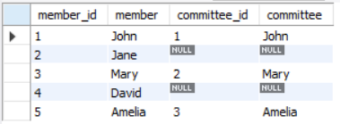

- Dùng `WHERE` để tìm thành viên không nằm trong `committees`

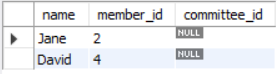

#### Mệnh đề `RIGHT JOIN`

- Ngược với lại `LEFT JOIN`. Bây giờ dữ liệu luôn được chọn sẽ là của `right table`

- Tìm những thành viên trong `committees` mà không có trong `members`:

```sql
SELECT *FROM members m
RIGHT JOIN committees c USING(name)
WHERE m.member_id is NULL;
```

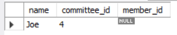

#### Mệnh đề `CROSS JOIN`

- Mệnh đề `CROSS JOIN` dùng khi mà 2 bảng ta cần truy vấn không có 1 **điều kiện nối** chung nào.

- Mệnh đề `CROSS JOIN`kết hợp mỗi hàng của bảng thứ nhất với mọi hàng của bảng thứ hai để tạo thành tập kết quả.

- Giả sử bảng thứ nhất có `n` dòng và bảng thứ hai có `m` dòng. `CROSS JOIN` 2 bảng này sẽ trả về `n x m` dòng.

- Cú pháp:

```sql
SELECT select_list
FROM table_1
CROSS JOIN table_2;
```

- Giả sử ta `CROSS JOIN` dữ liệu 2 bảng `members` và `committees` với nhau

```sql
SELECT
      m.memberId,
      m.name AS member,
      c.committeeId,
      c.name AS committee
FROM
      members m
CROSS JOIN 
      committees c;
```

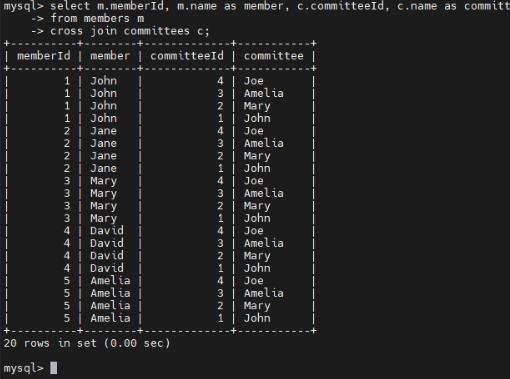

### `INNER JOIN`

- `INNER JOIN` là một mệnh đè tuỳ chọn của câu lệnh `SELECT`. Xuất hiện sau `FROM`.

- Cú pháp:

```sql
SELECT
      select_list
FROM t1
INNER JOIN t2 ON join_condition1
INNER JOIN t3 ON join_condition2
...;
```

- Nếu 1 cặp hàng từ hai bảng thoả mãn điều kiện nối (True), `INNER JOIN` sẽ tạo ra một hàng mới gồm tất cả các cột của hai hàng và đưa vào kết quả.

- Nếu không thoả mãn điều kiện, `INNER JOIN` sẽ bỏ qua cặp hàng đó

- **Example**: Ta thực hiện `JOIN` giữa các bảng có quan hệ `Foreign Key` giống như 2 bảng `productlines` và `products`.

- Giả sử ta muốn lấy:

  - `productCode` và `productName` từ bảng `products`
  - `textDescription` từ bảng `productlines`

```sql
SELECT 
    productCode, 
    productName, 
    textDescription
FROM
    products t1
INNER JOIN productlines t2 
    ON t1.productline = t2.productline; -- có thể thay thế bằng USING
```

#### Mệnh đề `INNER JOIN` với `GROUP BY`

- Xem 2 bảng `order` và `orderdetails` sau:

  - Trả về số đơn hàng(orderNumber), trạng thái đơn hàng (status), và tổng doanh số, bằng cách dùng `INNER JOIN` kết hợp với `GROUP BY`:

```sql
SELECT 
    t1.orderNumber,
    t1.status,
    SUM(quantityOrdered * priceEach) total
FROM
    orders t1
INNER JOIN orderdetails t2 
    ON t1.orderNumber = t2.orderNumber
GROUP BY t1.orderNumber; -- có thể thay thế bằng USING
```

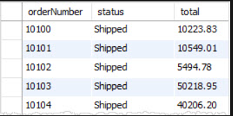

#### Dùng mệnh đề `INNER JOIN` kết hợp ba bảng

- Xem thông tin các bảng sau: `orders`, `orderdetails` và `products`.

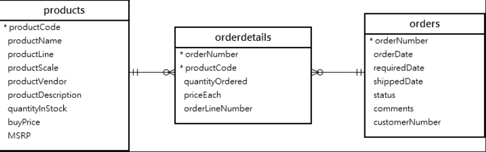

- Giả sử ta truy vấn sử dụng 2 mệnh `INNER JOIN` để kết hợp 3 bảng `orders`, `orderdetails` và `products`

```sql
SELECT 
    orderNumber,
    orderDate,
    orderLineNumber,
    productName,
    quantityOrdered,
    priceEach
FROM
    orders
INNER JOIN
    orderdetails USING (orderNumber)
INNER JOIN
    products USING (productCode)
ORDER BY 
    orderNumber, 
    orderLineNumber;
```

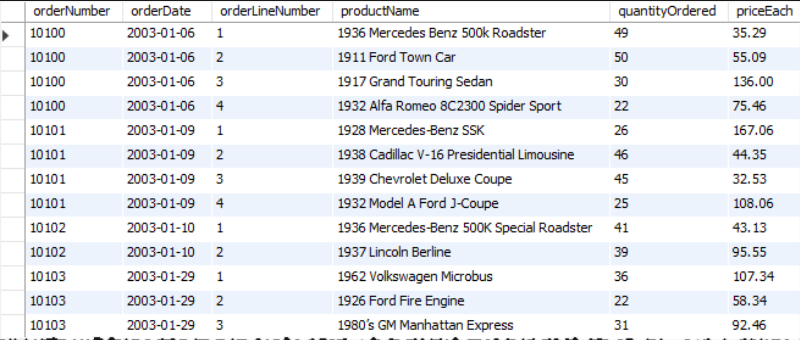

=> Từ đó suy ra muốn kết hợp bao bảng cải cần lấy số lượng bảng -1 là số lượng mệnh đề `INNER JOIN` dùng để truy vấn.

### `LEFT JOIN`

#### LEFT JOIN nối 2 bảng

- Xem hai bảng `customers` và `orders` trong cơ sở dữ liệu mẫu.

- Mỗi khách hàng có thể có 0 hoặc nhiều đơn hàng, trong khi mỗi đơn hàng phải thuộc về một khách hàng.

- Câu truy vấn sau sử dụng `LEFT JOIN` để tìm tất cả khách hàng và các đơn hàng tương ứng của họ:

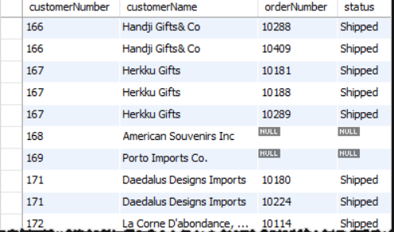

- **NOTE**: Nếu dùng INNER JOIN -> ta chỉ nhận được những khách hàng có ít nhất 1 đơn hàng

#### LEFT JOIN tìm hàng không khớp(unmatched rows)

- `LEFT JOIN` rất hữu ích khi bạn muốn tìm các hàng trong một bảng không có hàng tương ứng ở bảng khác.

- Ví dụ sau dùng `LEFT JOIN` để tìm khách hàng không có bất kỳ đơn hàng nào:

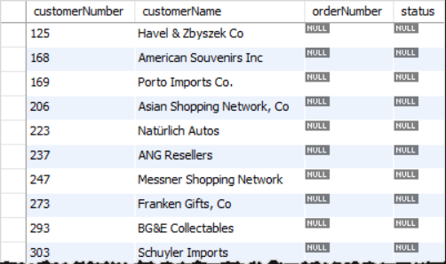

#### LEFT JOIN nối 3 bảng

- Xem ba bảng: `employees`, `customers`, và `payments`.

- Ví dụ sau dùng hai mệnh đề `LEFT JOIN` để nối cả hai bảng `customers` và `payments` với `employees`:

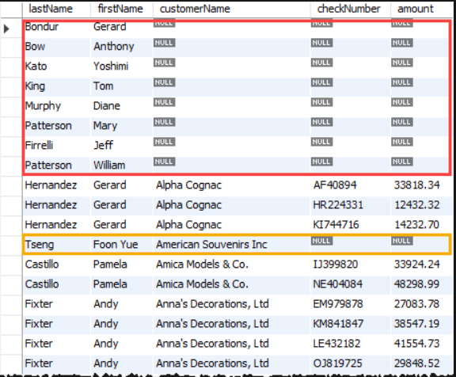

### `RIGHT JOIN`

- Giống tương tự `LEFT JOIN` nhưng bảng tham chiếu là là bảng bên phải

- Cú pháp:

```sql
SELECT 
    select_list
FROM table_1
RIGHT JOIN table_2 ON 
    join_condition; --Có thể dùng cú pháp USING dể thay thế
```

- Trong đó:
  
  - `Table_1` là bảng bên trái và `Table_2` là bàn bên phải.
  - `join_condition` là điều kiện để so khớp các hàng giữa các bảng

- Thực hành, do cấu trúc giống `LEFT JOIN` nên ta bỏ qua :D

### `SELF JOIN`

#### Introduction

- Self join cho phép ta join 1 bảng với chính nó

- Vì MySQL không có cú pháp self join riêng, bạn cần thực hiện self join thông qua một join thông thường như LEFT JOIN hoặc INNER JOIN.

- Để thực hiện self join, bạn làm theo các bước sau:
  - Alias một bảng: Gán cho mỗi lần sử dụng bảng một bí danh khác nhau để phân biệt chúng.
  - Chỉ định điều kiện join: Định nghĩa cách các dòng từ từng phiên bản của bảng sẽ được so sánh. Trong self join, bạn thường so sánh các giá trị ở các cột trong cùng một bảng.
  - Chọn các cột cần thiết: Chỉ định những cột bạn muốn đưa vào kết quả cuối cùng.

#### Examples

- Chúng ta sẽ sử dụng bảng `employees` từ cơ sở dữ liệu mẫu.
- Bảng `employees` không chỉ lưu thông tin nhân viên mà còn lưu cả cấu trúc tổ chức.
- Nó dùng cột `reportsTo` để xác định ID của người quản lý (`manager`) của một nhân viên.

#### Self join bằng INNER JOIN

- Thực hiện self join trên bảng employees, dùng cột `employeeNumber` và `reportsTo` để xem cấu trúc:

  ```sql
  SELECT 
      CONCAT(m.lastName, ', ', m.firstName) AS Manager,
      CONCAT(e.lastName, ', ', e.firstName) AS 'Direct report'
  FROM
      employees e
  INNER JOIN employees m ON 
      m.employeeNumber = e.reportsTo
  ORDER BY 
      Manager;
  ```

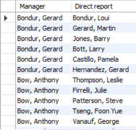

#### Self join bằng LEFT JOIN

- Tìm những nhân viên không có quản lý:

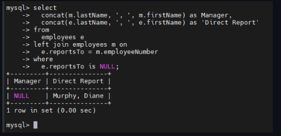

  -> Tìm ra được top manager

#### So sánh các dòng liền kề trong cùng bảng

- hiển thị danh sách các khách hàng sống trong cùng một thành phố, bằng cách join bảng `customers` với chính nó:

  ```sql
  SELECT 
      c1.city, 
      c1.customerName, 
      c2.customerName
  FROM
      customers c1
  INNER JOIN customers c2 ON 
      c1.city = c2.city
      AND c1.customername > c2.customerName
  ORDER BY 
      c1.city;
  ```

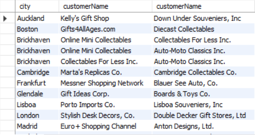

### `CROSS JOIN`

- Có thể giải thích đơn giản mệnh đề `CROSS JOIN` là lồng 2 bảng với nhau tạo ra 1 bảng lớn hơn với tập kết quả lồng với nhau. Cú pháp chung:

```sql
SELECT select_list 
FROM t1
CROSS JOIN t2;
```

#### Example `CROSS JOIN`

-Dùng `CROSS JOIN` để tạo bộ bài 52 lá

- Đầu tiên tạo 1 bảng để lưu các chất(suits):

```sql
CREATE TABLE suits (
      suitId INT,
      suitName VARCHAR (10)
);
```

- Tạo 1 bảng để lưu các hạng bài (ranks):

```sql
CREATE TABLE ranks (
      rankId INT,
      rankName VARCHAR (5)
);
```

- Chèn dữ liệu vào bảng `suits` và `ranks`:

```sql
INSERT INTO suits (suitId, suitName) VALUES
    (1, 'Tep'),
    (2, 'Ro'),
    (3, 'Tep'),
    (4, 'Bich');

INSERT INTO ranks (rankId, rankName) VALUES
    (1, 'A'),
    (2, '2'),
    (3, '3'),
    (4, '4'),
    (5, '5'),
    (6, '6'),
    (7, '7'),
    (8, '8'),
    (9, '9'),
    (10, '10'),
    (11, 'J'),
    (12, 'Q'),
    (13, 'K');
```

- Dùng `CROSS JOIN` dùng để kết hợp các chất và các hạng, nhằm tạo ra bộ bài 52 lá:

```sql
SELECT 
      suitName,
      rankName
FROM suits
CROSS JOIN ranks
ORDER BY
        suitName,
        rankName;
```

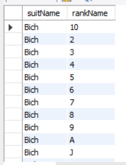

-> Ta đã tạo ra bộ bài 52 lá với 4 chất khác nhau.

## 3. Aggregation – Nhóm & tổng hợp dữ liệu

### `GROUP BY`

- Mệnh đề `GROUP BY` là mệnh đề gom các hàng lại dựa trên các giá trị cột và biểu thức.

- Nó trả về một hàng cho mỗi nhóm và giúp giảm số lượng hàng trong tập kết quả.

- Cú pháp:

```sql
SELECT
c1, c2, ..., cn, aggregate_function(ci)
FROM
    table_name
WHERE
    conditions
GROUP BY c1, c2, ..., cn;
```

- Trong đó:

  - Sau mệnh đề `GROUP BY` ta liệt kê các cột hoặc biểu thức mà ta muốn nhóm và cách nhau bằng dấu phẩy
  - MySQL đánh giá mệnh đề `GROUP BY` sau mệnh đề `FROM` và `WHERE` nhưng trước mệnh đề `HAVING`, `SELECT`, `DISTINCT`, `ORDER BY` và `LIMIT`.
  - Ta thường dử dụng mệnh đề `GROUP BY` với các hàm tổng hợp như `SUM`, `AVG`, `MAX`, `MIN` và `COUNT`.Hàm tổng hợp xuất hiện trong mệnh đề `SELECT` cung cấp thông tin cho từng nhóm.

#### Example `GROUP BY`

- **Ví dụ cơ bản**: Sử dụng bảng `orders` trong sample database

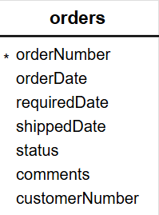

- Nếu ta muốn nhóm trạng thái các đơn hàng ta có thể sử dụng mệnh đề `GROUP BY` với cột `status` trong truy vấn sau:

```sql
SELECT 
  status 
FROM 
  orders 
GROUP BY 
  status;
```

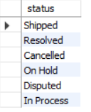

=> Kết quả dầu ra cho thấy mệnh đề `GROUP BY` này trả về các lần xuất hiện duy nhất của các giá trị trong cột `status`.(Nó hoạt động tương tự như mệnh đề `DISTINCT`đối với cột `status`)

- **Ví dụ kết hợp với `aggregate_function`**: Sử dụng mệnh đề `GROUP BY` trong MySQL với các hàm tổng hợp.

  - Ví dụ để lấy đơn hàng ở mỗi trạng thái, ta có có thể sử dụng hàm `COUNT` với mệnh đề `GROUP BY` như sau:

```sql
SELECT 
  status, 
  COUNT(*) AS soluongdonhang
FROM 
  orders 
GROUP BY 
  status;
```

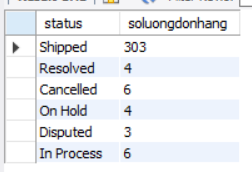

- **Ví dụ kết hợp với `aggregate_function`**: Sử dụng mệnh đề `GROUP BY` trong MySQL với các hàm tổng hợp.

  - Ví dụ tính tổng tiền đơn hàng ở mỗi trạng thái, ta có có thể sử dụng hàm `SUM` với mệnh đề `GROUP BY` như sau:

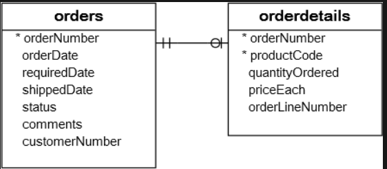

```sql
SELECT 
  status, 
  SUM(quantityOrdered * priceEach) AS amount 
FROM 
  orders 
  INNER JOIN orderdetails USING (orderNumber) 
GROUP BY 
  status;
```

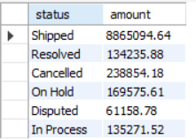

- Tương tự truy vấn sau trả về số đơn hàng và tổng số tiền đơn hàng:

```sql
SELECT 
  orderNumber, 
  SUM(quantityOrdered * priceEach) AS total 
FROM 
  orderdetails 
GROUP BY 
  orderNumber;
```

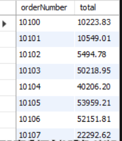

- **Ví dụ kết hợp với `expression`**: Sử dụng mệnh đề `GROUP BY` với các hàm biểu thức để nhóm các hàng theo biểu thức thay vì theo cột

  - Truy vấn sau tính tổng doanh số bán hàng cho mỗi năm

```sql
SELECT 
  YEAR(orderDate) AS year, 
  SUM(quantityOrdered * priceEach) AS total 
FROM 
  orders 
  INNER JOIN orderdetails USING (orderNumber) 
WHERE 
  status = 'Shipped' 
GROUP BY 
  YEAR(orderDate);
```

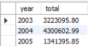

=> Trong ví dụ này, ta sử dụng hàm `YEAR` để trích xuất dữ liệu năm từ ngày đặt hàng (`orderDate`) và chỉ bao gồm các đơn hàng đã có trạng thái `shipped`(đã ship) trong tổng doanh số để từ đó tính ra doanh thu từng năm.

- **Ví dụ kết hợp với `HAVING`**: Sử dụng mệnh đề `GROUP BY` với `HAVING` để lọc các nhóm(Khác với `WHERE`lọc từng dòng)
  
  - Lấy doanh thu các năm sau năm 2003:

```sql
SELECT 
    YEAR(orderDate) as year, 
    SUM(quantityOrdered * priceEach) as total
FROM 
    orders
INNER JOIN orderdetails USING(orderNumber)
WHERE
    status = 'Shipped'
GROUP BY
    YEAR(orderDate)
HAVING
    year > 2003;
```

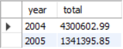

- **Ví dụ nhóm theo nhiều cột**: Sử dụng `GROUP BY` để nhóm thành nhiều cột cần truy vấn :

```sql
SELECT 
  YEAR(orderDate) AS year, 
  status, 
  SUM(quantityOrdered * priceEach) AS total 
FROM 
  orders 
  INNER JOIN orderdetails USING (orderNumber) 
GROUP BY 
  year, 
  status 
ORDER BY 
  year;
```

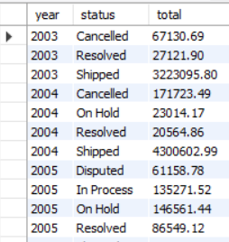

### `HAVING`

- Mệnh đề `HAVING` được dùng chung với mệnh đề `GROUP BY` để lọc các nhóm dựa trên 1 điều kiện cụ thể. Cụ pháp chung:

```sql
SELECT
    selectList
FROM
    tableName
WHERE
    condition
GROUP BY
    groupByExpression
HAVING
    groupCondition;
```

- Trong đó:

  - `HAVING` đánh giá từng nhóm được trả về trong GROUP BY. Nếu điều kiện đúng, nhóm đó được đưa vào trong truy vấn.

  - MySQL đánh giá mệnh đề `HAVING` sau các mệnh đề `FROM`, `WHERE` và `GROUP BY`, nhưng trước `DISTINCT`, `SELECT`, `ORDER BY` và `LIMIT`.

#### Example `HAVING`

- **Ví dụ về mệnh đề `HAVING` trong MySQL**: Ta sử dụng bảng `orderdetails` trong sample db để minh hoạ

  - Tìm các đơn hàng có doanh thu > 1000:

```sql
SELECT 
    orderNumber,
    SUM(quantityOrdered) AS itemsCount,
    SUM(quantityOrdered * priceEach) AS total
FROM 
    orders
INNER JOIN 
    orderdetails USING(orderNumber)
GROUP BY 
    orderNumber
HAVING 
    total > 1000;
```

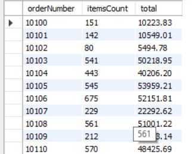

- **Ví dụ về mệnh đề `HAVING` và toán tử logic trong MySQL**: Ta sử dụng bảng `orderdetails` trong sample db để minh hoạ

  - Tìm các đơn hàng có doanh thu > 1000 và số lượng sản phẩm >600 :

```sql
SELECT 
    orderNumber,
    SUM(quantityOrdered) AS itemsCount,
    SUM(quantityOrdered * priceEach) AS total
FROM 
    orders
INNER JOIN 
    orderdetails USING(orderNumber)
GROUP BY 
    orderNumber
HAVING 
    total > 1000 AND itemsCount > 600;
```

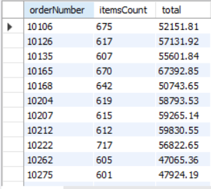

### `HAVING COUNT`

- `GROUP BY` là sắp xếp các hàng thành các nhóm.

- `GROUP BY` + `COUNT` là ta sẽ nhận được cả các nhóm và số lượng mục trong mỗi nhóm.

=> Để lọc các nhóm dựa trên số lượng mục mỗi nhóm, ta sử dụng mệnh đề `HAVING` + hàm `COUNT`

- Cú pháp chung:

```sql
SELECT 
  c1, 
  COUNT(c2) 
FROM 
  table_1 
GROUP BY 
  c1
HAVING 
  COUNT(c2)...
```

-> Lưu ý không sử dụng bí danh cột cho column 2 nhé vì MySQL đánh giá `HAVING` trước `SELECT` thế nên đặt bí danh lúc `SELECT` thì sao mà MySQL nó hiểu được.

#### Example `HAVING COUNT`

**Ví dụ đơn giản**:

- Bước 1: Tạo bảng `sales` với 3 cột `id`, `productName`, `saleAmount`

```sql
CREATE TABLE sales (
    id INT AUTO_INCREMENT,
    productName VARCHAR(50) NOT NULL,
    saleAmount DECIMAL(10, 2) NOT NULL,
    PRIMARY KEY(id)
);
```

- Bước 2: Chèn 1 số dữ liệu vào bảng `sales`:

```sql
INSERT INTO sales (productName, saleAmount)
VALUES
    ('Product A', 100.50),
    ('Product B', 75.25),
    ('Product A', 120.75),
    ('Product C', 50.00),
    ('Product B', 90.80);
```

- Tìm các sản phẩm chỉ bán được 1 lần :

```sql
SELECT
      productName,
      COUNT(id)
FROM
      sales
GROUP BY
      id
HAVING
      COUNT(id) = 1;
```

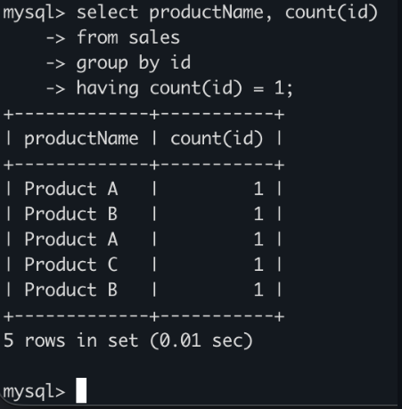

**Ví dụ thực tế**: Sử dung dụng bảng `customer` và `orders` trong sample database

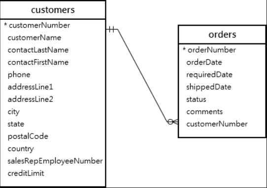

- Dùng `HAVING` và `COUNT` để truy vấn ra khách hàng đã đặt hơn 4 đơn hàng :

```sql
SELECT
      customerName,
      COUNT(*) order_count
FROM
      orders
INNER JOIN customers using (customerNumber)
GROUP BY
      customerName
HAVING
      COUNT(*)>4
ORDER BY
      order_count;
```

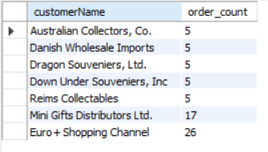

### `ROLL UP`

- Mệnh đề `ROLL UP` để tạo tạo tổng phụ và tổng cộng. Nó là phần mở rộng của mệnh đề `GROUP BY`. Cú pháp chung:

```sql
SELECT
      select_list
FROM
      table_name
GROUP BY
      c1,c2,c3 WITH ROLLUP;
```

=> Lệnh này tạo ra nhiều tập hợp nhóm dựa trên các cột hoặc biểu thức được chỉ định trong mệnh đề `GROUP BY`.

#### Example `ROLL UP`

- Trước tiên tạo một bảng mới có tên `sales` lưu trữ các giá trị đơn hàng được tóm tắt theo dòng sản phẩm và năm. Dữ liệu được lấy từ các bảng `products`, `orders`, và `orderDetails` trong cơ sở dữ liệu mẫu .

```sql
CREATE TABLE sales
SELECT
    productLine,
    YEAR(orderDate) orderYear,
    SUM(quantityOrdered * priceEach) orderValue
FROM
    orderdetails
        INNER JOIN
    orders USING (orderNumber)
        INNER JOIN
    products USING (productCode)
GROUP BY
    productLine ,
    YEAR(orderDate);

    SELECT * FROM sales;
```

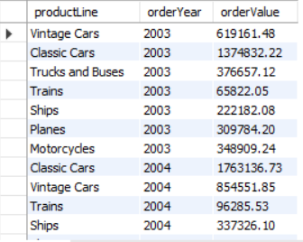

- Sau đó, Tạo 1 tập hợp nhóm tổng giá trị đơn hàng dựa trên cột sản phẩm của bảng `sales` mình tạo ở trên.
  
  - Lưu ý: Tập hợp nhóm là tập hợp cột mà bạn muốn nhóm theo

```sql
SELECT
      productLine,
      SUM(orderValue) totalOrderValue
FROM
      sales
GROUP BY
      productline WITH ROLLUP
```

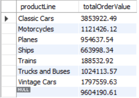

=> Như ta thấy trong kết quả đầu ra, mệnh đề `ROLL UP` không những tạo tổng phụ mà còn tạo tổng cộng của giá trị đơn hàng.

#### Truy vấn `ROLL UP` vói nhiều cột

- Nếu ta chỉ định nhiều hơn một cột trong mệnh đề `GROUP BY`, mệnh đề `ROLL UP` sẽ giả định 1 thứ bậc giữa các cột đầu vào. Ví dụ:

```sql
GROUP BY c1, c2, c3 WITH ROLLUP
```

- Giả định `ROLL UP` có hệ thống phân cấp như sau

```text
c1 > c2 > c3
```

-> Nó tạo ra tập hợp các đơn hàng như sau:

```text
(c1, c2, c3)
(c1, c2)
(c1)
()
```

- Chỉ định 2 cột:

```text
(c1, c2)
(c1)
()
```

- Ví dụ thực tế (Chỉ định 2 cột `orderYear` và `product` từ bảng `sales` ví dụ trước)

```sql
SELECT 
    productLine, 
    orderYear,
    SUM(orderValue) totalOrderValue
FROM
    sales
GROUP BY 
    productline, 
    orderYear 
WITH ROLLUP;
```

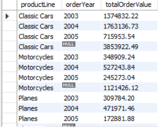

=> Ta có thể thấy `ROLL UP` tạo ra hàng tổng phụ mỗi khi dòng sản phẩm thay đổi theo năm và cho tổng cộng ở cuối cùng ở tập kết quả . Và thứ tự ưu tiên trong trường hợp này là:

```text
productLine > orderYear
```

- Giả sử ta đảo ngược lại thứ tự ưu tiên (orderYear > ProductLine)

```sql
SELECT 
    orderYear,
    productLine, 
    SUM(orderValue) totalOrderValue
FROM
    sales
GROUP BY 
    orderYear,
    productline
WITH ROLLUP;
```

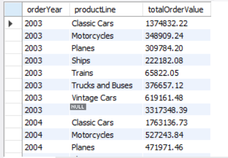

=>Mệnh đề `ROLLUP` sẽ tạo ra tổng phụ mỗi khi năm thay đổi và tổng cộng cuối cùng ở cuối tập kết quả.

#### Hàm GROUPING

- Để kiểm tra xem tập kết quả `NULL` có thể hiện tổng phụ hay tổng cộng, ta sử dụng hàm `GROUPING()` này.

- Do đây là phần mở rộng ta có thể tham khảo tài liệu ở [đây](https://www.mysqltutorial.org/mysql-basics/mysql-rollup/).

## 4. Subqueries – Truy vấn con

### MySQL SubQuery