# INSERT_UPDATE_DELETE DATA (CHÈN_CẬP NHẬT_XOÁ DỮ LIỆU)

## INSERT DATA (CHÈN DỮ LIỆU)

### `INSERT INTO`

#### Khái niệm `Insert into`

- Câu lệnh `INSERT` cho phép bạn chèn một hoặc nhiều hàng vào bảng. Cú pháp `INSERT` chung là:

```sql
INSERT INTO table_name (column1, column 2,...)
VALUES (value1, value2,...);
```

- Trong đó :

  - `Insert into` chỉ định tên bảng và tên danh sách các cột được phân tách bằng dấu phẩy trong dấu ngoặc đơn sau mệnh đề `Insert into`.
  - Tiếp theo, đặt 1 danh sách các giá trị của các cột tương ứng được phân tách bằng dấu phẩy, vào trong dấu ngoặc đơn sau từ khoá `VALUES`
  - Khi sử dụng câu lệnh `Insert into`, ta cần phải đảm bảo rằng số cột phải khớp số giá trị. Ngoài ra thự tự trong dấu ngoặc đơn của danh sách giá trị và danh sách cột phải tương ứng với nhau.

- Để chèn nhiều hàng vào bảng bằng một lệnh `Insert into` duy nhất ta sử dụng cú pháp sau:

```sql
INSERT INTO table (column1, column2)
VALUES
  (value1, value2,...),
  (value1, value2,...),
  ...
  (value1, value2,...);
```

-> Trong cú pháp này, các hàng được phân tách bằng dấu phẩy trong mệnh đề `VALUES`.

#### Example `Insert into`

- hãy tạo bảng `tasks` để thực hành câu lệnh `INSERT`:

```sql
USE tien9a;

DROP TABLE IF EXISTS tasks;

CREATE TABLE tasks (
  task_ID INT AUTO_INCREMENT PRIMARY KEY,
  title VARCHAR (255) NOT NULL,
  start_date DATE,
  priority TINYINT NOT NULL DEFAULT 3,
  DESCRIPTION TEXT
);
```

- Thâm 1 hàng mới vào bảng `tasks`. Cú pháp:

```sql
INSERT INTO tasks (title,priority)
VALUES('LEARNT MYSQL INSERT Statement',1);
```

-> Kết quả đầu ra:

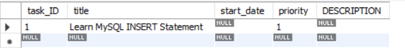

- Trong đó:
  
  - Trong ví dụ này, chúng ta chỉ định (chèn) giá trị cho các cột `priority` và cột `title`. Đối với các cột khác, MySQL sử dụng giá trị mặc định.
  - Cột `task_ID` này là một cột duy nhất `AUTO_INCREMENT`, có nghĩa là MySQL sẽ tạo ra 1 số nguyên tuần tự mỗi khi 1 hàng được chèn vào bảng.
  - Các cột `start_date`, `description` dử dụng giá trị `NULL` mặc định. Do đó, MySQL sẽ chèn dữ liệu vào các cột này nếu ta không chỉ định giá trị của chúng.

#### Example chèn giá trị mặc định vào bảng

- Ví dụ sau chèn hàng bằng giá trị mặc định vào 1 cột thì chúng ta có 2 cách:

  - Hãy bỏ qua cả tên cột và giá trị trong câu lệnh `INSERT`.
  - Hãy chỉ định tên cột trong câu lệnh `INSERT INTO` và sử dụng từ khoá `DEFAULT` trong câu lệnh đó

- Ví dụ sau minh hoạ cách thứ 2:

```sql
INSERT INTO tasks (title, priority)
VALUES ('Understanding DEFAULT keyword',DEFAULT);
```

-> Vì giá trị mặc định của cột `priority` là `3` như đã khai báo trước đó `priority TINY INT NOT NULL DEFAULT 3,` cho nên sau khi chèn 1 giá trị mặc định vào thì giá trị ưu tiên sẽ hiện là `3`.Kết quả truy vấn bảng:

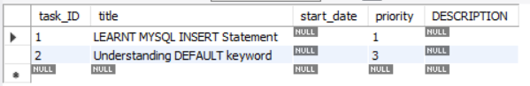

#### Chèn ngày, tháng vào bảng

- Để chèn giá trị ngày tháng cụ thể vào một cột sử dụng định dạng sau :

```text
YYYY-MM_DD
```

- Câu lệnh sau chèn 1 hàng mới vào bảng `tasks` với các giá trị ngày bắt đầu và ngày kết thúc :

```sql
INSERT INTO tasks (title, start_date)
VALUES ('INSERT DATA INTO TABLE', '2018-01-09');
```

=> Kết quả đầu ra:

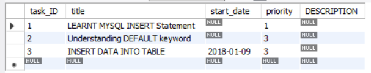

- Ngoài ta có thể add ngày tháng bằng tay thì ta có thể sử dụng các hàm như `CURRENT_DATE`(Cập nhật thời gian hiện tại chỗ máy chủ hệ thống) trong câu lệnh `INSERT INTO` và trong mệnh đề `VALUES`. Sau đây là 1 ví dụ:

```sql
INSERT INTO tasks (title,start_date)
VALUES (
  'Use current date for the tasks',
  CURRENT_DATE
);
```

=> Kết quả đầu ra:

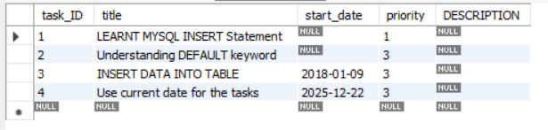

### INSERT MULTIPLE ROWs

#### Khái niêm Insert Multiple Rows

- Ta đã thực hành một số ví dụ chèn nhiều hàng vào cột vào các bảng ở phần cậu lệnh `INSERT INTO` và sau đây chỉ còn 1 số lưu ý cảu phần này:

#### Giới hạn chèn nhiều hàng trong MySQL

- Về lý thuyết, bạn có thể chèn bất kỳ số lượng hàng nào bằng một câu lệnh `INSERT` duy nhất.

- Tuy nhiên, máy chủ MySQL nhận được một câu lệnh `INSERT` có kích thước lớn hơn giá trị được chỉ định bởi tuỳ chọn `max_allowed_packet`. Nó sẽ báo lỗi `packet too large` và chấm dứt kết nối

- Câu lệnh sau thể hiện giá trị max hiện tại của biến `max_allowed_packet`

```sql
SHOW VARIABLES LIKE 'max_allowed_packet'
```

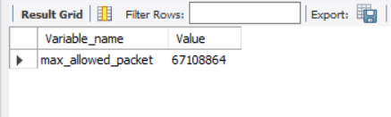

=> Con số trong cột `Value` đó là số `byte` cho phép để ta `INSERT` giá trị hàng vào cột trên MySQL.

- Ta có thể chỉnh hoặc đặt giá trị mới cho biến `max_allowed_packet` bằng cách sử dụng câu lệnh `SET GLOBAL`:

```sql
SET GLOBAL max_allowed_packet=size;
```

- Trong đó:

  - `size` là 1 số nguyên biểu diễn kích thước tối đa của gói dữ liệu cho phép tính bằng byte
  - Ngoài ra, `max_allowed_packet` không ảnh hưởng dến câu lệnh `INSERT INTO .... SELECT` vì câu lệnh đó có thể chèn bao nhiêu hàng tuỳ thích.

#### Sử dụng hàm `LAST_INSERT_ID()`

- Khi ta chèn nhiều hàng và sử dụng hàm `LAST_INSERT_ID()` để lấy ID của hàng được chèn đầu tiên trong một cột `AUTO_INCREMENT`, ta sẽ nhận được ID của hàng chèn đầu tiên chứ không phải ID của hàng chèn cuối cùng.

### `INSERT INTO SELECT`

#### Khái niệm `Insert Multiple Rows`

- Trong MySQL, không chỉ có thể dùng `INSERT` đề chèn các `VALUES` của các hàng vào cột mà ta còn có thể dùng kết quả truy vấn `SELECT` để chèn dữ liệu vào bảng truy xuất ra được hay các bảng gốc để truy xuất ra.

- Cú pháp chung:

```sql
INSERT iNTO table_name (column_list)
SELECT select_list
FROM another_table
WHERE condition;
```

#### Example Sử dụng câu lệnh `Insert Into Select`

- **Phương thức**: Dùng `INSERT` để chèn các giá trị vào các hàng vào cột bảng mà ta dùng lệnh `SELECT` để truy vấn.

- tạo 1 bảng mới có tên là `supliers`:

```sql
CREATE TABLE supppliers (
    supplierNumber INT AUTO_INCREMENT,
    supplierName VARCHAR(50) NOT NULL,
    phone VARCHAR(60),
    addressLine1 VARCHAR(50),
    addressLine2 VARCHAR(50),
    city VARCHAR (50),
    state VARCHAR (50),
    postalCode VARCHAR (50),
    country VARCHAR (50),
    customerNumber INT,
    PRIMARY KEY (supplierNumber)
);
```

- Giả sử tất cả khách hàng trong khu vực `California`, `USA` đều trở thành nhà cung cấp của công ty. Truy vấn sau đây tìm tất cả khách hàng có vị trí tại khu vực `California`, `USA`:

```sql
SELECT 
    customerNumber,
    customerName,
    phone,
    addressLine1,
    addressLine2,
    city,
    state,
    postalCode,
    country
FROM
    customers
WHERE
    country = 'USA' AND 
    state = 'CA';
```

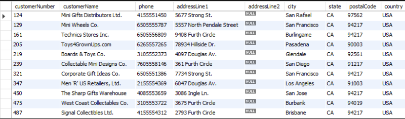

- Sau đó, chèn các khách hàng khu vực `California`, `USA` vào bảng `customers` từ bảng `suppliers` bằng câu lệnh `INSERT INTO SELECT` sau:

```sql
INSERT INTO suppliers (
    supplierName, 
    phone, 
    addressLine1,
    addressLine2,
    city,
    state,
    postalCode,
    country,
    customerNumber
)
SELECT 
    customerName,
    phone,
    addressLine1,
    addressLine2,
    city,
    state ,
    postalCode,
    country,
    customerNumber
FROM 
    customers
WHERE 
    country = 'USA' AND 
    state = 'CA';
```

-> Kết quả đầu ra :

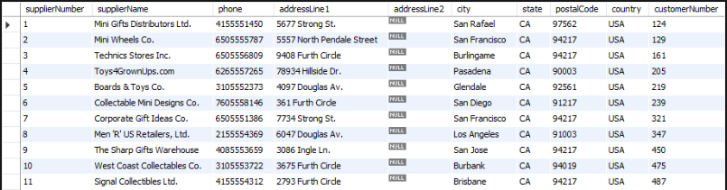

#### Example Sử dụng câu lệnh SELECT trong danh sách VALUES

- **Phương thức**: Chèn `VALUES` mà ta dùng lệnh `SELECT` để liệt kê dữ liệu mà ta truy vấn ra. Lưu ý, nó khác ví dụ trên ở chỗ ta dùng lệnh `SELECT` để truy vấn trong `VALUE` (nghĩa là kết quả truy vấn `SELECT` chính là `VALUES` mà ta muốn `INSERT`)

- Đầu tiên, hãy tạo một bảng mới có tên `stats`:

```sql
CREATE TABLE stats (
            totalProduct INT,
            totalCustomer INT,
            totalOrder INT,
);
```

- Thứ hai, sử dụng câu lệnh `INSERT` để chèn các giá trị từ các câu lệnh `SELECT`khác:

```sql
INSERT INTO stats(totalProduct, totalCustomer, totalOrder)
VALUES(
        (SELECT COUNT(*) FROM products),
        (SELECT COUNT(*) FROM customers),
        (SELECT COUNT(*) FROM orders)
);
```

- Trong đó:
  
  - Sử dụng câu lệnh `SELECT` cùng với hàm `COUNT` để lấy tổng số sản phẩm, nhân viên và đơn đặt hàng.
  - Thứ hai,hãy sử dụng các giá trị được trả về từ câu lệnh `SELECT` thay thế cho các giá trị trong mệnh đè `VALUES` của câu lệnh `INSERT`

-> Truy vấn dữ liệu của bảng `stats` ta sẽ được kết quả:

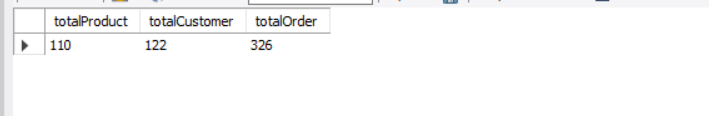

### `INSERT ON DUPLICATE KEY UPDATE`

#### Introduce Câu lệnh `INSERT ON DUPLICATE KEY UPDATE`

- Trong MySQL, câu lệnh `INSERT ON DUPLICATE KEY UPDATE` giúp:

  - `INSERT` - chèn hàng khi Không có trùng khoá(PRIMARY KEY hoặc UNIQUE)
  - `UPDATE` - Cập nhật khi có trùng khoá -> tránh lỗi `"Duplicate entry ... for key ..."`

- Đây là cú pháp chung:

```sql
INSERT INTO table_name (column1, column2,...)
VALUES (value1, value2, ...)
ON DUPLICATE KEY UPDATE
      column1 = new_value1,
      column2 = new_value2,
      ...;
```

- Trong đó:
  
  - `ON DUPLICATE KEY VALUE`: Chỉ định hành động cần thực hiện nấu xảy ra vi phạm trùng lặp
  - `column1 = new_value1..`:  Xác định cập nhật mới các hàng hiện có nếu gặp từ trùng lặp

- Ngoài ra;

  - Nếu `INSERT` thành công -> MySQL trả về 1 row affected
  - Nếu `UPDATE` (Vì trung từ)-> Trả về 2 rows affected
  - Nếu dữ liệu mới không có thay đổi gì -> 0 rows affected

#### Row Alias

- MySQL cho phép bạn định nghĩa bí danh hàng được chèn bằng cách sử dụng mệnh đề `AS alias_name` sau `VALUES`. Sau đây là cú pháp:

```sql
INSERT INTO table_name (column1, column2, ...)
VALUES (value1, value2, ...)
AS new_data
ON DUPLICATE KEY UPDATE
    col1 = new_data.column1,
    col2 = new_data.column1 + 1;
```

- Ngoài ra, ta cũng có thể sử dụng bí danh hàng trong mệnh đề `ON DUPLICATE KEY UPDATE` để tham chiếu đến các giá trị hàng được chèn.

#### Column Alias

- Cũng tương tự như bí danh hàng nhưng khác dùng mệnh đề `AS new(aliascolumn)`

```sql
INSERT INTO table_name (column1, column2, ...)
VALUES (value1, value2, ...)
AS new (alias1, alias2, ...)
ON DUPLICATE KEY UPDATE
      column1 = alias2 + alias 3;
```

#### Example use Row Alias

- Chúng ta tạo 1 bảng `employees` để minh hoạ:(Dùng DB khác nhé không trùng bảng `employees` trong `sampleDB`)

```sql
CREATE TABLE employees (
  id INT PRIMARY KEY,
  name VARCHAR(255) NOT NULL,
  age INT NOT NULL,
  salary DECIMAL (10,2) NOT NULL,
  bonus DECIMAL(10,2) DEFAULT 0
);
```

- Đầu tiên chèn 1 hàng mới vào bảng `employees` ta được:

```sql
INSERT INTO employees(id, name, age, salary)
VALUES (1,'Jane Doe', 25, 120000);
```

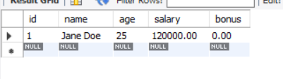

- Chèn 1 hàng mới vào bảng `employees` hoặc cặp nhật vào bảng hiện có nếu xảy ra lỗi trùng lặp khoá:

```sql
INSERT INTO employees (id, name, age, salary)
VALUES(1, 'Jane Smith', 26, 130000)
AS new
ON DUPLICATE KEY UPDATE
      name = new.name,
      age  = new.age,
      salary = new.salary;
```

-> **Output**:

```text
Query OK, 2 rows affected (0.00 sec)
```

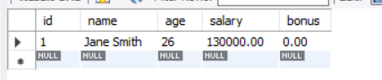

- **Trong ví dụ này**

  - Trong ví dụ này ta lấy, ta sử dụng `new` làm bí danh hàng. Vì hàng có id `1` đã tồn tại,câu lệnh sẽ cập nhật hàng đó thay vì chèn 1 hàng mới.
  - Trong mệnh đề `ON DUPLICATE KEY UPDATE`, ta truy cập giá trị mới được chỉ định trong mệnh đề `VALUES` thông qua bí danh bảng và sử dụng các giá trị mới này để cập nhật các cột `name`, `age` và `salary`.

#### Example use Column Alias để cập nhật thêm 1 cột khác

- Chúng ta vẫn sử dụng bảng `employees` trong ví dụ trên

- Trước tiên, hãy chèn 1 hàng mới hoặc cập nhật cột `salary` và `bonus` nếu hàng đó đã tồn tại

```sql
INSERT INTO employees(id, name, age, salary)
VALUES(1, 'Jane Doe', 26, 140000)
AS new
ON DUPLICATE KEY UPDATE
   salary = new.salary,
   bonus = new.salary * 0.1;
```

=> Kết quả đầu ra:

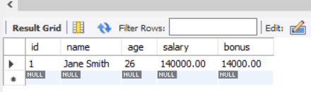

### `INSERT IGNORE`

#### Introduce Insert Ignore in MySQL

- Khi bạn sử dụng câ lệnh `INSERT` để thêm nhiều hàng vào 1 bảng nhưng trong quá trình MySQL xử lí có lỗi thì nó sẽ chấm dứt câu lệnh đó và trả về. Cho nên sẽ không có hàng nào được cập nhật

- Câu lệnh `INSERT IGNORE` cho phép ta **bỏ qua các hàng chứa dữ liệu không hợp lệ**, nếu xảy ra lỗi thì **chỉ chèn vào những dữ liệu hợp lệ**.

- Cú pháp chung:

```sql
INSERT IGNORE INTO table (column list)
VALUES(value_list),
      (value_list),
      ...;
```

-> **Lưu ý**: Tuỳ chọn `IGNORE` là một phần mở rộng của MySQL với tiêu chuẩn MySQL

#### Example `INSERT IGNORE` in MySQL

- Chúng ta tạo 1 bảng mới có tên `subcribers` đẻ minh hoạ:

```sql
CREATE TABLE subcribers (
      id INT PRIMARY KEY AUTO_INCREMENT,
      email VARCHAR(130) NOT NULL UNIQUE
);
```

- **Lưu ý**: Ràng buộc `UNIQUE` đảm bảo không có email trùng lặp nào tồn tại trong cột `email`.

- Tiếp theo, chèn 1 hàng mới vào bảng `subcribers`:

```sql
INSERT INTO subcribers(email)
VALUES ('hoanganhtien5102003@gmail.com');
```

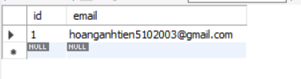

- Tiếp theo, chèn hai hàng vào bảng `subcribers`:

```sql
INSERT INTO subcribers(email)
VALUES ('hoanganhtien5102003@ibm.com'),
       ('hoanganhtien5102003@gmail.com');
```

- Nó sẽ trả về lỗi:

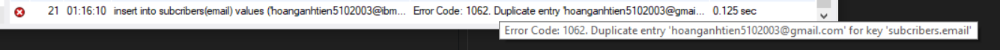

- Có thể dùng lệnh `SHOW WARNINGS` để xem chi tiết lỗi:

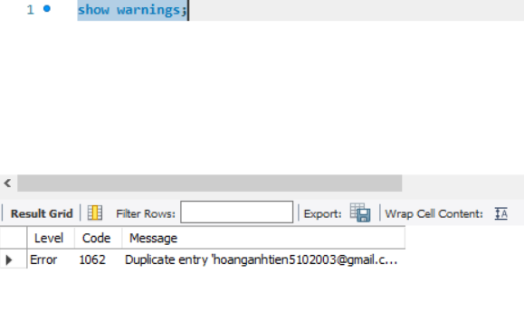

-> Như ta có thể thấy, MySQL báo lỗi bị lặp lại email do ta đặt ràng buộc `UNIQUE` vào trong `RULE TABLE` cho nên không thể tồn tại 2 hàng giá trị email trùng nhau.

- Lúc này, ta chỉ cần dùng lệnh `INSERT IGNORE INTO` thì:

```sql
INSERT IGNORE INTO subcribers(email)
VALUES ('hoanganhtien5102003@ibm.com'),
       ('hoanganhtien5102003@gmail.com');
```

-> Kết quả trả về `Warning` cho biết rằng 1 hàng hợp lệ được thêm vào và hàng còn lại không hợp lệ thì bỏ qua

- Để xem chi tiết cảnh báo, ta có thể xem chi tiết bằng lệnh `SHOW WARNINGS`như bên dưới:

```sql
SHOW WARNINGS
```

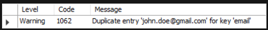

#### `INSERT IGNORE` mode and `STRICT` (nghiêm ngặt/chặt chẽ) mode in MySQL

- Khi chế độ `STRICT` được **bật**:(Mặc định SQL bật chế độ `STRICT`)

  - MySQL sẽ trả về lỗi và huỷ bỏ câu lệnh `INSERT` nếu ta cố gắng chèn các giá trị không hợp lệ vào bảng.

- Khi ta dùng lệnh `INSERT INTO IGNORE` thì thay vì trả về lỗi thì nó sẽ chỉ trả về cảnh báo và nó cố gắng điều chỉnh chúng hợp lệ trước khi đưa vào bảng.

### `INSERT DATETIMES`- Chèn ngày giờ

Trong phần này bạn sẽ hiểu cách làm thế nào để chèn giá trị `DATETIMES`(ngày, giờ) vào 1 bảng trong database

#### DEFINING A DATETIME COLUMN (Định nghĩa cột ngày giờ)

- Kiểu dữ liệu `DATETIME` được sử dụng **để lưu trữ cả giá trị ngày và giờ**(chẳng hạn như thời gian sự kiện,thời gian ghi nhật kí). Cú pháp chung:

```sql
column_name DATETIME
```

- **Lưu ý**:
  
  - Để chèn các giá trị vào cột `DATETIME` thì ta cần đảm bảo rằng các giá trị để ở đúng định dạng ngày giờ đó là `YYYY-MM-DD HH:MM:SS`.
  - Nếu ta có nhiều định dạng khác nhau thì ta phải để đúng định dạng `YYYY-MM-DD HH:MM:SS` mà MySQL yêu cầu.

#### Examples

- dầu tiên tạo một bảng có tên là `events`:

```sql
CREATE TABLE events (
      id INT PRIMARY KEY AUTO_INCREMENT,
      event_name VARCHAR(255) NOT NULL,
      event_time DATETIME NOT NULL
);
```

- Trong đó:

  - `id` là cột khoá chính tự động tăng
  - `event_name`: Cột này lưu trữ tên sự kiện
  - `even_time`: Cột này có `DATETIME`

- Thứ hai chèn một hàng mới vào bảng `events` và sử dụng định dạng ngày giờ `YYYY-MM-DD HH:MM:SS`:

```sql
INSERT INTO events (event_name,event_time)
VALUES ('MySQL Tutorial LiveStream','2026-12-28 02:43:00');
```

=> Insert xong ta truy vấn bảng ra sẽ được kết quả:


#### Example Chèn ngày giờ hiện tại

- Để chèn giá trị ngày giờ hiện tại ta dùng hàm `NOW()` trong cột `DATE TIME`(Chèn trong `VALUES`)

- Ví dụ chèn thêm một sự kiện mới lấy thời gian hiện tại vào bảng `events`:

```sql
INSERT INTO events (event_name,event_time)
VALUES ('MySQLWorkShop',NOW());
```

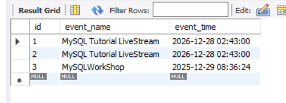

#### Example Chèn chuỗi ngày giờ

- Để chèn chuỗi ngày giờ vào cột `DATETIME`, ta cần sử dụng hàm `STR_TO_DATE` để chuyển đổi nó sang định dạng mong muốn.

- Ví dụ cài đặt 1 event trong bảng `events`

```sql
INSERT INTO events (event_name,event_time)
VALUES('MySQLParty',STR_TO_DATE('29-12-2025 08:46:00', '%d-%m-%Y %H:%i:%s'));
```

- **Lưu ý**:

  - Ở định dạng ngày tháng năm ta sắp xếp theo vị trí nào thì ở phần định dạng ta phải đặt đúng theo vị trí
  - Phần ngày, tháng và năm cách nhau bằng dấu `/` hoặc `:` thì ở phần định dạng chuỗi số cũng phải đặt tương tự y hệt.

- Kết quả truy vấn ra bẳng `events`:

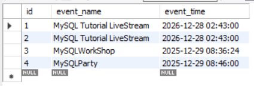

### `INSERT DATE` - Chèn ngày tháng

- Kiểu dữ liệu `DATE` cho phép bạn lưu trữ các giá trị ngày tháng. Sau đây là cách định nghĩa một với kiểu dữ liệu `DATE` này :

```sql
column_name DATE
```

- Để chèn giá trị ngày tháng vào một cột có kiểu dữ liệu `DATE` cụ thể, ta sử dụng định dạng ngày tháng như sau. Cú pháp chung:

```sql
YYYY-MM-DD
```

- **Lưu ý**: So với kiểu dữ liệu `DATETIME` thì kiểu dữ liệu `DATE` không khác là bao và chỉ cần **chú ý** đến chèn ngày tháng hiện tại thì thay vì dùng hàm `NOW()` ta dùng hàm `CURRENT_DATE()` hoặc có thể dùng `UTC_DATE()` để chèn ngày tháng theo định dạng UTC.

## UPDATE DATA

### `UPDATE`

#### Introduction `UPDATE`

- Câu lệnh `UPDATE` cập nhật dữ liệu dữ liệu trong 1 bảng.Nó cho phép ta thay đổi giá trị trong một hoặc nhiều cột của 1 hàng or nhiều hàng. Cú pháp chung:

```sql
UPDATE [LOW_PRIORITY] [IGNORE] table_name
SET
   column_name1 = expr1,
   column_name2 = expr2,
   ...
[WHERE
     condition];
```

- **Trong đó**:

  - Đầu tiên ta chỉ định tên của bảng mà ta muốn `UPDATE`
  - Thứ hai, ta chỉ định cột mà ta muốn `UPDATE` và giá trị mới trong mệnh để `SET`(Có thể `UPDATE` nhiều cột và các giá trị thay đổi phải ngăn cách nhau bởi dấu `,` và giá trị mới có thể là giá trị cố định, `expression` hay `subquery`)
  - Thứ ba, tuỳ chọn `WHERE condition`(tuỳ chọn) xác định các hàng sẽ được cập nhật, nếu bỏ `WHERE` thì các hàng trong bảng sẽ bị cập nhật.
  - Thứ tư, các `OPTION` đặc biệt như `LOW_PRIORITY` là hướng dẫn MySQL trì hoãn cập nhật cho đến khi không có kết nối nào đang đọc dữ liệu từ bảng và `IGNORE` cho phép MySQL tiếp tục cập nhật các hàng khác ngay khi có kết nối xảy ra

#### Example - Cập nhật giá trị của 1 cột

```sql
UPDATE employees
SET email = 'mary.patterson@classicmodelcars.com'
WHERE employeeNumber = 1056;
```

- Kết quả truy vấn:

```sql
SELECT firstName, lastName, email
FROM employees
WHERE employeeNumber=1056;
```

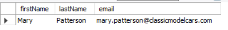

#### Example - Cập nhật bằng hàm `REPLACE`

- Thay đổi domain email của tất cả Sales Reps có officeCode = 6:

```sql
UPDATE employees
SET email = REPLACE(email,'@classicmodelcars.com','@mysqltutorial.org')
WHERE jobTitle = 'Sales Rep'
  AND officeCode = 6;
```

- Kết quả sau khi `UPDATE`:

```sql
SELECT firstName, lastName, email
FROM employees
WHERE jobTitle = 'Sales Rep'
  AND officeCode = 6;
```

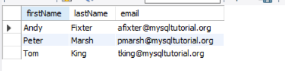

#### Example - Cập nhật dựa trên kết quả `SELECT`

- Giả sử trong bảng `customers`, 1 số khách hàng vẫn chưa có nhân viên đại diện nào (salesRepEmployeeNumber = `NULL`)

- Lấy 1 nhân viên ngẫu nhiên:

```sql
SELECT employeeNumber
FROM employees
WHERE jobTitle ='Sale Rep'
ORDER BY RAND ()
LIMIT 1;
```


- Cập nhật cho khách hàng chưa có nhân viên đại diện:

```sql
UPDATE customers
SET salesRepEmployeeNumber = (
  SELECT employeeNumber
FROM employees
WHERE jobTitle ='Sale Rep'
ORDER BY RAND ()
LIMIT 1
)
WHERE
   salesRepEmployeeNumber IS NULL;
```

