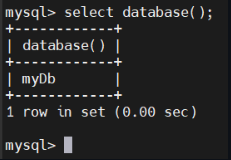
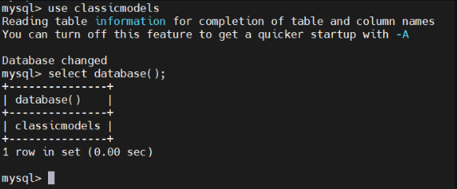
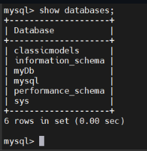
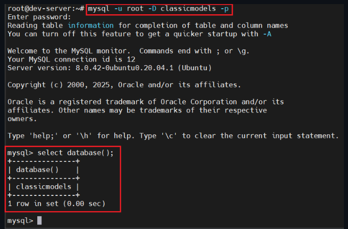
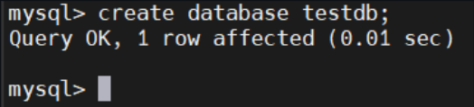
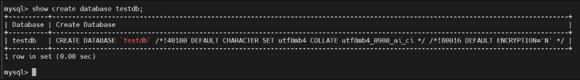
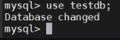
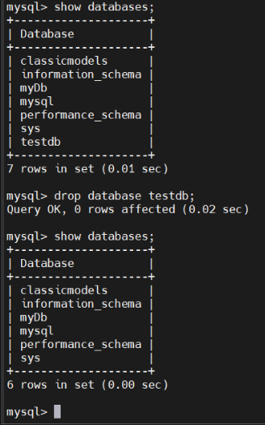

# MANAGING_DATABASES

## SELECT A DATABASES

- Đăng nhập bởi tài khoản root để có quyền truy vấn DataBases:

```sql
mysql -u root -p
```

- Để hiển thị CSDL hiện tại:

```sql
SELECT database ();
```



- Để chọn 1 CSDL dùng `USE`:

```sql
USE database_name
```



- Nếu CSDL không tồn tại, bạn có thể check lại các CSDL trên máy chủ:



- Chọn CSDL ngay sau khi đăng nhập:

```sql
mysql -u root -D classicmodels -p
```



## CREATE DATABASES

### Introduction (Create DataBases)

- Cú pháp chung:

```sql
CREATE DATABASES [IF NOT EXISTS] database_name
[CHARACTER SET charset_name]
[COLLATE collation_name];
```

- Trong đó:

  - Chỉ định tên CSDL sau các từ khoá `CREATE DATABASES`. Tên CSDL không phải duy nhất trong một phiên bản máy chủ MySQL. Nếu tạo 1 DB đã tồn tại thì máy chủ SQL sẽ báo lỗi.
  - Thử sử dụng tuỳ chọn [IF NOT EXISTS] để tạo cơ sở dữ liệu một cách có điều kiện - tức chỉ tạo nếu nó chưa tồn tại.
  - Chỉ định toàn bộ ký tự (character set) và đối chiếu (collation) cho cơ sở dữ liệu mới. Nếu bạn bỏ qua các mệnh đề `CHARACTER SET` và `COLLATE`, MySQL sử dụng toàn bộ ký tự và đối chiếu mặc định cho CSDL mới.

### Creating a new DataBases

- Tạo cơ sở dữ liệu mới `test db`:

```sql
CREATE DATABASES testdb;
```



- Xem chi tiết CSDL vừa tạo:

```sql
SHOW CREATE DATABASE testdb;
```



- Chọn cơ sở dữ liệu:

```sql
USE testdb;
```



- Thoát khỏi CSDL:

```sql
exit
```

## DROP DATABASES

- Xoá 1 CSDL

- Cú pháp chung:

```sql
DROP DATABASE db_name
```


