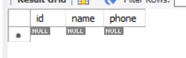

# MANAGING TABLE

## MYSQL ADD COLUMN

### Introduction

- Cú pháp chung:

```sql
ALTER TABLE table_name
ADD COLUMN new_column_name data_type
[FIRST | AFTER existing_column];
```

- Trong đó:

  - Tên bảng: Sau từ khoá `ALTER TABLE`, bạn ghi tên bảng mà bạn muốn thêm cột mới.
  - Cột mới và thuộc tính: Sau `ADD COLUMN`, bạn định nghĩa tên cột mới và kiểu dữ liệu của nó. Lưu ý rằng từ `COLUMN` là tuỳ chọn, bạn có thể bỏ qua.
  - Vị trí cột: bạn có thể chỉ định vị trí cột mới trong bảng:

    - `FIRST`: Đặt cột mới làm cột đầu tiên
    - `AFTER existing_column`: đặt cột mới ngay sau cột đã tồn tại

- Thêm nhiều cột một lúc:

```sql
ALTER TABLE table_name
ADD [COLUMN] column1 data_type [FIRST|AFTER existing_column],
ADD [COLUMN] column2 data_type [FIRST|AFTER existing_column],
...;
```

### Examples Add Column

- Tạo bảng `vendors` với 2 cột `id` và `name`:

```sql
CREATE TABLE vendors (
  id INT PRIMARY KEY,
  name VARCHAR(25)
);
```

- thêm cột `phone` sau `name`:

```sql
ALTER TABLE vendors
ADD phone VARCHAR(10) AFTER name;
```



## CREATE TABLE

