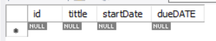
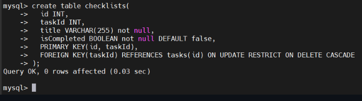
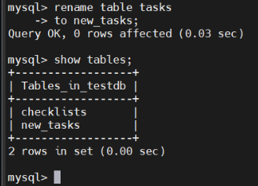
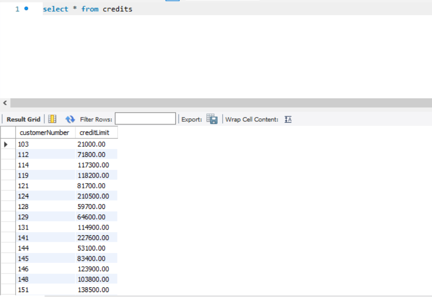

# MANAGING TABLE

## CREATE TABLE

### Introduction (Create Table)

- Cú pháp chung đẻ tạo bảng:

```sql
CREATE TABLE [IF NOT EXISTS] table_name(
   column 1 datatype constraints,
   column 2 datatype constraints,
   ....
) ENGINE=storage engine;
```

- Trong đó:

  - `table_name`: Tên bảng mà bạn muốn tạo
  - `column1`,`column2`,..: Tên các cột trong bảng
  - `datatype`: kiểu dữ liệu từng cột (`VAR`,`DATE`,`INT`)
  - `constraints`: Các tuỳ chọn ràng buộc như `NOTNULL`,`UNIQUE`,`PRIMARY KEY` và `FOREIGN KEY`

### Examples (Create Table)

- Tạo bảng mới tên `tasks`:

```sql
CREATE TABLE tasks (
  id INT primary key,
  tittle VARCHAR (255) NOT NULL,
  startDate DATE,
  dueDate DATE
);
```



- Tạo bảng với khoá ngoại:
  
  - Giả sử mỗi `tasks` có một checklist. Để lưu các checklist của task, bạn tạo một bảng tên mới là checklist:

    - Khi `id` của task thay đổi, hành động bị RESTRICT(cấm thay đổi nếu liên kết tồn tại)
    - Khi 1 task bị xoá thì tất cả checklist liên quan cũng bị CASCADE xoá tự động

  ```sql
  CREATE TABLE checklists(
    id INT,
    task_id INT,
    tittle VARCHAR (255) NOT NULL,
    is_completed BOOLEAN NOT NULL DEFAULT FALSE,
    PRIMARY KEY (id, task_id)
    FOREIGN KEY (task_id)
          REFERENCES task (id)
          ON UPDATE RESTRICT
          ON DELETE CASCADE
  );
  ```



## Thuộc tính `AUTO_INCREMENT`

### Introduction (Auto_Increment)

- Bạn sử dụng thuộc tính `AUTO_INCREMENT`để tự động tạo các giá trị số nguyên duy nhất cho một cột mỗi khi bạn chèn 1 hàng mới vào bảng.

- Ta dùng thuộc tính `AUTO_INCREMENT` cho cột `PRIMARY KEY`(khoá chính) để đảm bảo mỗi hàng có 1 mã định danh duy nhất

### Examples (`AUTO_INCREMENT`)

#### Tạo bảng với cột `AUTO_INCREMENT` trong MySQL

- Để tạo bảng có cột tự động tăng , ta sử dụng `AUTO_INCREMENT` thuộc tính:

```sql
CREATE TABLE table_name(
    id INT AUTO_INCREMENT PRIMARY KEY,
    ...
);
```

- Ví dụ tạo bảng `contacts` để lưu trữ dữ liệu liên hệ:

  - Trong đó:

    - Chúng ta gán thuộc tính `AUTO_INCREMENT` cho cột `id` để thiết lập nó làm khóa chính tự động tăng.
    - Khi ta chèn 1 hàng mới vào bảng `contacts` mà không cung cấp giá trị cho cột `id`, MySQL sẽ tự động tạo ra một số duy nhất.

```sql
CREATE TABLE contacts(
    id INT AUTO_INCREMENT PRIMARY KEY,
    name VARCHAR(255) NOT NULL,
    email VARCHAR(320) NOT NULL
);
```

#### Chèn hàng với cột `AUTO_INCREMENT`

- Khi chèn các hàng vào bảng có cột `AUTO_INCREMENT`, ta không cần phải chỉ định giá trị cột đó mà MySQL sẽ làm thay cho bạn. Ví dụ:
  
  - Trong câu lệnh `INSERT`, chúng ta không chỉ định giá trị cho cột `id` mà chỉ cung cấp giá trị cho các cột `name` và `email`. MySQL tự động tạo giá trị cho 1 cột `id`:

```sql
INSERT INTO contracts (name,email)
VALUES ('JohnDoe','john.doe@mysqltutorial.org');
```

## RENAME TABLE

### Introduction

- Cú pháp chung:

```sql
RENAME TABLE table_name
TO new_table_name;
```

- Rename nhiều table:

```sql
RENAME TABLE
table_name1 TO new_table_name1,
table_name2 TO new_table_name2,
...;
```

### Examples



## MYSQL ADD COLUMN

### Introduction (Add Col)

- Cú pháp chung:

```sql
ALTER TABLE table_name
ADD COLUMN new_column_name data_type
[FIRST | AFTER existing_column];
```

- Trong đó:

  - Tên bảng: Sau từ khoá `ALTER TABLE`, bạn ghi tên bảng mà bạn muốn thêm cột mới.
  - Cột mới và thuộc tính: Sau `ADD COLUMN`, bạn định nghĩa tên cột mới và kiểu dữ liệu của nó. Lưu ý rằng từ `COLUMN` là tuỳ chọn, bạn có thể bỏ qua.
  - Vị trí cột: bạn có thể chỉ định vị trí cột mới trong bảng:

    - `FIRST`: Đặt cột mới làm cột đầu tiên
    - `AFTER existing_column`: đặt cột mới ngay sau cột đã tồn tại

- Thêm nhiều cột một lúc:

```sql
ALTER TABLE table_name
ADD [COLUMN] column1 data_type [FIRST|AFTER existing_column],
ADD [COLUMN] column2 data_type [FIRST|AFTER existing_column],
...;
```

### Examples Add Column

- Tạo bảng `vendors` với 2 cột `id` và `name`:

```sql
CREATE TABLE vendors (
  id INT PRIMARY KEY,
  name VARCHAR(25)
);
```

- thêm cột `phone` sau `name`:

```sql
ALTER TABLE vendors
ADD phone VARCHAR(10) AFTER name;
```

## DROP COLUMN

- Cú pháp chung:

```sql
ALTER TABLE table_name
DROP COLUMN column_name;
```

- Xoá nhiều cột:

```sql
ALTER TABLE table_name
DROP COLUMN column_name_1,
DROP COLUMN column_name_2,
...;
```

## DROP TABLE

- `DROP TABLE` dùng để xoá hoàn toàn một hoặc nhiều bảng và dữ liệu bên trong khỏi cơ sở dữ liệu.
- Không ảnh hưởng đến quyền truy cập đã gán cho bảng.
- Cú pháp chung:

```sql
DROP [TEMPORARY] TABLE [IF EXISTS] table_name [, table_name ...] [RESTRICT | CASCADE];
```

- Ví dụ - Xoá 1 bảng;

```sql
DROP TABLE insurances;
```

- Ví dụ - Xoá nhiều bảng cùng lúc:

```sql
DROP TABLE CarAccessories, CarGadgets;
```

- Ví dụ - Xoá bảng không tồn tại với `IF EXISTS`:

```sql
DROP TABLE IF EXISTS aliens;
SHOW WARNINGS;
```

## TEMPORARY TABLE

### Introduction(Temporary Table)

- Trong MySQL, bảng tạm thời cho phép bạn lưu trữ các tập hợp kết quả tạm thời mà bạn có thể sử dụng lại nhiều lần trong cùng 1 phiên làm việc. Cú pháp chung:

```sql
CREATE TEMPORARY TABLE table_name(
   column1 datatype constraints,
   column1 datatype constraints,
   ...,
   table_constraints
);
```

- Bảng tạm thời có các đặc điểm sau:

  - MySQL tự động xoá bảng tạm thời khi phiên làm việc kết thúc hoặc kết nối bị chấm dứt.
  - Có thể dùng lệnh `DROP TABLE` để xoá bảng tạm thời
  - Bảng tạm thời chỉ khả dụng và có thể truy cập được bởi máy khách tạo ra nó. Các máy khách khác nhau có thể tạo ra bảng mới cùng tên mà không gây ra lỗi vì chỉ máy khách tạo ra bảng tạm thời và nhìn thấy nó.
  - Bảng tạm thời có thể cùng tên bảng chính khác. Nhưng khi tạo bảng tạm thời sẽ không truy cập được vào bảng chính thức cho đến khi ta xoá bảng tạm thời trong CSDL.

- Để tạo bảng tạm thời có cấu trúc dựa trên bảng hiện có ta sử dụng câu lệnh:

```sql
CREATE TEMPORARY TABLE temp_table-name
SELECT * FROM original_table
LIMIT 0;
```

- Xoá bảng tạm thời ta thực hiện theo cú pháp sau:

```sql
DROP TEMPORARY TABLE table_name;
```

### Examples (`Temporary Table`)

- Dùng sample DB:

```sql
use classicmodels;
```

- Tạo 1 bảng tạm thời có tên `credits` để lưu trữ số dư tín dụng của khách hàng:

```sql
CREATE TEMPORARY TABLE credis (
  customerNumber INT PRIMARY KEY,
  creditLimit DEC(10,2)
);
```

- Tiếp theo chèn các hàng từ bảng `customers` vào bảng tạm thời `credits`

```sql
INSERT INTO credits (customerNumber, creditLimit)
SELECT 
   customerNumber,
   creditLimit
FROM 
   customers
WHERE
   creditLimit > 0
```



## GENERATED COLUMN

- Các cột "được tạo tự động" vì dữ liệu trong cột này được tính toán dựa trên trên các biểu thức được định nghĩa trước. Cú pháp chung:

```sql
column_name data_type [GENERATED ALWAYS] AS (expression)
   [VIRTUAL | STORED] [UNIQUE [KEY]]
```

- Trong đó:

  - Thêm mệnh đè `GENERATED ALWAYS` để chỉ ra rằng cột đó là cột tạo tự động.
  - chỉ định kiểu dữ liệu của cột bằng tuỳ chọn tương ứng: `VIRTUAL` và `STORED`(Mặc định `VIRTUAL`)
  - Triển khai express sau từ khoá AS (biểu thức có thể chứa hằng số, tham số, toán tử v.v,...)
