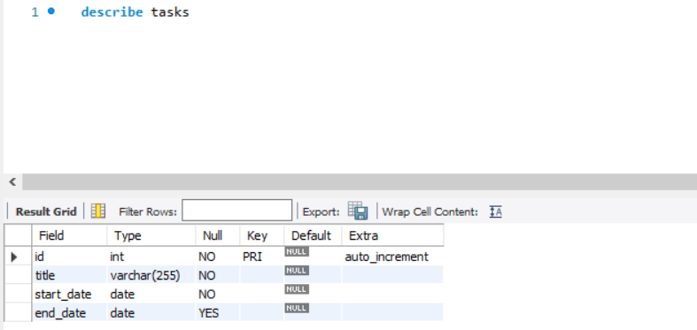

# MYSQL CONSTRAINTS

## PRIMARY KEY

### Introduction(Primary Key)

- Primary Key là cột hoặc tập hợp cột dùng để định danh duy nhất mỗi hàng trong bảng .
- Các cột của Primary Key phải `UNIQUE` và không được `NULL`.
- Mỗi bảng chỉ có 1 Primary Key (hoặc không có)
- Cú pháp **Single Column Primary Key**:

```sql
CREATE TABLE table_name(
  column1 datatype PRIMARY KEY, 
  column2 datatype
);
```

- Cú pháp đặt cuối danh sách cột

```sql
CREATE TABLE table_name (
   column1 datatype,
   column2 datatype,
   PRIMARY KEY (column1)
);
```

- **Multi-Column Primary Key**:

```sql
CREATE TABLE table_name(
  column1 datatype,
  column2 datatype,
  column3 datatype,
  PRIMARY KEY(column1, column2)
);
```

- Thêm PRIMARY KEY vào bảng đã tồn tại:

```sql
ALTER TABLE table_name
ADD PRIMARY KEY(column1, column2, ...);
```

- Xoá Primary Key:

```sql
ALTER TABLE table_name
DROP PRIMARY KEY;
```

## FOREIGN KEY

### Introduction(Foreign Key)

- Foreign Key (Khoá ngoại) là cột (hoặc nhóm cột) trong bảng con tham chiếu đến cột (thường là khoá chính) trong bảng cha.
- Nó giúp đảm bảo toàn vẹn dữ liệu: Các giá trị trong bảng con phải tồn tại trong bảng cha hoặc là `NULL`

  - Bảng cha = Bảng được tham chiếu
  - Bảng con = Bảng tham chiếu
  - Có thể tự tham chiếu (recursive), ví dụ: `employees.repotsTO -> employees.employeeNumber`

- Cú pháp chung:

```sql
[CONSTRAINT ten_rangbuoc]
FOREIGN KEY (cot_con, ...)
REFERENCES bang_cha(cot_cha, ...)
[on DELETE thao_tac]
[on DELETE thao_tac]
```

- Trong đó:

  - `thao_tac`có thể thực thi:

    - `CASCADE`: Tự động cập nhật xoá các hàng con khi hàng cha thay đổi.
    - `SET NULL`: Đặt các giá trị cột con thành `NULL` khi hàng cha thay đổi.
    - `RESTRICT / NO ACTION`: Không cho phép thay đổi nếu hàng con tồn tại
    - `SET DEFAULT`:
  - Mặc định để `RESTRICT`

### Examples (Foreign Key)

#### `RESTRICT/ NO ACTION`

```sql
CREATE TABLE categories (
  categoryId INT AUTO_INCREMENT PRIMARY KEY, 
  categoryName VARCHAR(100) NOT NULL
) ENGINE=INNODB;

CREATE TABLE products (
  productId INT AUTO_INCREMENT PRIMARY KEY, 
  productName VARCHAR(100) NOT NULL, 
  categoryId INT, 
  CONSTRAINT fk_category FOREIGN KEY (categoryId)
    REFERENCES categories(categoryId)
) ENGINE=INNODB;
```

- Thêm `category` không có trong `categories` -> báo lỗi
- Cập nhật/ Xoá `category` đang được tham chiếu -> báo lỗi

#### `CASCADE`

```sql
CREATE TABLE products (
    productId INT AUTO_INCREMENT PRIMARY KEY,
    productName VARCHAR(100) NOT NULL,
    categoryId INT,
    CONSTRAINT fk_category FOREIGN KEY (categoryID)
        REFERENCES categories(categoryID)
        ON UPDATE CASCADE
        ON UPDATE CASCADE
) ENGINE = INNODB;
```

- Cập nhật `categoryId` ở bảng cha -> Các hàng con tự động cập nhật.
- Xoá `categoryId` ở bảng cha -> các hàng con tự động xoá.

#### `SETNULL`

```sql
CREATE TABLE products (
  productId INT AUTO_INCREMENT PRIMARY KEY,
  productName VARCHAR(100) NOT NULL,
  categoryId INT,
  CONSTRAINT fk_category FOREIGN KEY (categoryId)
    REFERENCES categories(categoryId)
    ON UPDATE SET NULL
    ON DELETE SET NULL
) ENGINE=INNODB;
```

- Cập nhật `categoryId` ở bảng cha → các hàng con tự động thành `NULL`.
- Xóa `categoryId` ở bảng cha → các hàng con tự động thành `NULL`.

#### Xoá khoá ngoại

- Cú pháp:

```sql
ALTER TABLE products 
DROP FOREIGN KEY fk_category;
```

- Xem tên rằng buộc của khoá ngoại:

```sql
SHOW CREATE TABLE products;
```

#### Tạm tắt kiểm tra khoá ngoại

- Dùng khi Import dữ liệu:

```sql
SET foreign_key_check = 0; -- tắt
SET foreign_key_check = 1; -- bật lại
```

-> **Tác dụng disable chúng** là: tải dữ liệu vào bảng cha/ bảng con không theo thứ tự hoặc xoá bảng được tham chiếu bởi khoá ngoại.

## `UNIQUE` CONSTRAINTS

- `UNIQUE` CONSTRAINT dùng để đảm bảo rằng giá trị trong 1 cột hoặc 1 nhóm cột không bị trùng lặp.
- Cú pháp chung:

```sql
CREATE TABLE table_name (
    column1 datatype UNIQUE
);
```

- Ví dụ:

```sql
phone VARCHAR(15) UNIQUE
```

=> Cột `phone` không được có giá trị trùng

- `UNIQUE` cho nhiều cột:

```sql
UNIQUE(column1, column2)
```

- `UNIQUE` có tên rõ ràng (đặt tên constraint):

```sql
CONSTRAINT constraint_name 
UNIQUE(column_list)
```

- Ví dụ:

```sql
CONSTRAINT uc_name_address UNIQUE(name, address)
```

## `NOT NULL` CONSTRAINTS

### Introduction(`NOT NULL`Constraints)

- `NOT NULL` dùng để đảm bảo giá trị của một cột không được phép là `NULL`
- Cú pháp chung:

```sql
column_name datatype NOT NULL
```

### Example (`NOT NULL`)

#### Thêm `NOT NULL` vào bảng mới

- Tạo bảng có `NOT NULL`(bảng `tasks`):

```sql
CREATE TABLE tasks (
    id INT AUTO_INCREMENT PRIMARY KEY,
    title VARCHAR(255) NOT NULL,
    startDate DATE NOT NULL,
    endDate DATE
);
```



#### Thêm `NOT NULL` vào bảng đã có

- Giả sử bảng tasks đã có dữ liệu:

```sql
INSERT INTO tasks(title, start_date, end_date)
VALUES ('Learn MySQL NOT NULL constraint', '2017-02-01', '2017-02-02'),
       ('Check and update NOT NULL constraint to your database', '2017-02-01', NULL);
```

- ĐỔI `end_date` thành `NOT NULL`:

-> `Bước 1`: Cập nhật `NULL` -> giá trị hợp lệ:

```sql
UPDATE tasks
SET end_date = start_date + 7
WHERE end_date IS NULL;
```

-> `Bước 2`: Thêm ràng buộc NOT NULL:

```sql
ALTER TABLE tasks 
CHANGE end_date end_date DATE NOT NULL;
```

**NOTE**: `CHANGE old_col new_col new_definition`

#### Xoá Ràng Buộc `NOT NULL`

```sql
ALTER TABLE tasks 
MODIFY end_date DATE;
```

## `DEFAULT` Constraints

### Introduction (`Default`)

- Dùng để gán 1 giá trị mặc định cho một cột trong MySQL.

- Cú pháp:

```sql
column_name datatype DEFAULT default_value
```

### Examples

#### Thêm `DEFAULT` để gán 1 giá trị mặc định

```sql
CREATE TABLE cart_items 
(
    item_id INT AUTO_INCREMENT PRIMARY KEY,
    name VARCHAR(255) NOT NULL,
    quantity INT NOT NULL,
    price DEC(5,2) NOT NULL,
    sales_tax DEC(5,2) NOT NULL DEFAULT 0.1,
    CHECK(quantity > 0),
    CHECK(sales_tax >= 0) 
);
```

-> `sale_tax` có `DEFAULT`= 0.1 (10%)  
-> Nếu bạn không giá trị cho `sale_tax`-> MySQL tự dùng `0.1`

#### Thêm `DEFAULT` vào 1 cột của bảng đã tồn tại

- Cú pháp:

```sql
ALTER TABLE table_name 
ALTER COLUMN column_name SET  DEFAULT default_value;
```

- Ví dụ:

```sql
ALTER TABLE card_items
ALTER COLUMN quantity SET DEFAULT 1;
```

#### Xóa DEFAULT khỏi cột

**Cú pháp**:

```sql
ALTER TABLE table_name
ALTER COLUMN column_name DROP DEFAULT;
```

**Ví dụ**:

```sql
ALTER TABLE cart_items
ALTER COLUMN quantity DROP DEFAULT;
```

## MYSQL CHECK CONSTRAINTS

### Introduction(Check Constraints)

- `CHECK` đảm bảo giá trị lưu vào cột phải thoả mãn 1 biểu thức Boolean (`TRUE` hoặc `UNKNOWN`). Còn nếu biểu thức là `FALSE` -> lỗi không cho `INSERT/UPDATE`

- **Cú pháp**:

```sql
CONSTRAINT constraint_name
CHECK (expression)
[ENFORCED | NOT ENFORCED]
```

### Examples (Check Constraints)

#### Tạo check cấp 1

```sql
CREATE TABLE parts (
    part_no VARCHAR(18) PRIMARY KEY,
    description VARCHAR(40),
    cost DECIMAL(10,2) NOT NULL CHECK (cost >= 0),
    price DECIMAL(10,2) NOT NULL CHECK (price >= 0)
);
```

#### Tạo check cấp bảng

```sql
CREATE TABLE parts  (
    part_no VARCHAR(18) PRIMARY KEY,
    description VARCHAR (40),
    cost DECIMAL (10,2) NOT NULL CHECK (cost >= 0),
    price DECIMAL (10,2) NOT NULL CHECK (price >= 0),
    CONSTRAINT parts_chk_price_gt_cost CHECK (price >= cost)    
);
```

#### Thêm Check vào bảng đã có

- Tự sinh tên ràng buộc:

```sql
ALTER TABLE parts
ADD CHECK (part_no <> description);
```

- Tự đặt tên ràng buộc:

```sql
ALTER TABLE parts
ADD CONSTRAINT chk_part_name
CHECK (part_no <> description);
```

#### Xoá CHECK Constraints

- Ta phải biết tên `Constraints`:

```sql
ALTER TABLE parts
DROP CHECK name_check_constraints
```
