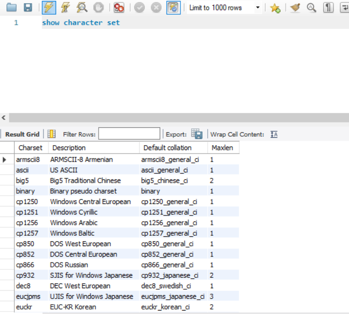
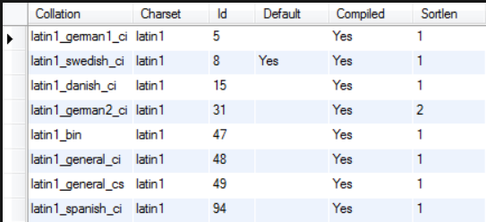

# MYSQL_GOBALIZATION

## MYSQL CHARACTER SETS

### Introduction (CharacterSet)

- Bộ kí tự MySQL (Character Sets) xác định cách dữ liệu được lưu trữ và sắp xếp trong cột văn bản.
- Cú pháp show bộ kí tự:

```sql
SHOW CHARACTER SET;
```



- Trong đó:
  
  - Cột `MaxLen` chỉ định số byte mà một kí tự có thể chiếm giữ.
  - Một số bảng chứa kí tự đơn Byte (VD:`latin1`,`latin2`,`cp850`,..v.v), trong khi các bảng kí tự khác chứa các kí tự đa byte.
  - Bộ kí tự mặc định là `utf8mb4` và `utf8mb4_0900_ai_ci` nhưng ta có thể thay theo ý.

### Examples (CharacterSet)

- Có một số ví dụ chuyển đổi các bộ kí tự và cách cấu hình bộ kí tự cho máy khách chúng ta có thể xem chi tiết hướng dẫn tại [đây](https://www.mysqltutorial.org/mysql-basics/mysql-character-set/)

## MYSQL COLLATION

### Introduction (Collation)

- Đối chiếu (Collation) trong MySQL là tập hợp các quy tắc sử dụng để so sánh kí tự trong bộ kí tự cụ thể. Mỗi bộ kí tự trong MySQL đều có ít nhất một đối chiếu mặc định. Nó có thể nhiều hơn một đối chiếu. Tuy nhiên, hai bộ ký tự không thể cùng 1 đối chiếu.

- MySQL cung cấp `SHOW CHARACTER SET` cho phép bạn lấy các bộ kí tự đối chiếu mặc định. Còn để `SHOW` theo 1 kiểu kí tự nhất định ta dùng lệnh:

```sql
# Cú pháp chung
SHOW COLLATION LIKE 'character_set_name%';

# Ví dụ
SHOW COLLATION LIKE 'latin1%';
```



### Examples

- Có một số ví dụ chúng ta có thể xem chi tiết hướng dẫn tại [đây](https://www.mysqltutorial.org/mysql-basics/mysql-collation/)
