# MYSQL IMPORT & EXPORTS

## IMPORT CSV File Into MYSQL TABLE

### Introduce

- **CSV (Comma-Separated Values)** là tệp văn bản thuần dùng để lưu trữ dữ liệu dạng bảng . Trong đó:

  - Mỗi **dòng** -> Một **bản ghi** (record)
  - Mỗi **cột** -> Một **trường** (field)

- Ví dụ về tệp CSV:

```c
id,name,age,email
1,Nguyen Van A,25,a@gmail.com
2,Tran Thi B,30,b@gmail.com
3,Le Van C,22,c@gmail.com
```

=> Dữ liệu giống bảng **excel**, **databases**

### Examples

#### Import tệp CSV vào bảng trên máy chủ SQL bằng câu lệnh `LOAD DATA INFILE`

- Câu lệnh `LOAD DATA INFILE` cho phép bạn đọc dữ liệu từ 1 tệp CSV trong một thư mục được chỉ định trên máy chủ MySQL và nhập nội dung nó vào 1 bảng.

- Trước khi nhập tập tin, bạn cần chuẩn bị những điều sau:

  - Bảng mà bạn muốn nhập dữ liệu vào .
  - Một tập tin CSV chứa dữ liệu khớp với số cột của bảng và kiểu dữ liệu trong mỗi cột
  - Tài khoản người dùng (user) MySQL có quyền FILE và INSERT

- Giả sử, ta có 1 bảng `discounts` với cấu trúc như sau:

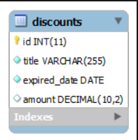

- Và tập tin `discounts.csv` sau đây chứa dòng đầu tiên làm tiêu đề cột và ba dòng dữ liệu còn lại:

```csv
id,title,expired_date,amount
1,Spring Break,2014-01-01,20
2,Back to School,2014-09-01,25
3,Summer Holiday,2014-08-25,10
```

**Để nhập tệp `discounts.csv` vào bảng `discounts`, bạn thực hiện các bước sau:**

- `Bước 1`: Tạo và lưu tệp `discount.csv` về máy local Window của mình

  - Truy cập NotePad trên PC (với quyền quản trị viên) và dán file `discount.csv` vào rồi sau đó lưu ở một đường dẫn nào đó trên máy local Window của mình ( ở đây là `:C/mysql/discounts.csv`)

  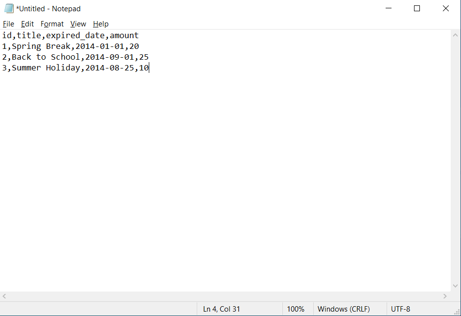

- `Bước 2`: Đăng nhập MySQL với quyền `root`

```sql
mysql -u root -p
```

- `Bước 3`: Hãy sử dụng DB `classic models`:

```sql
use classic models
```

- `Bước 4`: Hãy tạo 1 bảng `discounts`:

```sql
CREATE TABLE discounts(
      id INT NOT NULL AUTO_INCREMENT,
      title VARCHAR (255) NOT NULL,
      expired_date DATE NOT NULL,
      amount DECIMAL(10,2) NULL,
      PRIMARY KEY (id)
);
```

- `Bước 5`: Hãy hiển thị giá trị của biến `@@secure_file_priv`:

```sql
SELECT @@secure_file_priv;
```

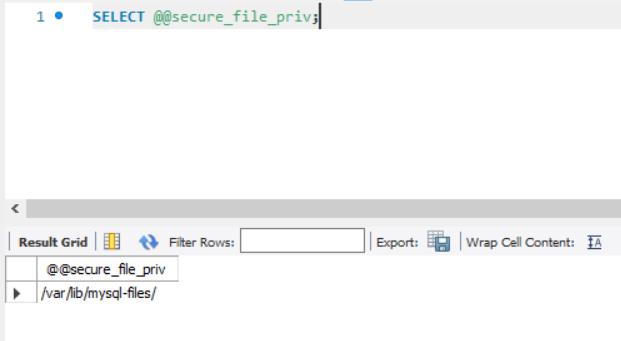

-> Tuỳ chọn `@@secure_file_priv` chỉ định thư mục mà bạn được phép lưu trữ tệp đầu vào và thực thi nó bằng câu lệnh `LOAD DATA INFILE`

- `Bước 6`: Tạo file để chứa file `discounts.csv` trên con máy ảo `Ubuntu 24.04`

```bash
# Tạo file chứa nơi Upload trước
sudo mkdir -p /var/lib/mysql-files/uploads
sudo chown mysql:mysql /var/lib/mysql-files/uploads
```

- `Bước 7`: Chuyển tệp `discount.csv` từ máy **Windows** về máy **Ubuntu 24.04**

  - `Window + R` -> `cmd` -> Rồi `scp` file `discounts.csv` từ Window vào `Ubuntu24.04`

```shell
scp D:/mysql/discounts.csv root@192.168.70.74:/var/lib/mysql-files/uploads/
```

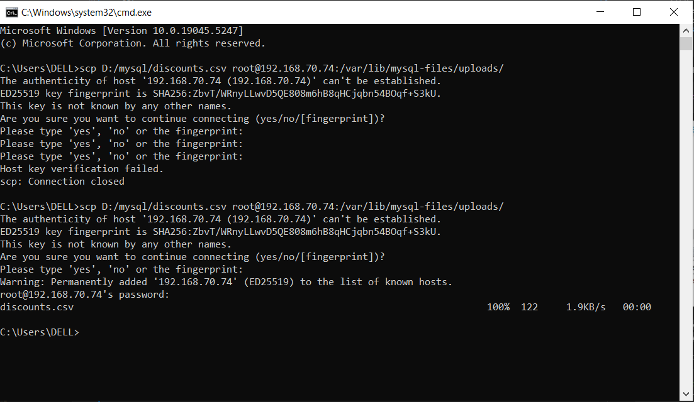

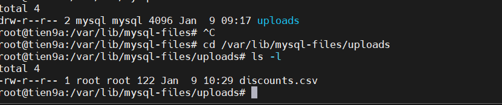

- `Bước 7`: Chỉnh quyền cho thư mục chứa file `discounts.csv` trong máy Ubuntu

```bash
sudo chown mysql:mysql /var/lib/mysql-files/uploads/discounts.csv
sudo chmod 750 /var/lib/mysql-files
sudo chmod 750 /var/lib/mysql-files/uploads
sudo chmod 640 /var/lib/mysql-files/uploads/discounts.csv
```

- `Bước 8`: Sao chép tệp `discounts.csv` vào bảng `discounts`bằng cách thực hiện lệnh sau:

```sql
LOAD DATA INFILE '/var/lib/mysql-files/uploads/discounts.csv' 
INTO TABLE discounts 
FIELDS TERMINATED BY ',' 
ENCLOSED BY '"'
LINES TERMINATED BY '\n'
IGNORE 1 ROWS;
```

- Trong đó:

  - `LOAD DATA INFILE`: Chỉ định đường dẫn tới dirs chứa dữ liệu cần tải vào bảng `discounts.csv`
  - `INTO TABLE discounts`: Chỉ định bảng đích nơi bạn muốn Add dữ liệu
  - `FIELDS TERMINATED BY ','` Chỉ định rằng các trường trong tệp đầu vào được phân bằng dấu phẩy `,`.Điều này cho biết tệp đó là tệp CSV (Comma-Separated Values).  
  - `ENCLOSED BY '"'`: Chỉ định rằng các trường trong tệp đầu vào được đặt trong dấu ngoặc kép `"`. Điều này thường được sử dụng trong các tệp CSV để xử lý các trường hợp một trường có thể chứa dấu phân cách `,`
  - `LINES TERMINATED BY '\n'`: Chỉ định rằng mỗi dòng trong tệp đầu vào được kết thúc bằng ký tự xuống dòng ( \n). Điều này cho biết kết thúc của một bản ghi (hàng) trong tệp CSV.
  - `IGNORE 1 ROWS`: Chỉ thị câu lệnh bỏ qua hàng đầu tiên trong tệp đầu vào. Điều này hữu ích khi hàng đầu tiên chứa tiêu đề và không nên được nhập khẩu dưới dạng dữ liệu.

=> **Kết quả đầu ra**: (Tải 3 hàng thành công vào tập tin)

```sql
Query OK, 3 rows affected (0.01 sec)
Records: 3  Deleted: 0  Skipped: 0  Warnings: 0
```

- `Bước 9`: Trích xuất bảng `discounts` để xem dữ liệu `.CSV` ta đã Imports vào:

```sql
SELECT * FROM discounts;
```

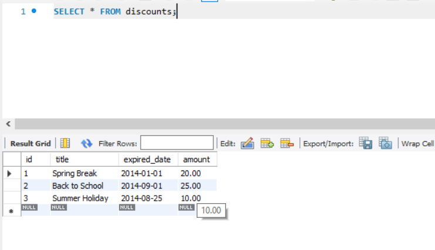

#### Chuyển đổi dữ liệu trong quá trình nhập

- Khi định dạng dữ liệu không khớp với các cột đích trong bảng. Ta có thể sử dụng mệnh đề `SET` để biến đổi chúng.

- Giả sử cột ngày hết hạn trong tệp `discount2.csv` có định dạng `mm/dd/yyyy` như sau:

```sql
id,title,expired_date,amount
1,Spring Break,01/01/2014,20
2,Back to School,09/01/2014,25
3,Summer Holiday,08/25/2014,10
```

Khi nhập dữ liệu vào bảng `discounts`, bạn có thể chuyển đổi dữ liệu đó sang định dạng ngày tháng của MySQL bằng cách sử dụng hàm `STR_TO_DATE()`:

```sql
LOAD DATA INFILE '/var/lib/mysql-files/uploads/discounts.csv' 
INTO TABLE discounts 
FIELDS TERMINATED BY ',' 
ENCLOSED BY '"'
LINES TERMINATED BY '\n'
IGNORE 1 ROWS;
(id, title, @expired_date,amount)
SET expired_date = STR_TO_DATE(@expired_date, '%m/%d/%Y');
```

#### Nhập file `.CSV` từ máy Local vào bảng trên máy chủ MySQL từ xa

Theo mặc định, MySQL vô hiệu hóa việc tải tệp cục bộ lên máy chủ. Để tải tệp cục bộ lên máy chủ MySQL, bạn cần bật tùy chọn này ở cả phía máy khách và máy chủ. Cách cấu hình:

- `Bước 1`: Hãy mở tệp cấu hình (`my.ini` or `my.conf`) và thêm dòng sau để cho phép tải tệp cục bộ trên máy chủ MySQL:

```sql
[mysqld]
local_infile=1
```

- `Bước 2`: Khởi động lại máy chủ MySQL để áp dụng thay đổi

- `Bước 3`: Mở chương trình client MySQL trên máy tính cục bộ để kết nối với máy chủ MySQl

```sql
mysql -h hostname -u root -p
```

- `Bước 4`: Đặt biến toàn cục `local_infile` thành 1 (hoặc `ON`):

```sql
SET GLOBAL local_infile = 1;
```

=> Đã cấu hình `local_infile` cả máy chủ và máy khách

- `Bước 5`: Thay đổi db chứa bảng `discounts` và thực thi câu lệnh `LOAD  DATA INFILE` để nhập dữ liệu từ tệp CSV nằm trong thư mục `C:\temp\` đó vào máy chủ :

```sql
USE classicmodels;
LOAD DATA LOCAL INFILE  'c:/temp/discounts.csv'
INTO TABLE discounts
FIELDS TERMINATED BY ',' 
ENCLOSED BY '"'
LINES TERMINATED BY '\n'
IGNORE 1 ROWS;
```

#### Nhập các tệp CSV vào bảng bằng MySQL Workbench

Công cụ MySQL Workbench cung cấp chức năng nhập dữ liệu vào bảng.

- `Bước 1`: Hãy mở bảng `discounts`:

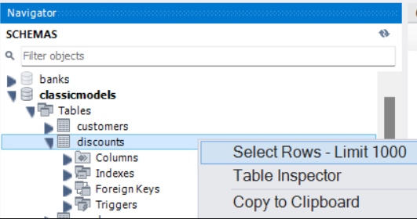

- `Bước 2`: Nhấp vào nút nhập:

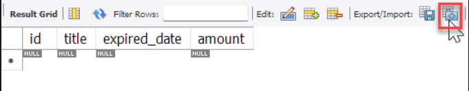

- `Bước 3`: Chọn đường dẫn đến tệp CSV và nhấp vào nút Tiếp theo:

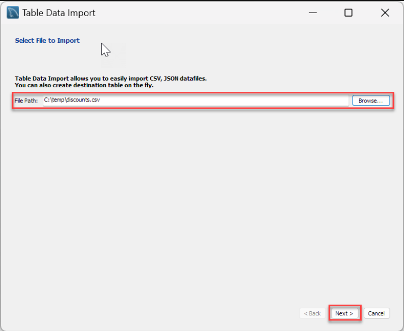

- `Bước 4`: chọn bảng đích, `classicmodels.discounts` trong trường hợp này là bảng . Lưu ý rằng bạn có thể tạo bảng mới trước khi nhập tệp và/hoặc xóa dữ liệu trong bảng trước khi nhập:

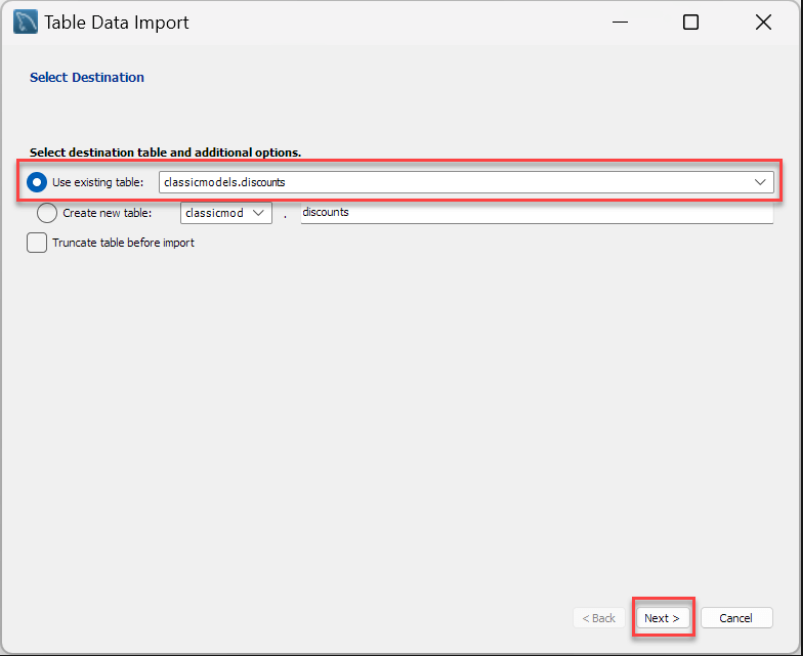

- `Bước 5`: Hãy đối chiếu các cột trong tệp nguồn với các cột trong bảng đích và nhấp vào nút `Tiếp theo`:

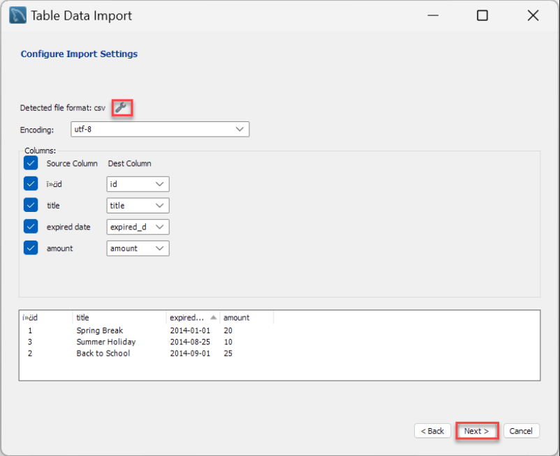

- `Bước6`: Xem lại các bước mà Workbench sẽ thực hiện và nhấp vào nút `Tiếp theo`:

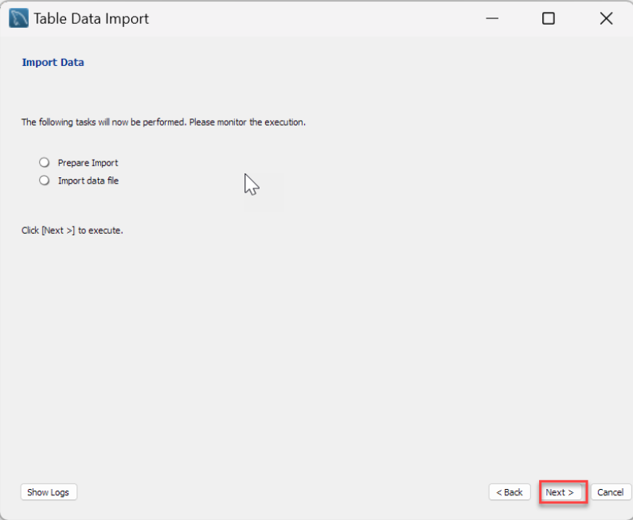

- `Bước 7`: Xem lại các bước mà Workbench sẽ thực hiện và nhấp vào nút `Tiếp theo`:

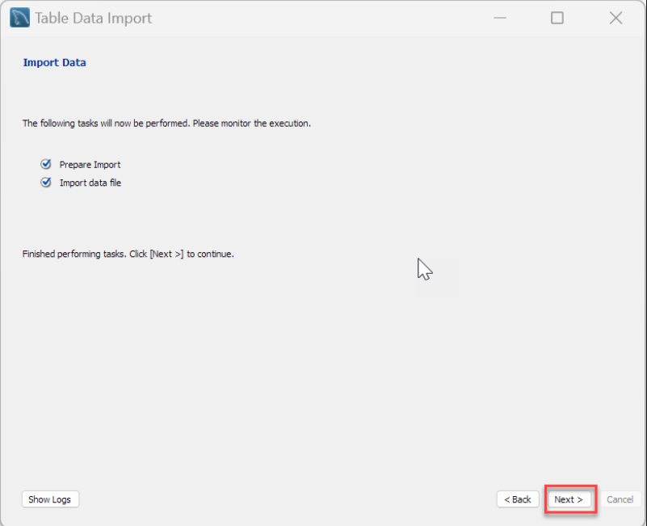

-`Bước 8`: Xem lại kết quả nhập và nhấp vào nút `Hoàn tất`:

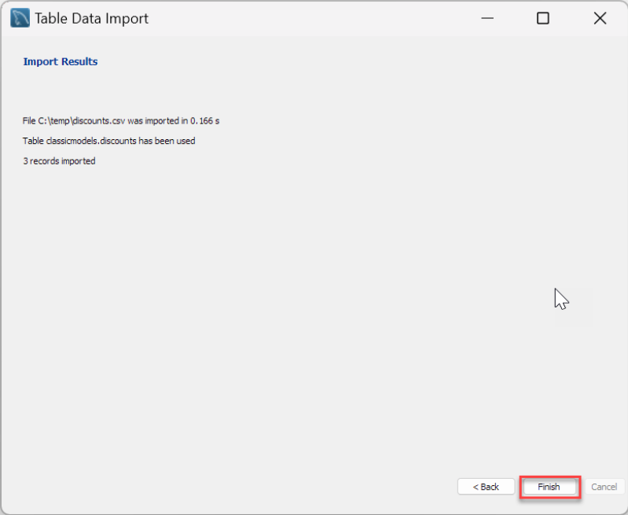

Cuối cùng, hãy hiển thị nội dung của bảng giảm giá:

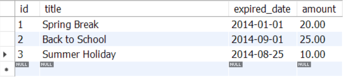

## EXPORT MYSQL TABLE TO CSV FILE

### Examples (`Export to CSV`)

#### Xuất bảng sang tệp CSV bằng câu lệnh `SELECT ... INTO OUTFILE`

Chúng ta sẽ xuất bảng các đơn hàng từ sampleDB sang file `.CSV`  nằm trên máy chủ MySQL:

- `Bước 1`: Mở `cmd` trên Window (Win+R ->`cmd`) rồi kết nối với máy chủ MySQL và xài DB `classicmodels`:

```shell
mysql -u root -p
use classicmodels;
```

- `Bước 2`: Hiển thị giá trị của biến `secure_file_priv`

```shell
SHOW VARIABLES LIKE "secure_file_priv";
```

-> Kết quả:

```sql
+------------------+------------------------------------------------+
| Variable_name    | Value                                          |
+------------------+------------------------------------------------+
| secure_file_priv | C:\ProgramData\MySQL\MySQL Server 8.0\Uploads\ |
+------------------+------------------------------------------------+
1 row in set (0.02 sec)
```

- `Bước 3`: Dùng lệnh sau, trích xuất dữ liệu từ bảng `orders` và xuất kết quả ra tệp `orders.csv`:

```sql
SELECT * FROM orders
INTO OUTFILE 'C:/ProgramData/MySQL/MySQL Server 8.0/Uploads/orders.csv' 
FIELDS ENCLOSED BY '"' 
TERMINATED BY ',' 
ESCAPED BY '"' 
LINES TERMINATED BY '\r\n';
```

-> **Lưu ý**: File `orders.csv` không được tồn tại ở `C:/ProgramData/MySQL/MySQL Server 8.0/Uploads` trước đó.

#### Thêm tiêu đề cột vào cột đầu ra `.CSV`

- Ta dùng toán tử `UNION`, vẫn ví dụ trên :

```sql
SELECT 'Order no', 'Order date', 'Required Date', 'Shipped Date', 'Status', 'Comments', 'Customer No'
UNION 
SELECT * FROM orders
INTO OUTFILE 'C:/ProgramData/MySQL/MySQL Server 8.0/Uploads/orders_heading.csv' 
FIELDS ENCLOSED BY '"' 
TERMINATED BY ',' 
ESCAPED BY '"' 
LINES TERMINATED BY '\r\n';
```

#### Xuất dữ liệu sang tệp CSV bằng MySQL Workbench

Ta tham khảo cách làm theo đường dẫn sau [đây](https://www.mysqltutorial.org/mysql-basics/mysql-export-table-to-csv/)
