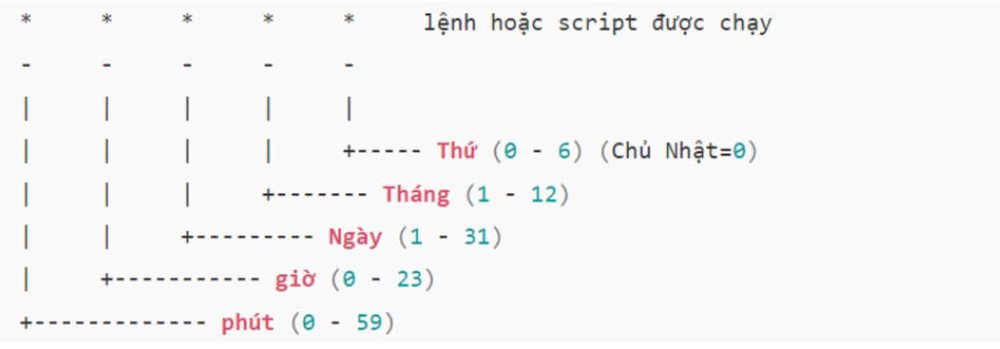
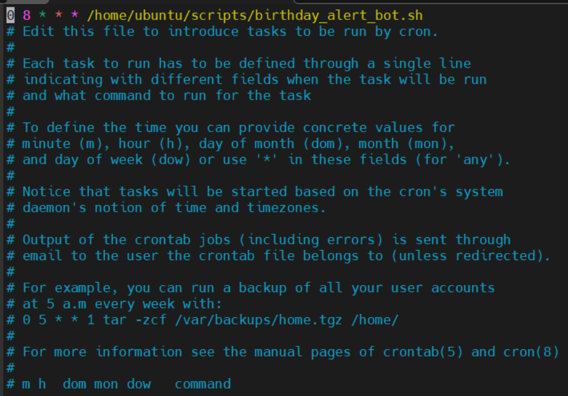
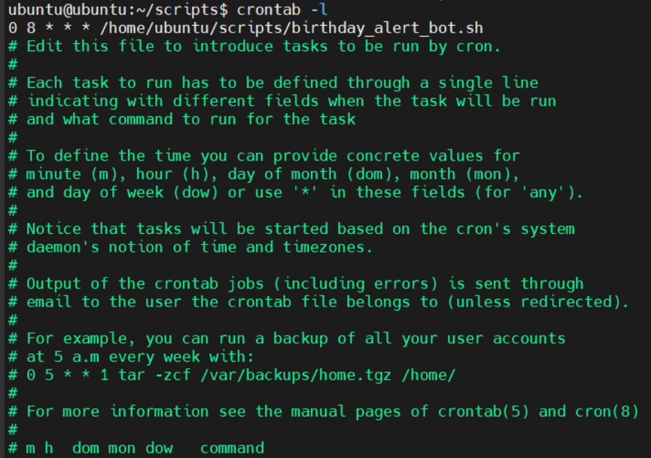

# TÌM HIỂU VỀ CRONTAB

## I. CRONTAB LÀ GÌ ?

### 1. Khái niệm

**Crontab** - viết tắt của **cron table** (Bảng định kỳ), là một tệp cấu hình giúp tạo và thực thi các lệnh theo chu kỳ nhất định. Nó cho phép người dùng lập lịch để thực hiện các tác vụ trên máy chủ, chạy một hoặc nhiều lệnh theo thời gian được xác định trước.

**cron** là `daemon` (nền) hoạt động liên tục và kiểm tra **file crontab** để chạy các lệnh đúng thời điểm.

### 2. Cấu trúc Crontab



Bên cạnh đó:

- `@yearly /script/script.sh`: Mỗi năm (lúc 00:00 ngày 1/1).
- `@monthly /script/script.sh`: Mỗi tháng (lúc 00:00 ngày 1).
- `@weekly /script/script.sh`: Mỗi tuần (lúc 00:00 Chủ Nhật).
- `@daily /script/script.sh`: Mỗi ngày (lúc 00:00).
- `@hourly /script/script.sh`: Mỗi giờ (lúc phút 0).
- `@reboot /home/ubuntu/scripts/start_service.sh`: Khởi động dịch vụ sau khi boot.

Các kí tự đặc biệt:

- `*`: Bất kỳ giá trị nào (ví dụ: * ở vị trí giờ nghĩa là "mỗi giờ").
- `,`: Liệt kê danh sách (ví dụ: 1,15,30 ở phút).
- `-`: Xác định khoảng (ví dụ: 1-5 ở ngày trong tuần nghĩa là từ thứ 2 đến thứ 6).
- `/`: Xác định bước nhảy (ví dụ: */10 ở phút nghĩa là "cứ mỗi 10 phút").

Ví dụ thực tế:

| Mục tiêu                                   | Lệnh Crontab                                       |
|--------------------------------------------|----------------------------------------------------|
| Chạy script backup mỗi ngày lúc 2:30 sáng  | `30 2 * * * /home/user/backup.sh`                  |
| Chạy lệnh dọn rác lúc 0h ngày 1 hàng tháng | `0 0 1 * * /usr/bin/cleanup`                       |
| Chạy script kiểm tra server mỗi 5 phút     | `*/5 * * * * /home/user/check_server.sh`           |
| Chạy báo cáo vào 8h sáng từ Thứ 2 đến Thứ 6| `0 8 * * 1-5 /path/to/report.sh`                   |

### 3. Các lệnh thao tác cơ bản

**Crontab** hoạt động thông qua các file cấu hình (`cron schedule`) để quản lý các tác vụ tự động trên hệ thống Linux. Mỗi người dùng có một file **Crontab** riêng, được lưu trữ trong thư mục `/var/spool/cron`. Người dùng không thể chỉnh sửa file này trực tiếp mà phải sử dụng lệnh `crontab -e` để mở tệp trong trình soạn thảo, thêm hoặc sửa các lệnh cần thực thi theo lịch trình và lưu lại.

Để làm việc với **crontab**, bạn dùng các lệnh sau trên terminal:

`crontab -e`:  Tùy chọn cho phép tạo hoặc chỉnh sửa file Crontab.

`crontab -l`: Hiển thị danh sách file crontab đang được lập lịch

`crontab -r`: Xóa toàn bộ file crontab của người dùng.

`crontab -u username -e`: Chỉnh sửa crontab cho một người dùng cụ thể (cần quyền root).

Hầu hết **VPS** đều đã cài sẵn **Crontab**, nhưng nếu thấy lỗi `command not found` khi sử dụng lệnh `crontab -l`, nghĩa là công cụ này chưa được cài. Bạn cần cài đặt Crontab thủ công bằng cách sử dụng package phần mềm của hệ điều hành Linux đang dùng.

### 4. Shorthand(Ký tự viết tắt)

Thay vì gõ 5 dấu sao phức tạp, bạn có thể dùng các từ khóa đặc biệt:

`@reboot`: Chạy một lần khi hệ thống vừa khởi động lại.

`@daily` hoặc `@midnight`: Chạy 1 lần mỗi ngày vào lúc 0:00.

`@weekly`: Chạy vào lúc 0:00 sáng Chủ Nhật hàng tuần.

`@hourly`: Chạy vào đầu mỗi giờ.

### 5. Những lưu ý "quan trọng" khi dùng Crontab

Nhiều người mới dùng thường thắc mắc `"Tại sao lệnh của tôi chạy tay thì được nhưng crontab thì không?"`. Đây là lý do:

#### 5.1 Đường dẫn tuyệt đối

**Crontab** không hiểu các biến môi trường như $PATH của bạn. Hãy luôn dùng đường dẫn tuyệt đối.

- Sai: `python script.py`

- Đúng: `/usr/bin/python3 /home/user/script.py`

#### 5.2 Log lỗi

Theo mặc định, **Crontab** không hiện lỗi ra màn hình. Bạn nên ghi log ra file để kiểm tra:

- `* * * * * /path/to/command >> /home/user/cron.log 2>&1`

#### 5.3 Quyền thực thi

Đảm bảo file script của bạn đã được cấp quyền chạy `(chmod +x script.sh)`.

#### 5.4 Dòng trống cuối file

Một số hệ thống yêu cầu file Crontab phải kết thúc bằng một **dòng trống** (**newline**) để lệnh cuối cùng được nhận diện.

## II. CÀI ĐẶT

### 1. Cách cài đặt

`Bước 1`: Cài đặt cron (nếu chưa có)

```bash
sudo apt update
sudo apt install cron
```

`Bước 2`: Khởi động và bật cron chạy cùng hệ thống

```bash
sudo systemctl start cron
sudo systemctl enable cron
```

`Bước 3`: Kiểm tra trạng thái cron

```bash
sudo systemctl status cron
```

- Nếu thấy dòng `Active: active (running)` nghĩa là cron đang chạy.

`Bước 4`: Thêm tác vụ vào crontab

Mở trình chỉnh sửa crontab cho người dùng hiện tại:

```bash
crontab -e
```

Sau đó có thể thêm vào dòng như dưới đây để chạy script thông báo sinh nhật mỗi 8h sáng hàng ngày:

```bash
0 8 * * * /home/ubuntu/scripts/birthday_alert_bot.sh
```

- Đảm bảo file `.sh` được cấp quyền thực thi `+x`



`Bước 5`: Xem lại danh sách các tác vụ con

```bash
crontab -l
```


