# TÌM HIỂU VỀ BASHSHELL

## I. TỔNG QUAN VỀ BASHSHELL TRONG LINUX

### 1. Khái niệm về Bash, Script và Shell ?


**Bash Shell**: là một chương trình giao tiếp giữa người dùng và hệ điều hành, chủ yếu sử dụng trong hệ thống Unix/Linux. Trong đó:

- **Bash** (**Bourne Again Shell**) được phát triển như là một bản cải tiến của sh(**Bourne Shell**) truyền thống.
- **Shell** là chương trình đọc lệnh người dùng gõ vào, thực thi lệnh đó và trả kết quả lại.
- **Bash** vừa là **trình thông dịch lệnh (command interpreter)**, vừa hỗ trợ ngôn ngữ lập trình script, cho phép viết file script để tự động hóa công việc.
- Còn **Script** là một tập hợp các lệnh được viết sẵn trong một file để máy tính thực thi tự động theo thứ tự.(Thay vì ngồi gõ các lệnh riêng lẻ).

Ngoài Bash ra thì còn một vài chương trình thông dụng khác tương tự với tính năng khác hơn đó là `.zsh`, `.csh`, `.ksh`

Ba khái niệm **Shell – Bash – Script** thường bị nhầm với nhau. Thực ra quan hệ của chúng là:

```text
Script → chạy bằng → Shell
Bash → là một loại → Shell
```

Hai khái niệm **CLI**,**Shell** cũng gây nhầm lẫn:

- **CLI** giống như:

```text
cái bàn phím và màn hình để nói chuyện với máy
```

- **Shell** giống như:

```text
người phiên dịch hiểu lệnh và thực thi
```

Ví dụ: về 1 script

```bash
$ echo "Hello world!"

Hello world!
```

### 2. Đặc điểm của Bash, Scripts và Shell

#### a. Đặc điểm của Bash

Đặc điểm chính của Bash gồm:

- **Giao diện dòng lệnh tương tác**: Cho phép người dùng nhập và thực thi các lệnh trực tiếp để quản lý file, chạy chương trình, và thực hiện các tác vụ khác trên hệ thống.

- **Ngôn ngữ Scripting**: Bash là một ngôn ngữ lập trình đầy đủ, hỗ trợ biến, vòng lặp, câu lệnh điều kiện và các cấu trúc điều khiển khác. Điều này cho phép người dùng viết các script (tập tin chứa chuỗi các lệnh) để tự động hóa các tác vụ lặp đi lặp lại hoặc phức tạp.

- **Tự động hóa**: Bash scripting được sử dụng rộng rãi để tự động hóa các công việc như sao lưu dữ liệu, cài đặt phần mềm, quản lý hệ thống và thực hiện các chuỗi lệnh.

- **Quản lý tiến trình**: Bash cung cấp các tính năng để quản lý các tiến trình đang chạy trên hệ thống.

- **Biên tập dòng lệnh**: Hỗ trợ chỉnh sửa dòng lệnh hiệu quả với các phím tắt và lịch sử lệnh.

- Hỗ trợ **alias**, **loop**, **variables**, **function**, **if command**...

#### b. Đặc điểm của Shell

Đặc điểm chính **Shell** là:

- Là **command interpreter (trình thông dịch lệnh)**.
- Cho phép: c**hạy command**, **quản lí process**, **redirect I/O**, **pipeline**
- Có nhiều loại shell khác nhau: `BashShell`, `Korn Shell`, `CShell`.

#### c. Đặc điểm của Scripts

Đặc điểm chính **Scripts** là:

- Là file text
- Chứa chuỗi lệnh
- Chạy tự động
- Cần interpreter (CLI) để chạy

#### So sánh Bash, Scripts và Shell

| Tiêu chí| Shell                    | Bash                | Script          |
| ------- | ------------------------ | ------------------- | --------------- |
| Bản chất| chương trình interpreter | một loại shell      | file chứa lệnh  |
| Vai trò |giao tiếp user ↔ kernel   | thực thi lệnh shell | automation work |
| Quan hệ | khái niệm chung          | nằm trong shell     | chạy trên shell |
| Ví dụ   | bash, zsh                | bash                | backup.sh       |

### 3. Công dụng chính Bash, Shell, Scripts

#### a.Công dụng chính Shell

- Thực thi lệnh của người dùng (`cd`,`pwd`,...)
- Quản lý tiến trình (process như `pkill`, `kill -9`, `sleep`,...)
- Điều hướng dữ liệu (I/O Redirection như `ls`, `cat`,...)
- Kết hợp lệnh bằng pipeline (`ps aux |grep nginx`)
- Chạy các script (`nano`,`vim`)

#### b. Công dụng của Bash

- Thực thi command shell (`ls`, `cd`, `mkdir`).
- Hỗ trợ scripting (`if`, `for`, `while`, `function`).
- Quản lý biến môi trường.
- History và autocomplete.
- Alias.

#### c. Công dụng của Scripts

- Tự động hóa công việc.
- Chạy nhều lệnh.
- Tạo logic tự động.(can use `if`, `for`, `while` and case)

### 4. How to use BashShell ?

Ta sẽ tách rõ **cách chạy** 1 file **Bash shell** và 1 file **BashScript** (thực tế Bash script cũng là một loại script, nhưng người ta thường hỏi theo cách này trong Linux).

#### a. Chế độ Shell (Cách chạy file BashShell)

**Chế độ Shell tương tác (Interactive Shell)**: là dạng sử dụng câu lệnh trực tiếp trên môi trường Unix.

Ví dụ: sử dụng Bash để in ra `Hello world!`


**Chế độ không tương tác Shell (Non-Interactive Shell)**:

Ví dụ:

```bash
# Tạo thư mục /scripts và file thực thi hello.sh 
sudo mkdir ~/scripts -> cd /scripts -> sudo nano hello.sh

# Thêm quyền thực thi cho thư mục
sudo chmod +x hello.sh
```

- Sau đó, thêm nội dung vào file; Chẳng hạn ở đây là in ra dòng chữ "This is content of the file":

```bash
#!/bin/bash
echo "this is content of this file"
```

- Thực thi file:(Có thể thực thi file BashShell bằng 3 cách)

```bash
# Cách 1: Chỉ có thể thực hiện khi file script khi đã có dòng #!/bin/bash và quyền +x

./hello.sh

# Cách 2: Bỏ qua shebang trong file, chắc chắn dùng đúng /bin/bash và không cần cấp quyền execute

/bin/bash hello.sh 

# hoặc

bash hello.sh

#Cách 3: Tương tự /bin/bash, nhưng gọi trình thông dịch bash theo $PATH.

bash hello.sh

## Lưu ý : Nhớ cd vào chỗ chứa file Scripts rồi mới thực thi lệnh.
```

- Kết quả


#### b. Chế độ Scripts

Script có thể là:

- bash script
- python script
- perl script
- javascript script

Ví dụ - file python scripts:

```bash
scripts.py
```

- Nội dung:

```bash
print("Hello script")
```

- Chạy bằng interpreter:

```bash
python script.py
```

#### c. Sử dụng biến trong Linux

Tạo file `tien9a.sh` với nội dung bên dưới và cấp quyền thực thi `chmod +x`:

```bash
#!/bin/bash
name="tien9a"
echo "Hi $name"
```

hoặc:

```bash
#!/bin/bash
name="tien9a"
printf "Hi %s\n" "$name"
### trong đó ta gán cụm từ "tien9a" như 1 biến "name"
```

Output:

```bash
Hi tien9a
```


#### d. Truyền tham số vào biến với User Input

Các biến có thể được truyền trực tiếp từ người dùng như sau:

```bash
#!/bin/bash
echo "what's your name?"
read name
echo "Hi, $name."
```

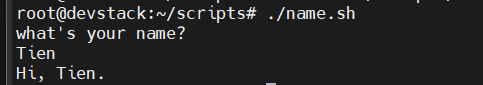

#### 5. Một vài lưu ý

**a. Tầm quan trọng của dấu nháy**:

Có 2 dạng dấu nháy:

- Weak quoting: nháy kép
- Strong quoting: nháy đơn

Công dụng:

- **Weak quoting:** Sử dụng dấu ngoặc kép khi muốn bash thực thi các biến được truyền vào

```bash
#!/bin/bash
animal="cat"
echo "black $animal"
```

- Output:

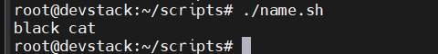

- **Strong quoting:** Sử dụng dấu ngoạc đơn khi muốn giữ nguyên nội dung trong nháy

```bash
#!/bin/bash
animal="cat"
echo 'black $animal'
```

- Output:

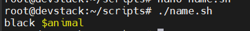

**b. Chế độ `DEBUG` trong Bashshell**

Chế độ `DEBUG` là chế độ giúp chúng ta xem chính xác những gì đang diễn ra trong các file scripts để tiện Debug. (xem log các dòng Scripts)

Sử dụng `-x` với `bash` để chạy script trong chế độ `DEBUG`:

- Ví dụ:

```bash
bash -x name.sh
```

Bật chế độ `DEBUG` trong một scripts Bash, có thể thêm dòng sau vào đầu Script:

```bash
#!/bin/bash
set -x
```

- Lệnh `set -x` sẽ kích hoạt chế độ `DEBUG` và tất cả các lệnh trong Scripts khi nó chạy:

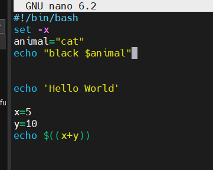

- Kết quả sau khi set `DEBUG` mode:

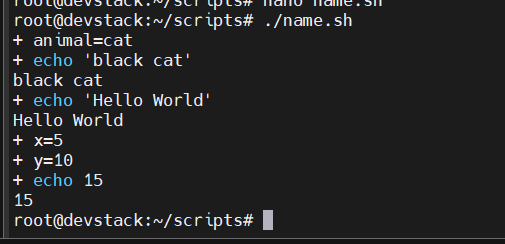

- Lệnh `set + x` sẽ tắt `DEBUG` mode:

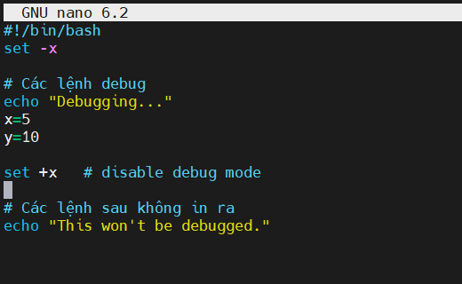

- Kết quả đầu ra

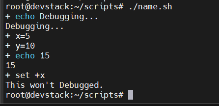

**c. Chế độ `Verbose` trong BashShell**

Nếu `Debug (-x)` là chế độ "soi" kết quả sau khi đã tính toán xong xuôi, thì `Verbose (-v)` là chế độ "đọc to" từng dòng code gốc trước khi thực hiện bất kỳ thao tác nào.

=> Nói cách khác, Verbose giúp bạn theo dõi quá trình đọc file script của Bash.

- Ví dụ: Để kích hoạt ta cũng sử dụng `set -v` đầu file Scripts

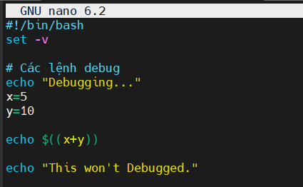

- Kết quả đầu ra:

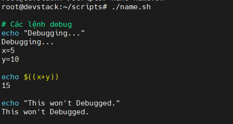

- Để disable Mode ta sử dụng `set +v` đầu mỗi đoạn ta muốn tắt nó đi

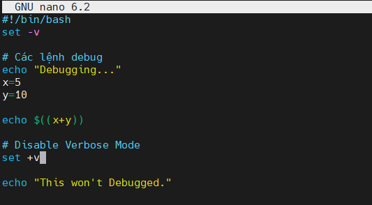

- Kết quả đầu ra:

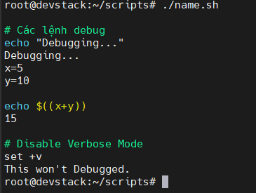

**d. Debug tín hiệu lỗi (signal traps)**:

Lệnh `trap` dùng để Debug tín hiệu lỗi, xác định lỗi ở đâu trong quá trình thực thi:

```bash
#!/bin/bash
trap 'echo "An error occurred at line $LINENO"' ERR

echo "start"
non_existing_command    # error
echo "end"
```

Kết quả:

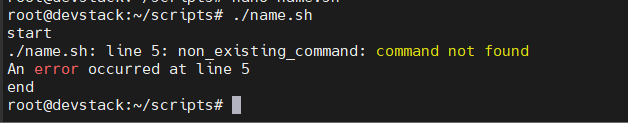

**e. So sánh nhanh các lệnh**:

| Lệnh | Mục đích | Hiển thị | Khi nào dùng? |
|-|-|-|-|
| `set -x` | Debug chi tiết | Hiển thị lệnh sau khi biến được xử lý và thực thi | Khi muốn biết script đang thực hiện lệnh với biến cụ thể nào |
| `set -v` | Verbose mode | Hiển thị dòng lệnh đúng như file, trước khi được thực thi | Khi muốn xem chính xác nội dung script |
| `trap` | Xử lý lỗi/tín hiệu | Không hiển thị lệnh; Thực hiện hành động khi có lỗi, tín hiệu xảy ra | Khi muốn xử lý lỗi (báo lỗi, dọn dẹp file tạm,  thoát an toàn) |

## II. HƯỚNG DẪN HỌC BASHSHELL

### 1. Các khái niệm cơ bản

#### 1.1 Sự khác nhau giữa Terminal và Shell

**Terminal**: Là cửa sổ giao diện để giao tiếp máy tính thông qua văn bản, nó giống như cái màn hình để gõ lệnh vào và thấy kết quả.

- Ví dụ: Mở ứng dụng **Terminal** or **CLI** trên **Ubuntu**, **MacOS** hoặc **Command Prompt** trên **Windows** -> đó là **Terminal**. **Terminal** không xử lý lệnh. Nó chỉ nhận lệnh gõ vào rồi chuyển **Shell** xử lí.

- **Shell**: là chương trình đọc lệnh người dùng gõ trong **Terminal**, hiểu lệnh, và thực thi lệnh đó. Nó thông dịch lệnh gõ, làm việc với hệ điều hành để cho ra kết quả.

  - Ví dụ: Shell phổ biến nhất là **Bash** (`/bin/bash`). Ngoài Bash, còn có các shell khác như: `Zsh`, `Fish`, `Sh`, `Ksh`...

#### 1.2 Cấu trúc dòng lệnh

```bash
command [options] [arguments]
```

- `command`: tên lệnh (ví dụ: ls, cp, cat, echo,...)
- `[options]`: (không bắt buộc) các tùy chọn để thay đổi cách lệnh hoạt động (thường bắt đầu bằng - hoặc --)
- `[arguments]`: (không bắt buộc) đối tượng mà lệnh sẽ xử lý (ví dụ: tên file, thư mục...)

Ví dụ:

```bash
ls -l /home/username
```

- `ls`: liệt kê tên file
- `-l`: Option hiển thị chi tiết
- `/home/username`: agruments chỉ định thư mục cần liệt kê

#### 1.3 Đường dẫn

- **Tuyệt đối**: bắt đầu từ `/`, ví dụ: `/home/user/docs/file.txt`
- **Tương đối**: tính từ vị trí hiện tại, ví dụ `../docs/file.txt`
- Ví dụ:

  - `cd /etc` (Tuyệt đối)
  - `cd ../folder`(Tương đối)

#### 1.4 Một số câu lệnh khác

| Lệnh | Ý nghĩa | Ví dụ |
|------|------|------|
| `tar` | Nén/giải nén file `.tar` | `tar -cvf archive.tar file1 file2` |
| `gzip` / `gunzip` | Nén/giải nén file `.gz` | `gzip file.txt` |
| `zip` / `unzip` | Nén/giải nén file `.zip` | `zip archive.zip file1 file2` |
| `ping` | Kiểm tra kết nối tới host | `ping google.com` |
| `ifconfig` hoặc `ip a` | Xem địa chỉ IP | `ip a` |
| `curl` | Gửi yêu cầu HTTP | `curl https://example.com` |

### 2. Bash Scripting

#### 2.1 Tạo Script với Shebang

Ví dụ file `myscript.sh`:

```bash
#!/bin/bash
echo "Hello from my first script!"
```

- `#!/bin/bash`: Shebang, chỉ ra file dùng bash để chạy
- `echo`: Lệnh, dùng để in ra dòng chữ

#### 2.2 Biến

Giả sử: In ra dòng chữ "Hi John":

```bash
name="John"
echo "Hi $name"

# Dòng 1 khai báo biến
# Dòng 2 có $name là để lấy giá trị biến
```

#### 2.3 Tham số dòng lệnh

```bash
echo "Scripts name: $0"
echo "First agrument: $1"
echo "Second agrument: $2"

# $0 là tên Scripts
# $1, $2 là các tham số truyền vào
```

Ví dụ chạy:

```bash
./myscript.sh file1 file2
```

Output:

```bash
Script name: ./myscript.sh
First argument: file1
Second argument: file2
```

### 3. Bash Shell

#### 3.1 Hàm (functions)

**Định nghĩa**: Hàm hay **functions** là khối mã lệnh được đặt tên để thực hiện một nhiệm vụ cụ thể. Thay vì viết lại đoạn code nhiều lần trong scripts thì ta dùng hàm gom hết nó thành 1 cụm lệnh để dùng bất kì lúc nào khi chúng ta cần.

**Cách khai báo hàm**:

- `Cách 1`: Sử dụng từ khoá **function**

```bash
function ten_ham {
    # Các câu lệnh ở đây
    echo "Chào mừng bạn đến với hệ thống!"
}
```

- `Cách 2`: Viết gọn hơn (Phổ biến hơn)

```bash
ten_ham() {
    # Các câu lệnh ở đây
    echo "Đang kiểm tra kết nối mạng..."
}
```

**Cách sử dụng hàm(Gọi hàm)**: Để chạy hàm, ta chỉ cần gõ tên của nó giống như 1 lệnh bình thường (Không cần dấu ngoặc đơn khi gọi)

```bash
# Gọi hàm
ten_ham (dùng bên trong file Scripts)
```

**Cách truyền tham số vào hàm**: Hàm trong Bash không khai báo tham số trong ngoặc đơn như `Python` hay `C`. Thay vào đó , nó sử dụng các biến vị trí tương tự như khi bạn truyền đối số cho 1 file Scripts

- Ví dụ:

```bash
#!/bin/bash
kiem_tra_ip() {
    echo "Đang kiểm tra địa chỉ IP: $1"
    ping -c 1 $1
}

# Sử dụng hàm với tham số
kiem_tra_ip 10.10.10.1
```

- Kết quả đầu ra:

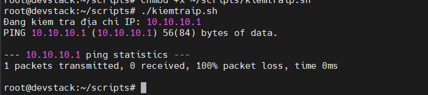

**Phạm vi của biến**:(`Local`và`Gobal`):

Đây là phần rất quan trọng để tránh làm hỏng script của bạn:

- Biến `Global` (Mặc định): Nếu bạn khai báo biến trong hàm, nó có thể được truy cập từ bên ngoài hàm sau khi hàm chạy.

- Biến `Local`: Sử dụng từ khóa `local` để biến đó chỉ tồn tại bên trong hàm.

Ví dụ:

```bash
my_func() {
    local net_path="/etc/network" # Biến này chỉ dùng trong hàm
    echo "Đường dẫn: $net_path"
}
```

- Đầu ra:

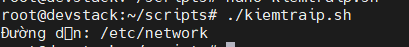

### 4. Xử lí kiểm tra lỗi (`ERROR HANDLING`)

#### 4.1 Kiểm tra mã thoát `$` ?

- Sau mỗi lệnh, bash lưu mã thoát trong `$?`.
- Nếu `$?` = 0: lệnh thành công.
- Nếu `$?` ≠ 0: lệnh thất bại.

Ví dụ:

```bash
#!/bin/bash
mkdir newfolder
if [ $? -eq 0 ]; then
    echo "Tạo thư mục thành công."
else
    echo "Tạo thư mục thất bại."
fi
```

#### 4.2 Kiểm tra nhanh gọn hơn bằng `&&` và `||`

Sử dụng && và ||:

```bash
mkdir newfolder && echo "Tạo folder thành công." || echo "Tạo folder thất bại."
```

### 5. Câu điều kiện

#### 5.1 Cấu trúc `if`, `elif` và `else`

```bash
#!/bin/bash
if [ điều_kiện ]; then
  # khối lệnh nếu điều kiện đúng
elif [ điều_kiện_khác ]; then
  # khối lệnh nếu điều kiện khác đúng
else
  # khối lệnh nếu không điều kiện nào đúng
fi
```

- `then`: bắt đầu khối lệnh
- `fi`: Kết thúc khối lệnh `if`

Ví dụ:

```bash
#!/bin/bash
echo "Nhập tuổi:"
read age

if [ $age -lt 18 ]; then
  echo "Chưa đủ tuổi."
elif [ $age -lt 65 ]; then
  echo "Trưởng thành."
else
  echo "Nghỉ hưu."
fi
```

- Khi chạy, scripts sẽ hỏi tuổi và phân loại tuổi theo nhóm

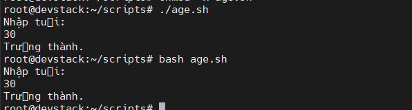

#### 5.2 Cấu trúc `Case`

**Định nghĩa**: Cấu trúc `case` trong Bash shell là một cách kiểm soát luồng điều kiện rất mạnh mẽ, được dùng để thay thế cho một chuỗi các câu lệnh `if-elif-else` dài dằng dặc khi bạn cần so sánh một giá trị với nhiều mẫu (pattern) khác nhau.

=> Nó giúp Source Code của bạn trông sạch sẽ, dễ đọc và chuyên nghiệp hơn rất nhiều.

**Cú pháp cơ bản**:

Cấu trúc của case bắt đầu bằng từ khóa `case`, kết thúc bằng cách viết ngược lại là `esac`.

```bash
#!/bin/bash
case "$BIEN" in
    mau_1)
        # Các lệnh thực thi nếu BIEN khớp mau_1
        ;;
    mau_2)
        # Các lệnh thực thi nếu BIEN khớp mau_2
        ;;
    *)
        # Các lệnh thực thi nếu không khớp mẫu nào ở trên (giống 'else' hoặc 'default')
        ;;
esac
```

Trong đó:

- `$BIEN`: Thường được đặt trong dấu ngoặc kép để tránh lỗi nếu biến bị trống.
- `mau)`: Mỗi mẫu so sánh kết thúc bằng dấu đóng ngoặc đơn.
- `;;`: Đây là ký hiệu bắt buộc để kết thúc một nhánh (tương đương với lệnh break trong `C` hoặc `Java`).
- `*)`: Mẫu đại diện (wildcard), dùng để **bắt tất cả các trường hợp còn lại**.

Ngoài ra còn một vài mẫu so sánh nâng cao:

- Dấu hỏi `?`: Khớp với đúng một ký tự bất kỳ.
- Dấu gạch đứng `|`: Kết hợp nhiều mẫu (điều kiện OR).
- Ngoặc vuông `[...]`: Khớp với một khoảng ký tự (ví dụ: [a-z]).

**Ví dụ**: Tạo scripts `status.sh` để xử lí trạng thái dịch vụ

```bash
#!/bin/bash
echo "Ban hay nhap mot lua chon:"
read lua_chon

case "$lua_chon" in
    start|up)
        echo "Đang khởi động dịch vụ..."
        ;;
    stop|down)
        echo "Đang dừng dịch vụ..."
        ;;
    [0-9])
        echo "Bạn vừa nhập một con số."
        ;;
    *)
        echo "Lệnh không hợp lệ. Vui lòng dùng: start hoặc stop."
        ;;
esac
```

- Kết quả:

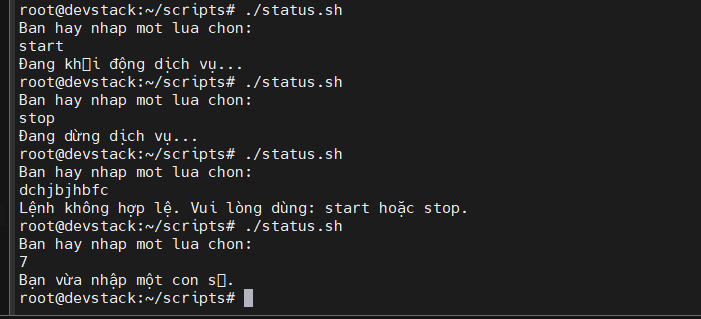

- Một vài lưu ý nâng cao:

- Phân biệt chữ hoa chữ thường: Bash mặc định phân biệt Start và start. Để bỏ qua việc này, bạn có thể thêm lệnh `shopt -s nocasematch` ở đầu script.

Mẫu `[0-9]`: Mẫu này chỉ khớp với duy nhất một chữ số. Nếu bạn muốn khớp với số có nhiều chữ số, bạn phải dùng mẫu `+([0-9])` (yêu cầu bật `extglob`) hoặc đơn giản là dùng `*[0-9]*` nếu muốn tìm số bất kỳ trong chuỗi.

Ký hiệu `;;&` và `;Required&` (Bash 4.0+): Thay vì dừng lại ở nhánh đầu tiên khớp, bạn có thể dùng các ký hiệu này để Bash tiếp tục kiểm tra các nhánh bên dưới (tương tự như việc bỏ lệnh break trong các ngôn ngữ khác).

### 6. Vòng lặp (Loops)

**Định nghĩa Loop**: là cấu trúc cho phép ta thực hiện một khối lệnh cho đến khi một điều kiện cụ thể được thoả mãn.

=> Đây là cấu trúc xương sống của tự động hoá, giúp ta xử lí tự động hoá hàng loạt node mạng chỉ vài dòng code.

Bash hỗ trợ 3 vòng lặp chính: `for`, `while` và `until`.

#### 6.1 Vòng lặp `for`

**Tác dụng vòng lặp `for`**: Dùng khi bạn biết trước số lần lặp hoặc muốn duyệt một danh sách các phần tử (file,số,chuỗi)

**Cú pháp cơ bản**:

`Cách 1`: Duyệt danh sách(Phổ biến nhất)

```bash
for var in var_1 var_2 var_3
do
    echo "Giá trị là: $var"
done
```

- Ví dụ: Tạo 1 file sripts `hello.sh` in ba tên nhân vật `Kain`, `Bob`, `Yasul`

```bash
#!/bin/bash
for name in Kain Bob Yasul
do
    echo "Hello $name"

done
```

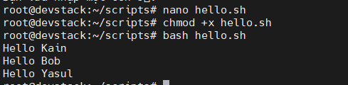

`Cách 2`: Kiểu C-style (Dùng cho số học)

```bash
#!/bin/bash
for ((i=1; i<=5; i ++ ))
do
    echo "Lần lặp thứ: $i"
done
```

- Ví dụ: tạo file scripts `loop.sh` in "Hello Bob" 5 lần:

```bash
#!/bin/bash
for ((i=1; i<=5; i))
do
    echo "Hello Bob"
    ((i++))
done
```

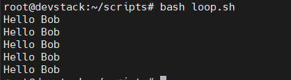

#### 6.2 Vòng lặp `While`

**Tác dụng vòng lặp `While`**: Dùng **khi bạn không biết số lần lặp**, vòng lặp chạy khi nào điều kiện còn **Đúng**.

**Cú pháp cơ bản**:

```bash
while [ điều_kiện ]
do
    # Lệnh thực thi
done
```

Ví dụ: Tạo file Scipts `loop2.sh` in "Hello Jane" 5 lần

```bash
#!/bin/bash
count=1
while [ $count -le 5 ]; do
    echo "Hello Jane"
    ((count++))
done
```

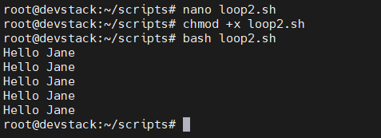

#### 6.3 Vòng lặp `Until`

**Tác dụng vòng lặp `Until`**: Ngược lại hoàn toàn với `while`. Nó sẽ chạy cho đến khi điều kiện trở nên **Đúng**(tức nó chạy khi điều kiện đang **SAI**).

**Cú pháp cơ bản**:

```bash
until [ điều_kiện ]
do
    # Lệnh thực thi
done
```

Ví dụ:

```bash
until systemctl is-active --quiet haproxy
do
    echo "Đang chờ HAProxy khởi động..."
    sleep 2
done
echo "HAProxy đã sẵn sàng!"
```

### 7. Chuyển hướng (Redirection)

**Định nghĩa**: **Redirection (Chuyển hướng)** là một tính năng cực kì mạnh mẽ cho phép ta thay đổi nơi nhận dữ liệu đầu vào và nơi gửi dữ liệu đầu ra của một câu lệnh.

-> Ở chế độ **Default**, **các lệnh đầu vào từ bàn phím** và **in kết quả ra màn hình**. **Redirection giúp bạn** ghi **kết quả đó vào file**, **đọc dữ liệu** từ **file**, hoặc thậm chí là **loại bỏ các thông báo lỗi phiền phức**.

#### 7.1 Ba luồng dữ liệu chuẩn (Standard Stream)

Mọi lệnh trong Linux khi chạy đều mở ra 3 luồng dữ liệu chính, được định danh bằng các con số (File Descriptors):

| Luồng  | Tên gọi (Full Name)  | Số định danh (File Descriptor) | Thiết bị mặc định                  |
|--------|----------------------|--------------------------------|------------------------------------|
| stdin  | Standard Input       | 0                              | Bàn phím                           |
| stdout | Standard Output      | 1                              | Màn hình (Kết quả lệnh thành công) |
| stderr | Standard Error       | 2                              | Màn hình (Thông báo lỗi)           |

#### 7.2 Input Redirection (Chuyển hướng đầu vào)

Dùng để lấy dữ liệu từ một file đưa vào lệnh thay vì nhập từ bàn phím.

- `<`: Đọc dữ liệu từ file.

Ví dụ: `mysql -u root -p database_name < backup.sql` (Phục hồi dữ liệu từ file backup).

#### 7.3 Output Redirection (Chuyển hướng đầu ra)

Dùng để lưu kết quả của lệnh vào một file thay vì hiện lên màn hình.

- `>` (Ghi đè - Overwrite): Tạo file mới hoặc ghi đè lên nội dung cũ.

- `>>` (Ghi thêm - Append): Thêm nội dung vào cuối file mà không xóa nội dung cũ.

Ví dụ:

- `ls > danh_sach.txt` (Lưu danh sách file vào danh_sach.txt).

- `echo "Log mới" >> system.log`.(Ghi "Log mới" vào cuối file `system.log`)

#### 7.4 Error Redirection (Chuyển hướng lỗi)

Đôi khi bạn muốn tách biệt kết quả đúng và thông báo lỗi.

- `2>`: Chỉ chuyển hướng luồng lỗi.

- `2> /dev/null`: "Vứt" lỗi vào hố đen vũ trụ (không hiện lỗi, không lưu lại). Cực kỳ hữu ích khi viết script sạch.

- `&>`: Chuyển hướng cả stdout và stderr vào cùng một file.

Ví dụ:

- `find /etc -name "hosts" 2> error.log` (Các thư mục không có quyền truy cập sẽ báo lỗi vào file này).

#### 7.4 Advance Technique & extension

`Here document (<<)`: Dùng để truyền một khối văn bản nhiều dòng vào một lệnh ngay trong script.

- Ví dụ: Lệnh trên tạo ra file `index.html` nội dung trong 2 chữ `EOF`

```bash
cat << EOF > index.html
<html>
  <body>
    <h1>Chào mừng tới Lab 10.10.10.x</h1>
  </body>
</html>
EOF
```

`Here string (<<<)`: truyền chuỗi trực tiếp vào `stdin`

- Ví dụ: `grep "hello" <<< "hello world"` => Truyền 1 chuỗi trực tiếp vào stdin 

`Pipe (|)`: Dùng để chuyển stdout của lệnh 1 làm stdin cho lệnh 2.

- Ví dụ: chuyển dữ liệu đầu ra vào 1 file `.txt`

```bash
ls | grep ".txt"
```

`Pipe (||)`: Chạy nếu lệnh trước thất bại

- Ví dụ: Nếu không tạo ra được thư mục thì in ra dòng chữ `"Không tạo được thư mục"`

```bash
mkdir newdir || echo "Không tạo được thư mục"
```

`Pipe (&&)`: Chạy lệnh tiếp theo nếu lệnh trước thành công

- Ví dụ: Nếu tạo được đường dẫn `newdir` thì thực hiện lệnh tiếp là di chuyển vô đó

```bash
mkdir newdir && cd newdir
```

`Pipe (;)`: di chuyển vào thư mục nào đó sau đó do `some command`.

- Ví dụ: muốn di chuyển vào thư mục `/var` sau đó liệt kê file trong thư mục với lệnh `ls`

```bash
cd /var; ls
```

`Backhole (/dev/null)`: Là hố đen dùng để dọn dẹp file cần bỏ đi.

- Ví dụ: `ls /abc > /dev/null 2>&1` => chuyển stderr cả stdout vô thư mục bỏ đi.

### 8. Biến (Variable)

**Định nghĩa**: là các "ngăn chứa" dùng để lưu trữ **dữ liệu** (**chuỗi, số, đường dẫn file**, v.v.) để bạn có thể tái sử dụng trong suốt **phiên làm việc** hoặc trong các **file script**.

**Quy tắc đặt tên và Gán giá trị**:

- Cú pháp: 

```text
TEN_BIEN=gia_tri
```

- Quy tắc:

  - KHÔNG được có khoảng trắng quanh dấu =. (Sai: `VAR = 10`, Đúng: `VAR=10`).

  - Tên biến phải bắt đầu bằng chữ cái hoặc dấu gạch dưới `_`.

  - Thường dùng chữ IN HOA cho biến hệ thống và chữ thường cho biến người dùng (để tránh ghi đè nhầm).

**Cách truy xuất giá trị (Accessing)**:

- Để lấy giá trị của biến, bạn thêm dấu $ trước tên biến.

- Ví dụ: 

```text
echo $TEN_BIEN
```

- `Mẹo`: Nên dùng dấu ngoặc nhọn `${TEN_BIEN}` để phân tách rõ ràng tên biến với các ký tự xung quanh.

- Ví dụ: `echo "${VAR}_backup"` (Nếu không có {}, Bash sẽ tìm biến `$VAR_backup`).

#### 8.1 Biến do người dùng tự định nghĩa

```bash
name="Tien"
echo "Hi, $name"
```

Kết quả:

```text
Hi Tien
```

#### 8.2 Biến với lệnh lồng bên trong

```bash
today=$(date +%Y-%m-%d)
echo "Today is $today"
```

Kết quả:

```text
Today is 2026-04-02
```

#### 8.3 Biến đặc biệt trong ShellScripts

Nội dung trong file `ìno.sh`:

```bash
#!/bin/bash
echo "Script name: $0"
echo "First arg: $1"
echo "Total args: $#"
echo "All args: $@"
```

- `$0`: Tên script
- `$1`: Tham số đầu tiên
- `$#`: Số lượng tham số
- `$@`: Tất cả tham số, từng phần

chạy thử:

```bash
bash info.sh one two three
```

Kết quả:

```bash
Script name: info.sh
First arg: one
Total args: 3
All args: one two three
```

#### 8.4 Dùng biến môi trường

Dùng biến có sẵn:

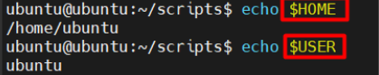

#### 8.5 Biến mảng

```bash
fruits=("apple" "banana" "orange")  # Đây gọi là mảng
echo "First fruit: ${fruits[0]}"
echo "All fruits: ${fruits[@]}"
echo "Total: ${#fruits[@]}"
```

Kết quả:

```bash
First fruit: apple
All fruits: apple banana orange
Total: 3
```

#### 8.6 Biến không thay đổi (readonly)

```bash
readonly PI=3.14
PI=3.15  # Sẽ gây lỗi!
```

#### 8.7 Xóa biến

```bash
x="delete me"
unset x
echo $x  # Trống
```
