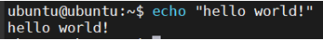
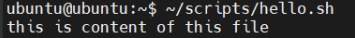
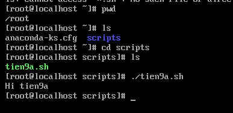

# TÌM HIỂU VỀ BASHSHELL

## I. TỔNG QUAN VỀ BASHSHELL TRONG LINUX

### 1. Khái niệm về Bash, Script và Shell ?


**Bash Shell**: là một chương trình giao tiếp giữa người dùng và hệ điều hành, chủ yếu sử dụng trong hệ thống Unix/Linux. Trong đó:

- **Bash** (**Bourne Again Shell**) được phát triển như là một bản cải tiến của sh(**Bourne Shell**) truyền thống.
- **Shell** là chương trình đọc lệnh người dùng gõ vào, thực thi lệnh đó và trả kết quả lại.
- **Bash** vừa là **trình thông dịch lệnh (command interpreter)**, vừa hỗ trợ ngôn ngữ lập trình script, cho phép viết file script để tự động hóa công việc.
- Còn **Script** là một tập hợp các lệnh được viết sẵn trong một file để máy tính thực thi tự động theo thứ tự.(Thay vì ngồi gõ các lệnh riêng lẻ).

Ngoài Bash ra thì còn một vài chương trình thông dụng khác tương tự với tính năng khác hơn đó là `.zsh`, `.csh`, `.ksh`

Ba khái niệm **Shell – Bash – Script** thường bị nhầm với nhau. Thực ra quan hệ của chúng là:

```text
Script → chạy bằng → Shell
Bash → là một loại → Shell
```

Hai khái niệm **CLI**,**Shell** cũng gây nhầm lẫn:

- **CLI** giống như:

```text
cái bàn phím và màn hình để nói chuyện với máy
```

- **Shell** giống như:

```text
người phiên dịch hiểu lệnh và thực thi
```

Ví dụ: về 1 script

```bash
$ echo "Hello world!"

Hello world!
```

### 2. Đặc điểm của Bash, Scripts và Shell

#### a. Đặc điểm của Bash

Đặc điểm chính của Bash gồm:

- **Giao diện dòng lệnh tương tác**: Cho phép người dùng nhập và thực thi các lệnh trực tiếp để quản lý file, chạy chương trình, và thực hiện các tác vụ khác trên hệ thống.

- **Ngôn ngữ Scripting**: Bash là một ngôn ngữ lập trình đầy đủ, hỗ trợ biến, vòng lặp, câu lệnh điều kiện và các cấu trúc điều khiển khác. Điều này cho phép người dùng viết các script (tập tin chứa chuỗi các lệnh) để tự động hóa các tác vụ lặp đi lặp lại hoặc phức tạp.

- **Tự động hóa**: Bash scripting được sử dụng rộng rãi để tự động hóa các công việc như sao lưu dữ liệu, cài đặt phần mềm, quản lý hệ thống và thực hiện các chuỗi lệnh.

- **Quản lý tiến trình**: Bash cung cấp các tính năng để quản lý các tiến trình đang chạy trên hệ thống.

- **Biên tập dòng lệnh**: Hỗ trợ chỉnh sửa dòng lệnh hiệu quả với các phím tắt và lịch sử lệnh.

- Hỗ trợ alias, loop, variables, function, if command...

#### b. Đặc điểm của Shell

Đặc điểm chính **Shell** là:

- Là **command interpreter (trình thông dịch lệnh)**.
- Cho phép: chạy command, quản lí process, redirect I/O, pipeline
- Có nhiều loại shell khác nhau: BashShell, Korn Shell, CShell.

#### c. Đặc điểm của Scripts

Đặc điểm chính **Scripts** là:

- Là file text
- Chứa chuỗi lệnh
- Chạy tự động
- Cần interpreter để chạy

#### So sánh Bash, Scripts và Shell

| Tiêu chí| Shell                    | Bash                | Script          |
| ------- | ------------------------ | ------------------- | --------------- |
| Bản chất| chương trình interpreter | một loại shell      | file chứa lệnh  |
| Vai trò |giao tiếp user ↔ kernel   | thực thi lệnh shell | automation work |
| Quan hệ | khái niệm chung          | nằm trong shell     | chạy trên shell |
| Ví dụ   | bash, zsh                | bash                | backup.sh       |

### 3. Công dụng chính Bash, Shell, Scripts

#### a.Công dụng chính Shell

- Thực thi lệnh của người dùng (`cd`,`pwd`,...)
- Quản lý tiến trình (process như `pkill`, `kill -9`, `sleep`,...)
- Điều hướng dữ liệu (I/O Redirection như `ls`, `cat`,...)
- Kết hợp lệnh bằng pipeline (`ps aux |grep nginx`)
- Chạy các script (`nano`,`vim`)

#### b. Công dụng của Bash

- Thực thi command shell (`ls`, `cd`, `mkdir`).
- Hỗ trợ scripting (`if`, `for`, `while`, `function`).
- Quản lý biến môi trường.
- History và autocomplete.
- Alias.

#### c. Công dụng của Scripts

- Tự động hóa công việc.
- Chạy nhều lệnh.
- Tạo logic tự động.(can use `if`, `for`, `while` and case)

### 4. How to use BashShell ?

Ta sẽ tách rõ **cách chạy** 1 file **Bash shell** và 1 file **BashScript** (thực tế Bash script cũng là một loại script, nhưng người ta thường hỏi theo cách này trong Linux).

#### a. Chế độ Shell (Cách chạy file BashShell)

**Chế độ Shell tương tác (Interactive Shell)**: là dạng sử dụng câu lệnh trực tiếp trên môi trường Unix.

Ví dụ: sử dụng Bash để in ra `Hello world!`



**Chế độ Shell không tương tác (Non-Interactive Shell)**:

Ví dụ:

```bash
# Tạo thư mục /scripts và file thực thi hello.sh 
sudo mkdir ~/scripts && sudo vim ~/scripts/hello.sh

# Thêm quyền thực thi cho thư mục
sudo chmod +x ~/scripts/hello.sh
```

- Sau đó, thêm nội dung vào file; Chẳng hạn ở đây là in ra dòng chữ "This is content of the file":

```bash
#!/bin/bash
echo "this is content of this file"
```

- Thực thi file:(Có thể thực thi file BashShell bằng 3 cách)

```bash
# Cách 1: Chỉ có thể thực hiện khi file script khi đã có dòng #!/bin/bash và quyền +x

./hello.sh

# Cách 2: Bỏ qua shebang trong file, chắc chắn dùng đúng /bin/bash và không cần cấp quyền execute

/bin/bash hello.sh 

# hoặc

bash hello.sh

#Cách 3: Tương tự /bin/bash, nhưng gọi trình thông dịch bash theo $PATH.

bash hello.sh

## Lưu ý : Nhớ cd vào chỗ chứa file Scripts rồi mới thực thi lệnh.
```

- Kết quả



#### b. Chế độ Scripts

Script có thể là:

- bash script
- python script
- perl script
- javascript script

Ví dụ - file python scripts:

```bash
scripts.py
```

- Nội dung:

```bash
print("Hello script")
```

- Chạy bằng interpreter:

```bash
python script.py
```

#### c. Sử dụng biến trong Linux

Tạo file `tien9a.sh` với nội dung bên dưới và cấp quyền thực thi `chmod +x`:

```bash
#!/bin/bash
name="tien9a"
echo "Hi $name"
```

hoặc:

```bash
#!/bin/bash
name="tien9a"
printf "Hi %s\n" "$name"
### trong đó ta gán cụm từ "tien9a" như 1 biến "name"
```

Output:

```bash
Hi tien9a
```



#### d. Truyền tham số vào biến với User Input

Các biến có thể được truyền trực tiếp từ người dùng như sau:

```bash
#!/bin/bash
echo "what's your name?"
read name
echo "Hi, $name."
```

