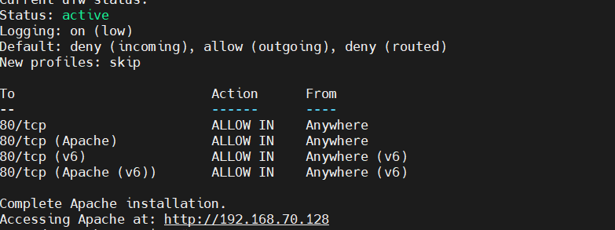
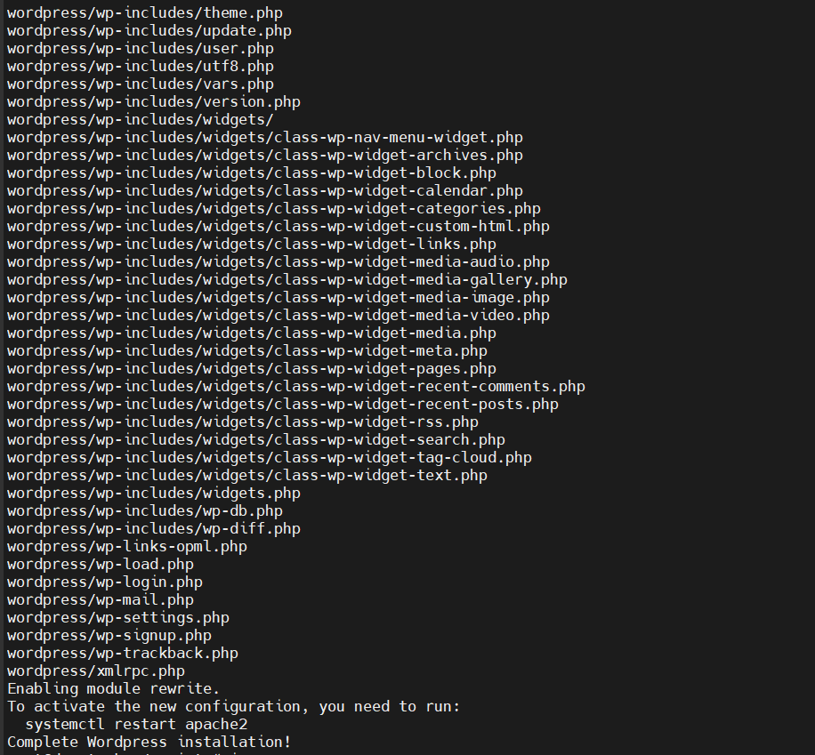

# LAB BASHSHELL

## I. CREATE FILE SCRIPTS `HELLO WORLD`

### 1. Tạo file script

```bash
sudo nano hello.sh
```

### 2. Thêm nội dung file (viết hàm)

```bash
#!/bin/bash

greeting () {
    echo "Hello $1!"
}

greeting World
greeting Tiến
```

### 3. Cấp quyền và thực thi file

Cấp quyền thực thi:

```bash
sudo chmod +x hello.sh
```

Thực thi file:

```bash
./hello.sh
# hoặc
bash hello.sh
# hoặc
/bin/bash
```

Kết quả:

```bash
Hello World!
Hello Tiến!
```

## II. CREATE AUTOMATE SCRIPTS INSTALL HTTP

### 1. Mục tiêu

1. Kiểm tra quyền `sudo`.
2. Cập nhật hệ thống.
3. Cài đặt Apache.
4. Kiểm tra dịch vụ.
5. Hiển thị địa chỉ IP để truy cập web

### 2.Nội dung file `install_http.sh`

```bash
#!/bin/bash

# Check not root or not using sudo
# [[ $EUID -ne 0 ]] && echo "Please run with sudo" && exit 1
if [[ $EUID -ne 0 ]]; then
    echo "Please run the script with sudo or root privileges"
    exit 1
fi

echo "updating system..."
sudo apt update -y && apt upgrade -y

echo "installing Apache HTTP Server..."
sudo apt install apache2 -y

echo "enable and start Apache service..."
sudo systemctl enable apache2
sudo systemctl start apache2

echo "Checking Apache service status..."
sudo systemctl is-active apache2

# Check if port 80 is open (Apache use it)
echo "Checking port 80..."
if sudo ss -tuln | grep ':80' > /dev/null; then
    echo "Port 80 is open and Apache is watching."
else
    echo "Port 80 not open. Maybe Apache is not running properly."
fi

# Install and configure ufw firewall
echo "installing ufw and opening port 80 HTTP..."
sudo apt install ufw -y
ufw allow 80/tcp
ufw allow 'Apache'
ufw enable <<EOF
y
EOF

echo "Current ufw status:"
sudo ufw status verbose

echo "Complete Apache installation."

# Show IP to access
ip_address=$(hostname -I | awk '{print $1}')
echo "Accessing Apache at: http://$ip_address"
```

### 3.Chạy file

```bash
chmod +x install_http.sh
sudo ./install_http.sh
```

### 4. Kết quả



## III. CREATE AUTOMATE SCRIPTS INSTALL WORDPRESS

### 1. Target

1. Cài **Apache**, **MySQL**, **PHP**.
2. Tải và giải nén WordPress.
3. Tạo cơ sở dữ liệu WordPress.
4. Cấu hình thư mục Apache `/var/www/html/wordpress`.

### 2. Nội dung file `install_wordpress.sh`

```bash
#!/bin/bash

# Check not root or not using sudo
# [[ $EUID -ne 0 ]] && echo "Please run with sudo" && exit 1
if [[ $EUID -ne 0 ]]; then
    echo "Please run the script with sudo or root privileges"
    exit 1
fi

echo "updating system..."
sudo apt update -y && apt upgrade -y

echo "installing Apache HTTP Server..."
sudo apt install apache2 -y
sudo systemctl enable apache2
sudo systemctl start apache2

echo "Installing PHP and extentions"
sudo apt install php libapache2-mod-php php-mysql php-curl php-gd php-mbstring php-xml php-xmlrpc php-soap php-intl php-zip -y

echo "Installing MySQL and create database..."
sudo apt install mysql-server -y

mysql_secure_installation <<EOF
y
n
y
y
y
EOF

echo "Creating database and user..."
mysql -u root <<EOF
CREATE DATABASE wordpress;
CREATE USER 'wpuser'@'localhost' IDENTIFIED BY 'tien@123';
GRANT ALL PRIVILEGES ON wordpress.* TO 'wpuser'@'localhost';
FLUSH PRIVILEGES;
EOF

# Install wordpress
echo "downloading wordpress..."
cd /tmp
sudo wget https://wordpress.org/latest.tar.gz
sudo tar -xzvf latest.tar.gz
sudo cp -r wordpress/* /var/www/html/
sudo chown -R www-data:www-data /var/www/html/
sudo chmod -R 755 /var/www/html/

# Modify Apache configuration to support .htaccess...
sed -i '/<VirtualHost \*:80>/,/<\/VirtualHost>/s|DocumentRoot /var/www/html|DocumentRoot /var/www/html\n\t<Directory /var/www/html>\n\t\tAllowOverride All\n\t</Directory>|' /etc/apache2/sites-available/000-default.conf

sudo a2enmod rewrite
sudo systemctl restart apache2

echo "Complete Wordpress installation!"
```

### 3. Chạy file

```bash
chmod +x install_wordpress.sh
sudo install_wordpress.sh
```

### 4. Result


